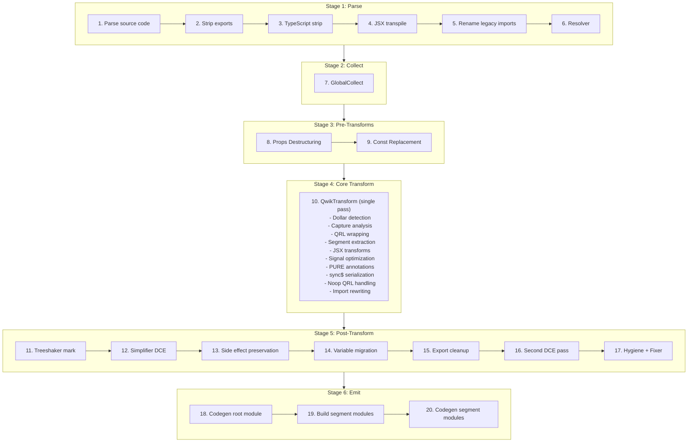
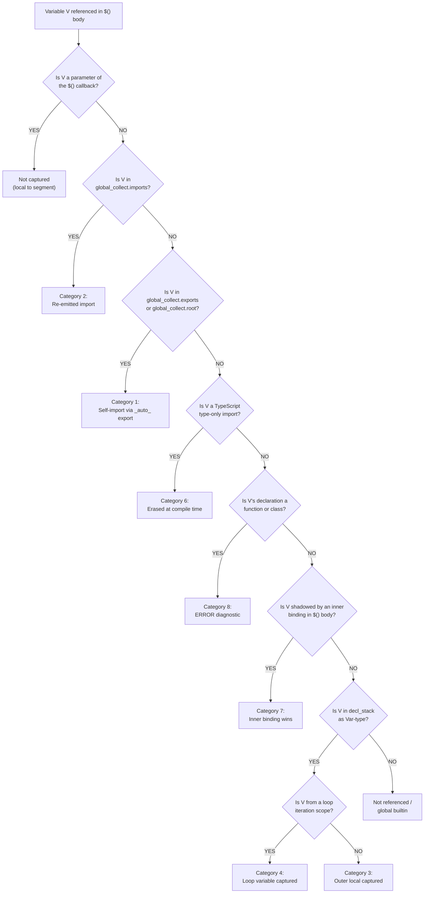

# Qwik v2 Optimizer -- Behavioral Specification

**Version:** 0.1.0
**Date:** 2026-04-01
**Status:** Phase 1 -- Core Pipeline

> **Scope:** This document specifies the behavioral contract of the Qwik v2 optimizer. An OXC implementation can be built from this specification without referencing the SWC source code.

---

## Pipeline Overview

The Qwik optimizer transforms a single input module into multiple output modules: one root module (the transformed original) and N segment modules (lazy-loadable code extracted from `$()` boundaries). The transformation executes as a deterministic 20-step pipeline.

### Pipeline Diagram



Source: parse.rs `transform_code()` function

### Stage Descriptions

**Stage 1: Parse (Steps 1-6).** Parses the source code, detecting TypeScript and JSX from the file extension. Optionally strips named exports (via `strip_exports` config), strips TypeScript type annotations, transpiles JSX to `jsx()`/`jsxs()` calls using React automatic runtime with `@qwik.dev/core` as the import source, renames legacy `@builder.io/qwik` imports to `@qwik.dev/core`, and runs the SWC resolver to assign scope marks for identifier resolution.

**Stage 2: Collect (Step 7).** Runs `GlobalCollect`, a single read-only AST pass that catalogs all imports, exports, and root-level declarations. This metadata is queried by every subsequent transformation stage. See [Stage 2: GlobalCollect](#stage-2-globalcollect) for full specification.

**Stage 3: Pre-Transforms (Steps 8-9).** Reconstructs destructured component props into `_rawProps.propName` access patterns for signal reactivity tracking (runs in all modes including Lib). In non-Lib/non-Test modes, replaces `isServer`, `isBrowser`, and `isDev` imports from `@qwik.dev/core/build` with boolean literals based on build configuration.

**Stage 4: Core Transform (Step 10).** A single traversal pass (`QwikTransform`) that performs the core QRL extraction pipeline: detects `$`-suffixed marker function calls, analyzes captured variables across scope boundaries, wraps marker calls with QRL references (`qrl()`/`inlinedQrl()`), extracts callback bodies as separate segment modules, rewrites imports for both root and segment modules, transforms JSX elements, optimizes signal expressions, adds PURE annotations to tree-shakeable calls, handles `sync$` serialization, and emits noop QRLs for stripped segments.

**Stage 5: Post-Transform (Steps 11-17).** Marks side-effect expressions for client-side tree-shaking, runs dead code elimination (DCE), preserves side-effect imports for Inline/Hoist strategies or performs client-side tree-shaker cleanup, migrates root-level variables exclusively used by a single segment into that segment, cleans up synthetic exports for migrated variables, runs a second DCE pass if migration occurred, and applies hygiene renaming and AST fixing.

**Stage 6: Emit (Steps 18-20).** Generates JavaScript code and source maps for the root module, constructs each segment module from its extracted expression and resolved imports via `code_move::new_module()`, and generates code and individual source maps for each segment module.

### Phase Coverage

**Phase 1 (this document) specifies:** Stage 2 (GlobalCollect), Stage 4 Core Transform (Dollar Detection, Capture Analysis, QRL Wrapping, Segment Extraction, Import Rewriting), Stage 5 Variable Migration, and the infrastructure sections (Hash Generation, Path Resolution, Source Map Generation).

**Later phases specify:** Stage 3 Pre-Transforms (Phase 2 -- Props Destructuring; Phase 3 -- Const Replacement), Stage 4 JSX/Signal/PURE subsystems (Phase 2), Stage 4 sync$/noop (Phase 3), Stage 5 DCE/Treeshaker (Phase 3), Stage 6 emit modes and entry strategies (Phase 3), and API/binding contracts (Phase 4).

---

## Stage 2: GlobalCollect

GlobalCollect is a single read-only AST traversal that runs once before any transformations (Step 7 in the pipeline). It catalogs every import, export, and root-level declaration in the module. Its output is queried throughout the pipeline by dollar detection (to identify marker functions), capture analysis (to distinguish globals from captures), QRL wrapping (to manage synthetic imports), segment extraction (to resolve imports for segment modules), and variable migration (to determine which declarations are migratable).

Source: collector.rs:56-528

### Data Structures

GlobalCollect produces four primary data structures:

| Field | Type | Description |
|-------|------|-------------|
| `imports` | `IndexMap<Id, Import>` | Every import specifier with its source module, `ImportKind` (Named, Default, All), whether it is synthetic (added by the optimizer), and optional import assertions |
| `exports` | `IndexMap<Atom, ExportInfo>` | Every exported name with its local `Id` and list of exported names (supports re-exports and renames) |
| `root` | `IndexMap<Id, Span>` | Every top-level declaration: `var`/`let`/`const` bindings, `function` declarations, `class` declarations, and `enum` (TypeScript) declarations |
| `canonical_ids` | `HashMap<Atom, Id>` | Maps symbol names to their first-seen `Id`, used for resolving local identifiers to their canonical representation |

Where `Id` is a tuple of `(Atom, SyntaxContext)` -- the symbol name paired with its scope context. `Import` contains `source` (module path), `specifier` (imported name), `kind` (Named/Default/All), `synthetic` (bool), and optional `asserts`.

### Behavioral Rules

1. **Single pass, read-only.** GlobalCollect visits the AST once using the `Visit` trait (not `VisitMut`). It does not modify the AST. It must run after the resolver (Step 6) so that `SyntaxContext` marks are assigned.

2. **Import collection.** Every `import` declaration is recorded:
   - Named imports (`import { foo } from 'bar'`): specifier = `"foo"`, kind = `Named`
   - Default imports (`import foo from 'bar'`): specifier = `"default"`, kind = `Default`
   - Namespace imports (`import * as foo from 'bar'`): specifier = `"*"`, kind = `All`
   - Renamed imports (`import { foo as bar } from 'baz'`): local id uses `bar`, specifier = `"foo"`
   - All user imports have `synthetic: false`

3. **Export collection.** Every export is recorded via `add_export(local_id, exported_name)`:
   - Named exports (`export { foo }`, `export { foo as bar }`): local_id from the identifier, exported name is the alias or `None` for same-name
   - Export declarations (`export const x = 1`, `export function f() {}`, `export class C {}`): local_id from the declaration name
   - Default export declarations (`export default function f() {}`, `export default class C {}`): exported name is `"default"`
   - Re-exports with a `src` (`export { foo } from 'bar'`) are **skipped** -- they are not local exports
   - Destructured export vars (`export const { a, b } = obj`) record each binding individually

4. **Root declaration collection.** Every top-level statement that is a declaration (but NOT inside an export) is recorded via `add_root(id, span)`:
   - `function` declarations
   - `class` declarations
   - `var`/`let`/`const` declarations (each binding in a destructuring pattern is recorded individually via `collect_from_pat`)
   - TypeScript `enum` declarations
   - Note: Export declarations are handled separately (they call `add_export`, which also registers canonical_ids but not root)

5. **Canonical ID registration.** Every `add_root`, `add_import`, and `add_export` call registers the id via `register_canonical_id()`, which stores the first-seen `Id` for each symbol name in `canonical_ids`. This is used later to resolve different scope contexts of the same symbol to a single canonical identity.

### Key Methods

**`is_global(id) -> bool`**: Returns `true` if the identifier appears in `imports` OR has an export with matching symbol name OR appears in `root`. This is the primary predicate used by capture analysis -- an identifier that is "global" is NOT a capture; it will be available in the segment module via imports or self-imports.

```
is_global(id) = imports.contains(id) || exports.contains(id.symbol) || root.contains(id)
```

**`import(specifier, source) -> Id`**: Ensures an import exists for the given specifier from the given source module. If an existing import matches (checked via `rev_imports` reverse lookup), returns its local `Id`. Otherwise, creates a new synthetic import with `synthetic: true`, adds it to both `imports` and `synthetic` lists, and returns the new local `Id`. Used by the core transform to add runtime helper imports (`qrl`, `componentQrl`, `_jsxSorted`, etc.).

**`add_export(id, exported) -> bool`**: Registers an export. If the symbol name is new, creates an `ExportInfo` entry. If it already exists, appends the new exported name to the list (supporting multiple export aliases). Returns `false` if the exact exported name already exists. Used by `ensure_export()` during segment extraction to create synthetic `_auto_X` exports for self-import resolution.

**`remove_root_and_exports_for_id(id)`**: Removes an identifier from both `root` and `exports` maps. Used during variable migration cleanup -- after a root-level declaration is moved into a segment, its entry is removed so the root module's export list stays clean.

**`get_imported_local(specifier, source) -> Option<Id>`**: Finds the local `Id` for a specific imported specifier from a specific source. Used by segment module construction to resolve identifiers to their original imports.

**`export_local_ids() -> Vec<Id>`**: Returns the local `Id` for every export. Used during dollar detection to identify locally-defined `$`-suffixed exports as marker functions.

### Example 1: Basic Module (basic_collect)

**Input:**

```typescript
import { component$, useTask$ } from '@qwik.dev/core';
import { fetchData } from './api';

export const Counter = component$(() => {
  return <div>Hello</div>;
});

const helperFn = () => 42;
let mutableState = 0;
```

**GlobalCollect output:**

```
imports: {
  (component$, ctx1) -> Import { source: "@qwik.dev/core", specifier: "component$", kind: Named, synthetic: false }
  (useTask$,   ctx1) -> Import { source: "@qwik.dev/core", specifier: "useTask$",   kind: Named, synthetic: false }
  (fetchData,  ctx2) -> Import { source: "./api",          specifier: "fetchData",  kind: Named, synthetic: false }
}

exports: {
  "Counter" -> ExportInfo { local_id: (Counter, ctx0), exported_names: [None] }
}

root: {
  (helperFn,     ctx0) -> Span(...)
  (mutableState, ctx0) -> Span(...)
}

canonical_ids: {
  "component$"   -> (component$, ctx1)
  "useTask$"     -> (useTask$, ctx1)
  "fetchData"    -> (fetchData, ctx2)
  "Counter"      -> (Counter, ctx0)
  "helperFn"     -> (helperFn, ctx0)
  "mutableState" -> (mutableState, ctx0)
}
```

**Key observations:**
- `Counter` appears in `exports` (because of `export const`) but NOT in `root` (export declarations are handled via `visit_export_decl`, which calls `add_export` but not the root-collection path of `visit_module_item`)
- `helperFn` and `mutableState` appear in `root` because they are top-level statements (non-exported `const` and `let`)
- All three imported identifiers are in `imports` with `synthetic: false`
- `is_global(helperFn)` returns `true` (it is in `root`)
- `is_global(Counter)` returns `true` (it has an export)

### Example 2: Synthetic Import During Transform (synthetic_import)

During the core transform pass (Step 10), the optimizer calls `global_collect.import(specifier, source)` to ensure runtime helper imports exist. This mutates GlobalCollect by adding synthetic entries.

**Before transform -- GlobalCollect state:**

```
imports: {
  ($,     ctx1) -> Import { source: "@qwik.dev/core", specifier: "$",     kind: Named, synthetic: false }
}
```

**Transform calls `global_collect.import("qrl", "@qwik.dev/core")`:**

```
imports: {
  ($,     ctx1) -> Import { source: "@qwik.dev/core", specifier: "$",     kind: Named, synthetic: false }
  (qrl,   ctx3) -> Import { source: "@qwik.dev/core", specifier: "qrl",   kind: Named, synthetic: true  }
}

synthetic: [
  (qrl, ctx3) -> Import { source: "@qwik.dev/core", specifier: "qrl", kind: Named, synthetic: true }
]
```

**Key observations:**
- The synthetic import gets a fresh `SyntaxContext` (ctx3) from `private_ident!()`, ensuring no collision with user identifiers
- The `synthetic` list tracks which imports were added by the optimizer (vs. user-written), used during segment module construction to determine which imports to emit
- Calling `import("qrl", "@qwik.dev/core")` a second time returns the existing `(qrl, ctx3)` Id without creating a duplicate (checked via `rev_imports`)
- `is_global((qrl, ctx3))` returns `true` after the synthetic import is added

---

## Stage 3: Pre-Transforms

> (Specified in Phase 2 -- Props Destructuring, Phase 3 -- Const Replacement)

---

## Stage 4: Core Transform

### Dollar Detection (CONV-01)

Dollar detection is the entry gate for the entire QRL extraction pipeline. It identifies which function calls in user code are `$`-suffixed marker functions that trigger QRL extraction, and determines the corresponding `Qrl`-suffixed callee name for the replacement call. Without dollar detection, no QRL wrapping, capture analysis, or segment extraction occurs.

Source: transform.rs:189-202 (marker construction), transform.rs:179-187 (convert_qrl_word), words.rs (QRL_SUFFIX = `'$'`, LONG_SUFFIX = `"Qrl"`)

#### Behavioral Rules

**Rule 1: Imported markers.** Any named import from `@qwik.dev/core` whose specifier ends with `$` (the `QRL_SUFFIX` constant, which is the character `'$'`) is a marker function. Detection occurs during `QwikTransform::new()` by iterating `global_collect.imports` and checking `import.specifier.ends_with(QRL_SUFFIX)`. Only `ImportKind::Named` imports qualify -- default imports and namespace imports are never markers. Each detected marker is stored in a `marker_functions: HashMap<Id, Atom>` that maps the local `Id` (symbol name + scope context) to the original specifier name (e.g., `"component$"`, `"useTask$"`, `"$"`).

```rust
// transform.rs:191-196
for (id, import) in options.global_collect.imports.iter() {
    if import.kind == ImportKind::Named && import.specifier.ends_with(QRL_SUFFIX) {
        marker_functions.insert(id.clone(), import.specifier.clone());
    }
}
```

**Rule 2: Local markers.** Any locally-defined export whose name ends with `$` is also a marker function. Detection occurs by calling `global_collect.export_local_ids()` and checking `id.0.ends_with(QRL_SUFFIX)`. These are added to the same `marker_functions` HashMap, with the specifier set to the symbol name itself. This enables library authors to define custom dollar functions that participate in QRL extraction.

```rust
// transform.rs:198-202
for id in options.global_collect.export_local_ids() {
    if id.0.ends_with(QRL_SUFFIX) {
        marker_functions.insert(id.clone(), id.0.clone());
    }
}
```

**Rule 3: Callee conversion rule.** When a `$`-suffixed call is detected, the callee is replaced with the `Qrl` variant. The `convert_qrl_word()` function (transform.rs:179-187) strips the trailing `$` and appends `"Qrl"` (the `LONG_SUFFIX` constant). Examples:

| Original Callee | Converted Callee |
|-----------------|-----------------|
| `component$` | `componentQrl` |
| `useTask$` | `useTaskQrl` |
| `useVisibleTask$` | `useVisibleTaskQrl` |
| `useStyles$` | `useStylesQrl` |
| `$` | `qrl` (special case: the bare `$` function maps to QSEGMENT, and `convert_qrl_word` produces `qrl` by stripping `$` and appending `Qrl` -- but the empty prefix means the result is just `Qrl`, which is then lowercased to `qrl` via the QSEGMENT code path) |

```rust
// transform.rs:179-187
fn convert_qrl_word(id: &Atom) -> Option<Atom> {
    let ident_name = id.as_ref();
    let needs_qrl = ident_name.ends_with(QRL_SUFFIX);
    if needs_qrl {
        let new_specifier = [&ident_name[0..ident_name.len() - 1], LONG_SUFFIX].concat();
        Some(Atom::from(new_specifier))
    } else {
        None
    }
}
```

**Rule 4: Special cases.**
- **`sync$`**: Has its own dedicated code path for serialization (produces `_qrlSync` calls), not segment extraction. It is still detected as a marker but handled differently from other dollar functions.
- **`$()` (bare dollar)**: Maps to the `QSEGMENT` constant (`"$"`). The converted callee is `qrl` (from `@qwik.dev/core`). This is the generic segment extraction marker.
- **`component$`**: In addition to the standard QRL wrapping, `component$` triggers a `/*#__PURE__*/` annotation on its `componentQrl` wrapper call (see [QRL Wrapping -- PURE Annotation](#qrl-wrapping-conv-02) for details). This is CONV-08 behavior but triggered as part of the dollar detection/wrapping flow.

**Rule 5: Detection site.** Dollar detection occurs in `fold_call_expr` during the `QwikTransform` traversal. When a `CallExpr`'s callee is an `Identifier` found in the `marker_functions` HashMap, the dollar detection triggers and initiates QRL wrapping for that call expression. The specifier value from the HashMap determines which conversion path to follow.

**Rule 6: Non-markers.** Functions whose names happen to end with `$` but are NOT imported from `@qwik.dev/core` (or its sub-paths) AND are NOT locally exported are NOT markers. They pass through the traversal unchanged. This prevents false positives on user-defined functions that coincidentally use `$` in their names.

#### Example 1: Basic Dollar Extraction (example_6)

**Input:**

```typescript
import { $, component$ } from '@qwik.dev/core';
export const sym1 = $((ctx) => console.log("1"));
```

**Dollar detection results:**

```
marker_functions: {
  ($,          ctx1) -> "$"           // bare $ -> QSEGMENT
  (component$, ctx1) -> "component$"  // component$ marker
}
```

**Callee conversion:**

| Call Site | Marker Specifier | Converted Callee | Import Added |
|-----------|-----------------|-----------------|--------------|
| `$((ctx) => ...)` | `"$"` (QSEGMENT) | `qrl` | `import { qrl } from "@qwik.dev/core"` |

**Root module output:**

```javascript
import { qrl } from "@qwik.dev/core";

const q_sym1_aXUrPXX5Lak = /*#__PURE__*/ qrl(
  () => import("./test.tsx_sym1_aXUrPXX5Lak"), "sym1_aXUrPXX5Lak"
);

export const sym1 = q_sym1_aXUrPXX5Lak;
```

**Key observations:**
- The original `import { $ } from '@qwik.dev/core'` is removed (the `$` function is no longer called directly)
- A synthetic `import { qrl } from "@qwik.dev/core"` is added via `global_collect.import()`
- The `$()` call is replaced by a `qrl()` call that lazily imports the extracted segment

#### Example 2: Multiple Markers from Same Import (example_capture_imports)

**Input:**

```typescript
import { component$, useStyles$ } from '@qwik.dev/core';
import css1 from './global.css';
import css2 from './style.css';
import css3 from './style.css';

export const App = component$(() => {
  useStyles$(`${css1}${css2}`);
  useStyles$(css3);
});
```

**Dollar detection results:**

```
marker_functions: {
  (component$, ctx1) -> "component$"
  (useStyles$, ctx1) -> "useStyles$"
}
```

**Callee conversions:**

| Call Site | Converted Callee |
|-----------|-----------------|
| `component$(...)` | `componentQrl` |
| `useStyles$(...)` (first) | `useStylesQrl` |
| `useStyles$(...)` (second) | `useStylesQrl` |

**Root module output:**

```javascript
import { componentQrl } from "@qwik.dev/core";
import { qrl } from "@qwik.dev/core";

const q_App_component_ckEPmXZlub0 = /*#__PURE__*/ qrl(
  () => import("./test.tsx_App_component_ckEPmXZlub0"), "App_component_ckEPmXZlub0"
);

export const App = /*#__PURE__*/ componentQrl(q_App_component_ckEPmXZlub0);
```

**Key observations:**
- Both `component$` and `useStyles$` are detected from the same `@qwik.dev/core` import
- Each marker is independently converted: `component$` -> `componentQrl`, `useStyles$` -> `useStylesQrl`
- The `useStylesQrl` calls appear inside the extracted component segment, not in the root module
- `componentQrl` gets the `/*#__PURE__*/` annotation; `useStylesQrl` does not (see QRL Wrapping PURE rule)

#### Example 3: Non-Marker Dollar Function (non_marker_edge_case)

**Input:**

```typescript
import { component$ } from '@qwik.dev/core';

// NOT a marker: locally defined but NOT exported
const myHelper$ = (x) => x * 2;

// IS a marker: locally defined AND exported
export const customDollar$ = (fn) => fn;

export const App = component$(() => {
  // myHelper$ passes through unchanged — not in marker_functions
  const result = myHelper$(42);
  return <div>{result}</div>;
});
```

**Dollar detection results:**

```
marker_functions: {
  (component$,    ctx1) -> "component$"    // imported from @qwik.dev/core
  (customDollar$, ctx0) -> "customDollar$" // locally exported, ends with $
}
// myHelper$ is NOT in marker_functions — it is not exported
```

**Key observations:**
- `myHelper$` is defined locally but not exported, so it is NOT a marker. Calls to `myHelper$` pass through the transform unchanged.
- `customDollar$` IS exported (appears in `global_collect.exports`), so it IS detected as a marker. Any call to `customDollar$()` with a callback argument would trigger QRL extraction.
- This demonstrates the two-source rule: markers come from either (1) `@qwik.dev/core` imports or (2) locally exported `$`-suffixed functions. All other `$`-suffixed identifiers are ignored.

### QRL Wrapping (CONV-02)

QRL wrapping is the transformation that replaces a detected `$`-suffixed marker call with a QRL reference. After dollar detection identifies a marker function call, QRL wrapping produces the replacement code: a `qrl()`, `inlinedQrl()`, or `_noopQrl()` call that references the extracted segment. The QRL wrapping path determines whether the callback body is lazy-loaded (via dynamic import), inlined (kept in the same module), or stripped (replaced with a noop placeholder).

QRL wrapping connects dollar detection (upstream) to segment extraction (downstream): dollar detection identifies *which* calls to transform, QRL wrapping produces *what replaces them*, and segment extraction creates *the output modules* that the QRL references point to. The symbol names used in QRL calls are generated by the [Hash Generation](#infrastructure-hash-generation) algorithm, and the import paths follow the [Path Resolution](#infrastructure-path-resolution) rules.

Source: transform.rs:1888-2062 (create_qrl, create_inline_qrl, create_internal_call), transform.rs:3000-3027 (create_noop_qrl), transform.rs:2013-2029 (emit_captures), transform.rs:1372-1457 (hoist_qrl_if_needed, .w() call construction)

#### Behavioral Rules

**Rule 1: Three QRL creation paths.** Which path is taken depends on the entry strategy and whether the segment should be emitted:

| Path | Function | When Used | Output Pattern |
|------|----------|-----------|----------------|
| Segment QRL | `create_qrl()` | Segment, Hook, Single, Component, Smart strategies when `should_emit_segment()` is true | `qrl(() => import("./path"), "symbol_name")` |
| Inline QRL | `create_inline_qrl()` | Inline or Hoist strategies, or Lib emit mode | `inlinedQrl(fn_expr, "symbol_name")` |
| Noop QRL | `create_noop_qrl()` | When `should_emit_segment()` returns false (callback stripped via `strip_ctx_name` or `strip_event_handlers` config) | `_noopQrl("symbol_name")` |

**`create_qrl()`** (transform.rs:1888-1943): Constructs a QRL call with a dynamic import arrow function as the first argument and the symbol name string as the second argument:

```javascript
qrl(() => import("./segment_path"), "symbol_name")
// With captures:
qrl(() => import("./segment_path"), "symbol_name", [capture1, capture2])
```

The import path (`"./segment_path"`) is the canonical filename constructed by `get_canonical_filename()` per the [Path Resolution](#infrastructure-path-resolution) rules. The symbol name (`"symbol_name"`) is the hash-suffixed identifier from the [Hash Generation](#infrastructure-hash-generation) algorithm (e.g., `"sym1_aXUrPXX5Lak"`).

**`create_inline_qrl()`** (transform.rs:1945-2011): Constructs an inlined QRL call that keeps the function expression in the same module rather than extracting it to a separate segment file:

```javascript
inlinedQrl(original_fn_expr, "symbol_name")
// With captures:
inlinedQrl(original_fn_expr, "symbol_name", [capture1, capture2])
```

For the Hoist strategy (not Inline or Lib mode), the function expression is replaced with a new identifier referencing a separately-emitted segment, and the segment is registered with a `qrl_id` for `.s()` call emission.

**`create_noop_qrl()`** (transform.rs:3000-3027): Constructs a noop QRL placeholder when the segment should not be emitted (stripped callbacks). The segment module is still created (with `null` as the export value) for metadata purposes, but the runtime call is a noop:

```javascript
_noopQrl("symbol_name")
// With dev info:
_noopQrlDEV("symbol_name", { file: "path", lo: 0, hi: 0, displayName: "name" })
```

Noop QRLs are used when `strip_ctx_name` matches the marker function name (e.g., `serverStuff$` stripped for client builds) or when `strip_event_handlers` is true and the segment kind is `EventHandler`.

**Rule 2: Dev mode variants.** When the emit mode is `Dev` or `Hmr`, each QRL creation function uses a dev-suffixed variant that includes source location metadata as an additional argument:

| Production | Dev/HMR |
|------------|---------|
| `qrl(...)` | `qrlDEV(..., { file, lo, hi, displayName })` |
| `inlinedQrl(...)` | `inlinedQrlDEV(..., { file, lo, hi, displayName })` |
| `_noopQrl(...)` | `_noopQrlDEV(..., { file, lo, hi, displayName })` |

The dev info object has four fields:

| Field | Type | Source |
|-------|------|--------|
| `file` | string | `dev_path` option (if set) or absolute file path from `path_data.abs_path` |
| `lo` | number | Start byte offset of the original expression's `Span` |
| `hi` | number | End byte offset of the original expression's `Span` |
| `displayName` | string | The segment's `display_name` from the [Hash Generation](#infrastructure-hash-generation) algorithm (e.g., `"test.tsx_App_component"`) |

Source: transform.rs:1926-1937 (qrl dev path), transform.rs:1994-2007 (inlinedQrl dev path), transform.rs:3011-3023 (noop dev path)

**Rule 3: Captures emission.** When the segment has captured variables (`scoped_idents` from capture analysis is non-empty), the captured identifiers are emitted as an array literal appended as the last argument to the QRL call. The `emit_captures()` function (transform.rs:2013-2029) handles two cases:

- **Auto captures** (`Captures::Auto(ids)`): When the list is non-empty, an `ArrayLiteral` of identifier references is appended: `[capture1, capture2, ...]`
- **Explicit captures** (`Captures::Explicit(arr)`): The user-provided array expression is passed through directly
- **No captures**: No additional argument is appended

Additionally, after hoisting the QRL to module scope, if captures exist, a `.w([captures])` method call is constructed on the QRL reference. The `.w()` method ("with captures") registers the captured variable bindings at the call site where the variables are in scope, while the QRL definition itself (hoisted to module scope) has no captures:

```javascript
// Module scope (hoisted, no captures):
const q_sym1_hash = /*#__PURE__*/ qrl(() => import("./path"), "symbol_name");

// Call site (where captures are in scope):
q_sym1_hash.w([capturedVar1, capturedVar2])
```

Source: transform.rs:2013-2029 (emit_captures), transform.rs:1593-1607 (.w() construction for qrl path), transform.rs:1651-1665 (.w() construction for inlinedQrl path)

**Rule 4: PURE annotation.** The `/*#__PURE__*/` comment annotation is added to QRL wrapper calls to enable tree-shaking by bundlers. The annotation is controlled by the `pure` parameter of `create_internal_call()` (transform.rs:2032-2062):

- **All QRL creation calls** (`qrl()`, `inlinedQrl()`, `_noopQrl()`) receive `/*#__PURE__*/` -- they are always passed `pure: true` by `create_qrl()`, `create_inline_qrl()`, and `create_noop_qrl()`.
- **`componentQrl()` wrapper calls** also receive `/*#__PURE__*/` because component definitions are tree-shakeable (if the component is not referenced, the entire QRL + component can be eliminated).
- **Other `*Qrl` wrappers** (`useTaskQrl()`, `useVisibleTaskQrl()`, `useStylesQrl()`, etc.) do NOT receive `/*#__PURE__*/` because they register side effects (tasks, styles, event handlers) that must not be eliminated by tree-shaking.

The practical effect: `/*#__PURE__*/` appears on the hoisted `const q_symbol = /*#__PURE__*/ qrl(...)` declaration at module scope, and on `/*#__PURE__*/ componentQrl(q_symbol)` calls. It does NOT appear on `useTaskQrl(q_symbol)` or similar side-effecting wrapper calls.

**Rule 5: Symbol name.** The second argument to every QRL call is the symbol name string (e.g., `"sym1_aXUrPXX5Lak"`). This is the hash-suffixed name produced by the [Hash Generation](#infrastructure-hash-generation) algorithm. It serves as:
- The segment identifier for lazy loading (the runtime uses it to resolve the correct export from the dynamically imported module)
- The export name in the segment module (`export const sym1_aXUrPXX5Lak = ...`)
- Part of the canonical filename for the segment file

**Rule 6: Import path.** The first argument to `qrl()` is a dynamic import arrow function: `() => import("./canonical_filename")`. The path is constructed per the [Path Resolution](#infrastructure-path-resolution) algorithm. For `inlinedQrl()`, no import path is needed because the function body is kept in the same module.

#### Example 1: Basic QRL Wrapping (example_6)

**Input:**

```typescript
import { $ } from '@qwik.dev/core';
export const sym1 = $((ctx) => console.log("1"));
```

**QRL wrapping transforms the `$()` call (Segment strategy, default):**

**Root module output:**

```javascript
import { qrl } from "@qwik.dev/core";

const q_sym1_aXUrPXX5Lak = /*#__PURE__*/ qrl(
  () => import("./test.tsx_sym1_aXUrPXX5Lak"), "sym1_aXUrPXX5Lak"
);

export const sym1 = q_sym1_aXUrPXX5Lak;
```

**Segment module output (`test.tsx_sym1_aXUrPXX5Lak.tsx`):**

```javascript
export const sym1_aXUrPXX5Lak = (ctx) => console.log("1");
```

**Key observations:**
- `create_qrl()` is used (Segment strategy, `should_emit_segment()` returns true)
- The `qrl()` call is hoisted to module scope as `const q_sym1_aXUrPXX5Lak = ...`
- `/*#__PURE__*/` is applied to the `qrl()` call
- The original `$` import is removed; a synthetic `qrl` import is added
- No captures (the callback only uses its parameter `ctx`), so no `.w()` call and no third argument

#### Example 2: QRL with Captures (example_multi_capture)

**Input:**

```typescript
import { $, component$ } from '@qwik.dev/core';

export const Foo = component$(({foo}) => {
  const arg0 = 20;
  return $(() => {
    const fn = ({aaa}) => aaa;
    return (
      <div>
        {foo}{fn()}{arg0}
      </div>
    )
  });
});
```

**QRL wrapping for the inner `$()` call inside `Foo`'s component body:**

The inner `$()` captures `_rawProps` (the component's props parameter, renamed during props destructuring). Capture analysis identifies this as a scoped identifier because `_rawProps` is defined in the component segment, not the root module.

**Component segment output (`test.tsx_Foo_component_HTDRsvUbLiE.jsx`):**

```javascript
import { qrl } from "@qwik.dev/core";

const q_Foo_component_1_DvU6FitWglY = /*#__PURE__*/ qrl(
  () => import("./test.tsx_Foo_component_1_DvU6FitWglY"),
  "Foo_component_1_DvU6FitWglY"
);

export const Foo_component_HTDRsvUbLiE = (_rawProps) => {
  return q_Foo_component_1_DvU6FitWglY.w([_rawProps]);
};
```

**Inner segment output (`test.tsx_Foo_component_1_DvU6FitWglY.jsx`):**

```javascript
import { _captures } from "@qwik.dev/core";

export const Foo_component_1_DvU6FitWglY = () => {
  const _rawProps = _captures[0];
  const fn = ({ aaa }) => aaa;
  return <div>{_rawProps.foo}{fn()}{20}</div>;
};
```

**Root module output:**

### Capture Analysis (CONV-03)

Capture analysis determines which variables cross the `$()` serialization boundary. Every identifier referenced inside a `$()` callback body must be classified: is it a capture (passed via `_captures[N]`), a self-import (resolved via `import { _auto_X as X } from "./module"`), a re-emitted import (same source as the original), a local (parameter of the callback itself), or an error (function/class declaration)? Getting this classification wrong causes runtime failures -- variables are either undefined (missing capture/import) or incorrectly serialized (extra captures bloating bundles). This section was the source of 293 runtime deviations in Jack's OXC implementation, 46 of which were caused by missing self-import reclassification alone.

Source: transform.rs:820-1075 (`_create_synthetic_qsegment`), collector.rs:400-530 (`IdentCollector`), transform.rs:4894 (`compute_scoped_idents`)

#### Algorithm Overview

The capture analysis algorithm executes in 4 steps for each `$()` call site:

**Step 1: Collect descendant identifiers.** An `IdentCollector` instance visits the `$()` callback body via SWC's `Visit` trait. It collects all referenced identifiers into a `HashSet<Id>`. The collector applies these filters:

- **SyntaxContext must not be empty.** Identifiers with `SyntaxContext::empty()` are unresolved globals and are excluded. Source: collector.rs:459-460.
- **Excludes global names.** The identifiers `undefined`, `NaN`, `Infinity`, and `null` are always excluded regardless of SyntaxContext. Source: collector.rs:461-464.
- **Uses `ExprOrSkip` enum.** The collector maintains an `expr_ctxt` stack that tracks whether the current position is an expression context (`ExprOrSkip::Expr`) or a skip context (`ExprOrSkip::Skip`). Only identifiers in expression context are collected. Source: collector.rs:418-428.
  - `visit_expr` pushes `Expr` (identifiers here ARE collected)
  - `visit_stmt` pushes `Skip` (statement-level identifiers are NOT collected)
  - `visit_jsx_attr` pushes `Skip` (JSX attribute names are NOT collected, but JSX expression containers within attributes ARE collected because they trigger `visit_expr`)
  - `visit_key_value_prop` pushes `Skip` (property keys in object literals are NOT collected)
  - `visit_member_expr` pushes `Skip` (member expression property names like `.foo` are NOT collected, but the object itself is collected because the ident is visited before the member push)
- **JSX element names.** `visit_jsx_element_name` only visits children (collecting the identifier) when the element name starts with an uppercase letter (`A-Z`). Lowercase JSX elements (HTML tags like `<div>`) are not collected as identifier references. Source: collector.rs:441-451.
- **JSX usage tracking.** The collector also tracks `use_h` (set to `true` when any JSX element or fragment is encountered) and `use_fragment` (set to `true` for JSX fragments). These flags inform import generation for JSX runtime helpers. Source: collector.rs:430-439.

The output is a sorted `Vec<Id>` of all unique identifiers referenced in the callback body. Source: collector.rs:408-412.

**Step 2: Partition declaration stack.** The `decl_stack` -- accumulated during the AST traversal as the optimizer descends into nested scopes -- contains entries of type `(Id, IdentType)`. Each entry records a declaration visible at the current scope level. The entries are partitioned into two sets:

- **`Var`-type declarations** (capturable): `let`, `const`, `var`, function parameters, catch clause bindings. These are declarations whose values can be serialized and passed across the `$()` boundary.
- **Non-`Var` declarations** (`invalid_decl`): `function` and `class` declarations. These produce ERROR diagnostics if referenced across `$()` boundaries because functions and classes cannot be serialized for resumability.

Source: transform.rs:967-972.

**Step 3: Compute scoped identifiers.** The `compute_scoped_idents()` function performs a set intersection: it finds identifiers that appear in BOTH the descendant identifier set (from Step 1) AND the `Var`-type declaration stack entries (from Step 2). These are the captured variables -- outer-scope locals that the `$()` callback references.

```
compute_scoped_idents(all_idents, all_decl) -> (Vec<Id>, bool):
    set = HashSet::new()
    is_const = true
    for ident in all_idents:
        if ident found in all_decl:
            set.insert(ident)
            if decl is not Var(true):  // Var(true) means const
                is_const = false
    output = sorted(set)
    return (output, is_const)
```

The `is_const` flag tracks whether ALL captured variables are `const` declarations. This metadata is used by the QRL wrapping step to determine if the segment's captures are immutable.

After `compute_scoped_idents()`, function callback parameters are filtered out -- they are local to the segment and must not be captured:

```
param_idents = get_function_params(folded_expr)
scoped_idents.retain(|id| !param_idents.contains(id))
```

Source: transform.rs:4894-4908 (`compute_scoped_idents`), transform.rs:985-990 (parameter filtering).

**Step 4: Classify each identifier against GlobalCollect.** For every identifier in the callback body's `local_idents` set (collected via a second `IdentCollector` pass on the folded expression), the optimizer checks `global_collect`:

- If `global_collect.has_export_symbol(id.symbol)` returns `true`: the identifier is a module-level declaration. The optimizer calls `ensure_export(root_id)` to create a synthetic `_auto_{name}` export, enabling the segment to import it via self-import. This is NOT a capture.
- If the identifier appears in `invalid_decl` (function/class declarations from Step 2): an ERROR diagnostic is emitted -- `"Reference to identifier '{name}' can not be used inside a Qrl($) scope because it's a function"`. The segment still generates (capture analysis does not bail on errors), but the identifier will be undefined at runtime.
- If the identifier is in `global_collect.imports`: it will be re-emitted as an import statement in the segment module by `code_move::new_module()`. NOT a capture.
- If the identifier is in `global_collect.root` (top-level declaration, not exported): same as the export case -- `ensure_export()` is called, creating a self-import path.
- If the identifier passes through all global checks and appears in `scoped_idents`: it IS a capture, resolved via `_captures[N]` destructuring in the segment.

Source: transform.rs:1022-1043 (local_idents classification loop).

**Important behavioral note:** Capture analysis proceeds regardless of diagnostic errors. Only bail if the parsed body is empty (structural parse failure). Semantic errors (e.g., `await` in non-async function, type errors) produce valid ASTs that can still be analyzed for identifier references. This is critical -- bailing on semantic errors silently drops captures for valid code patterns, causing undefined variable errors at runtime. (Pitfall 4 from research; Jack's Plan 10 fix.)

#### Mermaid Decision Tree (D-09)

The following flowchart shows the classification logic for a single variable reference `V` found inside a `$()` callback body:



#### 8-Category Taxonomy Table (D-09)

| # | Category | Is Capture? | How Resolved in Segment | SWC Mechanism | Example |
|---|----------|-------------|------------------------|---------------|---------|
| 1 | Module-level declarations | NO | Self-import: `import { _auto_X as X } from "./module_stem"` | `global_collect.has_export_symbol()` returns true; `ensure_export()` adds synthetic `_auto_` named export; `code_move::resolve_export_for_id()` generates the import in the segment | `const helper = () => 42;` at root scope, used in `$()` -- segment gets `import { _auto_helper as helper } from "./module"` |
| 2 | User-code imports | NO | Re-emitted import statement from original source | `code_move::resolve_import_for_id()` finds the import in `global_collect.imports` and emits an identical import in the segment module | `import css from './style.css'` used in `$()` -- segment gets `import css from './style.css'` |
| 3 | Outer-scope local variables | YES | `_captures[N]` destructuring at top of segment function body | `compute_scoped_idents()` returns them in the intersection of descendant idents and `Var`-type `decl_stack` entries | `const x = 5;` in component body, used in nested `$()` -- segment gets `const x = _captures[0];` |
| 4 | Loop iteration variables | YES | Same as Category 3 (`_captures[N]` destructuring) | Loop variables (`for-of`, `for-in`, C-style `for`) are added to `decl_stack` via `iteration_var_stack` during traversal; `compute_scoped_idents()` picks them up | `for (const item of list) { $(() => use(item)) }` -- `item` captured via `_captures[N]` |
| 5 | Destructured component props | YES (as `_rawProps`) | Captured as `_rawProps` after the props destructuring pre-pass transforms `({count}) => ...` to `(_rawProps) => ...` | Props destructuring (Stage 3, Step 8) runs BEFORE capture analysis, changing the parameter name; the `_rawProps` identifier then follows standard Category 3 capture rules | `component$(({count}) => $(() => count))` -- after props destructuring: `(_rawProps) => $(() => _rawProps.count)` -- `_rawProps` captured, accessed as `_rawProps.count` |
| 6 | TypeScript type-only imports | NO | Erased at compile time; never reaches capture analysis | TypeScript strip (Stage 1, Step 3) removes type-only imports before GlobalCollect runs; they do not appear in `global_collect.imports` | `import type { Foo } from './types'` -- completely removed during TS strip |
| 7 | Shadowed variables | NO (inner wins) | The inner binding is local to the segment; the outer binding is not referenced | `collect_local_declarations_from_expr()` in `get_local_idents` identifies inner declarations; the inner binding shadows the outer one in the descendant identifier set because they share the same name but have different `SyntaxContext` | `const x = 1; $(() => { const x = 2; use(x) })` -- the inner `x` has a different `SyntaxContext`, and only the inner one is referenced in the callback body |
| 8 | Function/class declarations in scope | ERROR | Diagnostic emitted; segment still generated but identifier will be undefined at runtime | `invalid_decl` partition in `_create_synthetic_qsegment`: identifiers whose `decl_stack` entry has a non-`Var` type produce error `"Reference to identifier '{name}' can not be used inside a Qrl($) scope because it's a function"` (error code C02) | `function helper() {}; $(() => helper())` -- ERROR diagnostic emitted for `helper`; segment code references `helper` but it will be undefined |

#### Self-Import Reclassification

Self-import reclassification is the single most impactful behavioral distinction in the capture system. It resolved 46 of Jack's 293 runtime deviations in his OXC implementation. The mechanism ensures that module-level declarations (constants, functions, classes, enums at the top level of the source file) are NOT treated as captures but are instead made available to segment modules via synthetic exports and self-imports.

**The problem it solves:** When a segment references a module-level declaration like `const API_URL = "/api"`, that declaration exists in the root module's scope. The segment module is a separate file -- it cannot directly access the root module's variables. Without self-import reclassification, the declaration would either be (a) incorrectly added as a `_captures[N]` entry (wrong -- it is not a closure variable) or (b) silently dropped (wrong -- the segment would get `ReferenceError` at runtime).

**The mechanism (4 steps):**

1. **Detection.** During the local_idents classification loop (transform.rs:1022-1043), for each identifier referenced by the segment, the optimizer checks `global_collect.has_export_symbol(id.symbol)`. If the identifier is already exported, no action is needed -- the segment can import it directly. If it is NOT exported but IS in `global_collect.root` (a top-level declaration), it needs a synthetic export.

2. **Synthetic export creation.** `ensure_export(root_id)` (transform.rs:1024-1026) calls `global_collect.add_export(root_id, Some("_auto_{name}"))`. This adds a synthetic named export to the root module: `export { original_name as _auto_original_name }`. The `_auto_` prefix prevents collision with user-defined exports.

3. **Segment import generation.** When `code_move::new_module()` constructs the segment module, it processes each identifier in `local_idents`. For identifiers that resolve to exports (including the new synthetic `_auto_` exports), `resolve_export_for_id()` generates: `import { _auto_X as X } from "./module_stem"`. The segment can now reference `X` as if it were a local variable.

4. **Captures field is `false`.** Because the identifier is resolved via import rather than capture, the segment's `captures` field in `SegmentAnalysis` is `false` (assuming no other identifiers are captured). The segment does NOT import `_captures` from `@qwik.dev/core` and does NOT have destructuring at the function body top.

**Key implementation detail:** The `_auto_` prefix is a convention, not a hard requirement from the language. It exists to prevent name collisions -- if a module already exports a `helper` name, the synthetic export `_auto_helper` does not conflict.

Source: transform.rs:1024-1026 (`ensure_export`), code_move.rs:200-276 (`resolve_export_for_id` and import generation)

#### Example 1: Captures with Destructuring (example_multi_capture)

This example demonstrates Category 3 (outer-scope local variables) and Category 5 (destructured component props) captures. The component's props are destructured, transformed by the props destructuring pre-pass into `_rawProps`, and then captured across the `$()` boundary.

**Input:**

```typescript
import { $, component$ } from '@qwik.dev/core';

export const Foo = component$(({foo}) => {
  const arg0 = 20;
  return $(() => {
    const fn = ({aaa}) => aaa;
    return (
      <div>
        {foo}{fn()}{arg0}
      </div>
    )
  });
})
```

**Root module output (test.jsx):**

```javascript
import { componentQrl } from "@qwik.dev/core";
import { qrl } from "@qwik.dev/core";
//
const q_Foo_component_HTDRsvUbLiE = /*#__PURE__*/ qrl(
  ()=>import("./test.tsx_Foo_component_HTDRsvUbLiE"),
  "Foo_component_HTDRsvUbLiE"
);
//
export const Foo = /*#__PURE__*/ componentQrl(q_Foo_component_HTDRsvUbLiE);
```

**Component segment output (test.tsx_Foo_component_HTDRsvUbLiE.jsx):**

```javascript
import { qrl } from "@qwik.dev/core";
//
const q_Foo_component_1_DvU6FitWglY = /*#__PURE__*/ qrl(
  ()=>import("./test.tsx_Foo_component_1_DvU6FitWglY"),
  "Foo_component_1_DvU6FitWglY"
);
//
export const Foo_component_HTDRsvUbLiE = (_rawProps)=>{
    return q_Foo_component_1_DvU6FitWglY.w([
        _rawProps
    ]);
};
```

**Nested segment output (test.tsx_Foo_component_1_DvU6FitWglY.jsx):**

```javascript
import { _captures } from "@qwik.dev/core";
//
export const Foo_component_1_DvU6FitWglY = ()=>{
    const _rawProps = _captures[0];
    const fn = ({ aaa })=>aaa;
    return <div>
        {_rawProps.foo}{fn()}{20}
      </div>;
};
```

**Capture analysis breakdown:**
- `_rawProps` (Category 5): The original `{foo}` destructuring was transformed to `_rawProps` by the props destructuring pre-pass. In the component segment, `_rawProps` is a parameter (not captured). In the nested segment, `_rawProps` is an outer-scope local -- captured via `_captures[0]`. Access to `foo` becomes `_rawProps.foo`.
- `arg0` (value `20`): This `const` initializer is inlined as the literal `20` in the segment -- it is NOT captured. The optimizer detects that `arg0` is a simple const with a literal initializer and substitutes it directly.
- `fn` (Category 7 -- inner binding): The `fn` variable is declared INSIDE the `$()` callback body. It is local to the segment, not captured.
- `captures: true` on the nested segment, `captureNames: ["_rawProps"]` -- confirming `_rawProps` is the only capture.
- `captures: false` on the component segment -- `_rawProps` is a parameter, not a capture.

#### Example 2: Import Re-emission (example_capture_imports)

This example demonstrates Category 2 (user-code imports). Imports used inside a `$()` callback are NOT captured -- they are re-emitted as import statements in the segment module.

**Input:**

```typescript
import { component$, useStyles$ } from '@qwik.dev/core';
import css1 from './global.css';
import css2 from './style.css';
import css3 from './style.css';

export const App = component$(() => {
  useStyles$(`${css1}${css2}`);
  useStyles$(css3);
})
```

**Segment output for `useStyles$(\`...\`)` (test.tsx_App_component_useStyles_t35nSa5UV7U.js):**

```javascript
import css1 from "./global.css";
import css2 from "./style.css";
//
export const App_component_useStyles_t35nSa5UV7U = `${css1}${css2}`;
```

**Segment output for `useStyles$(css3)` (test.tsx_style_css_TRu1FaIoUM0.js):**

```javascript
import css3 from "./style.css";
//
export const style_css_TRu1FaIoUM0 = css3;
```

**Capture analysis breakdown:**
- `css1`, `css2`, `css3` (Category 2): All three are user-code imports. They appear in `global_collect.imports`. The segment modules re-emit identical import statements from the same sources. `captures: false` on both segments.
- The `useStyles$` calls are converted to `useStylesQrl()` calls in the component segment, referencing the extracted QRL constants.
- No `_captures` import appears in any segment -- all references resolve to imports.

#### Example 3: Self-Import Reclassification (example_capturing_fn_class)

This example demonstrates Category 1 (module-level declarations via self-import) and Category 8 (function/class declaration errors). It shows how the optimizer handles function and class declarations referenced across `$()` boundaries.

**Input:**

```typescript
import { $, component$ } from '@qwik.dev/core';

export const App = component$(() => {
  function hola() {
    console.log('hola');
  }
  class Thing {}
  class Other {}

  return $(() => {
    hola();
    new Thing();
    return (
      <div></div>
    )
  });
})
```

**Nested segment output (test.tsx_App_component_1_w0t0o3QMovU.js):**

```javascript
import { _jsxSorted } from "@qwik.dev/core";
//
export const App_component_1_w0t0o3QMovU = ()=>{
    hola();
    new Thing();
    return /*#__PURE__*/ _jsxSorted("div", null, null, null, 3, "u6_0");
};
```

**Diagnostics:**

```json
[
  {
    "category": "error",
    "code": "C02",
    "message": "Reference to identifier 'Thing' can not be used inside a Qrl($) scope because it's a function"
  },
  {
    "category": "error",
    "code": "C02",
    "message": "Reference to identifier 'hola' can not be used inside a Qrl($) scope because it's a function"
  }
]
```

**Capture analysis breakdown:**
- `hola` and `Thing` (Category 8): Both are function/class declarations in the component scope. They appear in `invalid_decl` (non-`Var` partition of `decl_stack`). ERROR diagnostics are emitted with code C02. The segment still generates -- capture analysis does not bail on errors -- but `hola` and `Thing` will be undefined at runtime.
- `Other` is declared but not referenced in the `$()` callback, so it does not appear in the analysis.
- `captures: false` on the nested segment -- `hola` and `Thing` are not added to `scoped_idents` because they are not `Var`-type declarations.
- The segment code references `hola()` and `new Thing()` directly (not through `_captures`), meaning they will cause `ReferenceError` at runtime. This is by design -- the ERROR diagnostic warns the developer.

#### Named Capture Edge Cases

Per D-10, the following 16 edge cases define the complete test matrix for capture analysis. Each edge case validates a specific behavioral rule. An implementation MUST handle all 16 cases correctly. Jack's OXC implementation initially had 293 runtime deviations, 46 of which were resolved by correctly implementing self-import reclassification (CAPTURE-EDGE-10 through CAPTURE-EDGE-12).

---

**CAPTURE-EDGE-01: Loop variable in for-of** (Category 4)

**Rule tested:** Variables declared in `for-of` loop headers are added to `decl_stack` via `iteration_var_stack` and are capturable across `$()` boundaries.

**Input:**
```typescript
import { $, component$ } from '@qwik.dev/core';
export const App = component$(() => {
  const items = ['a', 'b'];
  for (const item of items) {
    $(() => console.log(item));
  }
});
```

**Expected behavior:** `item` IS captured via `_captures[0]`. The segment imports `_captures` from `@qwik.dev/core` and destructures `const item = _captures[0];` at the top of the function body.

**Why it matters:** Loop iteration variables have fresh bindings per iteration. If not captured, the segment would reference a stale or undefined variable.

Reference: example_component_with_event_listeners_inside_loop snapshot (loopForOf function).

---

**CAPTURE-EDGE-02: Loop variable in for-in** (Category 4)

**Rule tested:** Variables declared in `for-in` loop headers follow the same capture path as `for-of`.

**Input:**
```typescript
import { $, component$ } from '@qwik.dev/core';
export const App = component$(() => {
  const obj = {a: 1, b: 2};
  for (const key in obj) {
    $(() => console.log(key));
  }
});
```

**Expected behavior:** `key` IS captured via `_captures[0]`. Same mechanism as CAPTURE-EDGE-01.

**Why it matters:** `for-in` iteration variables must be treated identically to `for-of` variables for capture purposes.

Reference: example_component_with_event_listeners_inside_loop snapshot (loopForIn function).

---

**CAPTURE-EDGE-03: C-style for loop variable** (Category 4)

**Rule tested:** Variables declared in C-style `for` loop initializers (`for (let i = 0; ...)`) are capturable.

**Input:**
```typescript
import { $, component$ } from '@qwik.dev/core';
export const App = component$(() => {
  const results = ['a', 'b'];
  for (let i = 0; i < results.length; i++) {
    $(() => console.log(results[i]));
  }
});
```

**Expected behavior:** Both `i` and `results` ARE captured. The segment gets `const i = _captures[0]; const results = _captures[1];` (or similar ordering based on sorted `Id`).

**Why it matters:** C-style `for` loop variables use `let` (mutable), which means each iteration does NOT get a fresh binding (unlike `for-of`/`for-in` with `const`). However, the optimizer still captures them because they appear in `decl_stack` as `Var`-type entries. The runtime behavior depends on the calling code to pass the correct value per iteration.

Reference: example_component_with_event_listeners_inside_loop snapshot (loopForI function).

---

**CAPTURE-EDGE-04: Nested $() capturing from grandparent scope** (Category 3)

**Rule tested:** When `$()` is nested inside another `$()`, the inner segment captures variables from its immediate enclosing scope (the outer segment), not from the grandparent scope. The outer segment must first capture the variable from the grandparent, then the inner segment captures it from the outer.

**Input:**
```typescript
import { $, component$ } from '@qwik.dev/core';
export const App = component$(() => {
  const value = 42;
  return $(() => {
    return $(() => {
      console.log(value);
    });
  });
});
```

**Expected behavior:** The middle segment captures `value` from the component scope via `_captures[0]`. The innermost segment captures `value` from the middle segment via `_captures[0]`. Each `$()` boundary independently captures what it needs from its direct parent scope -- there is no "skip-level" capture.

**Why it matters:** Nested segments form a chain of captures. Each level must independently capture and re-expose variables. If the middle segment does not capture `value`, the inner segment has no way to access it.

(Constructed example -- nesting pattern derived from example_multi_capture.)

---

**CAPTURE-EDGE-05: Shadowed variable -- inner binding hides outer** (Category 7)

**Rule tested:** When a variable is declared both outside and inside the `$()` body, the inner declaration shadows the outer one. The outer variable is NOT captured.

**Input:**
```typescript
import { $ } from '@qwik.dev/core';
const x = 'outer';
export const handler = $(() => {
  const x = 'inner';
  console.log(x);
});
```

**Expected behavior:** `x` is NOT captured. The inner `const x = 'inner'` declaration has a different `SyntaxContext` than the outer `x`. The `IdentCollector` collects the inner `x`'s `Id`, which does not match any `decl_stack` entry for the outer `x`. The segment uses its own local `x`.

**Why it matters:** Without proper shadowing, the segment would unnecessarily capture the outer `x` and the destructured capture would conflict with the inner declaration.

(Constructed example.)

---

**CAPTURE-EDGE-06: Destructured object parameter in $() callback** (Not captured -- callback parameter)

**Rule tested:** Parameters of the `$()` callback itself (including destructured parameters) are local to the segment and are NOT captured.

**Input:**
```typescript
import { $ } from '@qwik.dev/core';
export const handler = $((event, element) => {
  console.log(event.target, element);
});
```

**Expected behavior:** `event` and `element` are NOT captured. They are parameters of the callback function. `get_function_params()` identifies them and `scoped_idents.retain(|id| !param_idents.contains(id))` filters them out. `captures: false`.

**Why it matters:** Callback parameters are provided at invocation time, not at extraction time. Capturing them would be incorrect -- they would be `undefined` at build time.

(Constructed example.)

---

**CAPTURE-EDGE-07: Rest parameter in $() callback** (Not captured -- callback parameter)

**Rule tested:** Rest parameters (`...args`) of the `$()` callback are also local to the segment.

**Input:**
```typescript
import { $ } from '@qwik.dev/core';
export const handler = $((...args) => {
  console.log(args.length);
});
```

**Expected behavior:** `args` is NOT captured. It is a rest parameter of the callback. `get_function_params()` handles rest parameters via `collect_from_pat` which recursively processes `Pat::Rest`. `captures: false`.

**Why it matters:** Rest parameters are a common pattern for event handlers. They must not be treated as captures.

(Constructed example.)

---

**CAPTURE-EDGE-08: Function declaration referenced across $() boundary** (Category 8 -- ERROR)

**Rule tested:** Function declarations in an enclosing scope that are referenced inside `$()` produce an ERROR diagnostic. They are NOT captured (they are in `invalid_decl`, not in the `Var`-type partition).

**Input:**
```typescript
import { $, component$ } from '@qwik.dev/core';
export const App = component$(() => {
  function helper() {
    return 'help';
  }
  return $(() => helper());
});
```

**Expected behavior:** ERROR diagnostic: `"Reference to identifier 'helper' can not be used inside a Qrl($) scope because it's a function"` (code C02). The segment still generates but `helper` will be undefined at runtime. `captures: false` because `helper` is not a `Var`-type declaration.

**Why it matters:** Function declarations cannot be serialized for resumability. Silently capturing them would produce runtime failures without developer feedback. The error diagnostic gives actionable guidance.

Reference: example_capturing_fn_class snapshot -- `hola()` produces this error.

---

**CAPTURE-EDGE-09: Class declaration referenced across $() boundary** (Category 8 -- ERROR)

**Rule tested:** Class declarations follow the same error path as function declarations.

**Input:**
```typescript
import { $, component$ } from '@qwik.dev/core';
export const App = component$(() => {
  class MyWidget {}
  return $(() => new MyWidget());
});
```

**Expected behavior:** ERROR diagnostic: `"Reference to identifier 'MyWidget' can not be used inside a Qrl($) scope because it's a function"` (code C02). Same behavior as CAPTURE-EDGE-08. Note the error message says "function" for both function and class declarations -- this is the actual SWC behavior.

**Why it matters:** Classes, like functions, cannot be serialized. They must be declared at module level (Category 1) to be usable across `$()` boundaries.

Reference: example_capturing_fn_class snapshot -- `Thing` (a class) produces this error.

---

**CAPTURE-EDGE-10: Module-level const used in nested $() -- self-import, not capture** (Category 1)

**Rule tested:** A `const` declaration at the top level of the module (root scope) that is referenced in a nested `$()` is resolved via self-import, NOT via `_captures[N]`.

**Input:**
```typescript
import { $, component$ } from '@qwik.dev/core';
const API_URL = '/api/data';
export const App = component$(() => {
  return $(() => fetch(API_URL));
});
```

**Expected behavior:** `API_URL` is NOT captured. `ensure_export()` creates a synthetic export `export { API_URL as _auto_API_URL }` in the root module. The segment module gets `import { _auto_API_URL as API_URL } from "./module_stem"`. `captures: false`.

**Why it matters:** This is the most impactful edge case. Treating module-level declarations as captures was the source of 46 runtime deviations in Jack's implementation. Module-level declarations are available to all segments via imports -- capturing them would double-serialize them and break the QRL contract (`captures: true` vs `captures: false`).

(Constructed example -- pattern from self-import reclassification subsection.)

---

**CAPTURE-EDGE-11: Module-level function used in $() -- self-import** (Category 1)

**Rule tested:** Module-level function declarations (at root scope, outside any component) are resolved via self-import. Unlike CAPTURE-EDGE-08, these are at module level and available to all segments.

**Input:**
```typescript
import { $, component$ } from '@qwik.dev/core';
export function formatDate(d: Date) {
  return d.toISOString();
}
export const App = component$(() => {
  return $(() => formatDate(new Date()));
});
```

**Expected behavior:** `formatDate` is NOT captured. It is already in `global_collect.exports` (user-exported), so `ensure_export()` is not needed. The segment module gets `import { formatDate } from "./module_stem"`. `captures: false`.

**Why it matters:** The distinction between CAPTURE-EDGE-08 (function in component scope = ERROR) and CAPTURE-EDGE-11 (function at module level = self-import) is critical. The scope level determines the behavior, not the declaration type.

(Constructed example.)

---

**CAPTURE-EDGE-12: TypeScript enum at module level -- self-import** (Category 1)

**Rule tested:** TypeScript `enum` declarations at module level are collected in `global_collect.root` (or `global_collect.exports` if exported) and resolved via self-import in segments.

**Input:**
```typescript
import { component$ } from '@qwik.dev/core';
export enum Thing { A, B }
export const App = component$(() => {
  console.log(Thing.A);
  return <p>Hello</p>;
});
```

**Expected behavior:** `Thing` is NOT captured. It appears in `global_collect.exports`. The segment accesses `Thing.A` -- which SWC may inline as the literal `0` (since TypeScript enums with numeric values are const-evaluated) or import via self-import depending on the transpilation mode. In the SWC snapshot, `Thing.A` is inlined as `0` in the segment. `captures: false`.

**Why it matters:** TypeScript enums are a common pattern. They must be recognized as module-level declarations, not captures. The `TSEnumDeclaration` variant must be collected by `GlobalCollect`'s root/export collection -- Jack's Plan 07 found this was initially missing.

Reference: example_ts_enums snapshot -- `Thing.A` becomes `0` in segment output.

---

**CAPTURE-EDGE-13: Named import used in $() -- re-emitted, not captured** (Category 2)

**Rule tested:** Named imports that are used inside a `$()` callback are re-emitted as import statements in the segment module, not captured.

**Input:**
```typescript
import { component$, useStyles$ } from '@qwik.dev/core';
import css1 from './global.css';
import { helper } from './utils';
export const App = component$(() => {
  useStyles$(css1);
  return $(() => helper());
});
```

**Expected behavior:** `css1` and `helper` are NOT captured. They appear in `global_collect.imports`. The segment for `useStyles$` gets `import css1 from "./global.css"`. The nested segment gets `import { helper } from "./utils"`. `captures: false` on both segments.

**Why it matters:** User imports are already available via the module system. Capturing them would serialize values that are meant to be loaded on demand.

Reference: example_capture_imports snapshot -- `css1` and `css2` are re-emitted as imports.

---

**CAPTURE-EDGE-14: Default import used in $() -- re-emitted** (Category 2)

**Rule tested:** Default imports follow the same re-emission path as named imports.

**Input:**
```typescript
import { component$, useStyles$ } from '@qwik.dev/core';
import styles from './component.module.css';
export const App = component$(() => {
  useStyles$(styles);
});
```

**Expected behavior:** `styles` is NOT captured. It is a default import (`ImportKind::Default`) in `global_collect.imports`. The segment gets `import styles from "./component.module.css"`. `captures: false`.

**Why it matters:** Default imports are common for CSS modules and third-party libraries. The import kind (Default vs Named vs All) must be preserved when re-emitting -- `import styles from X` must not become `import { styles } from X`.

Reference: example_capture_imports snapshot -- `css1` is a default import that gets re-emitted.

---

**CAPTURE-EDGE-15: Props destructuring -- `_rawProps` captured after pre-pass** (Category 5)

**Rule tested:** Component props destructuring is transformed by the Stage 3 pre-pass BEFORE capture analysis runs. The original destructured parameter names (e.g., `{count}`) become `_rawProps`, and property accesses become `_rawProps.count`. When `_rawProps` is used across a `$()` boundary, it follows standard Category 3 capture rules.

**Input:**
```typescript
import { $, component$ } from '@qwik.dev/core';
export const Counter = component$(({count, label}) => {
  return $(() => (
    <div>{count} - {label}</div>
  ));
});
```

**Expected behavior:** After props destructuring pre-pass, the component becomes `(_rawProps) => { ... _rawProps.count ... _rawProps.label ... }`. In the component segment, `_rawProps` is a parameter (not captured). In the nested segment, `_rawProps` is captured via `_captures[0]`, and access is `_rawProps.count` and `_rawProps.label`. `captures: true, captureNames: ["_rawProps"]` on the nested segment.

**Why it matters:** The ordering constraint -- props destructuring BEFORE capture analysis -- is critical. If capture analysis ran first, it would see `count` and `label` as individual identifiers (which do not exist in any outer scope after destructuring). After the pre-pass, there is a single capturable identifier (`_rawProps`) that cleanly represents all props.

Reference: example_multi_capture snapshot -- `_rawProps` is captured with access patterns like `_rawProps.foo`.

---

**CAPTURE-EDGE-16: TypeScript type-only import -- erased, not captured** (Category 6)

**Rule tested:** TypeScript `import type` declarations are removed during the TypeScript strip phase (Stage 1, Step 3), before GlobalCollect even runs. They never appear in `global_collect.imports` and therefore cannot be captured or re-emitted.

**Input:**
```typescript
import { $ } from '@qwik.dev/core';
import type { UserData } from './types';
export const handler = $((data: UserData) => {
  console.log(data.name);
});
```

**Expected behavior:** `UserData` does not appear in the segment output at all. The `import type` is erased during TypeScript strip. The type annotation `data: UserData` is also erased. The segment output is simply `(data) => { console.log(data.name); }`. `captures: false` -- `data` is a callback parameter.

**Why it matters:** Type-only imports must not generate runtime import statements in segments. If the TypeScript strip phase is bypassed or incomplete, type-only imports could leak into `global_collect.imports` and produce invalid `import type { X }` statements in segments that are pure JavaScript.

(Constructed example.)

---

An implementation MUST handle all 16 edge cases. Jack's OXC implementation initially had 293 runtime deviations, 46 of which were resolved by correctly implementing self-import reclassification (CAPTURE-EDGE-10 through CAPTURE-EDGE-12). The remaining deviations were distributed across loop variable capture (CAPTURE-EDGE-01 through CAPTURE-EDGE-03), function/class declaration errors (CAPTURE-EDGE-08, CAPTURE-EDGE-09), and props destructuring ordering (CAPTURE-EDGE-15).

---

### Segment Extraction (CONV-05)

Segment extraction is the primary output mechanism of the Qwik optimizer. Each `$()` marker call produces a **segment**: a self-contained JavaScript module that can be lazy-loaded independently. The extraction pipeline has two phases: `create_segment` (during QwikTransform traversal) records what to extract, and `new_module` (during emit) constructs the actual segment module with resolved imports, captures injection, hoisted declarations, and topological ordering.

Source: transform.rs:1110-1145 (`create_segment`), code_move.rs:105-450 (`new_module`), parse.rs:446-583 (segment construction loop)

#### Segment Creation (`create_segment`)

When QwikTransform encounters a `$()` marker call and has analyzed captures, it calls `create_segment` to register the extracted function for later processing. This function does NOT build the output module -- it records a `Segment` struct and returns a QRL call expression to replace the original `$()` in the root module.

**Behavioral rules:**

1. **Compute `canonical_filename`**: Calls `get_canonical_filename(display_name, symbol_name)` which concatenates the display name and the last token of the symbol name (the hash). See [Hash Generation](#infrastructure-hash-generation) and [Path Resolution](#infrastructure-path-resolution) for the full algorithms.

2. **Classify entry**: Queries `entry_policy.get_entry_for_sym(stack_ctxt, segment_data)` to determine how the bundler should chunk this segment. Entry classification is strategy-dependent (documented in Phase 3). If `entry` is `None`, the segment is an entry point; if `Some(name)`, it is grouped with the named entry.

3. **Build `import_path`**: Constructs `"./" + canonical_filename`. If `explicit_extensions` config is `true`, appends `"." + extension` to the path. This import path appears in the QRL reference in the root module.

4. **Create QRL call**: Calls `create_qrl(import_path, symbol_name, segment_data, span)` to build the `qrl()` or `inlinedQrl()` call expression that replaces the original `$()`. See QRL Wrapping section for `create_qrl` details.

5. **Push Segment struct**: Appends a `Segment` to `self.segments` for later processing during emit (Stage 6).

Source: transform.rs:1110-1145

#### Segment Struct Fields

Each `Segment` records everything needed to construct the output module during emit:

| Field | Type | Description |
|-------|------|-------------|
| `name` | `Atom` | Symbol name (hash-suffixed, e.g., `sym1_aXUrPXX5Lak`) |
| `canonical_filename` | `String` | Output module path stem (e.g., `test.tsx_sym1_aXUrPXX5Lak`) |
| `expr` | `Box<Expr>` | The extracted function expression (AST node) |
| `data.scoped_idents` | `Vec<Id>` | Captured variables from [Capture Analysis](#capture-analysis-conv-03) |
| `data.local_idents` | `Vec<Id>` | All identifiers referenced by the segment body |
| `data.display_name` | `String` | Human-readable name for dev tools |
| `data.ctx_kind` | `SegmentKind` | `Function`, `EventHandler`, or `JSXProp` |
| `data.ctx_name` | `String` | Original marker name (e.g., `"component$"`, `"useTask$"`, `"$"`) |
| `data.parent_segment` | `Option<String>` | Parent segment name if nested (see below) |
| `data.need_transform` | `bool` | Whether captures injection is needed |
| `data.migrated_root_vars` | `Vec<ModuleItem>` | Variable declarations migrated from root module |
| `entry` | `Option<String>` | Entry classification from `entry_policy` |
| `hash` | `u64` | Segment hash for ordering |
| `param_names` | `Vec<Atom>` | Parameter names of the extracted function |

#### Nested Segments (`segment_stack`)

The optimizer tracks nesting depth using a `segment_stack` during AST traversal. When a `$()` is encountered inside another `$()` body, the inner segment records a parent-child relationship.

**Behavioral rules:**

1. **Stack tracking**: When QwikTransform begins processing a `$()` callback, it pushes the segment name onto `segment_stack`. When processing completes, it pops.

2. **Parent assignment**: If `segment_stack` is non-empty when a new segment is created, `parent_segment` is set to `segment_stack.last()` -- the name of the immediately enclosing segment.

3. **Component nesting**: A `component$` body typically contains event handlers (`onClick$`), tasks (`useTask$`), and other `$()` calls. All inner segments have `parent` pointing to the component segment.

4. **SegmentAnalysis exposure**: The `parent` field flows through to `SegmentAnalysis.parent` in the transform output, enabling bundlers to understand segment relationships.

Source: transform.rs segment_stack usage throughout QwikTransform

#### Segment Module Construction (`new_module`)

During emit (Stage 6, Steps 19-20), `code_move::new_module()` constructs a complete JavaScript module from each `Segment`. This is a multi-step process that resolves imports, injects captures, hoists declarations, and orders everything by dependency.

**Step-by-step process:**

**Step 1: Captures injection.** If `scoped_idents` is non-empty (segment has captured variables from [Capture Analysis](#capture-analysis-conv-03)):
- Add `import { _captures } from "@qwik.dev/core"` to the module
- Transform the function expression: for each captured variable at index N, inject `const {name} = _captures[N]` as the first statements in the function body
- The root module passes captures via `.w([capture0, capture1, ...])` on the QRL reference

**Step 2: QRL hoisting.** If the segment body contains nested `$()` calls (e.g., an event handler inside a component), the inner QRL declarations (`const q_... = qrl(...)`) are hoisted from inline position to module-level `var` declarations. `var` declarations hoist naturally, so forward references work without reordering.

**Step 3: Self-referential variable fix.** Scans function bodies for variable declarations that reference themselves (e.g., `const x = fn(x)`) and applies fixups to avoid initialization errors.

**Step 4: Extra top items.** Collects additional declarations needed by this segment that were registered during transform (e.g., shared helper declarations, additional QRL references). Filters out items whose symbols are already provided by imports, hoisted QRLs, or migrated vars to prevent duplicates.

**Step 5: Import resolution for `local_idents`.** For each identifier in the segment's `local_idents` (plus identifiers from hoisted items and migrated vars), resolves where it comes from. See [Import Rewriting (CONV-12)](#import-rewriting-conv-12) for the full resolution algorithm. Three outcomes:
- **User import**: Re-emit with original source path
- **Module export (self-import)**: Generate `import { _auto_X as X } from "./module_stem"`
- **Collision**: Rename with `_N` suffix

**Step 6: Topological sort.** All non-import declarations (hoisted QRLs + migrated root variables + extra top items) are sorted by dependency using `order_items_by_dependency()`. This ensures that declarations appear before their uses in the output module.

**Step 7: Deduplication.** Final aggressive pass removes any duplicate symbols from the module body. Comparison uses symbol names only (not SyntaxContext) to catch duplicates across imports, const declarations, and export declarations.

**Step 8: Named export.** Creates the final export statement: `export const {symbol_name} = {function_expression}`. This is the segment's public API -- the symbol that the QRL reference in the root module imports.

Source: code_move.rs:122-449

#### Segment Construction Loop (parse.rs)

The pipeline's emit stage (Steps 19-20 in parse.rs:446-583) iterates over all segments and calls `new_module` for each:

1. For each segment, construct a `NewModuleCtx` with: the extracted expression, path data, symbol name, local_idents, scoped_idents, GlobalCollect reference, core module path, extra_top_items, migrated_root_vars, and explicit_imports (dev-mode QRL helpers in Dev/Hmr modes).
2. Call `new_module(ctx)` to get the segment's AST module.
3. Optionally run DCE (if minification is enabled).
4. Run hygiene renaming and AST fixer.
5. Generate JavaScript code and source map via codegen.
6. Build `TransformModule` with the segment's code, source map, path, ordering hash, and `SegmentAnalysis` metadata.

Source: parse.rs:446-583

#### Example 1: Basic Segment (example_6)

A simple `$()` call with no captures -- the most basic extraction case.

**Input:**
```javascript
import { $, component$ } from '@qwik.dev/core';
export const sym1 = $((ctx) => console.log("1"));
```

**Root module output (`test.tsx`):**
```javascript
import { qrl } from "@qwik.dev/core";
//
const q_sym1_aXUrPXX5Lak = /*#__PURE__*/ qrl(()=>import("./test.tsx_sym1_aXUrPXX5Lak"), "sym1_aXUrPXX5Lak");
//
export const sym1 = q_sym1_aXUrPXX5Lak;
```

**Segment module output (`test.tsx_sym1_aXUrPXX5Lak.tsx`):**
```javascript
export const sym1_aXUrPXX5Lak = (ctx)=>console.log("1");
```

**SegmentAnalysis:**
```json
{
  "origin": "test.tsx",
  "name": "sym1_aXUrPXX5Lak",
  "entry": null,
  "displayName": "test.tsx_sym1",
  "hash": "aXUrPXX5Lak",
  "canonicalFilename": "test.tsx_sym1_aXUrPXX5Lak",
  "path": "",
  "extension": "tsx",
  "parent": null,
  "ctxKind": "function",
  "ctxName": "$",
  "captures": false,
  "loc": [72, 97],
  "paramNames": ["ctx"]
}
```

Key observations:
- No captures: `scoped_idents` is empty, so no `_captures` import or destructuring
- The segment module contains only the named export with the extracted function
- `parent` is `null` -- this is a top-level segment
- `entry` is `null` meaning this segment IS an entry point
- The original `$` and `component$` imports are consumed (not re-emitted in root)

(Source: Jack's swc-snapshots/example_6.snap)

#### Example 2: Segment with Captures (example_multi_capture)

A component with a nested `$()` that captures a variable from the outer scope.

**Input:**
```javascript
import { $, component$ } from '@qwik.dev/core';

export const Foo = component$(({foo}) => {
  const arg0 = 20;
  return $(() => {
    const fn = ({aaa}) => aaa;
    return (
      <div>
        {foo}{fn()}{arg0}
      </div>
    )
  });
})
```

**Root module output (`test.jsx`):**
```javascript
import { componentQrl } from "@qwik.dev/core";
import { qrl } from "@qwik.dev/core";
//
const q_Foo_component_HTDRsvUbLiE = /*#__PURE__*/ qrl(()=>import("./test.tsx_Foo_component_HTDRsvUbLiE"), "Foo_component_HTDRsvUbLiE");
//
export const Foo = /*#__PURE__*/ componentQrl(q_Foo_component_HTDRsvUbLiE);
```

**Component segment output (`test.tsx_Foo_component_HTDRsvUbLiE.jsx`):**
```javascript
import { qrl } from "@qwik.dev/core";
//
const q_Foo_component_1_DvU6FitWglY = /*#__PURE__*/ qrl(()=>import("./test.tsx_Foo_component_1_DvU6FitWglY"), "Foo_component_1_DvU6FitWglY");
//
export const Foo_component_HTDRsvUbLiE = (_rawProps)=>{
    return q_Foo_component_1_DvU6FitWglY.w([
        _rawProps
    ]);
};
```

**Inner segment output (`test.tsx_Foo_component_1_DvU6FitWglY.jsx`):**
```javascript
import { _captures } from "@qwik.dev/core";
//
export const Foo_component_1_DvU6FitWglY = ()=>{
    const _rawProps = _captures[0];
    const fn = ({ aaa })=>aaa;
    return <div>
        {_rawProps.foo}{fn()}{20}
      </div>;
};
```

**SegmentAnalysis (inner segment):**
```json
{
  "origin": "test.tsx",
  "name": "Foo_component_1_DvU6FitWglY",
  "displayName": "test.tsx_Foo_component_1",
  "hash": "DvU6FitWglY",
  "canonicalFilename": "test.tsx_Foo_component_1_DvU6FitWglY",
  "parent": "Foo_component_HTDRsvUbLiE",
  "ctxKind": "function",
  "ctxName": "$",
  "captures": true,
  "captureNames": ["_rawProps"]
}
```

Key observations:
- The inner segment imports `_captures` from `@qwik.dev/core` and destructures: `const _rawProps = _captures[0]`
- The component segment passes captures via `.w([_rawProps])` on the QRL reference
- `arg0` (value `20`) was inlined as a constant literal -- it does not appear as a capture because the optimizer constant-folded it
- `parent` points to the component segment (`Foo_component_HTDRsvUbLiE`), establishing the nesting relationship
- The component segment itself has `captures: false` -- `_rawProps` is its own parameter, not a capture from an outer scope

(Source: Jack's swc-snapshots/example_multi_capture.snap)

#### Example 3: Nested Segments with Parent-Child Relationships (example_capture_imports)

A component with nested `useStyles$` calls that demonstrate segment nesting and import re-emission.

**Input:**
```javascript
import { component$, useStyles$ } from '@qwik.dev/core';
import css1 from './global.css';
import css2 from './style.css';
import css3 from './style.css';

export const App = component$(() => {
  useStyles$(`${css1}${css2}`);
  useStyles$(css3);
})
```

**Root module output (`test.js`):**
```javascript
import { componentQrl } from "@qwik.dev/core";
import { qrl } from "@qwik.dev/core";
//
const q_App_component_ckEPmXZlub0 = /*#__PURE__*/ qrl(()=>import("./test.tsx_App_component_ckEPmXZlub0"), "App_component_ckEPmXZlub0");
//
export const App = /*#__PURE__*/ componentQrl(q_App_component_ckEPmXZlub0);
```

**Component segment (`test.tsx_App_component_ckEPmXZlub0.js`):**
```javascript
import { qrl } from "@qwik.dev/core";
import { useStylesQrl } from "@qwik.dev/core";
//
const q_App_component_useStyles_t35nSa5UV7U = /*#__PURE__*/ qrl(()=>import("./test.tsx_App_component_useStyles_t35nSa5UV7U"), "App_component_useStyles_t35nSa5UV7U");
const q_style_css_TRu1FaIoUM0 = /*#__PURE__*/ qrl(()=>import("./test.tsx_style_css_TRu1FaIoUM0"), "style_css_TRu1FaIoUM0");
//
export const App_component_ckEPmXZlub0 = ()=>{
    useStylesQrl(q_App_component_useStyles_t35nSa5UV7U);
    useStylesQrl(q_style_css_TRu1FaIoUM0);
};
```

**useStyles segment (`test.tsx_App_component_useStyles_t35nSa5UV7U.js`):**
```javascript
import css1 from "./global.css";
import css2 from "./style.css";
//
export const App_component_useStyles_t35nSa5UV7U = `${css1}${css2}`;
```

Key observations:
- The useStyles segments have `parent: "App_component_ckEPmXZlub0"` -- they are children of the component segment
- User imports (`css1`, `css2`) are re-emitted in the segment with their original source paths
- The component segment has hoisted QRL declarations for both inner segments
- `useStyles$` was replaced with `useStylesQrl` in the component segment (QRL Wrapping)
- `captures: false` on the useStyles segments -- `css1`, `css2` are resolved as user import re-emissions, not captures

(Source: Jack's swc-snapshots/example_capture_imports.snap)

---

### Import Rewriting (CONV-12)

Import rewriting ensures that every output module (root and segments) has correct, complete import statements. The optimizer does not simply copy imports from the original source -- it must add synthetic imports for transformed code, strip consumed imports, re-emit user imports for segments, generate self-imports for module-level declarations, and handle naming collisions. Import rewriting spans multiple stages of the pipeline and involves four distinct mechanisms.

Source: rename_imports.rs (legacy rename), code_move.rs:66-277 (per-segment resolution), collector.rs ImportKind + `import()` method, transform.rs:1265-1284 (`ensure_core_import`, `ensure_export`)

#### Mechanism 1: Legacy Rename (Step 5)

`RenameTransform` is a simple AST visitor that rewrites legacy `@builder.io` import paths to their `@qwik.dev` equivalents. It runs as Step 5 of the pipeline -- BEFORE GlobalCollect -- so all subsequent analysis sees normalized paths.

**Rewrite rules:**

| Original Path | Rewritten Path |
|---------------|----------------|
| `@builder.io/qwik` | `@qwik.dev/core` |
| `@builder.io/qwik/build` | `@qwik.dev/core/build` |
| `@builder.io/qwik-city` | `@qwik.dev/router` |
| `@builder.io/qwik-city/...` | `@qwik.dev/router/...` |
| `@builder.io/qwik-react` | `@qwik.dev/react` |
| `@builder.io/qwik-react/...` | `@qwik.dev/react/...` |

The rename is prefix-based: `@builder.io/qwik` matches and the remainder of the path is appended to `@qwik.dev/core`. The order of checks matters -- `@builder.io/qwik-city` and `@builder.io/qwik-react` are checked before `@builder.io/qwik` to prevent incorrect prefix matching.

Source: rename_imports.rs (full file, 17 lines)

#### Mechanism 2: Consumed Import Stripping

After QwikTransform replaces `$`-suffixed function calls with their `Qrl` equivalents, the original `$`-suffixed identifiers are no longer referenced in the root module AST. The optimizer does NOT explicitly strip these imports -- it relies on SWC's post-transform hygiene and DCE passes (Steps 12 and 16) to remove unreferenced imports automatically.

**Example flow:**
- Original: `import { $, component$ } from '@qwik.dev/core'`
- After QwikTransform: `$` is consumed (replaced by `qrl()`), `component$` is consumed (replaced by `componentQrl()`)
- After DCE: Neither `$` nor `component$` is referenced, so the import is removed
- Synthetic imports for `qrl` and `componentQrl` remain (added by Mechanism 3)

**Key insight:** The optimizer transforms the call sites but never touches the import statements directly. Import cleanup is a natural consequence of dead code elimination. This means if DCE fails or is misconfigured, stale imports persist in the output.

#### Mechanism 3: Synthetic Import Addition

During QwikTransform, whenever the optimizer needs a runtime function that wasn't in the original source, it calls `ensure_core_import(specifier)` to register a synthetic import.

**How it works:**
1. `ensure_core_import(specifier)` delegates to `global_collect.import(specifier, core_module)`
2. This adds an entry to `GlobalCollect.imports` with `synthetic: true` and `kind: ImportKind::Named`
3. The import is registered with the `core_module` path (typically `@qwik.dev/core`)
4. During codegen, all imports in GlobalCollect (both user and synthetic) are emitted in the root module

**Common synthetic imports:**

| Specifier | Added When |
|-----------|-----------|
| `qrl` | Any `$()` call produces a `qrl()` reference |
| `componentQrl` | `component$()` call |
| `inlinedQrl` | Inline entry strategy |
| `_jsxSorted` | JSX elements (Phase 2) |
| `_jsxSplit` | JSX with spread props (Phase 2) |
| `_fnSignal` | Signal optimization (Phase 2) |
| `_captures` | Segment with captured variables (imported in segment, not root) |
| `_noopQrl` | Stripped segment placeholder (Phase 3) |
| `useStylesQrl` | `useStyles$()` call |

**`ensure_export` for self-imports:** When a segment references a module-level declaration (Category 4 in [Capture Analysis](#capture-analysis-conv-03)), the optimizer calls `ensure_export(id)` which:
1. Computes the canonical Id for the symbol
2. Adds a synthetic export with name `_auto_{symbol}` to GlobalCollect
3. Inserts `export { symbol as _auto_symbol }` at the bottom of the root module

This creates the "self-import" pattern: the root module exports the declaration under an `_auto_` prefix, and the segment imports it back. See [Self-Import Reclassification](#self-import-reclassification) in Capture Analysis.

Source: transform.rs:1265-1284 (`ensure_core_import`, `ensure_export`), collector.rs `import()` method

#### Mechanism 4: Per-Segment Import Resolution

During segment module construction (`new_module` in code_move.rs), each identifier used by the segment must be resolved to an import source. The function `resolve_import_for_id` handles this with a priority-based lookup.

**Resolution algorithm for each identifier in `local_idents`:**

1. **Exact match in GlobalCollect imports**: If `global_collect.imports` contains an entry with the same `Id` (symbol + SyntaxContext), use that import. Re-emit with the original source path. Example: `import css1 from './global.css'` in the original source becomes `import css1 from "./global.css"` in the segment.

2. **Unique-by-symbol fallback**: If exact Id match fails, check if there is exactly one import in GlobalCollect whose symbol name matches (ignoring SyntaxContext). If unique, use it. This handles cases where the resolver assigned different SyntaxContexts to the same symbol.

3. **Export (not import) -- self-import**: If the identifier is in `GlobalCollect.exports` but NOT in `GlobalCollect.imports`, it is a module-level declaration that was exported via `ensure_export`. Generate a self-import: `import { _auto_X as X } from "./module_stem"`. The module stem is `file_stem` if `explicit_extensions` is false, or `file_name` if true.

4. **No match**: If the identifier is not in GlobalCollect at all, it is not imported (it may be a local parameter, a hoisted variable, or a global). No import is generated.

**Collision handling:** After collecting all imports for a segment, the algorithm detects collisions -- cases where the same local name is needed for imports from different sources. Resolution:
- First import with the name keeps the original name
- Subsequent imports get renamed with `_{index}` suffix (e.g., `foo`, `foo_1`, `foo_2`)
- Sorting by symbol name ensures deterministic collision resolution

**Dev-mode explicit imports:** In `Dev` and `Hmr` emit modes, additional explicit imports are passed to `new_module`: `_qrlDev`, `_inlinedQrlDev`, and `_noopQrlDev` from `@qwik.dev/core`. These take priority during resolution (checked via `explicit_imports` parameter).

Source: code_move.rs:197-276 (`resolve_import_for_id` and collision handling)

#### Example 1: Root Module Import Transformation (example_6)

Shows how original `$`-suffixed imports are consumed and replaced by synthetic imports.

**Input:**
```javascript
import { $, component$ } from '@qwik.dev/core';
export const sym1 = $((ctx) => console.log("1"));
```

**Root module output (`test.tsx`):**
```javascript
import { qrl } from "@qwik.dev/core";
//
const q_sym1_aXUrPXX5Lak = /*#__PURE__*/ qrl(()=>import("./test.tsx_sym1_aXUrPXX5Lak"), "sym1_aXUrPXX5Lak");
//
export const sym1 = q_sym1_aXUrPXX5Lak;
```

Key observations:
- `$` is consumed: no longer referenced after QRL wrapping replaced `$((ctx) => ...)` with `qrl(...)`
- `component$` is consumed: was imported but never used in this module (only `$` was called)
- `qrl` is synthetic: added by `ensure_core_import("qrl")` during QRL wrapping
- The original import statement `import { $, component$ } from '@qwik.dev/core'` is entirely gone -- DCE removed it because neither `$` nor `component$` is referenced
- The new import `import { qrl } from "@qwik.dev/core"` was registered via `ensure_core_import`

(Source: Jack's swc-snapshots/example_6.snap)

#### Example 2: Segment Import Resolution (example_capture_imports)

Shows how segments re-emit user imports from the original source.

**Input:**
```javascript
import { component$, useStyles$ } from '@qwik.dev/core';
import css1 from './global.css';
import css2 from './style.css';
import css3 from './style.css';

export const App = component$(() => {
  useStyles$(`${css1}${css2}`);
  useStyles$(css3);
})
```

**useStyles segment output (`test.tsx_App_component_useStyles_t35nSa5UV7U.js`):**
```javascript
import css1 from "./global.css";
import css2 from "./style.css";
//
export const App_component_useStyles_t35nSa5UV7U = `${css1}${css2}`;
```

**css3 segment output (`test.tsx_style_css_TRu1FaIoUM0.js`):**
```javascript
import css3 from "./style.css";
//
export const style_css_TRu1FaIoUM0 = css3;
```

Key observations:
- `css1` and `css2` are resolved via Mechanism 4 Step 1 (exact match in GlobalCollect imports) -- re-emitted with original source paths
- `css3` is also a user import re-emission -- note it imports from `"./style.css"` (same source as `css2` but different symbol)
- These are NOT captures (`captures: false` in both segments) -- they are resolved as re-emitted user imports, which are more efficient than capture-based resolution
- Each segment only imports what it actually uses: the first useStyles segment needs `css1` and `css2`, the second needs only `css3`

(Source: Jack's swc-snapshots/example_capture_imports.snap)

#### Example 3: Self-Import Pattern (example_segment_variable_migration)

Shows the `_auto_` self-import pattern for module-level declarations referenced by segments.

**Input:**
```javascript
import { component$ } from '@qwik.dev/core';

const helperFn = (msg) => {
  console.log('Helper: ' + msg);
  return msg.toUpperCase();
};

const SHARED_CONFIG = { value: 42 };

export const publicHelper = () => console.log('public');

export const App = component$(() => {
  const result = helperFn('hello');
  return <div>{result} {SHARED_CONFIG.value}</div>;
});

export const Other = component$(() => {
  return <div>{SHARED_CONFIG.value}</div>;
});
```

**Root module output (`test.tsx`):**
```javascript
import { componentQrl } from "@qwik.dev/core";
import { qrl } from "@qwik.dev/core";
//
const q_App_component_ckEPmXZlub0 = /*#__PURE__*/ qrl(()=>import("./test.tsx_App_component_ckEPmXZlub0"), "App_component_ckEPmXZlub0");
const q_Other_component_C1my3EIdP1k = /*#__PURE__*/ qrl(()=>import("./test.tsx_Other_component_C1my3EIdP1k"), "Other_component_C1my3EIdP1k");
//
const SHARED_CONFIG = {
    value: 42
};
export const publicHelper = ()=>console.log('public');
export const App = /*#__PURE__*/ componentQrl(q_App_component_ckEPmXZlub0);
export const Other = /*#__PURE__*/ componentQrl(q_Other_component_C1my3EIdP1k);
export { SHARED_CONFIG as _auto_SHARED_CONFIG };
```

**App segment output (`test.tsx_App_component_ckEPmXZlub0.tsx`):**
```javascript
import { _auto_SHARED_CONFIG as SHARED_CONFIG } from "./test";
//
const helperFn = (msg)=>{
    console.log('Helper: ' + msg);
    return msg.toUpperCase();
};
export const App_component_ckEPmXZlub0 = ()=>{
    const result = helperFn('hello');
    return <div>{result} {SHARED_CONFIG.value}</div>;
};
```

**Other segment output (`test.tsx_Other_component_C1my3EIdP1k.tsx`):**
```javascript
import { _auto_SHARED_CONFIG as SHARED_CONFIG } from "./test";
//
export const Other_component_C1my3EIdP1k = ()=>{
    return <div>{SHARED_CONFIG.value}</div>;
};
```

Key observations:
- `SHARED_CONFIG` is used by multiple segments, so it stays in the root module and gets a synthetic export: `export { SHARED_CONFIG as _auto_SHARED_CONFIG }`
- Both segments import it back via self-import: `import { _auto_SHARED_CONFIG as SHARED_CONFIG } from "./test"`
- `helperFn` is only used by the App segment, so it was migrated into the App segment (Variable Migration, documented separately). It does NOT get a self-import -- it was physically moved.
- `publicHelper` stays at root because it's an explicit user export
- The self-import pattern uses `_auto_` prefix via `ensure_export` (Mechanism 3) and Mechanism 4 Step 3

(Source: Jack's swc-snapshots/example_segment_variable_migration.snap)

### JSX Transform (CONV-06)

The JSX transform intercepts `jsx()`/`jsxs()`/`jsxDEV()` calls produced by Stage 1 JSX transpilation and converts them to Qwik's internal `_jsxSorted()` or `_jsxSplit()` calls with separated static/dynamic props, extracted children, computed flags, and auto-generated keys. This is the largest single transformation in the optimizer.

Source: transform.rs:1149-2900 (handle_jsx, handle_jsx_props_obj, internal_handle_jsx_props_obj, transform_jsx_prop), transform.rs:4639-4728 (event name conversion, key generation), words.rs (constant definitions)

#### _jsxSorted vs _jsxSplit Branch Point

Both `_jsxSorted` and `_jsxSplit` produce the same 6-argument signature:

```
_jsxSorted(type, varProps, constProps, children, flags, key)
_jsxSplit(type, varProps, constProps, children, flags, key)
```

The branch point determines which function is emitted:

- **_jsxSorted path**: No spread props AND no component `bind:*` props. Props are sorted alphabetically by key at compile time. This is the "compile-time sorted" path.
- **_jsxSplit path**: Spread props exist OR component has `bind:*` props. Props are NOT sorted at compile time; runtime handles ordering. This is the "runtime-sorted" path.

**Note:** In the SWC source, the internal variable `should_sort` is `true` for the _jsxSplit path (counterintuitively -- it means "should the runtime sort"). The spec uses the clear terminology above instead.

**Rules:**

1. Input is `jsx(type, propsObject, key?)` from Stage 1 transpilation
2. Output is `_jsxSorted(type, varProps, constProps, children, flags, key)` when no spreads and no component `bind:*` props
3. Output is `_jsxSplit(type, varProps, constProps, children, flags, key)` when spreads exist or component has `bind:*` props
4. `varProps` sorted alphabetically by key for `_jsxSorted` path; unsorted for `_jsxSplit`
5. Empty `varProps` = `null` (2nd argument), empty `constProps` = `null` (3rd argument)
6. Dev/Hmr emit modes add a 7th argument with source location info (`{ fileName, lineNumber, columnNumber }`)

#### Element Transformation

Element type detection determines how the JSX element is processed. The optimizer classifies the first argument of `jsx()` into three categories:

| Element Type | Example | `is_fn` | `is_text_only` | `name_token` | Mutability |
|---|---|---|---|---|---|
| String literal | `"div"`, `"span"` | `false` | check list | `true` | N/A |
| Identifier | `MyComponent`, `Foo` | `true` | `false` | `true` | mutable (unless in `immutable_function_cmp`) |
| Other expression | `cond ? A : B` | `true` | `false` | `false` | always mutable |

Source: transform.rs:1158-1174

**Text-only element list:** `text`, `textarea`, `title`, `option`, `script`, `style`, `noscript`

Text-only elements have their children forced to raw content treatment (no signal optimization on children).

**`is_fn` determines:**

- Key generation behavior: components (`is_fn=true`) always get a key; native elements may not (see [Key Generation](#key-generation))
- `className` handling: native elements rename `className` to `class`; components keep `className` as-is
- Event name conversion: native elements convert `onClick$` to `q-e:click`; components convert `onClick$` to `onClickQrl`
- `bind:*` handling: on components, any `bind:*` forces the `_jsxSplit` path

#### Prop Classification (Static vs Dynamic)

Every prop in the JSX element is classified as either static (`constProps`) or dynamic (`varProps`). This separation enables Qwik's fine-grained reactivity -- static props never change and are inlined into the component's template, while dynamic props are tracked for re-rendering.

Source: transform.rs:2066-2653

**Static determination via `is_const_expr()`:**

| Expression Type | Classification | Rationale |
|---|---|---|
| Literal values (string, number, boolean, null) | `constProps` | Compile-time constant |
| Template literals with only literal parts | `constProps` | No runtime expressions |
| Template literals where all expressions are const | `constProps` | Transitively constant |
| Imported identifiers | `constProps` | Module-level, immutable binding |
| `const`-declared variables with static initializers | `constProps` | In `const_idents` list with `IdentType::Var(true)` |
| Global identifiers | `constProps` | Environment-provided, treated as stable |
| Signal references (e.g., `signal`) | `constProps` | The signal object itself is stable |
| Signal `.value` access (e.g., `signal.value`) | `constProps` | Wrapped via `_wrapProp` for reactivity |
| Computed expressions over signals | `constProps` | Wrapped via `_fnSignal` for reactivity |
| Function calls | `varProps` | Runtime side effects |
| Variables not in `const_idents` | `varProps` | Mutable binding |
| Expressions mixing signals with non-const | `varProps` | Cannot be statically optimized |
| Object/array literals with dynamic contents | `varProps` | Runtime-constructed |

**Empty bucket handling:** empty `varProps` -> `null`, empty `constProps` -> `null`.

**Spread interaction preview:** When spreads exist, all props before the last spread go to `varProps` regardless of static nature (detailed in [Spread Props Handling](#spread-props-handling)).

#### Special Attributes

The optimizer treats certain prop names specially, applying transformations beyond simple static/dynamic classification.

**Special Attribute Catalog:**

| Attribute | Behavior | Target Bucket | Conditions |
|---|---|---|---|
| `children` | Extracted to 4th argument | Neither | Always extracted |
| `ref` | Passed through, never optimized for signals | `varProps` | Always |
| `q:slot` | Passed through, never optimized for signals | `varProps` | Always |
| `className` | Renamed to `class` on native elements | Depends on value | `is_fn=false` only |
| `class` | Kept as-is | Depends on value | Both native and components |
| `bind:value` | Expands to value prop + `q-e:input` handler | `constProps` | Native elements without spreads |
| `bind:checked` | Expands to checked prop + `q-e:input` handler | `constProps` | Native elements without spreads |
| `bind:*` (other) | Kept as-is | `constProps` | Unrecognized bind directives |
| `on*$` events | Extracted as QRL segments, name converted | `constProps` (static) or `varProps` | Depends on handler constness |
| `q:p` / `q:ps` | Injected for iteration variable lifting | `varProps` | Loop context only |

**Detailed behaviors:**

1. **children**: Extracted to 4th argument, never appears in props. Single child passed directly, array of children as JS array literal, no children produces `null`.

2. **ref**: Always goes to `varProps` (never optimized for signals).

3. **q:slot**: Always goes to `varProps` (never optimized for signals).

4. **className**: On native elements (`is_fn=false`), renamed to `"class"`. On components (`is_fn=true`), kept as `"className"`. The `class` attribute itself is never renamed for either type.

5. **bind:value** (native elements, no spreads): Expands to a `value` prop containing the signal reference in `constProps`, plus a `q-e:input` event handler: `inlinedQrl(_val, "_val", [signal])` also in `constProps`. On native elements with spreads (_jsxSplit path): bind in `varProps` left untouched, only `constProps`-targeted bind expands. On components: forces `_jsxSplit`, no expansion.

6. **bind:checked** (native elements, no spreads): Same pattern as `bind:value` but uses `_chk` helper instead of `_val`, and generates a `"checked"` prop.

7. **bind:*** (other): Unrecognized bind directives (e.g., `bind:stuff`) are kept as-is in `constProps`. On components, any `bind:*` forces the `_jsxSplit` path.

8. **on\*$ event handlers**: Arrow/function expressions are extracted as QRL segments. The event name is converted based on the element type (see Event Name Conversion below).

9. **q:p / q:ps**: Injected by the optimizer for iteration variable lifting in loop contexts. `q:p` for a single variable (value is the variable directly), `q:ps` for multiple variables (value is an array). See [Iteration Variable Lifting](#iteration-variable-lifting-qpqps).

**Event Name Conversion**

Event handler prop names are converted based on their prefix pattern:

| Input Pattern | Output Prefix | Example |
|---|---|---|
| `on*$` (native element) | `q-e:` | `onClick$` -> `q-e:click` |
| `onDocument*$` | `q-e:document` | `onDocumentScroll$` -> `q-e:documentscroll` |
| `document:on*$` | `q-e:document:` | `document:onScroll$` -> `q-e:document:scroll` (note: this is a distinct pattern from `onDocument*$`) |
| `window:on*$` | `q-e:window:` | `window:onResize$` -> `q-e:window:resize` |
| `host:*` | kept as-is | `host:onClick$` -> `host:onClick$` (no conversion) |
| `on*$` (component) | replace `$` with `Qrl` | `onClick$` -> `onClickQrl` |

**Case rules for native element event names:**

1. Remove the `$` suffix
2. Strip the scope prefix (`on`, `onDocument`, `document:on`, `window:on`)
3. If the remaining name starts with `-`, use as-is (the `-` is a case-sensitive marker): `on-cLick$` -> `q-e:c-lick` (note: the `-` prefix on the name preserves case)
4. Otherwise, lowercase the entire event name and convert camelCase to kebab-case: `onClick$` -> `q-e:click`
5. For `onDocument*$` pattern (no colon separator), the prefix `document` is concatenated directly: `onDocumentScroll$` -> `q-e:documentscroll`

**Handler merging:** Multiple handlers for the same converted key are emitted as duplicate properties. The runtime handles deduplication.

**bind:value/bind:checked Expansion**

On native elements without spreads:

- `bind:value={signal}` expands to:
  - `"value": signal` in `constProps`
  - `"q-e:input": inlinedQrl(_val, "_val", [signal])` in `constProps`

- `bind:checked={checked}` expands to:
  - `"checked": checked` in `constProps`
  - `"q-e:input": inlinedQrl(_chk, "_chk", [checked])` in `constProps`

- If a `q-e:input` handler already exists (from an explicit `onInput$` prop), the bind handler is merged: the existing value and the new bind handler are combined into an array value for the `q-e:input` key.

#### Example 1: Basic JSX with Static and Dynamic Props (example_derived_signals_div)

Shows `_jsxSorted` with `varProps`/`constProps` separation, signal wrapping via `_wrapProp` and `_fnSignal`.

**Input:**
```javascript
import { component$, useStore, mutable } from '@qwik.dev/core';
import {dep} from './file';
import styles from './styles.module.css';

export const App = component$((props) => {
  const signal = useSignal(0);
  const store = useStore({});
  const count = props.counter.count;
  return (
    <div
      class={{ even: count % 2 === 0, odd: count % 2 === 1, stable0: true, hidden: false }}
      staticClass={styles.foo}
      staticText="text"
      staticNumber={1}
      staticBoolean={true}
      signal={signal}
      signalValue={signal.value}
      signalComputedValue={12 + signal.value}
      store={store.address.city.name}
      storeComputed={store.address.city.name ? 'true' : 'false'}
      dep={dep}
      depAccess={dep.thing}
      noInline={signal.value()}
      noInline2={signal.value + unknown()}
      noInline3={mutable(signal)}
      noInline4={signal.value + dep}
    />
  );
});
```

**Segment output (relevant JSX):**
```javascript
import { _fnSignal } from "@qwik.dev/core";
import { _wrapProp } from "@qwik.dev/core";
import { _jsxSorted } from "@qwik.dev/core";

const _hf0 = (p0)=>12 + p0.value;
const _hf0_str = "12+p0.value";
const _hf1 = (p0)=>p0.address.city.name;
const _hf1_str = "p0.address.city.name";
const _hf2 = (p0)=>p0.address.city.name ? 'true' : 'false';
const _hf2_str = 'p0.address.city.name?"true":"false"';

/* ... */
return /*#__PURE__*/ _jsxSorted("div", {
    class: { even: count % 2 === 0, odd: count % 2 === 1, stable0: true, hidden: false },
    global: globalThing,
    noInline: signal.value(),
    noInline2: signal.value + unknown(),
    noInline3: mutable(signal),
    noInline4: signal.value + dep,
    staticDocument: window.document
}, {
    staticClass: styles.foo,
    staticText: "text",
    staticNumber: 1,
    staticBoolean: true,
    signal: signal,
    signalValue: _wrapProp(signal),
    signalComputedValue: _fnSignal(_hf0, [signal], _hf0_str),
    store: _fnSignal(_hf1, [store], _hf1_str),
    storeComputed: _fnSignal(_hf2, [store], _hf2_str),
    dep: dep,
    depAccess: dep.thing
}, null, 3, "u6_0");
```

Key observations:
- `varProps` (2nd arg) contains: object literals with dynamic keys (`class`), global accesses (`globalThing`), function call results (`signal.value()`, `mutable(signal)`), and mixed expressions (`signal.value + dep`)
- `constProps` (3rd arg) contains: string/number/boolean literals, imported identifiers (`dep`), import member access (`dep.thing`), signal references wrapped via `_wrapProp(signal)`, and computed signal expressions wrapped via `_fnSignal`
- Children: `null` (4th arg) -- no children
- Flags: `3` (5th arg) -- `static_listeners + static_subtree` (no event handlers, no children)
- Key: `"u6_0"` (6th arg) -- auto-generated (this is inside a component, root JSX position)

(Source: Jack's swc-snapshots/example_derived_signals_div.snap)

#### Example 2: Spread Props with _jsxSplit (should_split_spread_props)

Shows the `_jsxSplit` path with `_getVarProps`/`_getConstProps` helper functions for identifier-based spreads.

**Input:**
```javascript
import { component$ } from '@qwik.dev/core';

export default component$((props) => {
  return (
    <div {...props}></div>
  );
});
```

**Segment output:**
```javascript
import { _getConstProps } from "@qwik.dev/core";
import { _getVarProps } from "@qwik.dev/core";
import { _jsxSplit } from "@qwik.dev/core";

export const test_component_LUXeXe0DQrg = (props)=>{
    return /*#__PURE__*/ _jsxSplit("div", {
        ..._getVarProps(props)
    }, _getConstProps(props), null, 0, "u6_0");
};
```

Key observations:
- `_jsxSplit` is used because spread props exist
- Identifier-based spread `{...props}` is split into `_getVarProps(props)` (in varProps) and `_getConstProps(props)` (in constProps)
- Flags: `0` -- fully dynamic in spread context (static_listeners and static_subtree both false)

(Source: Jack's swc-snapshots/should_split_spread_props.snap)

#### Example 3: Event Name Conversion (example_jsx_listeners)

Shows `on*$`, `onDocument*$`, `document:on*$`, `window:on*$`, `host:*`, and case-sensitive patterns.

**Input (relevant portion):**
```javascript
<div
  onClick$={()=>console.log('onClick$')}
  onDocumentScroll$={()=>console.log('onDocumentScroll')}
  on-cLick$={()=>console.log('on-cLick$')}
  onDocument-sCroll$={()=>console.log('onDocument-sCroll')}
  host:onClick$={()=>console.log('host:onClick$')}
  host:onDocumentScroll$={()=>console.log('host:onDocumentScroll')}
  onKeyup$={handler}
  onDocument:keyup$={handler}
  onWindow:keyup$={handler}
  custom$={()=>console.log('custom')}
/>
```

**Output (JSX call in segment):**
```javascript
_jsxSorted("div", null, {
    "q-e:click": q_..._q_e_click_YEa2A5ADUOg,
    "q-e:documentscroll": q_..._q_e_documentscroll_0FSbGzUROso,
    "q-e:c-lick": q_..._q_e_c_lick_kX5SiYdz650,
    "q-e:document--scroll": q_..._q_e_document_scroll_6qyBttefepU,
    "host:onClick$": q_..._host_onClick_cPEH970JbEY,
    "host:onDocumentScroll$": q_..._host_onDocumentScroll_Zip7mifsjRY,
    "q-e:keyup": handler,
    "q-e:document:keyup": handler,
    "q-e:window:keyup": handler,
    custom$: q_..._custom_pyHnxab17ms
}, null, 3, "u6_0");
```

Key observations:
- `onClick$` -> `q-e:click` (standard conversion: strip `on`, strip `$`, lowercase)
- `onDocumentScroll$` -> `q-e:documentscroll` (no colon: `onDocument` prefix, name concatenated directly)
- `on-cLick$` -> `q-e:c-lick` (dash prefix preserves case: `-cLick` becomes `c-lick` keeping the `-` as separator)
- `onDocument-sCroll$` -> `q-e:document--scroll` (dash prefix on document-scoped: `document-` + `-scroll`)
- `host:onClick$` -> `host:onClick$` (host prefix: no conversion at all)
- `onKeyup$` -> `q-e:keyup` (standard)
- `onDocument:keyup$` -> `q-e:document:keyup` (colon-separated document scope)
- `onWindow:keyup$` -> `q-e:window:keyup` (colon-separated window scope)
- `custom$` -> `custom$` (not an event handler pattern -- no `on` prefix, kept as-is but still extracted as QRL)

(Source: Jack's swc-snapshots/example_jsx_listeners.snap)

#### Example 4: bind:value and bind:checked Expansion (example_input_bind)

Shows `bind:value`, `bind:checked`, and unrecognized `bind:stuff`.

**Input:**
```javascript
import { component$, $ } from '@qwik.dev/core';

export const Greeter = component$(() => {
  const value = useSignal(0);
  const checked = useSignal(false);
  const stuff = useSignal();
  return (
    <>
      <input bind:value={value} />
      <input bind:checked={checked} />
      <input bind:stuff={stuff} />
      <div>{value}</div>
      <div>{value.value}</div>
    </>
  )
});
```

**Output (inline segment):**
```javascript
return /*#__PURE__*/ _jsxSorted(_Fragment, null, null, [
    /*#__PURE__*/ _jsxSorted("input", null, {
        "value": value,
        "q-e:input": inlinedQrl(_val, "_val", [value])
    }, null, 3, null),
    /*#__PURE__*/ _jsxSorted("input", null, {
        "checked": checked,
        "q-e:input": inlinedQrl(_chk, "_chk", [checked])
    }, null, 3, null),
    /*#__PURE__*/ _jsxSorted("input", null, {
        "bind:stuff": stuff
    }, null, 3, null),
    /*#__PURE__*/ _jsxSorted("div", null, null, value, 3, null),
    /*#__PURE__*/ _jsxSorted("div", null, null, _wrapProp(value), 3, null)
], 3, "u6_0");
```

Key observations:
- `bind:value={value}` expands to `"value": value` + `"q-e:input": inlinedQrl(_val, "_val", [value])` in constProps
- `bind:checked={checked}` expands to `"checked": checked` + `"q-e:input": inlinedQrl(_chk, "_chk", [checked])` in constProps
- `bind:stuff={stuff}` is unrecognized -- kept as `"bind:stuff": stuff` in constProps, no expansion
- Children `{value}` (signal ref) -> passed as-is; `{value.value}` (signal access) -> wrapped with `_wrapProp(value)`

(Source: Jack's swc-snapshots/example_input_bind.snap)

#### Example 5: className Normalization (example_class_name)

Shows how `className` is treated differently for native elements vs components.

**Input:**
```javascript
export const App2 = component$(() => {
  const signal = useSignal();
  const computed = signal.value + 'foo';
  return (
    <>
      <div className="hola"></div>
      <div className={signal.value}></div>
      <div className={signal}></div>
      <div className={computed}></div>
      <Foo className="hola"></Foo>
      <Foo className={signal.value}></Foo>
      <Foo className={signal}></Foo>
      <Foo className={computed}></Foo>
    </>
  );
});
```

**Segment output:**
```javascript
return /*#__PURE__*/ _jsxSorted(_Fragment, null, null, [
    /*#__PURE__*/ _jsxSorted("div", null, { "class": "hola" }, null, 3, null),
    /*#__PURE__*/ _jsxSorted("div", null, { "class": _wrapProp(signal) }, null, 3, null),
    /*#__PURE__*/ _jsxSorted("div", null, { "class": signal }, null, 3, null),
    /*#__PURE__*/ _jsxSorted("div", { "class": computed }, null, null, 3, null),
    /*#__PURE__*/ _jsxSorted(Foo, null, { className: "hola" }, null, 3, "u6_0"),
    /*#__PURE__*/ _jsxSorted(Foo, null, { className: _wrapProp(signal) }, null, 3, "u6_1"),
    /*#__PURE__*/ _jsxSorted(Foo, null, { className: signal }, null, 3, "u6_2"),
    /*#__PURE__*/ _jsxSorted(Foo, { className: computed }, null, null, 3, "u6_3")
], 1, "u6_4");
```

Key observations:
- Native `<div>`: `className` renamed to `"class"` in all cases
- Component `<Foo>`: `className` kept as `"className"` in all cases
- `signal.value` access wrapped with `_wrapProp(signal)` in both native and component contexts
- `computed` (dynamic expression) goes to `varProps` in both contexts
- Native elements (`<div>`) get no auto-key (`null`); components (`<Foo>`) get auto-generated keys (`"u6_0"` through `"u6_3"`)

(Source: Jack's swc-snapshots/example_class_name.snap)

**See also:** example_jsx.snap, example_jsx_keyed.snap, example_jsx_keyed_dev.snap, should_split_spread_props_with_additional_prop.snap through ...5.snap, should_merge_attributes_with_spread_props.snap, should_merge_attributes_with_spread_props_before_and_after.snap, should_merge_bind_value_and_on_input.snap, should_merge_bind_checked_and_on_input.snap, should_merge_on_input_and_bind_value.snap, should_merge_on_input_and_bind_checked.snap, should_make_component_jsx_split_with_bind.snap, should_not_transform_bind_value_in_var_props_for_jsx_split.snap, should_not_transform_bind_checked_in_var_props_for_jsx_split.snap, should_move_bind_value_to_var_props.snap, should_convert_jsx_events.snap, example_component_with_event_listeners_inside_loop.snap

#### Children Handling

Children are extracted from the JSX props object and placed as the 4th argument to `_jsxSorted`/`_jsxSplit`. They never appear in the `varProps` or `constProps` buckets.

Source: transform.rs:2327-2366

**Rules:**

1. Children extracted from props object, placed as 4th argument to `_jsxSorted`/`_jsxSplit`
2. Single child: passed directly as 4th argument (not wrapped in array)
3. Array of children: passed as a JS array literal
4. No children: 4th argument is `null`
5. Text-only elements (`text`, `textarea`, `title`, `option`, `script`, `style`, `noscript`): children forced to raw content treatment -- no signal optimization (no `_wrapProp` or `_fnSignal` wrapping) is applied to children of these elements
6. Children in spread context: children appearing before a spread go to `varProps` as a regular `children` key-value prop instead of being extracted to the 4th argument
7. Child expressions referencing signals are processed through `convert_to_signal_item` (may wrap in `_fnSignal` or `_wrapProp` -- see Signal Optimization CONV-07 in Plan 03)

**Child classification examples:**

| Child Expression | Output in 4th Arg | Reason |
|---|---|---|
| `{value}` (signal ref) | `value` | Signal object passed directly |
| `{value.value}` (signal access) | `_wrapProp(value)` | `.value` access wrapped for reactivity |
| `{count + 1}` (computed) | `_fnSignal(fn, [count], str)` | Expression wrapped for fine-grained tracking |
| `"Hello"` (string literal) | `"Hello"` | Static content, no wrapping |
| No children | `null` | Empty 4th argument |

#### Key Generation

Keys uniquely identify JSX elements for Qwik's reconciliation. The optimizer auto-generates keys when needed, using a deterministic format based on file hash and element position.

Source: transform.rs:4639-4728

**Rules:**

1. **Explicit keys**: If the original `jsx()` call has a 3rd argument (explicit key), it is used as-is
2. **Auto-generated key format**: `"{base64_prefix}_{counter}"` where `base64_prefix` = first 2 chars of base64(file_hash), `counter` = `jsx_key_counter` incremented per key in file
3. **Example key values**: `"u6_0"`, `"u6_1"`, `"u6_2"` (where `u6` is the base64 prefix for the test file)
4. **Components** (`is_fn=true`): Always get a key (auto-generated if not explicit)
5. **Root-level JSX** (`root_jsx_mode=true`): Gets a key
6. **Nested native elements in non-root position**: key is `null`
7. `root_jsx_mode` starts `true`, is reset to `false` after the first JSX element is processed, and restored after processing completes

**Key assignment summary:**

| Element Type | Position | Key |
|---|---|---|
| Component (`is_fn=true`) | Any | Always (explicit or auto-generated) |
| Native element | Root JSX | Auto-generated |
| Native element | Nested, non-root | `null` |
| Any | Explicit `key` prop | Explicit value used |

#### Example 6: Key Generation Across Elements (example_jsx_keyed)

**Input:**
```javascript
import { component$, useStore } from '@qwik.dev/core';

export const App = component$((props: Stuff) => {
  return (
    <>
      <Cmp key="stuff"></Cmp>
      <Cmp></Cmp>
      <Cmp prop="23"></Cmp>
      <Cmp prop="23" key={props.stuff}></Cmp>
      <p key={props.stuff}>Hello Qwik</p>
    </>
  );
});
```

**Segment output:**
```javascript
export const App_component_ckEPmXZlub0 = (props)=>{
    return /*#__PURE__*/ _jsxSorted(_Fragment, null, null, [
        /*#__PURE__*/ _jsxSorted(Cmp, null, null, null, 3, "stuff"),
        /*#__PURE__*/ _jsxSorted(Cmp, null, null, null, 3, "u6_0"),
        /*#__PURE__*/ _jsxSorted(Cmp, null, { prop: "23" }, null, 3, "u6_1"),
        /*#__PURE__*/ _jsxSorted(Cmp, null, { prop: "23" }, null, 3, props.stuff),
        /*#__PURE__*/ _jsxSorted("p", null, null, "Hello Qwik", 3, props.stuff)
    ], 1, "u6_2");
};
```

Key observations:
- `<Cmp key="stuff">`: explicit key `"stuff"` used as-is
- `<Cmp>`: component with no explicit key gets auto-generated `"u6_0"`
- `<Cmp prop="23">`: component gets auto-generated `"u6_1"`
- `<Cmp key={props.stuff}>`: explicit dynamic key `props.stuff` used
- `<p key={props.stuff}>`: native element with explicit key `props.stuff` -- explicit keys always used regardless of element type
- Fragment wrapper: component (`_Fragment`), gets auto-generated `"u6_2"`
- Native `<p>` elements without explicit keys would get `null` -- but here the explicit key overrides

(Source: Jack's swc-snapshots/example_jsx_keyed.snap)

**See also:** example_jsx_keyed_dev.snap (key + dev mode 7th argument with source location)

#### Flag Computation

The flags bitmask (5th argument) communicates static analysis results to the Qwik runtime for optimization decisions.

Source: transform.rs:2613-2622

**Flag bit definitions:**

| Bit | Value | Name | Meaning |
|-----|-------|------|---------|
| 0 | 1 | `static_listeners` | All event handlers are const (no captured mutable state) |
| 1 | 2 | `static_subtree` | Children subtree is fully static |
| 2 | 4 | `moved_captures` | Element has `q:p` or `q:ps` props (lifted iteration variables) |

**Common flag combinations:**

| Value | Composition | Meaning |
|-------|-------------|---------|
| 0 | none | Fully dynamic |
| 1 | `static_listeners` | Static listeners, dynamic children |
| 2 | `static_subtree` | Dynamic listeners, static children |
| 3 | `static_listeners` + `static_subtree` | Fully static element |
| 4 | `moved_captures` | Iteration variable lifting, dynamic |
| 5 | `moved_captures` + `static_listeners` | Iteration lifting with static listeners |
| 6 | `moved_captures` + `static_subtree` | Iteration lifting with static children |

**Rules:**

1. `static_listeners` (bit 0): Set to `1` when all event handlers in the element are const expressions -- no captured mutable state
2. `static_subtree` (bit 1): Set to `1` when the children subtree contains no dynamic content -- all children are literals or static references
3. `moved_captures` (bit 2): Set to `1` when the element has `q:p` or `q:ps` props injected by iteration variable lifting
4. When spreads exist, both `static_listeners` and `static_subtree` start as `false` (flags default to `0` in spread context)
5. The flags value is the bitwise OR of all applicable flags

#### Spread Props Handling

Spread props fundamentally change how the JSX element is processed: they force the `_jsxSplit` path and alter prop classification rules.

Source: transform.rs:2570-2700

**Rules:**

1. **Identifier-based spreads** (`{...props}`): Split using `_getVarProps(props)` and `_getConstProps(props)` helpers imported from `@qwik.dev/core`. The `_getVarProps` spread goes to `varProps`, the `_getConstProps` call goes to `constProps`.
2. **Non-identifier spreads** (`{...getProps()}`): Entire spread expression goes to `varProps` as-is
3. **Multiple spreads**: All `constProps` spreads after the first spread go to `varProps` to maintain correct override order
4. **Props before last spread**: ALL regular props before the last spread go to `varProps` regardless of their static nature
5. **Props after last spread**: Follow normal static/dynamic classification unless `has_var_prop_after_last_spread` is set
6. **Spread presence forces `_jsxSplit` path**

#### Example 7: Spread with Additional Props (should_split_spread_props_with_additional_prop)

**Input:**
```javascript
import { component$ } from '@qwik.dev/core';

export default component$((props) => {
  return (
    <div {...props} test="test"></div>
  );
});
```

**Segment output:**
```javascript
import { _getConstProps } from "@qwik.dev/core";
import { _getVarProps } from "@qwik.dev/core";
import { _jsxSplit } from "@qwik.dev/core";

export const test_component_LUXeXe0DQrg = (props)=>{
    return /*#__PURE__*/ _jsxSplit("div", {
        ..._getVarProps(props)
    }, {
        ..._getConstProps(props),
        test: "test"
    }, null, 0, "u6_0");
};
```

Key observations:
- Spread forces `_jsxSplit` path
- `{...props}` (identifier) split into `_getVarProps(props)` in varProps and `_getConstProps(props)` in constProps
- `test="test"` appears after the spread, so it follows normal classification -- string literal goes to constProps
- Flags: `0` (spread context forces both static bits to false)

(Source: Jack's swc-snapshots/should_split_spread_props_with_additional_prop.snap)

**See also:** should_split_spread_props_with_additional_prop2.snap through ...5.snap, should_merge_attributes_with_spread_props.snap, should_merge_attributes_with_spread_props_before_and_after.snap

#### Iteration Variable Lifting (q:p/q:ps)

When JSX elements with event handlers appear inside loops, iteration variables referenced by those handlers must be "lifted" -- injected as extra parameters to the event handler function and passed via `q:p`/`q:ps` props on the JSX element. This allows the Qwik runtime to reconstruct the correct variable bindings when the lazily-loaded handler executes.

Source: transform.rs:2066-2653 (iteration variable detection), transform.rs:4639-4728 (q:p/q:ps injection)

**Rules:**

1. In loop context: iteration variables from `iteration_var_stack` used by event handlers are collected
2. Outside loop context: union of all captures from all event handlers is computed
3. Variables are injected as extra parameters to event handler functions (e.g., `(_, _1, item) => { ... }`)
4. `q:p` (single variable) or `q:ps` (multiple) prop added to `varProps`
5. Props referencing iteration variables are moved to `varProps` even if otherwise const
6. Sets `moved_captures` flag (bit 2, value `4`)

#### Example 8: Loop Event Handlers with Iteration Variable Lifting (example_component_with_event_listeners_inside_loop)

**Input (arrow function map pattern):**
```javascript
function loopArrowFn(results: string[]) {
  return results.map((item) => (
    <span onClick$={() => { cart.push(item); }}>{item}</span>
  ));
}
```

**Output:**
```javascript
function loopArrowFn(results) {
    return results.map((item)=>/*#__PURE__*/ _jsxSorted("span", {
            "q-e:click": App_component_loopArrowFn_span_q_e_click_Wau7C836nf0,
            "q:p": item
        }, null, item, 4, "u6_0"));
}
```

**Handler segment:**
```javascript
export const App_component_loopArrowFn_span_q_e_click_Wau7C836nf0 = (_, _1, item)=>{
    const cart = _captures[0];
    cart.push(item);
};
```

Key observations:
- `item` is a loop iteration variable captured by the `onClick$` handler
- `q:p`: single iteration variable `item` injected as `"q:p": item` in varProps
- Handler function receives `item` as 3rd parameter (after `_` and `_1` placeholders)
- `cart` is captured normally via `_captures` (not an iteration variable -- it's from outer component scope)
- Flags: `4` (`moved_captures` only -- not static because of dynamic children `item`)
- For `for` loops with index variables (e.g., `for(let i = ...)`) or `for...in` with key: the same `q:p` pattern applies -- the loop variable is injected as an extra handler parameter

**For multiple iteration variables** (e.g., `for(let i = 0; ...)` where handler captures both `i` and `results`):
- `q:p` is used for a single variable, `q:ps` for multiple -- but in the snapshot output, single iteration variable uses `q:p` with the variable directly as value

(Source: Jack's swc-snapshots/example_component_with_event_listeners_inside_loop.snap)

**See also:** should_move_props_related_to_iteration_variables_to_var_props.snap

## Variable Migration

Variable migration is a post-transform optimization (Steps 14-16 in the pipeline) that moves root-level declarations used exclusively by a single segment into that segment's module. This reduces root module size and eliminates unnecessary self-imports -- the migrated variable is emitted directly in the segment module instead of being imported from the root module. Variable migration runs AFTER the core QRL transform has completed segment extraction, so it operates on the fully-transformed AST where segments already have their `local_idents` and `scoped_idents` populated by capture analysis.

Source: dependency_analysis.rs (full file -- ~587 LOC), parse.rs:399-435 (migration invocation and cleanup)

### Data Structures

```rust
/// Information about a root-level variable's dependencies
pub struct RootVarDependency {
    pub decl: RootVarDecl,       // The AST node (Var, Fn, Class, TsEnum)
    pub is_imported: bool,        // true if from global_collect.imports
    pub is_exported: bool,        // true if user-exported (NOT synthetic _auto_ exports)
    pub depends_on: Vec<Id>,      // Other root-level identifiers referenced in initializer/body
}

// Result of find_migratable_vars:
// BTreeMap<segment_index, Vec<Id>>  -- which variables migrate to which segment
```

### 5-Step Migration Pipeline

Variable migration executes as a 5-step pipeline. Steps 1-3 gather dependency and usage data; step 4 applies the migration conditions; step 5 cleans up the root module.

**Step 1: `analyze_root_dependencies(module, global_collect)`**

Walks every top-level statement in the module and builds a `HashMap<Id, RootVarDependency>` for all root-level declarations:

- For each variable declaration (`const`, `let`, `var`): records the declared identifier(s) and uses `IdentCollector` to find all other identifiers referenced in the initializer expression. These become `depends_on`.
- For function declarations: collects identifiers referenced in the function body.
- For class declarations: collects identifiers referenced in the class body.
- For TypeScript enum declarations: records the declaration (no dependency analysis on members).
- Marks each variable as `is_exported: true` if it appears in a user-written `export` declaration. Synthetic `_auto_`-prefixed exports (generated by the optimizer for self-import support) are NOT counted as user exports.
- Also includes identifiers from `global_collect.root` (which tracks root-level bindings) to ensure imported names are represented.
- Skips import declarations and synthetic export-only statements.

Source: dependency_analysis.rs:28-273

**Step 2: `build_root_var_usage_map(segments, root_deps)`**

For each segment, checks which root variables appear in the segment's `local_idents` or `scoped_idents` (populated by capture analysis). Builds an `IndexMap<Id, Vec<segment_index>>` mapping each root variable to the list of segments that reference it.

- A root variable referenced by 0 segments is "orphaned" -- only the main module uses it.
- A root variable referenced by exactly 1 segment is a **migration candidate**.
- A root variable referenced by 2+ segments cannot be migrated -- it must stay in the root module for all segments to import it.

Source: dependency_analysis.rs:313-335

**Step 3: `build_main_module_usage_set(module, root_deps)`**

Identifies root variables that are still referenced by non-declaration, non-import statements in the root module. These variables cannot be migrated even if only one segment uses them, because the root module itself still needs them at runtime.

The function scans all module items EXCEPT:
- Declaration statements (`Stmt::Decl`) -- a variable's own declaration doesn't count as "usage"
- Import declarations
- Named export declarations (these are structural, not runtime usage)
- Export-all declarations

For all remaining items (expression statements, default exports with expressions, etc.), it collects referenced identifiers via `IdentCollector` and intersects with the set of known root variables.

**Example:** `const x = 5; console.log(x); $(() => use(x))` -- `x` is used by a segment AND by the `console.log(x)` statement in the root module. The main module usage set includes `x`, so it is NOT migratable.

Source: dependency_analysis.rs:341-377

**Step 4: `find_migratable_vars(segments, root_deps, usage_map, main_usage)`**

A variable is migratable if **ALL** of these conditions hold:

1. **Used by exactly one segment** -- appears in exactly one segment's `local_idents` or `scoped_idents` (from Step 2 usage map)
2. **NOT exported by user code** -- `is_exported` is `false`. Synthetic `_auto_` exports are OK to migrate (they are removed as part of cleanup). User-visible exports must remain in the root module.
3. **NOT an import** -- `is_imported` is `false`. Imports stay in the root module and are re-emitted per segment via the import rewriting system.
4. **NOT referenced by main module** -- does not appear in the main module usage set (from Step 3). If the root module still uses this variable at runtime, removing it would break the root module.
5. **Transitive dependencies are ALSO migratable** -- if variable A depends on variable B (B appears in A's `depends_on`), then B must also satisfy conditions 1-4 and migrate to the SAME segment. The algorithm uses BFS to collect all transitive dependencies, including each dependency only if it is not exported, not imported, and not used by the main module.
6. **Safety filter: no root declaration outside the target segment depends on this variable** -- this is the critical guard that prevents breaking other root-level code. The algorithm iterates all root declarations: if any root variable X (that is NOT migrating to the same segment) has this candidate in its `depends_on`, the candidate is blocked. This runs as a fixed-point loop -- removing one candidate can unblock or block others, so the filter repeats until no changes occur.

Additionally, shared declarators (destructuring patterns like `const [a, b] = ...`) must migrate as a unit -- all identifiers in the same declarator must target the same segment, or none migrate.

Source: dependency_analysis.rs:382-475

**Step 5: Post-migration cleanup (parse.rs:399-435)**

After `find_migratable_vars` returns the migration map, the optimizer applies three cleanup operations:

1. **`remove_migrated_exports(module, migrated_ids)`**: Removes synthetic `_auto_`-prefixed named exports for migrated variables from the root module. Also removes the variables from `global_collect` root/export tracking via `remove_root_and_exports_for_id()`.
2. **`remove_unused_qrl_declarations(module)`**: Cleans up QRL const declarations that are no longer referenced after migration.
3. **Second DCE pass**: If any variables were migrated AND minification is enabled (`minify != None`), runs the SWC simplifier/DCE again. This removes imports that were only needed by the now-migrated variables. Without this second pass, the root module would retain dead imports.

The migrated variable declarations are added to the target segment's `migrated_root_vars` field, which is consumed by `new_module()` in code_move.rs when constructing the segment module. The migrated declarations appear as top-level statements in the segment module, before the segment's main function body.

### Cross-References

- **Capture Analysis**: Provides `scoped_idents` and `local_idents` per segment, which are the inputs to Step 2 (usage map construction). Without accurate capture analysis, migration would incorrectly assess which segments use which root variables.
- **Segment Extraction**: Consumes `migrated_root_vars` via `new_module()` in code_move.rs. Migrated declarations are emitted as top-level statements in the segment module.
- **GlobalCollect**: Queried in Step 1 for root-level bindings. Updated in Step 5 when migrated variables are removed from root tracking.
- **Import Rewriting**: After migration, the segment no longer needs to self-import the migrated variable. The self-import statement is eliminated because the variable declaration now lives directly in the segment module.

### Example 1: Basic Variable Migration (basic_migration)

A root-level helper function used by only one segment is migrated into that segment.

**Input:**

```typescript
import { $, component$ } from '@qwik.dev/core';

const helper = (x: number) => x * 2;

export const Counter = component$(() => {
  const val = helper(21);
  return <div>{val}</div>;
});
```

**Root module BEFORE migration:**

```javascript
import { qrl, _jsxC } from "@qwik.dev/core";
const helper = (x)=>x * 2;
export { helper as _auto_helper };
const q_Counter = /*#__PURE__*/ qrl(
  ()=>import("./Counter.tsx_Counter_abc123"), "Counter_abc123"
);
export const Counter = /*#__PURE__*/ component$(q_Counter);
```

**Root module AFTER migration:**

```javascript
import { qrl, _jsxC } from "@qwik.dev/core";
// helper is GONE -- migrated to segment
// _auto_helper export is GONE -- removed by cleanup
const q_Counter = /*#__PURE__*/ qrl(
  ()=>import("./Counter.tsx_Counter_abc123"), "Counter_abc123"
);
export const Counter = /*#__PURE__*/ component$(q_Counter);
```

**Segment module (Counter.tsx_Counter_abc123.tsx):**

```javascript
// helper appears directly -- no self-import needed
const helper = (x)=>x * 2;

export const Counter_abc123 = ()=>{
  const val = helper(21);
  return /*#__PURE__*/ _jsxC("div", { children: val });
};
```

**Why it migrated:** `helper` is used by exactly 1 segment (Counter), is not user-exported, is not an import, is not used by the root module (beyond its declaration), has no transitive dependencies, and no other root declaration depends on it.

### Example 2: Non-Migratable -- Shared Dependency (shared_dependency)

A root-level constant used by multiple segments cannot be migrated. Additionally, a derived variable that depends on the shared constant is also blocked from migration even though only one segment uses it.

**Input:**

```typescript
import { $ } from '@qwik.dev/core';

const CONFIG = { multiplier: 2, offset: 10 };
const derived = CONFIG.multiplier + CONFIG.offset;

export const task1 = $(() => console.log(CONFIG.multiplier));
export const task2 = $(() => console.log(CONFIG.offset));
export const task3 = $(() => console.log(derived));
```

**Root module (after transform, no migration occurs):**

```javascript
import { qrl } from "@qwik.dev/core";
const CONFIG = { multiplier: 2, offset: 10 };
const derived = CONFIG.multiplier + CONFIG.offset;
export { CONFIG as _auto_CONFIG };
export { derived as _auto_derived };

export const task1 = /*#__PURE__*/ qrl(
  ()=>import("./example.tsx_task1_hash1"), "task1_hash1"
);
export const task2 = /*#__PURE__*/ qrl(
  ()=>import("./example.tsx_task2_hash2"), "task2_hash2"
);
export const task3 = /*#__PURE__*/ qrl(
  ()=>import("./example.tsx_task3_hash3"), "task3_hash3"
);
```

**Why CONFIG stays in root:** `CONFIG` is used by 2 segments (task1 and task2). Condition 1 (exactly one segment) fails.

**Why derived stays in root:** `derived` is used by only 1 segment (task3), but its `depends_on` includes `CONFIG`. When `collect_transitive_dependencies` tries to include `CONFIG` as a transitive dependency, it finds that `CONFIG` is used by 2 segments (fails condition 1 in the transitive dependency check). Since the transitive dependency cannot migrate, the safety filter prevents `derived` from migrating -- another root declaration (`derived`) depends on `CONFIG`, and `CONFIG` is not migrating to the same segment. This prevents a situation where `derived` references `CONFIG` in the segment module but `CONFIG` doesn't exist there.

**Segment modules (all use self-imports):**

```javascript
// task1 segment:
import { _auto_CONFIG as CONFIG } from "./example.tsx";
export const task1_hash1 = ()=>console.log(CONFIG.multiplier);

// task2 segment:
import { _auto_CONFIG as CONFIG } from "./example.tsx";
export const task2_hash2 = ()=>console.log(CONFIG.offset);

// task3 segment:
import { _auto_derived as derived } from "./example.tsx";
export const task3_hash3 = ()=>console.log(derived);
```

---

## Infrastructure: Hash Generation

The optimizer uses a deterministic hashing algorithm to generate stable, unique identifiers for each extracted segment. These hashes appear in symbol names, canonical filenames, and QRL references. Hash stability across builds is critical -- changing a hash invalidates cached QRL references and breaks resumability.

Source: transform.rs:204-210 (file hash), transform.rs:353-421 (symbol hash), transform.rs:4725-4729 (base64 encoding), transform.rs:4612-4635 (escape_sym)

### Two-Level Hashing

The optimizer computes two separate hashes using `std::collections::hash_map::DefaultHasher` (Rust's SipHash-1-3):

#### 1. File Hash

Computed once per file during `QwikTransform::new()`. Used as a prefix for JSX key auto-generation.

**Algorithm:**

```
hasher = DefaultHasher::new()
if scope is set:
    hasher.write(scope.as_bytes())
hasher.write(rel_path.to_forward_slash().as_bytes())
file_hash = hasher.finish()    // u64
```

**Inputs (in seed order):**
1. `scope` -- optional string from `TransformModulesOptions.scope` (written first via `Hasher::write` if present)
2. `rel_path` -- the file's relative path with all backslashes converted to forward slashes (via `to_slash_lossy()`)

Source: transform.rs:204-210

#### 2. Symbol Hash

Computed per segment during `register_context_name()`. Produces the hash suffix that appears in symbol names and canonical filenames.

**Algorithm:**

```
hasher = DefaultHasher::new()
if hash_override is set:
    hasher.write(hash_override.as_bytes())
else:
    if scope is set:
        hasher.write(scope.as_bytes())
    hasher.write(rel_path.to_forward_slash().as_bytes())
    hasher.write(display_name.as_bytes())
hash = hasher.finish()    // u64
hash64 = base64(hash)     // see Base64 Encoding below
```

**Inputs (in seed order, when no hash_override):**
1. `scope` -- optional string (written first if present)
2. `rel_path` -- forward-slashed relative file path
3. `display_name` -- the escaped, deduplicated display name (see Display Name Construction below)

Source: transform.rs:393-421

### Base64 Encoding

The `base64()` function converts a `u64` hash to a string identifier:

```rust
fn base64(nu: u64) -> String {
    base64::engine::general_purpose::URL_SAFE_NO_PAD
        .encode(nu.to_le_bytes())
        .replace(['-', '_'], "0")
}
```

**Steps:**
1. Convert the `u64` to 8 bytes in **little-endian** order (`to_le_bytes()`)
2. Encode with `URL_SAFE_NO_PAD` base64 engine (alphabet: `A-Za-z0-9+/` with `-` and `_` instead of `+` and `/`, no `=` padding)
3. Replace all `-` characters with `0`
4. Replace all `_` characters with `0`

The result is always 11 characters (8 bytes base64-encoded without padding = ceil(8*4/3) = 11 chars, with `-`/`_` replaced by `0`).

Source: transform.rs:4725-4729

### Display Name Construction

The display name is built from the function context hierarchy and determines both the human-readable portion of symbol names and the hash input.

**Algorithm:**

```
1. Build context string:
   display_name = stack_ctxt.join("_")
   if stack_ctxt is empty:
       display_name = "s_"

2. Escape non-alphanumeric characters:
   display_name = escape_sym(display_name)
   // escape_sym replaces non-[A-Za-z0-9] with '_'
   // trims leading underscores
   // squashes consecutive underscores to one

3. Prepend underscore if starts with digit:
   if display_name[0] is '0'-'9':
       display_name = "_" + display_name

4. Deduplicate via segment_names HashMap:
   if display_name not in segment_names:
       segment_names[display_name] = 0     // first occurrence, no suffix
   else:
       segment_names[display_name] += 1
       display_name = display_name + "_" + count  // e.g., "sym_1", "sym_2"

5. Compute hash using display_name (see Symbol Hash above)

6. Build final display_name for metadata:
   display_name = file_stem + "_" + display_name  // e.g., "Counter_onClick"
```

**`escape_sym()` details** (transform.rs:4612-4635):
- Every character that is NOT `A-Z`, `a-z`, or `0-9` is replaced with `_`
- Leading underscores are trimmed (the fold starts with an empty accumulator and only emits `_` when preceded by a non-underscore character)
- Consecutive underscores are squashed to a single underscore (tracked via the `prev` state in the fold)

**`stack_ctxt` contents:** The context stack is built during the traversal. Function names, variable names from assignments, and JSX element tag names are pushed onto `stack_ctxt` as the traversal descends. This gives segments meaningful names like `Counter_onClick` rather than anonymous hashes.

Source: transform.rs:4612-4635 (escape_sym), transform.rs:353-376 (register_context_name)

### Symbol Name Format

The final symbol name depends on the emit mode:

| Mode | Format | Example |
|------|--------|---------|
| Dev, Test, Hmr, Lib | `{display_name}_{hash64}` | `Counter_onClick_aXUrPXX5Lak` |
| Prod | `s_{hash64}` | `s_aXUrPXX5Lak` |

Source: transform.rs:407-414

### Example 1: Basic Symbol Hash (example_6)

**Input file:** `test.tsx` (relative path: `test.tsx`)

```typescript
import { $ } from '@qwik.dev/core';
export const sym1 = $((ctx) => console.log("1"));
```

**Display name construction:**
1. `stack_ctxt` at the `$()` call site: `["sym1"]` (from the variable assignment)
2. `stack_ctxt.join("_")` = `"sym1"`
3. `escape_sym("sym1")` = `"sym1"` (already alphanumeric)
4. Does not start with digit, no prepend needed
5. First occurrence in `segment_names`, no deduplication suffix
6. Symbol hash inputs: `rel_path = "test.tsx"`, `display_name = "sym1"`
7. Final `display_name` for metadata: `"test.tsx_sym1"`

**Hash computation (Dev mode):**
```
hasher = DefaultHasher::new()
hasher.write(b"test.tsx")
hasher.write(b"sym1")
hash = hasher.finish()           // some u64
hash64 = base64(hash)            // e.g., "aXUrPXX5Lak"
symbol_name = "sym1_aXUrPXX5Lak" // Dev mode: {display_name}_{hash64}
```

**In Prod mode:** `symbol_name = "s_aXUrPXX5Lak"` (same hash, different format)

### Example 2: Deduplication with Multiple Dollar Calls (dedup_dollar)

**Input file:** `test.tsx`

```typescript
import { $ } from '@qwik.dev/core';
export const handler = () => {
  const a = $(() => console.log("first"));
  const b = $(() => console.log("second"));
};
```

**Display name construction for first `$()`:**
1. `stack_ctxt`: `["handler"]` (from the enclosing function)
2. `display_name` = `"handler"`
3. `segment_names` check: not present, insert `"handler" -> 0`
4. No deduplication suffix
5. Symbol hash inputs: `"test.tsx"` + `"handler"`
6. `symbol_name` = `"handler_{hash1}"`

**Display name construction for second `$()`:**
1. `stack_ctxt`: `["handler"]` (same enclosing function)
2. `display_name` = `"handler"`
3. `segment_names` check: already present with count 0, increment to 1
4. Deduplication suffix applied: `display_name` = `"handler_1"`
5. Symbol hash inputs: `"test.tsx"` + `"handler_1"` (different input, different hash)
6. `symbol_name` = `"handler_1_{hash2}"`

**Result:** Two distinct segments with unique hashes despite sharing the same enclosing context.

---

## Infrastructure: Path Resolution

Path resolution governs how the optimizer constructs file paths for segment modules -- both the canonical filename used to name the segment file and the import path used to reference it from the root module's QRL calls.

Source: parse.rs:927-956 (parse_path), transform.rs:4910-4913 (get_canonical_filename), transform.rs:1110-1145 (create_segment)

### parse_path()

Extracts file metadata from the relative source path. Called once at the start of `transform_code()`.

**Algorithm:**

```
input: relative_path (string), base_dir (Path)
1. Convert backslashes to forward slashes: path = relative_path.replace('\\', '/')
2. Extract file_stem: path without extension (e.g., "Counter" from "src/Counter.tsx")
3. Extract extension: file extension without dot (e.g., "tsx")
4. Extract file_name: full filename (e.g., "Counter.tsx")
5. Extract rel_dir: parent directory of the relative path
6. Compute abs_path: normalize(base_dir / path)
7. Compute abs_dir: normalize(abs_path.parent())
```

**Output (PathData):**

| Field | Type | Description |
|-------|------|-------------|
| `rel_path` | `PathBuf` | Forward-slashed relative path as provided |
| `abs_path` | `PathBuf` | Normalized absolute path (base_dir joined with rel_path) |
| `rel_dir` | `PathBuf` | Parent directory of rel_path |
| `abs_dir` | `PathBuf` | Parent directory of abs_path |
| `extension` | `String` | File extension without dot |
| `file_name` | `String` | Full filename with extension |
| `file_stem` | `String` | Filename without extension |

Source: parse.rs:927-956

### Output Extension Mapping

The extension used for output modules (root and segments) depends on the `transpile_ts` and `transpile_jsx` configuration flags combined with the input file's detected type:

| `transpile_ts` | `transpile_jsx` | `is_typescript` | `is_jsx` | Output Extension |
|:-:|:-:|:-:|:-:|:--|
| true | true | any | any | `.js` |
| true | false | any | true | `.jsx` |
| true | false | any | false | `.js` |
| false | true | true | any | `.ts` |
| false | true | false | any | `.js` |
| false | false | any | any | same as input |

In the common case (`transpile_ts: true, transpile_jsx: true`), all output is `.js` regardless of input type.

Source: parse.rs:225-232

### get_canonical_filename()

Constructs the canonical filename for a segment module. This is the filename (without extension) used both for the output file and for the import path in QRL calls.

**Algorithm:**

```
input: display_name (Atom), symbol_name (Atom)
1. Extract hash suffix: split symbol_name on '_', take last segment
2. canonical_filename = display_name + "_" + hash_suffix
```

**Example:**
- `display_name` = `"test.tsx_sym1"`, `symbol_name` = `"sym1_aXUrPXX5Lak"`
- Hash suffix = `"aXUrPXX5Lak"` (last `_`-delimited token)
- `canonical_filename` = `"test.tsx_sym1_aXUrPXX5Lak"`

Source: transform.rs:4910-4913

### Import Path Construction

The import path used in `qrl()` calls to reference segment modules is constructed in `create_segment()`:

**Algorithm:**

```
input: canonical_filename, explicit_extensions (bool), extension (string)
1. import_path = "./" + canonical_filename
2. if explicit_extensions:
       import_path = import_path + "." + extension
```

**Rules:**
- Import paths always start with `"./"` (relative to the root module)
- When `explicit_extensions` is `false` (the default), no extension is appended -- the bundler resolves the extension
- When `explicit_extensions` is `true`, the output extension (from the extension mapping table above) is appended

Source: transform.rs:1127-1131

### Full Segment Path Construction

The full output path for a segment module file (used in `TransformModule.path`) combines the relative directory with the canonical filename:

```
segment_path = rel_dir + "/" + canonical_filename + "." + extension
```

If `rel_dir` is empty (file is at the root of `src_dir`), the path is just `canonical_filename + "." + extension` with no leading separator.

Source: parse.rs:450-461

### Example 1: Basic Path Resolution (basic_path)

**Input:** `src/components/Counter.tsx` with `transpile_ts: true`, `transpile_jsx: true`, `explicit_extensions: false`

```typescript
import { component$ } from '@qwik.dev/core';
export const Counter = component$(() => {
  return <div>Count</div>;
});
```

**Path resolution:**
- `parse_path("src/components/Counter.tsx", src_dir)`:
  - `file_stem` = `"Counter"`
  - `extension` = `"tsx"`
  - `file_name` = `"Counter.tsx"`
  - `rel_dir` = `"src/components"`
- Output extension: `.js` (transpile_ts + transpile_jsx = true)
- Display name (from hash generation): `"Counter.tsx_Counter"`
- Symbol name: `"Counter_XYZ123hash"` (in Dev mode)
- `get_canonical_filename("Counter.tsx_Counter", "Counter_XYZ123hash")`:
  - Hash suffix = `"XYZ123hash"`
  - canonical_filename = `"Counter.tsx_Counter_XYZ123hash"`
- Import path in QRL: `"./Counter.tsx_Counter_XYZ123hash"` (no extension -- `explicit_extensions: false`)
- Segment file path: `"src/components/Counter.tsx_Counter_XYZ123hash.js"`

### Example 2: Explicit Extensions (explicit_ext)

**Input:** Same `src/components/Counter.tsx` with `explicit_extensions: true`

**Path resolution (only the import path differs):**
- Import path in QRL: `"./Counter.tsx_Counter_XYZ123hash.js"` (extension appended)
- Segment file path: `"src/components/Counter.tsx_Counter_XYZ123hash.js"` (unchanged -- segment file path always has an extension)

**Comparison:**

| Config | Import Path in `qrl()` Call |
|--------|---------------------------|
| `explicit_extensions: false` | `"./Counter.tsx_Counter_XYZ123hash"` |
| `explicit_extensions: true` | `"./Counter.tsx_Counter_XYZ123hash.js"` |

The `explicit_extensions` flag exists because some bundlers (like Vite in certain configurations) require explicit `.js` extensions in import specifiers for proper module resolution, while others resolve extensions automatically.

---

## Infrastructure: Source Map Generation

The optimizer generates V3-format source maps for both root modules and segment modules. Source maps enable debugging of the transformed output by mapping generated JavaScript positions back to original source file locations. Each `TransformModule` in the output carries an optional `map: Option<String>` field containing the JSON-stringified source map (or `None` if source maps are disabled).

Source: parse.rs:701-753 (`emit_source_code`)

### Generation Mechanism

The `emit_source_code` function produces JavaScript code and an optional source map in a single pass:

1. **Create a `JsWriter`** with a source map buffer. The `JsWriter` records byte-position-to-original-position mappings during JavaScript serialization. When `source_maps` is `false`, the mapping buffer is `None` and no position tracking occurs.

2. **Run `Emitter::emit_module()`** which serializes the AST to JavaScript source code. During emission, the `JsWriter` records the correspondence between output byte positions and original source `Span` positions stored in AST nodes.

3. **Build V3 source map** from the recorded mappings using `SourceMap::build_source_map()`. This produces a V3-format source map with `version`, `sources`, `sourcesContent`, `names`, and `mappings` fields.

4. **Set `sourceRoot`** (optional). If the `root_dir` config option is provided, it is set as the `sourceRoot` property of the source map, allowing consumers to resolve source file paths relative to a project root.

5. **Return `(code: String, map: Option<String>)`** where `code` is the generated JavaScript and `map` is the JSON-stringified source map. If `source_maps` is `false`, `map` is `None`.

```rust
// Simplified signature
pub fn emit_source_code(
    source_map: Lrc<SourceMap>,
    comments: Option<SingleThreadedComments>,
    module: &ast::Module,
    root_dir: Option<&Path>,
    source_maps: bool,
) -> Result<(String, Option<String>), Error>
```

### Root Module Source Maps

Root module source maps are computed from the **mutated AST** after all transforms (QRL wrapping, variable migration, DCE, hygiene, fixer) have been applied.

**Fidelity: HIGH.** The root module AST is mutated in-place throughout the pipeline. SWC's parser assigns `Span` positions to every AST node during the initial parse, and these spans are preserved through in-place mutations. When the emitter serializes a variable declaration or expression that existed in the original source, the span references the original source position, producing accurate source map mappings.

The source map's `sources` array contains the original file path (e.g., `"src/components/Counter.tsx"`). The `sourcesContent` array contains the original source code text (if the source map implementation includes it).

**What maps accurately:** All code that existed in the original source -- variable declarations, function bodies, expressions, import statements (even if rewritten, the span of the import declaration is preserved).

**What does NOT map accurately:** Synthetic code injected by the optimizer -- QRL wrapper calls (`qrl(()=>import(...), "symbol")`), `_auto_` export statements, PURE annotations. These are generated with `DUMMY_SP` spans and produce no source mapping.

### Segment Module Source Maps

Each segment module is independently constructed via `new_module()` in code_move.rs, then processed through hygiene + fixer + codegen with source map generation.

**Fidelity: MIXED.** The segment AST is built from scratch -- it is a new `Module` node assembled from:
- The extracted function body (moved from the original AST)
- Generated import statements (resolved by code_move)
- `_captures` destructuring statement (generated)
- Export wrapper (generated)
- Migrated root variable declarations (if variable migration applied)

**What maps accurately:** The function body portion of the segment. Because the function body's AST nodes retain their original `Span` positions from the initial parse, the emitter produces correct mappings back to the original source file.

**What does NOT map accurately:** All generated code surrounding the function body:
- `import { _captures } from "./module"` -- generated, no original source position
- `const { capture1, capture2 } = _captures` -- generated destructuring
- `export const symbol_hash = ...` -- generated export wrapper
- Any migrated root variable declarations -- these retain their original spans, so they DO map back correctly

The source map's `sources` array contains the **original file path** (e.g., `"src/components/Counter.tsx"`), NOT the segment filename. This means the segment's source map points back to the original source file for debugging.

### Configuration

| Option | Type | Effect |
|--------|------|--------|
| `source_maps` | `bool` | When `false`, `map` field is `None` for all `TransformModule` outputs. No source map computation occurs. When `true`, source maps are generated for both root and segment modules. |
| `root_dir` | `Option<String>` | Sets the `sourceRoot` property in the generated source map JSON. Allows source map consumers to resolve source file paths relative to a project root directory. |

The `TransformModule` output structure carries the source map:

```rust
pub struct TransformModule {
    pub path: String,          // Output file path
    pub code: String,          // Generated JavaScript
    pub map: Option<String>,   // JSON-stringified V3 source map (None if disabled)
    pub is_entry: bool,        // Whether this is the root module
    // ... other fields
}
```

### Behavioral Contract

Source maps SHOULD reference original file positions for all code that originated from the input source. The contract differs by module type:

- **Root modules:** Source map fidelity is high. All original code maps back accurately. Only optimizer-generated synthetic code (QRL wrappers, auto-exports) has no mapping.
- **Segment modules:** Source map fidelity is mixed. Function body mappings are reliable (original spans preserved). Generated code (imports, captures destructuring, export wrappers) has no original-source mapping. Migrated root variables DO map back accurately (original spans preserved).

### Example 1: Root Module Source Map (root_source_map)

**Input:** `src/Counter.tsx`

```typescript
import { component$ } from '@qwik.dev/core';
export const Counter = component$(() => {
  return <div>Hello</div>;
});
```

**Root module output:**

```javascript
import { qrl, _jsxC } from "@qwik.dev/core";
const q_Counter = /*#__PURE__*/ qrl(()=>import("./Counter.tsx_Counter_abc123"), "Counter_abc123");
export const Counter = /*#__PURE__*/ component$(q_Counter);
```

**Source map JSON structure (simplified):**

```json
{
  "version": 3,
  "sources": ["src/Counter.tsx"],
  "sourcesContent": ["import { component$ } from '@qwik.dev/core';\nexport const Counter = ..."],
  "names": ["Counter", "component$"],
  "mappings": "AAAA,SAAS,...;AACA,...;AACA,...",
  "sourceRoot": "/Users/project"
}
```

The `sources` array points to the original file. The `mappings` field encodes position correspondences using VLQ-encoded segments. The `sourceRoot` is set from the `root_dir` configuration option.

**Mapping coverage:**
- `import { ... } from "@qwik.dev/core"` -- maps to line 1 of original (import was rewritten but span preserved)
- `export const Counter = ...` -- maps to line 2 of original
- `const q_Counter = qrl(...)` -- generated code, NO mapping (DUMMY_SP)

### Example 2: Segment Module Source Map (segment_source_map)

**Segment module output** (`Counter.tsx_Counter_abc123.tsx`):

```javascript
import { _jsxC } from "@qwik.dev/core";
export const Counter_abc123 = ()=>{
  return /*#__PURE__*/ _jsxC("div", { children: "Hello" });
};
```

**Source map JSON structure (simplified):**

```json
{
  "version": 3,
  "sources": ["src/Counter.tsx"],
  "sourcesContent": ["import { component$ } from '@qwik.dev/core';\nexport const Counter = ..."],
  "names": [],
  "mappings": ";AAAA,...;AACA,...;AACA"
}
```

**Mapping coverage:**
- `import { _jsxC } from "@qwik.dev/core"` -- generated import, NO mapping (no original source position)
- `()=> { return _jsxC("div", ...) }` -- maps to lines 2-4 of original (function body spans preserved from parse)
- `export const Counter_abc123 = ...` -- generated export wrapper, NO mapping

The function body is the only part with reliable source mappings. A debugger stepping through this segment module will correctly show the original `Counter.tsx` source for the component body, but will not be able to map the import statement or export wrapper back to the original source.

Source: parse.rs:701-753 (emit_source_code)

---
