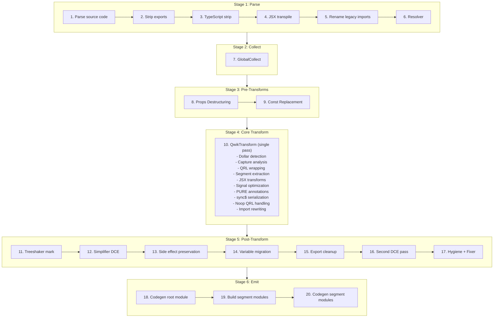

# Qwik v2 Optimizer -- Behavioral Specification

**Version:** 0.1.0
**Date:** 2026-04-01
**Status:** Phase 1 -- Core Pipeline

> **Scope:** This document specifies the behavioral contract of the Qwik v2 optimizer. An OXC implementation can be built from this specification without referencing the SWC source code.

---

## Pipeline Overview

The Qwik optimizer transforms a single input module into multiple output modules: one root module (the transformed original) and N segment modules (lazy-loadable code extracted from `$()` boundaries). The transformation executes as a deterministic 20-step pipeline.

### Pipeline Diagram



Source: parse.rs `transform_code()` function

### Stage Descriptions

**Stage 1: Parse (Steps 1-6).** Parses the source code, detecting TypeScript and JSX from the file extension. Optionally strips named exports (via `strip_exports` config), strips TypeScript type annotations, transpiles JSX to `jsx()`/`jsxs()` calls using React automatic runtime with `@qwik.dev/core` as the import source, renames legacy `@builder.io/qwik` imports to `@qwik.dev/core`, and runs the SWC resolver to assign scope marks for identifier resolution.

**Stage 2: Collect (Step 7).** Runs `GlobalCollect`, a single read-only AST pass that catalogs all imports, exports, and root-level declarations. This metadata is queried by every subsequent transformation stage. See [Stage 2: GlobalCollect](#stage-2-globalcollect) for full specification.

**Stage 3: Pre-Transforms (Steps 8-9).** Reconstructs destructured component props into `_rawProps.propName` access patterns for signal reactivity tracking (runs in all modes including Lib). In non-Lib/non-Test modes, replaces `isServer`, `isBrowser`, and `isDev` imports from `@qwik.dev/core/build` with boolean literals based on build configuration.

**Stage 4: Core Transform (Step 10).** A single traversal pass (`QwikTransform`) that performs the core QRL extraction pipeline: detects `$`-suffixed marker function calls, analyzes captured variables across scope boundaries, wraps marker calls with QRL references (`qrl()`/`inlinedQrl()`), extracts callback bodies as separate segment modules, rewrites imports for both root and segment modules, transforms JSX elements, optimizes signal expressions, adds PURE annotations to tree-shakeable calls, handles `sync$` serialization, and emits noop QRLs for stripped segments.

**Stage 5: Post-Transform (Steps 11-17).** Marks side-effect expressions for client-side tree-shaking, runs dead code elimination (DCE), preserves side-effect imports for Inline/Hoist strategies or performs client-side tree-shaker cleanup, migrates root-level variables exclusively used by a single segment into that segment, cleans up synthetic exports for migrated variables, runs a second DCE pass if migration occurred, and applies hygiene renaming and AST fixing.

**Stage 6: Emit (Steps 18-20).** Generates JavaScript code and source maps for the root module, constructs each segment module from its extracted expression and resolved imports via `code_move::new_module()`, and generates code and individual source maps for each segment module.

### Phase Coverage

**Phase 1 (this document) specifies:** Stage 2 (GlobalCollect), the infrastructure sections (Hash Generation, Path Resolution), and lays the structural foundation. Stages 4 Core Transform details (Dollar Detection, Capture Analysis, QRL Wrapping, Segment Extraction, Import Rewriting) and Stage 5 Variable Migration will be added in Plans 02-04.

**Later phases specify:** Stage 3 Pre-Transforms (Phase 2 -- Props Destructuring; Phase 3 -- Const Replacement), Stage 4 JSX/Signal/PURE subsystems (Phase 2), Stage 4 sync$/noop (Phase 3), Stage 5 DCE/Treeshaker (Phase 3), Stage 6 emit modes and entry strategies (Phase 3), and API/binding contracts (Phase 4).

---

## Stage 2: GlobalCollect

GlobalCollect is a single read-only AST traversal that runs once before any transformations (Step 7 in the pipeline). It catalogs every import, export, and root-level declaration in the module. Its output is queried throughout the pipeline by dollar detection (to identify marker functions), capture analysis (to distinguish globals from captures), QRL wrapping (to manage synthetic imports), segment extraction (to resolve imports for segment modules), and variable migration (to determine which declarations are migratable).

Source: collector.rs:56-528

### Data Structures

GlobalCollect produces four primary data structures:

| Field | Type | Description |
|-------|------|-------------|
| `imports` | `IndexMap<Id, Import>` | Every import specifier with its source module, `ImportKind` (Named, Default, All), whether it is synthetic (added by the optimizer), and optional import assertions |
| `exports` | `IndexMap<Atom, ExportInfo>` | Every exported name with its local `Id` and list of exported names (supports re-exports and renames) |
| `root` | `IndexMap<Id, Span>` | Every top-level declaration: `var`/`let`/`const` bindings, `function` declarations, `class` declarations, and `enum` (TypeScript) declarations |
| `canonical_ids` | `HashMap<Atom, Id>` | Maps symbol names to their first-seen `Id`, used for resolving local identifiers to their canonical representation |

Where `Id` is a tuple of `(Atom, SyntaxContext)` -- the symbol name paired with its scope context. `Import` contains `source` (module path), `specifier` (imported name), `kind` (Named/Default/All), `synthetic` (bool), and optional `asserts`.

### Behavioral Rules

1. **Single pass, read-only.** GlobalCollect visits the AST once using the `Visit` trait (not `VisitMut`). It does not modify the AST. It must run after the resolver (Step 6) so that `SyntaxContext` marks are assigned.

2. **Import collection.** Every `import` declaration is recorded:
   - Named imports (`import { foo } from 'bar'`): specifier = `"foo"`, kind = `Named`
   - Default imports (`import foo from 'bar'`): specifier = `"default"`, kind = `Default`
   - Namespace imports (`import * as foo from 'bar'`): specifier = `"*"`, kind = `All`
   - Renamed imports (`import { foo as bar } from 'baz'`): local id uses `bar`, specifier = `"foo"`
   - All user imports have `synthetic: false`

3. **Export collection.** Every export is recorded via `add_export(local_id, exported_name)`:
   - Named exports (`export { foo }`, `export { foo as bar }`): local_id from the identifier, exported name is the alias or `None` for same-name
   - Export declarations (`export const x = 1`, `export function f() {}`, `export class C {}`): local_id from the declaration name
   - Default export declarations (`export default function f() {}`, `export default class C {}`): exported name is `"default"`
   - Re-exports with a `src` (`export { foo } from 'bar'`) are **skipped** -- they are not local exports
   - Destructured export vars (`export const { a, b } = obj`) record each binding individually

4. **Root declaration collection.** Every top-level statement that is a declaration (but NOT inside an export) is recorded via `add_root(id, span)`:
   - `function` declarations
   - `class` declarations
   - `var`/`let`/`const` declarations (each binding in a destructuring pattern is recorded individually via `collect_from_pat`)
   - TypeScript `enum` declarations
   - Note: Export declarations are handled separately (they call `add_export`, which also registers canonical_ids but not root)

5. **Canonical ID registration.** Every `add_root`, `add_import`, and `add_export` call registers the id via `register_canonical_id()`, which stores the first-seen `Id` for each symbol name in `canonical_ids`. This is used later to resolve different scope contexts of the same symbol to a single canonical identity.

### Key Methods

**`is_global(id) -> bool`**: Returns `true` if the identifier appears in `imports` OR has an export with matching symbol name OR appears in `root`. This is the primary predicate used by capture analysis -- an identifier that is "global" is NOT a capture; it will be available in the segment module via imports or self-imports.

```
is_global(id) = imports.contains(id) || exports.contains(id.symbol) || root.contains(id)
```

**`import(specifier, source) -> Id`**: Ensures an import exists for the given specifier from the given source module. If an existing import matches (checked via `rev_imports` reverse lookup), returns its local `Id`. Otherwise, creates a new synthetic import with `synthetic: true`, adds it to both `imports` and `synthetic` lists, and returns the new local `Id`. Used by the core transform to add runtime helper imports (`qrl`, `componentQrl`, `_jsxSorted`, etc.).

**`add_export(id, exported) -> bool`**: Registers an export. If the symbol name is new, creates an `ExportInfo` entry. If it already exists, appends the new exported name to the list (supporting multiple export aliases). Returns `false` if the exact exported name already exists. Used by `ensure_export()` during segment extraction to create synthetic `_auto_X` exports for self-import resolution.

**`remove_root_and_exports_for_id(id)`**: Removes an identifier from both `root` and `exports` maps. Used during variable migration cleanup -- after a root-level declaration is moved into a segment, its entry is removed so the root module's export list stays clean.

**`get_imported_local(specifier, source) -> Option<Id>`**: Finds the local `Id` for a specific imported specifier from a specific source. Used by segment module construction to resolve identifiers to their original imports.

**`export_local_ids() -> Vec<Id>`**: Returns the local `Id` for every export. Used during dollar detection to identify locally-defined `$`-suffixed exports as marker functions.

### Example 1: Basic Module (basic_collect)

**Input:**

```typescript
import { component$, useTask$ } from '@qwik.dev/core';
import { fetchData } from './api';

export const Counter = component$(() => {
  return <div>Hello</div>;
});

const helperFn = () => 42;
let mutableState = 0;
```

**GlobalCollect output:**

```
imports: {
  (component$, ctx1) -> Import { source: "@qwik.dev/core", specifier: "component$", kind: Named, synthetic: false }
  (useTask$,   ctx1) -> Import { source: "@qwik.dev/core", specifier: "useTask$",   kind: Named, synthetic: false }
  (fetchData,  ctx2) -> Import { source: "./api",          specifier: "fetchData",  kind: Named, synthetic: false }
}

exports: {
  "Counter" -> ExportInfo { local_id: (Counter, ctx0), exported_names: [None] }
}

root: {
  (helperFn,     ctx0) -> Span(...)
  (mutableState, ctx0) -> Span(...)
}

canonical_ids: {
  "component$"   -> (component$, ctx1)
  "useTask$"     -> (useTask$, ctx1)
  "fetchData"    -> (fetchData, ctx2)
  "Counter"      -> (Counter, ctx0)
  "helperFn"     -> (helperFn, ctx0)
  "mutableState" -> (mutableState, ctx0)
}
```

**Key observations:**
- `Counter` appears in `exports` (because of `export const`) but NOT in `root` (export declarations are handled via `visit_export_decl`, which calls `add_export` but not the root-collection path of `visit_module_item`)
- `helperFn` and `mutableState` appear in `root` because they are top-level statements (non-exported `const` and `let`)
- All three imported identifiers are in `imports` with `synthetic: false`
- `is_global(helperFn)` returns `true` (it is in `root`)
- `is_global(Counter)` returns `true` (it has an export)

### Example 2: Synthetic Import During Transform (synthetic_import)

During the core transform pass (Step 10), the optimizer calls `global_collect.import(specifier, source)` to ensure runtime helper imports exist. This mutates GlobalCollect by adding synthetic entries.

**Before transform -- GlobalCollect state:**

```
imports: {
  ($,     ctx1) -> Import { source: "@qwik.dev/core", specifier: "$",     kind: Named, synthetic: false }
}
```

**Transform calls `global_collect.import("qrl", "@qwik.dev/core")`:**

```
imports: {
  ($,     ctx1) -> Import { source: "@qwik.dev/core", specifier: "$",     kind: Named, synthetic: false }
  (qrl,   ctx3) -> Import { source: "@qwik.dev/core", specifier: "qrl",   kind: Named, synthetic: true  }
}

synthetic: [
  (qrl, ctx3) -> Import { source: "@qwik.dev/core", specifier: "qrl", kind: Named, synthetic: true }
]
```

**Key observations:**
- The synthetic import gets a fresh `SyntaxContext` (ctx3) from `private_ident!()`, ensuring no collision with user identifiers
- The `synthetic` list tracks which imports were added by the optimizer (vs. user-written), used during segment module construction to determine which imports to emit
- Calling `import("qrl", "@qwik.dev/core")` a second time returns the existing `(qrl, ctx3)` Id without creating a duplicate (checked via `rev_imports`)
- `is_global((qrl, ctx3))` returns `true` after the synthetic import is added

---

## Stage 3: Pre-Transforms

> (Specified in Phase 2 -- Props Destructuring, Phase 3 -- Const Replacement)

---

## Stage 4: Core Transform

> (Dollar Detection, Capture Analysis, QRL Wrapping, Segment Extraction, and Import Rewriting sections will be added in Plans 02-04)

---
