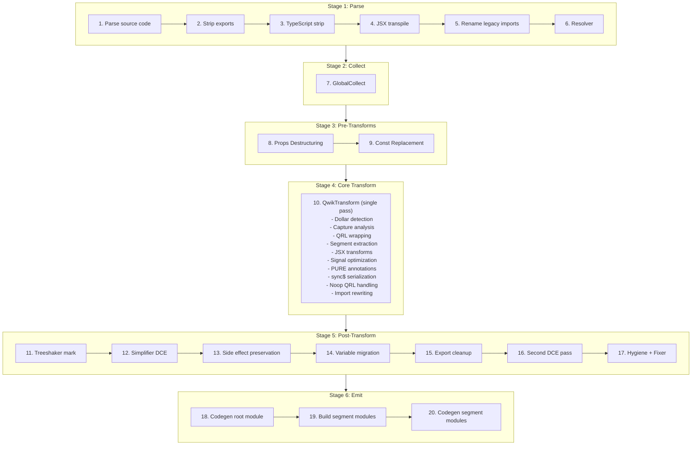
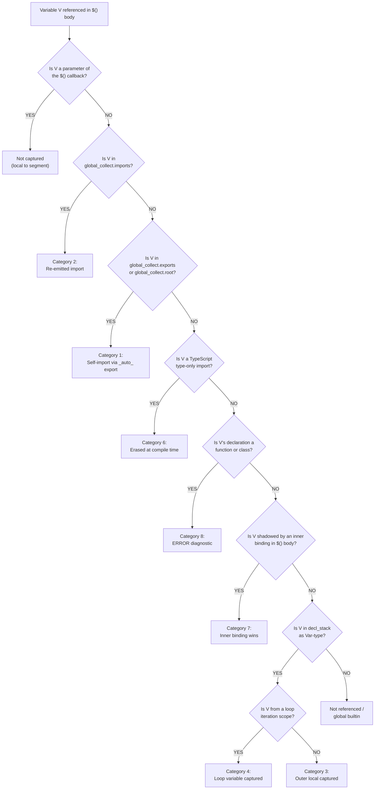

# Qwik v2 Optimizer -- Behavioral Specification

**Version:** 0.1.0
**Date:** 2026-04-01
**Status:** Phase 1 -- Core Pipeline

> **Scope:** This document specifies the behavioral contract of the Qwik v2 optimizer. An OXC implementation can be built from this specification without referencing the SWC source code.

---

## Pipeline Overview

The Qwik optimizer transforms a single input module into multiple output modules: one root module (the transformed original) and N segment modules (lazy-loadable code extracted from `$()` boundaries). The transformation executes as a deterministic 20-step pipeline.

### Pipeline Diagram



Source: parse.rs `transform_code()` function

### Stage Descriptions

**Stage 1: Parse (Steps 1-6).** Parses the source code, detecting TypeScript and JSX from the file extension. Optionally strips named exports (via `strip_exports` config), strips TypeScript type annotations, transpiles JSX to `jsx()`/`jsxs()` calls using React automatic runtime with `@qwik.dev/core` as the import source, renames legacy `@builder.io/qwik` imports to `@qwik.dev/core`, and runs the SWC resolver to assign scope marks for identifier resolution.

**Stage 2: Collect (Step 7).** Runs `GlobalCollect`, a single read-only AST pass that catalogs all imports, exports, and root-level declarations. This metadata is queried by every subsequent transformation stage. See [Stage 2: GlobalCollect](#stage-2-globalcollect) for full specification.

**Stage 3: Pre-Transforms (Steps 8-9).** Reconstructs destructured component props into `_rawProps.propName` access patterns for signal reactivity tracking (runs in all modes including Lib). In non-Lib/non-Test modes, replaces `isServer`, `isBrowser`, and `isDev` imports from `@qwik.dev/core/build` with boolean literals based on build configuration.

**Stage 4: Core Transform (Step 10).** A single traversal pass (`QwikTransform`) that performs the core QRL extraction pipeline: detects `$`-suffixed marker function calls, analyzes captured variables across scope boundaries, wraps marker calls with QRL references (`qrl()`/`inlinedQrl()`), extracts callback bodies as separate segment modules, rewrites imports for both root and segment modules, transforms JSX elements, optimizes signal expressions, adds PURE annotations to tree-shakeable calls, handles `sync$` serialization, and emits noop QRLs for stripped segments.

**Stage 5: Post-Transform (Steps 11-17).** Marks side-effect expressions for client-side tree-shaking, runs dead code elimination (DCE), preserves side-effect imports for Inline/Hoist strategies or performs client-side tree-shaker cleanup, migrates root-level variables exclusively used by a single segment into that segment, cleans up synthetic exports for migrated variables, runs a second DCE pass if migration occurred, and applies hygiene renaming and AST fixing.

**Stage 6: Emit (Steps 18-20).** Generates JavaScript code and source maps for the root module, constructs each segment module from its extracted expression and resolved imports via `code_move::new_module()`, and generates code and individual source maps for each segment module.

### Phase Coverage

**Phase 1 (this document) specifies:** Stage 2 (GlobalCollect), Stage 4 Core Transform (Dollar Detection, Capture Analysis, QRL Wrapping, Segment Extraction, Import Rewriting), Stage 5 Variable Migration, and the infrastructure sections (Hash Generation, Path Resolution, Source Map Generation).

**Later phases specify:** Stage 3 Pre-Transforms (Phase 2 -- Props Destructuring; Phase 3 -- Const Replacement), Stage 4 JSX/Signal/PURE subsystems (Phase 2), Stage 4 sync$/noop (Phase 3), Stage 5 DCE/Treeshaker (Phase 3), Stage 6 emit modes and entry strategies (Phase 3), and API/binding contracts (Phase 4).

---

## Stage 2: GlobalCollect

GlobalCollect is a single read-only AST traversal that runs once before any transformations (Step 7 in the pipeline). It catalogs every import, export, and root-level declaration in the module. Its output is queried throughout the pipeline by dollar detection (to identify marker functions), capture analysis (to distinguish globals from captures), QRL wrapping (to manage synthetic imports), segment extraction (to resolve imports for segment modules), and variable migration (to determine which declarations are migratable).

Source: collector.rs:56-528

### Data Structures

GlobalCollect produces four primary data structures:

| Field | Type | Description |
|-------|------|-------------|
| `imports` | `IndexMap<Id, Import>` | Every import specifier with its source module, `ImportKind` (Named, Default, All), whether it is synthetic (added by the optimizer), and optional import assertions |
| `exports` | `IndexMap<Atom, ExportInfo>` | Every exported name with its local `Id` and list of exported names (supports re-exports and renames) |
| `root` | `IndexMap<Id, Span>` | Every top-level declaration: `var`/`let`/`const` bindings, `function` declarations, `class` declarations, and `enum` (TypeScript) declarations |
| `canonical_ids` | `HashMap<Atom, Id>` | Maps symbol names to their first-seen `Id`, used for resolving local identifiers to their canonical representation |

Where `Id` is a tuple of `(Atom, SyntaxContext)` -- the symbol name paired with its scope context. `Import` contains `source` (module path), `specifier` (imported name), `kind` (Named/Default/All), `synthetic` (bool), and optional `asserts`.

### Behavioral Rules

1. **Single pass, read-only.** GlobalCollect visits the AST once using the `Visit` trait (not `VisitMut`). It does not modify the AST. It must run after the resolver (Step 6) so that `SyntaxContext` marks are assigned.

2. **Import collection.** Every `import` declaration is recorded:
   - Named imports (`import { foo } from 'bar'`): specifier = `"foo"`, kind = `Named`
   - Default imports (`import foo from 'bar'`): specifier = `"default"`, kind = `Default`
   - Namespace imports (`import * as foo from 'bar'`): specifier = `"*"`, kind = `All`
   - Renamed imports (`import { foo as bar } from 'baz'`): local id uses `bar`, specifier = `"foo"`
   - All user imports have `synthetic: false`

3. **Export collection.** Every export is recorded via `add_export(local_id, exported_name)`:
   - Named exports (`export { foo }`, `export { foo as bar }`): local_id from the identifier, exported name is the alias or `None` for same-name
   - Export declarations (`export const x = 1`, `export function f() {}`, `export class C {}`): local_id from the declaration name
   - Default export declarations (`export default function f() {}`, `export default class C {}`): exported name is `"default"`
   - Re-exports with a `src` (`export { foo } from 'bar'`) are **skipped** -- they are not local exports
   - Destructured export vars (`export const { a, b } = obj`) record each binding individually

4. **Root declaration collection.** Every top-level statement that is a declaration (but NOT inside an export) is recorded via `add_root(id, span)`:
   - `function` declarations
   - `class` declarations
   - `var`/`let`/`const` declarations (each binding in a destructuring pattern is recorded individually via `collect_from_pat`)
   - TypeScript `enum` declarations
   - Note: Export declarations are handled separately (they call `add_export`, which also registers canonical_ids but not root)

5. **Canonical ID registration.** Every `add_root`, `add_import`, and `add_export` call registers the id via `register_canonical_id()`, which stores the first-seen `Id` for each symbol name in `canonical_ids`. This is used later to resolve different scope contexts of the same symbol to a single canonical identity.

### Key Methods

**`is_global(id) -> bool`**: Returns `true` if the identifier appears in `imports` OR has an export with matching symbol name OR appears in `root`. This is the primary predicate used by capture analysis -- an identifier that is "global" is NOT a capture; it will be available in the segment module via imports or self-imports.

```
is_global(id) = imports.contains(id) || exports.contains(id.symbol) || root.contains(id)
```

**`import(specifier, source) -> Id`**: Ensures an import exists for the given specifier from the given source module. If an existing import matches (checked via `rev_imports` reverse lookup), returns its local `Id`. Otherwise, creates a new synthetic import with `synthetic: true`, adds it to both `imports` and `synthetic` lists, and returns the new local `Id`. Used by the core transform to add runtime helper imports (`qrl`, `componentQrl`, `_jsxSorted`, etc.).

**`add_export(id, exported) -> bool`**: Registers an export. If the symbol name is new, creates an `ExportInfo` entry. If it already exists, appends the new exported name to the list (supporting multiple export aliases). Returns `false` if the exact exported name already exists. Used by `ensure_export()` during segment extraction to create synthetic `_auto_X` exports for self-import resolution.

**`remove_root_and_exports_for_id(id)`**: Removes an identifier from both `root` and `exports` maps. Used during variable migration cleanup -- after a root-level declaration is moved into a segment, its entry is removed so the root module's export list stays clean.

**`get_imported_local(specifier, source) -> Option<Id>`**: Finds the local `Id` for a specific imported specifier from a specific source. Used by segment module construction to resolve identifiers to their original imports.

**`export_local_ids() -> Vec<Id>`**: Returns the local `Id` for every export. Used during dollar detection to identify locally-defined `$`-suffixed exports as marker functions.

### Example 1: Basic Module (basic_collect)

**Input:**

```typescript
import { component$, useTask$ } from '@qwik.dev/core';
import { fetchData } from './api';

export const Counter = component$(() => {
  return <div>Hello</div>;
});

const helperFn = () => 42;
let mutableState = 0;
```

**GlobalCollect output:**

```
imports: {
  (component$, ctx1) -> Import { source: "@qwik.dev/core", specifier: "component$", kind: Named, synthetic: false }
  (useTask$,   ctx1) -> Import { source: "@qwik.dev/core", specifier: "useTask$",   kind: Named, synthetic: false }
  (fetchData,  ctx2) -> Import { source: "./api",          specifier: "fetchData",  kind: Named, synthetic: false }
}

exports: {
  "Counter" -> ExportInfo { local_id: (Counter, ctx0), exported_names: [None] }
}

root: {
  (helperFn,     ctx0) -> Span(...)
  (mutableState, ctx0) -> Span(...)
}

canonical_ids: {
  "component$"   -> (component$, ctx1)
  "useTask$"     -> (useTask$, ctx1)
  "fetchData"    -> (fetchData, ctx2)
  "Counter"      -> (Counter, ctx0)
  "helperFn"     -> (helperFn, ctx0)
  "mutableState" -> (mutableState, ctx0)
}
```

**Key observations:**
- `Counter` appears in `exports` (because of `export const`) but NOT in `root` (export declarations are handled via `visit_export_decl`, which calls `add_export` but not the root-collection path of `visit_module_item`)
- `helperFn` and `mutableState` appear in `root` because they are top-level statements (non-exported `const` and `let`)
- All three imported identifiers are in `imports` with `synthetic: false`
- `is_global(helperFn)` returns `true` (it is in `root`)
- `is_global(Counter)` returns `true` (it has an export)

### Example 2: Synthetic Import During Transform (synthetic_import)

During the core transform pass (Step 10), the optimizer calls `global_collect.import(specifier, source)` to ensure runtime helper imports exist. This mutates GlobalCollect by adding synthetic entries.

**Before transform -- GlobalCollect state:**

```
imports: {
  ($,     ctx1) -> Import { source: "@qwik.dev/core", specifier: "$",     kind: Named, synthetic: false }
}
```

**Transform calls `global_collect.import("qrl", "@qwik.dev/core")`:**

```
imports: {
  ($,     ctx1) -> Import { source: "@qwik.dev/core", specifier: "$",     kind: Named, synthetic: false }
  (qrl,   ctx3) -> Import { source: "@qwik.dev/core", specifier: "qrl",   kind: Named, synthetic: true  }
}

synthetic: [
  (qrl, ctx3) -> Import { source: "@qwik.dev/core", specifier: "qrl", kind: Named, synthetic: true }
]
```

**Key observations:**
- The synthetic import gets a fresh `SyntaxContext` (ctx3) from `private_ident!()`, ensuring no collision with user identifiers
- The `synthetic` list tracks which imports were added by the optimizer (vs. user-written), used during segment module construction to determine which imports to emit
- Calling `import("qrl", "@qwik.dev/core")` a second time returns the existing `(qrl, ctx3)` Id without creating a duplicate (checked via `rev_imports`)
- `is_global((qrl, ctx3))` returns `true` after the synthetic import is added

---

## Stage 3: Pre-Transforms

> (Specified in Phase 2 -- Props Destructuring, Phase 3 -- Const Replacement)

---

## Stage 4: Core Transform

> Dollar Detection, QRL Wrapping, Segment Extraction, and Import Rewriting sections are added by Plans 02 and 04.

### Capture Analysis (CONV-03)

Capture analysis determines which variables cross the `$()` serialization boundary. Every identifier referenced inside a `$()` callback body must be classified: is it a capture (passed via `_captures[N]`), a self-import (resolved via `import { _auto_X as X } from "./module"`), a re-emitted import (same source as the original), a local (parameter of the callback itself), or an error (function/class declaration)? Getting this classification wrong causes runtime failures -- variables are either undefined (missing capture/import) or incorrectly serialized (extra captures bloating bundles). This section was the source of 293 runtime deviations in Jack's OXC implementation, 46 of which were caused by missing self-import reclassification alone.

Source: transform.rs:820-1075 (`_create_synthetic_qsegment`), collector.rs:400-530 (`IdentCollector`), transform.rs:4894 (`compute_scoped_idents`)

#### Algorithm Overview

The capture analysis algorithm executes in 4 steps for each `$()` call site:

**Step 1: Collect descendant identifiers.** An `IdentCollector` instance visits the `$()` callback body via SWC's `Visit` trait. It collects all referenced identifiers into a `HashSet<Id>`. The collector applies these filters:

- **SyntaxContext must not be empty.** Identifiers with `SyntaxContext::empty()` are unresolved globals and are excluded. Source: collector.rs:459-460.
- **Excludes global names.** The identifiers `undefined`, `NaN`, `Infinity`, and `null` are always excluded regardless of SyntaxContext. Source: collector.rs:461-464.
- **Uses `ExprOrSkip` enum.** The collector maintains an `expr_ctxt` stack that tracks whether the current position is an expression context (`ExprOrSkip::Expr`) or a skip context (`ExprOrSkip::Skip`). Only identifiers in expression context are collected. Source: collector.rs:418-428.
  - `visit_expr` pushes `Expr` (identifiers here ARE collected)
  - `visit_stmt` pushes `Skip` (statement-level identifiers are NOT collected)
  - `visit_jsx_attr` pushes `Skip` (JSX attribute names are NOT collected, but JSX expression containers within attributes ARE collected because they trigger `visit_expr`)
  - `visit_key_value_prop` pushes `Skip` (property keys in object literals are NOT collected)
  - `visit_member_expr` pushes `Skip` (member expression property names like `.foo` are NOT collected, but the object itself is collected because the ident is visited before the member push)
- **JSX element names.** `visit_jsx_element_name` only visits children (collecting the identifier) when the element name starts with an uppercase letter (`A-Z`). Lowercase JSX elements (HTML tags like `<div>`) are not collected as identifier references. Source: collector.rs:441-451.
- **JSX usage tracking.** The collector also tracks `use_h` (set to `true` when any JSX element or fragment is encountered) and `use_fragment` (set to `true` for JSX fragments). These flags inform import generation for JSX runtime helpers. Source: collector.rs:430-439.

The output is a sorted `Vec<Id>` of all unique identifiers referenced in the callback body. Source: collector.rs:408-412.

**Step 2: Partition declaration stack.** The `decl_stack` -- accumulated during the AST traversal as the optimizer descends into nested scopes -- contains entries of type `(Id, IdentType)`. Each entry records a declaration visible at the current scope level. The entries are partitioned into two sets:

- **`Var`-type declarations** (capturable): `let`, `const`, `var`, function parameters, catch clause bindings. These are declarations whose values can be serialized and passed across the `$()` boundary.
- **Non-`Var` declarations** (`invalid_decl`): `function` and `class` declarations. These produce ERROR diagnostics if referenced across `$()` boundaries because functions and classes cannot be serialized for resumability.

Source: transform.rs:967-972.

**Step 3: Compute scoped identifiers.** The `compute_scoped_idents()` function performs a set intersection: it finds identifiers that appear in BOTH the descendant identifier set (from Step 1) AND the `Var`-type declaration stack entries (from Step 2). These are the captured variables -- outer-scope locals that the `$()` callback references.

```
compute_scoped_idents(all_idents, all_decl) -> (Vec<Id>, bool):
    set = HashSet::new()
    is_const = true
    for ident in all_idents:
        if ident found in all_decl:
            set.insert(ident)
            if decl is not Var(true):  // Var(true) means const
                is_const = false
    output = sorted(set)
    return (output, is_const)
```

The `is_const` flag tracks whether ALL captured variables are `const` declarations. This metadata is used by the QRL wrapping step to determine if the segment's captures are immutable.

After `compute_scoped_idents()`, function callback parameters are filtered out -- they are local to the segment and must not be captured:

```
param_idents = get_function_params(folded_expr)
scoped_idents.retain(|id| !param_idents.contains(id))
```

Source: transform.rs:4894-4908 (`compute_scoped_idents`), transform.rs:985-990 (parameter filtering).

**Step 4: Classify each identifier against GlobalCollect.** For every identifier in the callback body's `local_idents` set (collected via a second `IdentCollector` pass on the folded expression), the optimizer checks `global_collect`:

- If `global_collect.has_export_symbol(id.symbol)` returns `true`: the identifier is a module-level declaration. The optimizer calls `ensure_export(root_id)` to create a synthetic `_auto_{name}` export, enabling the segment to import it via self-import. This is NOT a capture.
- If the identifier appears in `invalid_decl` (function/class declarations from Step 2): an ERROR diagnostic is emitted -- `"Reference to identifier '{name}' can not be used inside a Qrl($) scope because it's a function"`. The segment still generates (capture analysis does not bail on errors), but the identifier will be undefined at runtime.
- If the identifier is in `global_collect.imports`: it will be re-emitted as an import statement in the segment module by `code_move::new_module()`. NOT a capture.
- If the identifier is in `global_collect.root` (top-level declaration, not exported): same as the export case -- `ensure_export()` is called, creating a self-import path.
- If the identifier passes through all global checks and appears in `scoped_idents`: it IS a capture, resolved via `_captures[N]` destructuring in the segment.

Source: transform.rs:1022-1043 (local_idents classification loop).

**Important behavioral note:** Capture analysis proceeds regardless of diagnostic errors. Only bail if the parsed body is empty (structural parse failure). Semantic errors (e.g., `await` in non-async function, type errors) produce valid ASTs that can still be analyzed for identifier references. This is critical -- bailing on semantic errors silently drops captures for valid code patterns, causing undefined variable errors at runtime. (Pitfall 4 from research; Jack's Plan 10 fix.)

#### Mermaid Decision Tree (D-09)

The following flowchart shows the classification logic for a single variable reference `V` found inside a `$()` callback body:



#### 8-Category Taxonomy Table (D-09)

| # | Category | Is Capture? | How Resolved in Segment | SWC Mechanism | Example |
|---|----------|-------------|------------------------|---------------|---------|
| 1 | Module-level declarations | NO | Self-import: `import { _auto_X as X } from "./module_stem"` | `global_collect.has_export_symbol()` returns true; `ensure_export()` adds synthetic `_auto_` named export; `code_move::resolve_export_for_id()` generates the import in the segment | `const helper = () => 42;` at root scope, used in `$()` -- segment gets `import { _auto_helper as helper } from "./module"` |
| 2 | User-code imports | NO | Re-emitted import statement from original source | `code_move::resolve_import_for_id()` finds the import in `global_collect.imports` and emits an identical import in the segment module | `import css from './style.css'` used in `$()` -- segment gets `import css from './style.css'` |
| 3 | Outer-scope local variables | YES | `_captures[N]` destructuring at top of segment function body | `compute_scoped_idents()` returns them in the intersection of descendant idents and `Var`-type `decl_stack` entries | `const x = 5;` in component body, used in nested `$()` -- segment gets `const x = _captures[0];` |
| 4 | Loop iteration variables | YES | Same as Category 3 (`_captures[N]` destructuring) | Loop variables (`for-of`, `for-in`, C-style `for`) are added to `decl_stack` via `iteration_var_stack` during traversal; `compute_scoped_idents()` picks them up | `for (const item of list) { $(() => use(item)) }` -- `item` captured via `_captures[N]` |
| 5 | Destructured component props | YES (as `_rawProps`) | Captured as `_rawProps` after the props destructuring pre-pass transforms `({count}) => ...` to `(_rawProps) => ...` | Props destructuring (Stage 3, Step 8) runs BEFORE capture analysis, changing the parameter name; the `_rawProps` identifier then follows standard Category 3 capture rules | `component$(({count}) => $(() => count))` -- after props destructuring: `(_rawProps) => $(() => _rawProps.count)` -- `_rawProps` captured, accessed as `_rawProps.count` |
| 6 | TypeScript type-only imports | NO | Erased at compile time; never reaches capture analysis | TypeScript strip (Stage 1, Step 3) removes type-only imports before GlobalCollect runs; they do not appear in `global_collect.imports` | `import type { Foo } from './types'` -- completely removed during TS strip |
| 7 | Shadowed variables | NO (inner wins) | The inner binding is local to the segment; the outer binding is not referenced | `collect_local_declarations_from_expr()` in `get_local_idents` identifies inner declarations; the inner binding shadows the outer one in the descendant identifier set because they share the same name but have different `SyntaxContext` | `const x = 1; $(() => { const x = 2; use(x) })` -- the inner `x` has a different `SyntaxContext`, and only the inner one is referenced in the callback body |
| 8 | Function/class declarations in scope | ERROR | Diagnostic emitted; segment still generated but identifier will be undefined at runtime | `invalid_decl` partition in `_create_synthetic_qsegment`: identifiers whose `decl_stack` entry has a non-`Var` type produce error `"Reference to identifier '{name}' can not be used inside a Qrl($) scope because it's a function"` (error code C02) | `function helper() {}; $(() => helper())` -- ERROR diagnostic emitted for `helper`; segment code references `helper` but it will be undefined |

#### Self-Import Reclassification

Self-import reclassification is the single most impactful behavioral distinction in the capture system. It resolved 46 of Jack's 293 runtime deviations in his OXC implementation. The mechanism ensures that module-level declarations (constants, functions, classes, enums at the top level of the source file) are NOT treated as captures but are instead made available to segment modules via synthetic exports and self-imports.

**The problem it solves:** When a segment references a module-level declaration like `const API_URL = "/api"`, that declaration exists in the root module's scope. The segment module is a separate file -- it cannot directly access the root module's variables. Without self-import reclassification, the declaration would either be (a) incorrectly added as a `_captures[N]` entry (wrong -- it is not a closure variable) or (b) silently dropped (wrong -- the segment would get `ReferenceError` at runtime).

**The mechanism (4 steps):**

1. **Detection.** During the local_idents classification loop (transform.rs:1022-1043), for each identifier referenced by the segment, the optimizer checks `global_collect.has_export_symbol(id.symbol)`. If the identifier is already exported, no action is needed -- the segment can import it directly. If it is NOT exported but IS in `global_collect.root` (a top-level declaration), it needs a synthetic export.

2. **Synthetic export creation.** `ensure_export(root_id)` (transform.rs:1024-1026) calls `global_collect.add_export(root_id, Some("_auto_{name}"))`. This adds a synthetic named export to the root module: `export { original_name as _auto_original_name }`. The `_auto_` prefix prevents collision with user-defined exports.

3. **Segment import generation.** When `code_move::new_module()` constructs the segment module, it processes each identifier in `local_idents`. For identifiers that resolve to exports (including the new synthetic `_auto_` exports), `resolve_export_for_id()` generates: `import { _auto_X as X } from "./module_stem"`. The segment can now reference `X` as if it were a local variable.

4. **Captures field is `false`.** Because the identifier is resolved via import rather than capture, the segment's `captures` field in `SegmentAnalysis` is `false` (assuming no other identifiers are captured). The segment does NOT import `_captures` from `@qwik.dev/core` and does NOT have destructuring at the function body top.

**Key implementation detail:** The `_auto_` prefix is a convention, not a hard requirement from the language. It exists to prevent name collisions -- if a module already exports a `helper` name, the synthetic export `_auto_helper` does not conflict.

Source: transform.rs:1024-1026 (`ensure_export`), code_move.rs:200-276 (`resolve_export_for_id` and import generation)

#### Example 1: Captures with Destructuring (example_multi_capture)

This example demonstrates Category 3 (outer-scope local variables) and Category 5 (destructured component props) captures. The component's props are destructured, transformed by the props destructuring pre-pass into `_rawProps`, and then captured across the `$()` boundary.

**Input:**

```typescript
import { $, component$ } from '@qwik.dev/core';

export const Foo = component$(({foo}) => {
  const arg0 = 20;
  return $(() => {
    const fn = ({aaa}) => aaa;
    return (
      <div>
        {foo}{fn()}{arg0}
      </div>
    )
  });
})
```

**Root module output (test.jsx):**

```javascript
import { componentQrl } from "@qwik.dev/core";
import { qrl } from "@qwik.dev/core";
//
const q_Foo_component_HTDRsvUbLiE = /*#__PURE__*/ qrl(
  ()=>import("./test.tsx_Foo_component_HTDRsvUbLiE"),
  "Foo_component_HTDRsvUbLiE"
);
//
export const Foo = /*#__PURE__*/ componentQrl(q_Foo_component_HTDRsvUbLiE);
```

**Component segment output (test.tsx_Foo_component_HTDRsvUbLiE.jsx):**

```javascript
import { qrl } from "@qwik.dev/core";
//
const q_Foo_component_1_DvU6FitWglY = /*#__PURE__*/ qrl(
  ()=>import("./test.tsx_Foo_component_1_DvU6FitWglY"),
  "Foo_component_1_DvU6FitWglY"
);
//
export const Foo_component_HTDRsvUbLiE = (_rawProps)=>{
    return q_Foo_component_1_DvU6FitWglY.w([
        _rawProps
    ]);
};
```

**Nested segment output (test.tsx_Foo_component_1_DvU6FitWglY.jsx):**

```javascript
import { _captures } from "@qwik.dev/core";
//
export const Foo_component_1_DvU6FitWglY = ()=>{
    const _rawProps = _captures[0];
    const fn = ({ aaa })=>aaa;
    return <div>
        {_rawProps.foo}{fn()}{20}
      </div>;
};
```

**Capture analysis breakdown:**
- `_rawProps` (Category 5): The original `{foo}` destructuring was transformed to `_rawProps` by the props destructuring pre-pass. In the component segment, `_rawProps` is a parameter (not captured). In the nested segment, `_rawProps` is an outer-scope local -- captured via `_captures[0]`. Access to `foo` becomes `_rawProps.foo`.
- `arg0` (value `20`): This `const` initializer is inlined as the literal `20` in the segment -- it is NOT captured. The optimizer detects that `arg0` is a simple const with a literal initializer and substitutes it directly.
- `fn` (Category 7 -- inner binding): The `fn` variable is declared INSIDE the `$()` callback body. It is local to the segment, not captured.
- `captures: true` on the nested segment, `captureNames: ["_rawProps"]` -- confirming `_rawProps` is the only capture.
- `captures: false` on the component segment -- `_rawProps` is a parameter, not a capture.

#### Example 2: Import Re-emission (example_capture_imports)

This example demonstrates Category 2 (user-code imports). Imports used inside a `$()` callback are NOT captured -- they are re-emitted as import statements in the segment module.

**Input:**

```typescript
import { component$, useStyles$ } from '@qwik.dev/core';
import css1 from './global.css';
import css2 from './style.css';
import css3 from './style.css';

export const App = component$(() => {
  useStyles$(`${css1}${css2}`);
  useStyles$(css3);
})
```

**Segment output for `useStyles$(\`...\`)` (test.tsx_App_component_useStyles_t35nSa5UV7U.js):**

```javascript
import css1 from "./global.css";
import css2 from "./style.css";
//
export const App_component_useStyles_t35nSa5UV7U = `${css1}${css2}`;
```

**Segment output for `useStyles$(css3)` (test.tsx_style_css_TRu1FaIoUM0.js):**

```javascript
import css3 from "./style.css";
//
export const style_css_TRu1FaIoUM0 = css3;
```

**Capture analysis breakdown:**
- `css1`, `css2`, `css3` (Category 2): All three are user-code imports. They appear in `global_collect.imports`. The segment modules re-emit identical import statements from the same sources. `captures: false` on both segments.
- The `useStyles$` calls are converted to `useStylesQrl()` calls in the component segment, referencing the extracted QRL constants.
- No `_captures` import appears in any segment -- all references resolve to imports.

#### Example 3: Self-Import Reclassification (example_capturing_fn_class)

This example demonstrates Category 1 (module-level declarations via self-import) and Category 8 (function/class declaration errors). It shows how the optimizer handles function and class declarations referenced across `$()` boundaries.

**Input:**

```typescript
import { $, component$ } from '@qwik.dev/core';

export const App = component$(() => {
  function hola() {
    console.log('hola');
  }
  class Thing {}
  class Other {}

  return $(() => {
    hola();
    new Thing();
    return (
      <div></div>
    )
  });
})
```

**Nested segment output (test.tsx_App_component_1_w0t0o3QMovU.js):**

```javascript
import { _jsxSorted } from "@qwik.dev/core";
//
export const App_component_1_w0t0o3QMovU = ()=>{
    hola();
    new Thing();
    return /*#__PURE__*/ _jsxSorted("div", null, null, null, 3, "u6_0");
};
```

**Diagnostics:**

```json
[
  {
    "category": "error",
    "code": "C02",
    "message": "Reference to identifier 'Thing' can not be used inside a Qrl($) scope because it's a function"
  },
  {
    "category": "error",
    "code": "C02",
    "message": "Reference to identifier 'hola' can not be used inside a Qrl($) scope because it's a function"
  }
]
```

**Capture analysis breakdown:**
- `hola` and `Thing` (Category 8): Both are function/class declarations in the component scope. They appear in `invalid_decl` (non-`Var` partition of `decl_stack`). ERROR diagnostics are emitted with code C02. The segment still generates -- capture analysis does not bail on errors -- but `hola` and `Thing` will be undefined at runtime.
- `Other` is declared but not referenced in the `$()` callback, so it does not appear in the analysis.
- `captures: false` on the nested segment -- `hola` and `Thing` are not added to `scoped_idents` because they are not `Var`-type declarations.
- The segment code references `hola()` and `new Thing()` directly (not through `_captures`), meaning they will cause `ReferenceError` at runtime. This is by design -- the ERROR diagnostic warns the developer.

#### Named Capture Edge Cases

Per D-10, the following 16 edge cases define the complete test matrix for capture analysis. Each edge case validates a specific behavioral rule. An implementation MUST handle all 16 cases correctly. Jack's OXC implementation initially had 293 runtime deviations, 46 of which were resolved by correctly implementing self-import reclassification (CAPTURE-EDGE-10 through CAPTURE-EDGE-12).

---

**CAPTURE-EDGE-01: Loop variable in for-of** (Category 4)

**Rule tested:** Variables declared in `for-of` loop headers are added to `decl_stack` via `iteration_var_stack` and are capturable across `$()` boundaries.

**Input:**
```typescript
import { $, component$ } from '@qwik.dev/core';
export const App = component$(() => {
  const items = ['a', 'b'];
  for (const item of items) {
    $(() => console.log(item));
  }
});
```

**Expected behavior:** `item` IS captured via `_captures[0]`. The segment imports `_captures` from `@qwik.dev/core` and destructures `const item = _captures[0];` at the top of the function body.

**Why it matters:** Loop iteration variables have fresh bindings per iteration. If not captured, the segment would reference a stale or undefined variable.

Reference: example_component_with_event_listeners_inside_loop snapshot (loopForOf function).

---

**CAPTURE-EDGE-02: Loop variable in for-in** (Category 4)

**Rule tested:** Variables declared in `for-in` loop headers follow the same capture path as `for-of`.

**Input:**
```typescript
import { $, component$ } from '@qwik.dev/core';
export const App = component$(() => {
  const obj = {a: 1, b: 2};
  for (const key in obj) {
    $(() => console.log(key));
  }
});
```

**Expected behavior:** `key` IS captured via `_captures[0]`. Same mechanism as CAPTURE-EDGE-01.

**Why it matters:** `for-in` iteration variables must be treated identically to `for-of` variables for capture purposes.

Reference: example_component_with_event_listeners_inside_loop snapshot (loopForIn function).

---

**CAPTURE-EDGE-03: C-style for loop variable** (Category 4)

**Rule tested:** Variables declared in C-style `for` loop initializers (`for (let i = 0; ...)`) are capturable.

**Input:**
```typescript
import { $, component$ } from '@qwik.dev/core';
export const App = component$(() => {
  const results = ['a', 'b'];
  for (let i = 0; i < results.length; i++) {
    $(() => console.log(results[i]));
  }
});
```

**Expected behavior:** Both `i` and `results` ARE captured. The segment gets `const i = _captures[0]; const results = _captures[1];` (or similar ordering based on sorted `Id`).

**Why it matters:** C-style `for` loop variables use `let` (mutable), which means each iteration does NOT get a fresh binding (unlike `for-of`/`for-in` with `const`). However, the optimizer still captures them because they appear in `decl_stack` as `Var`-type entries. The runtime behavior depends on the calling code to pass the correct value per iteration.

Reference: example_component_with_event_listeners_inside_loop snapshot (loopForI function).

---

**CAPTURE-EDGE-04: Nested $() capturing from grandparent scope** (Category 3)

**Rule tested:** When `$()` is nested inside another `$()`, the inner segment captures variables from its immediate enclosing scope (the outer segment), not from the grandparent scope. The outer segment must first capture the variable from the grandparent, then the inner segment captures it from the outer.

**Input:**
```typescript
import { $, component$ } from '@qwik.dev/core';
export const App = component$(() => {
  const value = 42;
  return $(() => {
    return $(() => {
      console.log(value);
    });
  });
});
```

**Expected behavior:** The middle segment captures `value` from the component scope via `_captures[0]`. The innermost segment captures `value` from the middle segment via `_captures[0]`. Each `$()` boundary independently captures what it needs from its direct parent scope -- there is no "skip-level" capture.

**Why it matters:** Nested segments form a chain of captures. Each level must independently capture and re-expose variables. If the middle segment does not capture `value`, the inner segment has no way to access it.

(Constructed example -- nesting pattern derived from example_multi_capture.)

---

**CAPTURE-EDGE-05: Shadowed variable -- inner binding hides outer** (Category 7)

**Rule tested:** When a variable is declared both outside and inside the `$()` body, the inner declaration shadows the outer one. The outer variable is NOT captured.

**Input:**
```typescript
import { $ } from '@qwik.dev/core';
const x = 'outer';
export const handler = $(() => {
  const x = 'inner';
  console.log(x);
});
```

**Expected behavior:** `x` is NOT captured. The inner `const x = 'inner'` declaration has a different `SyntaxContext` than the outer `x`. The `IdentCollector` collects the inner `x`'s `Id`, which does not match any `decl_stack` entry for the outer `x`. The segment uses its own local `x`.

**Why it matters:** Without proper shadowing, the segment would unnecessarily capture the outer `x` and the destructured capture would conflict with the inner declaration.

(Constructed example.)

---

**CAPTURE-EDGE-06: Destructured object parameter in $() callback** (Not captured -- callback parameter)

**Rule tested:** Parameters of the `$()` callback itself (including destructured parameters) are local to the segment and are NOT captured.

**Input:**
```typescript
import { $ } from '@qwik.dev/core';
export const handler = $((event, element) => {
  console.log(event.target, element);
});
```

**Expected behavior:** `event` and `element` are NOT captured. They are parameters of the callback function. `get_function_params()` identifies them and `scoped_idents.retain(|id| !param_idents.contains(id))` filters them out. `captures: false`.

**Why it matters:** Callback parameters are provided at invocation time, not at extraction time. Capturing them would be incorrect -- they would be `undefined` at build time.

(Constructed example.)

---

**CAPTURE-EDGE-07: Rest parameter in $() callback** (Not captured -- callback parameter)

**Rule tested:** Rest parameters (`...args`) of the `$()` callback are also local to the segment.

**Input:**
```typescript
import { $ } from '@qwik.dev/core';
export const handler = $((...args) => {
  console.log(args.length);
});
```

**Expected behavior:** `args` is NOT captured. It is a rest parameter of the callback. `get_function_params()` handles rest parameters via `collect_from_pat` which recursively processes `Pat::Rest`. `captures: false`.

**Why it matters:** Rest parameters are a common pattern for event handlers. They must not be treated as captures.

(Constructed example.)

---

**CAPTURE-EDGE-08: Function declaration referenced across $() boundary** (Category 8 -- ERROR)

**Rule tested:** Function declarations in an enclosing scope that are referenced inside `$()` produce an ERROR diagnostic. They are NOT captured (they are in `invalid_decl`, not in the `Var`-type partition).

**Input:**
```typescript
import { $, component$ } from '@qwik.dev/core';
export const App = component$(() => {
  function helper() {
    return 'help';
  }
  return $(() => helper());
});
```

**Expected behavior:** ERROR diagnostic: `"Reference to identifier 'helper' can not be used inside a Qrl($) scope because it's a function"` (code C02). The segment still generates but `helper` will be undefined at runtime. `captures: false` because `helper` is not a `Var`-type declaration.

**Why it matters:** Function declarations cannot be serialized for resumability. Silently capturing them would produce runtime failures without developer feedback. The error diagnostic gives actionable guidance.

Reference: example_capturing_fn_class snapshot -- `hola()` produces this error.

---

**CAPTURE-EDGE-09: Class declaration referenced across $() boundary** (Category 8 -- ERROR)

**Rule tested:** Class declarations follow the same error path as function declarations.

**Input:**
```typescript
import { $, component$ } from '@qwik.dev/core';
export const App = component$(() => {
  class MyWidget {}
  return $(() => new MyWidget());
});
```

**Expected behavior:** ERROR diagnostic: `"Reference to identifier 'MyWidget' can not be used inside a Qrl($) scope because it's a function"` (code C02). Same behavior as CAPTURE-EDGE-08. Note the error message says "function" for both function and class declarations -- this is the actual SWC behavior.

**Why it matters:** Classes, like functions, cannot be serialized. They must be declared at module level (Category 1) to be usable across `$()` boundaries.

Reference: example_capturing_fn_class snapshot -- `Thing` (a class) produces this error.

---

**CAPTURE-EDGE-10: Module-level const used in nested $() -- self-import, not capture** (Category 1)

**Rule tested:** A `const` declaration at the top level of the module (root scope) that is referenced in a nested `$()` is resolved via self-import, NOT via `_captures[N]`.

**Input:**
```typescript
import { $, component$ } from '@qwik.dev/core';
const API_URL = '/api/data';
export const App = component$(() => {
  return $(() => fetch(API_URL));
});
```

**Expected behavior:** `API_URL` is NOT captured. `ensure_export()` creates a synthetic export `export { API_URL as _auto_API_URL }` in the root module. The segment module gets `import { _auto_API_URL as API_URL } from "./module_stem"`. `captures: false`.

**Why it matters:** This is the most impactful edge case. Treating module-level declarations as captures was the source of 46 runtime deviations in Jack's implementation. Module-level declarations are available to all segments via imports -- capturing them would double-serialize them and break the QRL contract (`captures: true` vs `captures: false`).

(Constructed example -- pattern from self-import reclassification subsection.)

---

**CAPTURE-EDGE-11: Module-level function used in $() -- self-import** (Category 1)

**Rule tested:** Module-level function declarations (at root scope, outside any component) are resolved via self-import. Unlike CAPTURE-EDGE-08, these are at module level and available to all segments.

**Input:**
```typescript
import { $, component$ } from '@qwik.dev/core';
export function formatDate(d: Date) {
  return d.toISOString();
}
export const App = component$(() => {
  return $(() => formatDate(new Date()));
});
```

**Expected behavior:** `formatDate` is NOT captured. It is already in `global_collect.exports` (user-exported), so `ensure_export()` is not needed. The segment module gets `import { formatDate } from "./module_stem"`. `captures: false`.

**Why it matters:** The distinction between CAPTURE-EDGE-08 (function in component scope = ERROR) and CAPTURE-EDGE-11 (function at module level = self-import) is critical. The scope level determines the behavior, not the declaration type.

(Constructed example.)

---

**CAPTURE-EDGE-12: TypeScript enum at module level -- self-import** (Category 1)

**Rule tested:** TypeScript `enum` declarations at module level are collected in `global_collect.root` (or `global_collect.exports` if exported) and resolved via self-import in segments.

**Input:**
```typescript
import { component$ } from '@qwik.dev/core';
export enum Thing { A, B }
export const App = component$(() => {
  console.log(Thing.A);
  return <p>Hello</p>;
});
```

**Expected behavior:** `Thing` is NOT captured. It appears in `global_collect.exports`. The segment accesses `Thing.A` -- which SWC may inline as the literal `0` (since TypeScript enums with numeric values are const-evaluated) or import via self-import depending on the transpilation mode. In the SWC snapshot, `Thing.A` is inlined as `0` in the segment. `captures: false`.

**Why it matters:** TypeScript enums are a common pattern. They must be recognized as module-level declarations, not captures. The `TSEnumDeclaration` variant must be collected by `GlobalCollect`'s root/export collection -- Jack's Plan 07 found this was initially missing.

Reference: example_ts_enums snapshot -- `Thing.A` becomes `0` in segment output.

---

**CAPTURE-EDGE-13: Named import used in $() -- re-emitted, not captured** (Category 2)

**Rule tested:** Named imports that are used inside a `$()` callback are re-emitted as import statements in the segment module, not captured.

**Input:**
```typescript
import { component$, useStyles$ } from '@qwik.dev/core';
import css1 from './global.css';
import { helper } from './utils';
export const App = component$(() => {
  useStyles$(css1);
  return $(() => helper());
});
```

**Expected behavior:** `css1` and `helper` are NOT captured. They appear in `global_collect.imports`. The segment for `useStyles$` gets `import css1 from "./global.css"`. The nested segment gets `import { helper } from "./utils"`. `captures: false` on both segments.

**Why it matters:** User imports are already available via the module system. Capturing them would serialize values that are meant to be loaded on demand.

Reference: example_capture_imports snapshot -- `css1` and `css2` are re-emitted as imports.

---

**CAPTURE-EDGE-14: Default import used in $() -- re-emitted** (Category 2)

**Rule tested:** Default imports follow the same re-emission path as named imports.

**Input:**
```typescript
import { component$, useStyles$ } from '@qwik.dev/core';
import styles from './component.module.css';
export const App = component$(() => {
  useStyles$(styles);
});
```

**Expected behavior:** `styles` is NOT captured. It is a default import (`ImportKind::Default`) in `global_collect.imports`. The segment gets `import styles from "./component.module.css"`. `captures: false`.

**Why it matters:** Default imports are common for CSS modules and third-party libraries. The import kind (Default vs Named vs All) must be preserved when re-emitting -- `import styles from X` must not become `import { styles } from X`.

Reference: example_capture_imports snapshot -- `css1` is a default import that gets re-emitted.

---

**CAPTURE-EDGE-15: Props destructuring -- `_rawProps` captured after pre-pass** (Category 5)

**Rule tested:** Component props destructuring is transformed by the Stage 3 pre-pass BEFORE capture analysis runs. The original destructured parameter names (e.g., `{count}`) become `_rawProps`, and property accesses become `_rawProps.count`. When `_rawProps` is used across a `$()` boundary, it follows standard Category 3 capture rules.

**Input:**
```typescript
import { $, component$ } from '@qwik.dev/core';
export const Counter = component$(({count, label}) => {
  return $(() => (
    <div>{count} - {label}</div>
  ));
});
```

**Expected behavior:** After props destructuring pre-pass, the component becomes `(_rawProps) => { ... _rawProps.count ... _rawProps.label ... }`. In the component segment, `_rawProps` is a parameter (not captured). In the nested segment, `_rawProps` is captured via `_captures[0]`, and access is `_rawProps.count` and `_rawProps.label`. `captures: true, captureNames: ["_rawProps"]` on the nested segment.

**Why it matters:** The ordering constraint -- props destructuring BEFORE capture analysis -- is critical. If capture analysis ran first, it would see `count` and `label` as individual identifiers (which do not exist in any outer scope after destructuring). After the pre-pass, there is a single capturable identifier (`_rawProps`) that cleanly represents all props.

Reference: example_multi_capture snapshot -- `_rawProps` is captured with access patterns like `_rawProps.foo`.

---

**CAPTURE-EDGE-16: TypeScript type-only import -- erased, not captured** (Category 6)

**Rule tested:** TypeScript `import type` declarations are removed during the TypeScript strip phase (Stage 1, Step 3), before GlobalCollect even runs. They never appear in `global_collect.imports` and therefore cannot be captured or re-emitted.

**Input:**
```typescript
import { $ } from '@qwik.dev/core';
import type { UserData } from './types';
export const handler = $((data: UserData) => {
  console.log(data.name);
});
```

**Expected behavior:** `UserData` does not appear in the segment output at all. The `import type` is erased during TypeScript strip. The type annotation `data: UserData` is also erased. The segment output is simply `(data) => { console.log(data.name); }`. `captures: false` -- `data` is a callback parameter.

**Why it matters:** Type-only imports must not generate runtime import statements in segments. If the TypeScript strip phase is bypassed or incomplete, type-only imports could leak into `global_collect.imports` and produce invalid `import type { X }` statements in segments that are pure JavaScript.

(Constructed example.)

---

An implementation MUST handle all 16 edge cases. Jack's OXC implementation initially had 293 runtime deviations, 46 of which were resolved by correctly implementing self-import reclassification (CAPTURE-EDGE-10 through CAPTURE-EDGE-12). The remaining deviations were distributed across loop variable capture (CAPTURE-EDGE-01 through CAPTURE-EDGE-03), function/class declaration errors (CAPTURE-EDGE-08, CAPTURE-EDGE-09), and props destructuring ordering (CAPTURE-EDGE-15).

---

## Variable Migration

Variable migration is a post-transform optimization (Steps 14-16 in the pipeline) that moves root-level declarations used exclusively by a single segment into that segment's module. This reduces root module size and eliminates unnecessary self-imports -- the migrated variable is emitted directly in the segment module instead of being imported from the root module. Variable migration runs AFTER the core QRL transform has completed segment extraction, so it operates on the fully-transformed AST where segments already have their `local_idents` and `scoped_idents` populated by capture analysis.

Source: dependency_analysis.rs (full file -- ~587 LOC), parse.rs:399-435 (migration invocation and cleanup)

### Data Structures

```rust
/// Information about a root-level variable's dependencies
pub struct RootVarDependency {
    pub decl: RootVarDecl,       // The AST node (Var, Fn, Class, TsEnum)
    pub is_imported: bool,        // true if from global_collect.imports
    pub is_exported: bool,        // true if user-exported (NOT synthetic _auto_ exports)
    pub depends_on: Vec<Id>,      // Other root-level identifiers referenced in initializer/body
}

// Result of find_migratable_vars:
// BTreeMap<segment_index, Vec<Id>>  -- which variables migrate to which segment
```

### 5-Step Migration Pipeline

Variable migration executes as a 5-step pipeline. Steps 1-3 gather dependency and usage data; step 4 applies the migration conditions; step 5 cleans up the root module.

**Step 1: `analyze_root_dependencies(module, global_collect)`**

Walks every top-level statement in the module and builds a `HashMap<Id, RootVarDependency>` for all root-level declarations:

- For each variable declaration (`const`, `let`, `var`): records the declared identifier(s) and uses `IdentCollector` to find all other identifiers referenced in the initializer expression. These become `depends_on`.
- For function declarations: collects identifiers referenced in the function body.
- For class declarations: collects identifiers referenced in the class body.
- For TypeScript enum declarations: records the declaration (no dependency analysis on members).
- Marks each variable as `is_exported: true` if it appears in a user-written `export` declaration. Synthetic `_auto_`-prefixed exports (generated by the optimizer for self-import support) are NOT counted as user exports.
- Also includes identifiers from `global_collect.root` (which tracks root-level bindings) to ensure imported names are represented.
- Skips import declarations and synthetic export-only statements.

Source: dependency_analysis.rs:28-273

**Step 2: `build_root_var_usage_map(segments, root_deps)`**

For each segment, checks which root variables appear in the segment's `local_idents` or `scoped_idents` (populated by capture analysis). Builds an `IndexMap<Id, Vec<segment_index>>` mapping each root variable to the list of segments that reference it.

- A root variable referenced by 0 segments is "orphaned" -- only the main module uses it.
- A root variable referenced by exactly 1 segment is a **migration candidate**.
- A root variable referenced by 2+ segments cannot be migrated -- it must stay in the root module for all segments to import it.

Source: dependency_analysis.rs:313-335

**Step 3: `build_main_module_usage_set(module, root_deps)`**

Identifies root variables that are still referenced by non-declaration, non-import statements in the root module. These variables cannot be migrated even if only one segment uses them, because the root module itself still needs them at runtime.

The function scans all module items EXCEPT:
- Declaration statements (`Stmt::Decl`) -- a variable's own declaration doesn't count as "usage"
- Import declarations
- Named export declarations (these are structural, not runtime usage)
- Export-all declarations

For all remaining items (expression statements, default exports with expressions, etc.), it collects referenced identifiers via `IdentCollector` and intersects with the set of known root variables.

**Example:** `const x = 5; console.log(x); $(() => use(x))` -- `x` is used by a segment AND by the `console.log(x)` statement in the root module. The main module usage set includes `x`, so it is NOT migratable.

Source: dependency_analysis.rs:341-377

**Step 4: `find_migratable_vars(segments, root_deps, usage_map, main_usage)`**

A variable is migratable if **ALL** of these conditions hold:

1. **Used by exactly one segment** -- appears in exactly one segment's `local_idents` or `scoped_idents` (from Step 2 usage map)
2. **NOT exported by user code** -- `is_exported` is `false`. Synthetic `_auto_` exports are OK to migrate (they are removed as part of cleanup). User-visible exports must remain in the root module.
3. **NOT an import** -- `is_imported` is `false`. Imports stay in the root module and are re-emitted per segment via the import rewriting system.
4. **NOT referenced by main module** -- does not appear in the main module usage set (from Step 3). If the root module still uses this variable at runtime, removing it would break the root module.
5. **Transitive dependencies are ALSO migratable** -- if variable A depends on variable B (B appears in A's `depends_on`), then B must also satisfy conditions 1-4 and migrate to the SAME segment. The algorithm uses BFS to collect all transitive dependencies, including each dependency only if it is not exported, not imported, and not used by the main module.
6. **Safety filter: no root declaration outside the target segment depends on this variable** -- this is the critical guard that prevents breaking other root-level code. The algorithm iterates all root declarations: if any root variable X (that is NOT migrating to the same segment) has this candidate in its `depends_on`, the candidate is blocked. This runs as a fixed-point loop -- removing one candidate can unblock or block others, so the filter repeats until no changes occur.

Additionally, shared declarators (destructuring patterns like `const [a, b] = ...`) must migrate as a unit -- all identifiers in the same declarator must target the same segment, or none migrate.

Source: dependency_analysis.rs:382-475

**Step 5: Post-migration cleanup (parse.rs:399-435)**

After `find_migratable_vars` returns the migration map, the optimizer applies three cleanup operations:

1. **`remove_migrated_exports(module, migrated_ids)`**: Removes synthetic `_auto_`-prefixed named exports for migrated variables from the root module. Also removes the variables from `global_collect` root/export tracking via `remove_root_and_exports_for_id()`.
2. **`remove_unused_qrl_declarations(module)`**: Cleans up QRL const declarations that are no longer referenced after migration.
3. **Second DCE pass**: If any variables were migrated AND minification is enabled (`minify != None`), runs the SWC simplifier/DCE again. This removes imports that were only needed by the now-migrated variables. Without this second pass, the root module would retain dead imports.

The migrated variable declarations are added to the target segment's `migrated_root_vars` field, which is consumed by `new_module()` in code_move.rs when constructing the segment module. The migrated declarations appear as top-level statements in the segment module, before the segment's main function body.

### Cross-References

- **Capture Analysis**: Provides `scoped_idents` and `local_idents` per segment, which are the inputs to Step 2 (usage map construction). Without accurate capture analysis, migration would incorrectly assess which segments use which root variables.
- **Segment Extraction**: Consumes `migrated_root_vars` via `new_module()` in code_move.rs. Migrated declarations are emitted as top-level statements in the segment module.
- **GlobalCollect**: Queried in Step 1 for root-level bindings. Updated in Step 5 when migrated variables are removed from root tracking.
- **Import Rewriting**: After migration, the segment no longer needs to self-import the migrated variable. The self-import statement is eliminated because the variable declaration now lives directly in the segment module.

### Example 1: Basic Variable Migration (basic_migration)

A root-level helper function used by only one segment is migrated into that segment.

**Input:**

```typescript
import { $, component$ } from '@qwik.dev/core';

const helper = (x: number) => x * 2;

export const Counter = component$(() => {
  const val = helper(21);
  return <div>{val}</div>;
});
```

**Root module BEFORE migration:**

```javascript
import { qrl, _jsxC } from "@qwik.dev/core";
const helper = (x)=>x * 2;
export { helper as _auto_helper };
const q_Counter = /*#__PURE__*/ qrl(
  ()=>import("./Counter.tsx_Counter_abc123"), "Counter_abc123"
);
export const Counter = /*#__PURE__*/ component$(q_Counter);
```

**Root module AFTER migration:**

```javascript
import { qrl, _jsxC } from "@qwik.dev/core";
// helper is GONE -- migrated to segment
// _auto_helper export is GONE -- removed by cleanup
const q_Counter = /*#__PURE__*/ qrl(
  ()=>import("./Counter.tsx_Counter_abc123"), "Counter_abc123"
);
export const Counter = /*#__PURE__*/ component$(q_Counter);
```

**Segment module (Counter.tsx_Counter_abc123.tsx):**

```javascript
// helper appears directly -- no self-import needed
const helper = (x)=>x * 2;

export const Counter_abc123 = ()=>{
  const val = helper(21);
  return /*#__PURE__*/ _jsxC("div", { children: val });
};
```

**Why it migrated:** `helper` is used by exactly 1 segment (Counter), is not user-exported, is not an import, is not used by the root module (beyond its declaration), has no transitive dependencies, and no other root declaration depends on it.

### Example 2: Non-Migratable -- Shared Dependency (shared_dependency)

A root-level constant used by multiple segments cannot be migrated. Additionally, a derived variable that depends on the shared constant is also blocked from migration even though only one segment uses it.

**Input:**

```typescript
import { $ } from '@qwik.dev/core';

const CONFIG = { multiplier: 2, offset: 10 };
const derived = CONFIG.multiplier + CONFIG.offset;

export const task1 = $(() => console.log(CONFIG.multiplier));
export const task2 = $(() => console.log(CONFIG.offset));
export const task3 = $(() => console.log(derived));
```

**Root module (after transform, no migration occurs):**

```javascript
import { qrl } from "@qwik.dev/core";
const CONFIG = { multiplier: 2, offset: 10 };
const derived = CONFIG.multiplier + CONFIG.offset;
export { CONFIG as _auto_CONFIG };
export { derived as _auto_derived };

export const task1 = /*#__PURE__*/ qrl(
  ()=>import("./example.tsx_task1_hash1"), "task1_hash1"
);
export const task2 = /*#__PURE__*/ qrl(
  ()=>import("./example.tsx_task2_hash2"), "task2_hash2"
);
export const task3 = /*#__PURE__*/ qrl(
  ()=>import("./example.tsx_task3_hash3"), "task3_hash3"
);
```

**Why CONFIG stays in root:** `CONFIG` is used by 2 segments (task1 and task2). Condition 1 (exactly one segment) fails.

**Why derived stays in root:** `derived` is used by only 1 segment (task3), but its `depends_on` includes `CONFIG`. When `collect_transitive_dependencies` tries to include `CONFIG` as a transitive dependency, it finds that `CONFIG` is used by 2 segments (fails condition 1 in the transitive dependency check). Since the transitive dependency cannot migrate, the safety filter prevents `derived` from migrating -- another root declaration (`derived`) depends on `CONFIG`, and `CONFIG` is not migrating to the same segment. This prevents a situation where `derived` references `CONFIG` in the segment module but `CONFIG` doesn't exist there.

**Segment modules (all use self-imports):**

```javascript
// task1 segment:
import { _auto_CONFIG as CONFIG } from "./example.tsx";
export const task1_hash1 = ()=>console.log(CONFIG.multiplier);

// task2 segment:
import { _auto_CONFIG as CONFIG } from "./example.tsx";
export const task2_hash2 = ()=>console.log(CONFIG.offset);

// task3 segment:
import { _auto_derived as derived } from "./example.tsx";
export const task3_hash3 = ()=>console.log(derived);
```

---

## Infrastructure: Hash Generation

The optimizer uses a deterministic hashing algorithm to generate stable, unique identifiers for each extracted segment. These hashes appear in symbol names, canonical filenames, and QRL references. Hash stability across builds is critical -- changing a hash invalidates cached QRL references and breaks resumability.

Source: transform.rs:204-210 (file hash), transform.rs:353-421 (symbol hash), transform.rs:4725-4729 (base64 encoding), transform.rs:4612-4635 (escape_sym)

### Two-Level Hashing

The optimizer computes two separate hashes using `std::collections::hash_map::DefaultHasher` (Rust's SipHash-1-3):

#### 1. File Hash

Computed once per file during `QwikTransform::new()`. Used as a prefix for JSX key auto-generation.

**Algorithm:**

```
hasher = DefaultHasher::new()
if scope is set:
    hasher.write(scope.as_bytes())
hasher.write(rel_path.to_forward_slash().as_bytes())
file_hash = hasher.finish()    // u64
```

**Inputs (in seed order):**
1. `scope` -- optional string from `TransformModulesOptions.scope` (written first via `Hasher::write` if present)
2. `rel_path` -- the file's relative path with all backslashes converted to forward slashes (via `to_slash_lossy()`)

Source: transform.rs:204-210

#### 2. Symbol Hash

Computed per segment during `register_context_name()`. Produces the hash suffix that appears in symbol names and canonical filenames.

**Algorithm:**

```
hasher = DefaultHasher::new()
if hash_override is set:
    hasher.write(hash_override.as_bytes())
else:
    if scope is set:
        hasher.write(scope.as_bytes())
    hasher.write(rel_path.to_forward_slash().as_bytes())
    hasher.write(display_name.as_bytes())
hash = hasher.finish()    // u64
hash64 = base64(hash)     // see Base64 Encoding below
```

**Inputs (in seed order, when no hash_override):**
1. `scope` -- optional string (written first if present)
2. `rel_path` -- forward-slashed relative file path
3. `display_name` -- the escaped, deduplicated display name (see Display Name Construction below)

Source: transform.rs:393-421

### Base64 Encoding

The `base64()` function converts a `u64` hash to a string identifier:

```rust
fn base64(nu: u64) -> String {
    base64::engine::general_purpose::URL_SAFE_NO_PAD
        .encode(nu.to_le_bytes())
        .replace(['-', '_'], "0")
}
```

**Steps:**
1. Convert the `u64` to 8 bytes in **little-endian** order (`to_le_bytes()`)
2. Encode with `URL_SAFE_NO_PAD` base64 engine (alphabet: `A-Za-z0-9+/` with `-` and `_` instead of `+` and `/`, no `=` padding)
3. Replace all `-` characters with `0`
4. Replace all `_` characters with `0`

The result is always 11 characters (8 bytes base64-encoded without padding = ceil(8*4/3) = 11 chars, with `-`/`_` replaced by `0`).

Source: transform.rs:4725-4729

### Display Name Construction

The display name is built from the function context hierarchy and determines both the human-readable portion of symbol names and the hash input.

**Algorithm:**

```
1. Build context string:
   display_name = stack_ctxt.join("_")
   if stack_ctxt is empty:
       display_name = "s_"

2. Escape non-alphanumeric characters:
   display_name = escape_sym(display_name)
   // escape_sym replaces non-[A-Za-z0-9] with '_'
   // trims leading underscores
   // squashes consecutive underscores to one

3. Prepend underscore if starts with digit:
   if display_name[0] is '0'-'9':
       display_name = "_" + display_name

4. Deduplicate via segment_names HashMap:
   if display_name not in segment_names:
       segment_names[display_name] = 0     // first occurrence, no suffix
   else:
       segment_names[display_name] += 1
       display_name = display_name + "_" + count  // e.g., "sym_1", "sym_2"

5. Compute hash using display_name (see Symbol Hash above)

6. Build final display_name for metadata:
   display_name = file_stem + "_" + display_name  // e.g., "Counter_onClick"
```

**`escape_sym()` details** (transform.rs:4612-4635):
- Every character that is NOT `A-Z`, `a-z`, or `0-9` is replaced with `_`
- Leading underscores are trimmed (the fold starts with an empty accumulator and only emits `_` when preceded by a non-underscore character)
- Consecutive underscores are squashed to a single underscore (tracked via the `prev` state in the fold)

**`stack_ctxt` contents:** The context stack is built during the traversal. Function names, variable names from assignments, and JSX element tag names are pushed onto `stack_ctxt` as the traversal descends. This gives segments meaningful names like `Counter_onClick` rather than anonymous hashes.

Source: transform.rs:4612-4635 (escape_sym), transform.rs:353-376 (register_context_name)

### Symbol Name Format

The final symbol name depends on the emit mode:

| Mode | Format | Example |
|------|--------|---------|
| Dev, Test, Hmr, Lib | `{display_name}_{hash64}` | `Counter_onClick_aXUrPXX5Lak` |
| Prod | `s_{hash64}` | `s_aXUrPXX5Lak` |

Source: transform.rs:407-414

### Example 1: Basic Symbol Hash (example_6)

**Input file:** `test.tsx` (relative path: `test.tsx`)

```typescript
import { $ } from '@qwik.dev/core';
export const sym1 = $((ctx) => console.log("1"));
```

**Display name construction:**
1. `stack_ctxt` at the `$()` call site: `["sym1"]` (from the variable assignment)
2. `stack_ctxt.join("_")` = `"sym1"`
3. `escape_sym("sym1")` = `"sym1"` (already alphanumeric)
4. Does not start with digit, no prepend needed
5. First occurrence in `segment_names`, no deduplication suffix
6. Symbol hash inputs: `rel_path = "test.tsx"`, `display_name = "sym1"`
7. Final `display_name` for metadata: `"test.tsx_sym1"`

**Hash computation (Dev mode):**
```
hasher = DefaultHasher::new()
hasher.write(b"test.tsx")
hasher.write(b"sym1")
hash = hasher.finish()           // some u64
hash64 = base64(hash)            // e.g., "aXUrPXX5Lak"
symbol_name = "sym1_aXUrPXX5Lak" // Dev mode: {display_name}_{hash64}
```

**In Prod mode:** `symbol_name = "s_aXUrPXX5Lak"` (same hash, different format)

### Example 2: Deduplication with Multiple Dollar Calls (dedup_dollar)

**Input file:** `test.tsx`

```typescript
import { $ } from '@qwik.dev/core';
export const handler = () => {
  const a = $(() => console.log("first"));
  const b = $(() => console.log("second"));
};
```

**Display name construction for first `$()`:**
1. `stack_ctxt`: `["handler"]` (from the enclosing function)
2. `display_name` = `"handler"`
3. `segment_names` check: not present, insert `"handler" -> 0`
4. No deduplication suffix
5. Symbol hash inputs: `"test.tsx"` + `"handler"`
6. `symbol_name` = `"handler_{hash1}"`

**Display name construction for second `$()`:**
1. `stack_ctxt`: `["handler"]` (same enclosing function)
2. `display_name` = `"handler"`
3. `segment_names` check: already present with count 0, increment to 1
4. Deduplication suffix applied: `display_name` = `"handler_1"`
5. Symbol hash inputs: `"test.tsx"` + `"handler_1"` (different input, different hash)
6. `symbol_name` = `"handler_1_{hash2}"`

**Result:** Two distinct segments with unique hashes despite sharing the same enclosing context.

---

## Infrastructure: Path Resolution

Path resolution governs how the optimizer constructs file paths for segment modules -- both the canonical filename used to name the segment file and the import path used to reference it from the root module's QRL calls.

Source: parse.rs:927-956 (parse_path), transform.rs:4910-4913 (get_canonical_filename), transform.rs:1110-1145 (create_segment)

### parse_path()

Extracts file metadata from the relative source path. Called once at the start of `transform_code()`.

**Algorithm:**

```
input: relative_path (string), base_dir (Path)
1. Convert backslashes to forward slashes: path = relative_path.replace('\\', '/')
2. Extract file_stem: path without extension (e.g., "Counter" from "src/Counter.tsx")
3. Extract extension: file extension without dot (e.g., "tsx")
4. Extract file_name: full filename (e.g., "Counter.tsx")
5. Extract rel_dir: parent directory of the relative path
6. Compute abs_path: normalize(base_dir / path)
7. Compute abs_dir: normalize(abs_path.parent())
```

**Output (PathData):**

| Field | Type | Description |
|-------|------|-------------|
| `rel_path` | `PathBuf` | Forward-slashed relative path as provided |
| `abs_path` | `PathBuf` | Normalized absolute path (base_dir joined with rel_path) |
| `rel_dir` | `PathBuf` | Parent directory of rel_path |
| `abs_dir` | `PathBuf` | Parent directory of abs_path |
| `extension` | `String` | File extension without dot |
| `file_name` | `String` | Full filename with extension |
| `file_stem` | `String` | Filename without extension |

Source: parse.rs:927-956

### Output Extension Mapping

The extension used for output modules (root and segments) depends on the `transpile_ts` and `transpile_jsx` configuration flags combined with the input file's detected type:

| `transpile_ts` | `transpile_jsx` | `is_typescript` | `is_jsx` | Output Extension |
|:-:|:-:|:-:|:-:|:--|
| true | true | any | any | `.js` |
| true | false | any | true | `.jsx` |
| true | false | any | false | `.js` |
| false | true | true | any | `.ts` |
| false | true | false | any | `.js` |
| false | false | any | any | same as input |

In the common case (`transpile_ts: true, transpile_jsx: true`), all output is `.js` regardless of input type.

Source: parse.rs:225-232

### get_canonical_filename()

Constructs the canonical filename for a segment module. This is the filename (without extension) used both for the output file and for the import path in QRL calls.

**Algorithm:**

```
input: display_name (Atom), symbol_name (Atom)
1. Extract hash suffix: split symbol_name on '_', take last segment
2. canonical_filename = display_name + "_" + hash_suffix
```

**Example:**
- `display_name` = `"test.tsx_sym1"`, `symbol_name` = `"sym1_aXUrPXX5Lak"`
- Hash suffix = `"aXUrPXX5Lak"` (last `_`-delimited token)
- `canonical_filename` = `"test.tsx_sym1_aXUrPXX5Lak"`

Source: transform.rs:4910-4913

### Import Path Construction

The import path used in `qrl()` calls to reference segment modules is constructed in `create_segment()`:

**Algorithm:**

```
input: canonical_filename, explicit_extensions (bool), extension (string)
1. import_path = "./" + canonical_filename
2. if explicit_extensions:
       import_path = import_path + "." + extension
```

**Rules:**
- Import paths always start with `"./"` (relative to the root module)
- When `explicit_extensions` is `false` (the default), no extension is appended -- the bundler resolves the extension
- When `explicit_extensions` is `true`, the output extension (from the extension mapping table above) is appended

Source: transform.rs:1127-1131

### Full Segment Path Construction

The full output path for a segment module file (used in `TransformModule.path`) combines the relative directory with the canonical filename:

```
segment_path = rel_dir + "/" + canonical_filename + "." + extension
```

If `rel_dir` is empty (file is at the root of `src_dir`), the path is just `canonical_filename + "." + extension` with no leading separator.

Source: parse.rs:450-461

### Example 1: Basic Path Resolution (basic_path)

**Input:** `src/components/Counter.tsx` with `transpile_ts: true`, `transpile_jsx: true`, `explicit_extensions: false`

```typescript
import { component$ } from '@qwik.dev/core';
export const Counter = component$(() => {
  return <div>Count</div>;
});
```

**Path resolution:**
- `parse_path("src/components/Counter.tsx", src_dir)`:
  - `file_stem` = `"Counter"`
  - `extension` = `"tsx"`
  - `file_name` = `"Counter.tsx"`
  - `rel_dir` = `"src/components"`
- Output extension: `.js` (transpile_ts + transpile_jsx = true)
- Display name (from hash generation): `"Counter.tsx_Counter"`
- Symbol name: `"Counter_XYZ123hash"` (in Dev mode)
- `get_canonical_filename("Counter.tsx_Counter", "Counter_XYZ123hash")`:
  - Hash suffix = `"XYZ123hash"`
  - canonical_filename = `"Counter.tsx_Counter_XYZ123hash"`
- Import path in QRL: `"./Counter.tsx_Counter_XYZ123hash"` (no extension -- `explicit_extensions: false`)
- Segment file path: `"src/components/Counter.tsx_Counter_XYZ123hash.js"`

### Example 2: Explicit Extensions (explicit_ext)

**Input:** Same `src/components/Counter.tsx` with `explicit_extensions: true`

**Path resolution (only the import path differs):**
- Import path in QRL: `"./Counter.tsx_Counter_XYZ123hash.js"` (extension appended)
- Segment file path: `"src/components/Counter.tsx_Counter_XYZ123hash.js"` (unchanged -- segment file path always has an extension)

**Comparison:**

| Config | Import Path in `qrl()` Call |
|--------|---------------------------|
| `explicit_extensions: false` | `"./Counter.tsx_Counter_XYZ123hash"` |
| `explicit_extensions: true` | `"./Counter.tsx_Counter_XYZ123hash.js"` |

The `explicit_extensions` flag exists because some bundlers (like Vite in certain configurations) require explicit `.js` extensions in import specifiers for proper module resolution, while others resolve extensions automatically.

---
