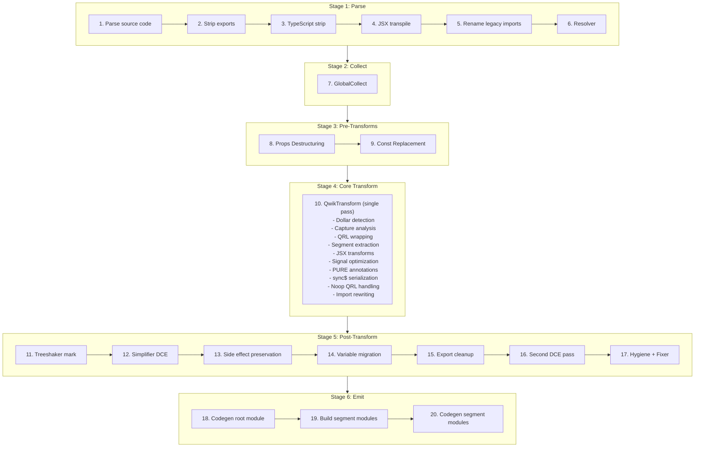
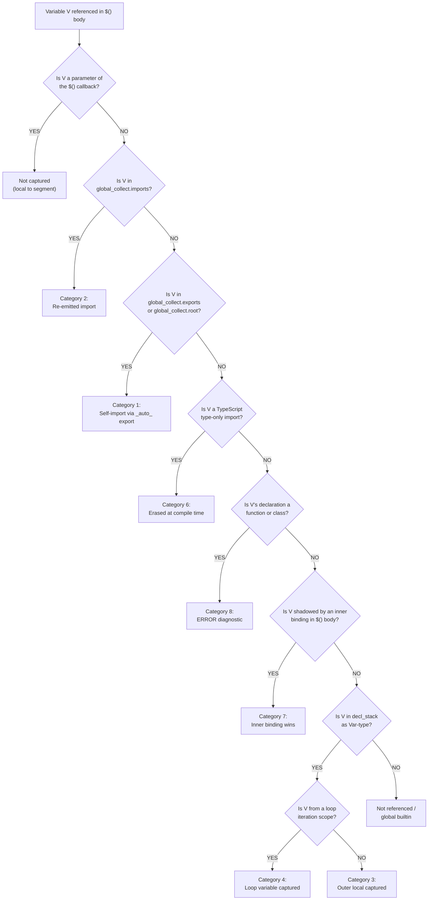
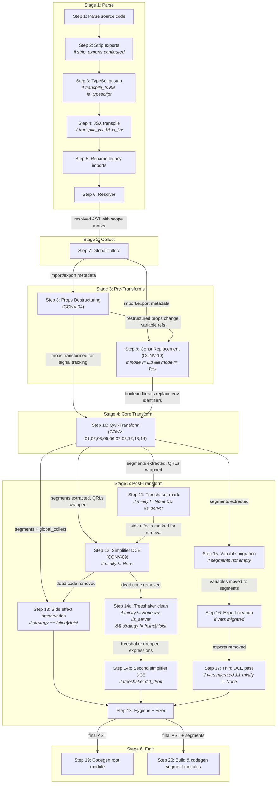

# Qwik v2 Optimizer -- Behavioral Specification

**Version:** 0.1.0
**Date:** 2026-04-01
**Status:** Phase 1 -- Core Pipeline

> **Scope:** This document specifies the behavioral contract of the Qwik v2 optimizer. An OXC implementation can be built from this specification without referencing the SWC source code.

---

## Pipeline Overview

The Qwik optimizer transforms a single input module into multiple output modules: one root module (the transformed original) and N segment modules (lazy-loadable code extracted from `$()` boundaries). The transformation executes as a deterministic 20-step pipeline.

### Pipeline Diagram



Source: parse.rs `transform_code()` function

### Stage Descriptions

**Stage 1: Parse (Steps 1-6).** Parses the source code, detecting TypeScript and JSX from the file extension. Optionally strips named exports (via `strip_exports` config), strips TypeScript type annotations, transpiles JSX to `jsx()`/`jsxs()` calls using React automatic runtime with `@qwik.dev/core` as the import source, renames legacy `@builder.io/qwik` imports to `@qwik.dev/core`, and runs the SWC resolver to assign scope marks for identifier resolution.

**Stage 2: Collect (Step 7).** Runs `GlobalCollect`, a single read-only AST pass that catalogs all imports, exports, and root-level declarations. This metadata is queried by every subsequent transformation stage. See [Stage 2: GlobalCollect](#stage-2-globalcollect) for full specification.

**Stage 3: Pre-Transforms (Steps 8-9).** Reconstructs destructured component props into `_rawProps.propName` access patterns for signal reactivity tracking (runs in all modes including Lib). In non-Lib/non-Test modes, replaces `isServer`, `isBrowser`, and `isDev` imports from `@qwik.dev/core/build` with boolean literals based on build configuration.

**Stage 4: Core Transform (Step 10).** A single traversal pass (`QwikTransform`) that performs the core QRL extraction pipeline: detects `$`-suffixed marker function calls, analyzes captured variables across scope boundaries, wraps marker calls with QRL references (`qrl()`/`inlinedQrl()`), extracts callback bodies as separate segment modules, rewrites imports for both root and segment modules, transforms JSX elements, optimizes signal expressions, adds PURE annotations to tree-shakeable calls, handles `sync$` serialization, and emits noop QRLs for stripped segments.

**Stage 5: Post-Transform (Steps 11-17).** Marks side-effect expressions for client-side tree-shaking, runs dead code elimination (DCE), preserves side-effect imports for Inline/Hoist strategies or performs client-side tree-shaker cleanup, migrates root-level variables exclusively used by a single segment into that segment, cleans up synthetic exports for migrated variables, runs a second DCE pass if migration occurred, and applies hygiene renaming and AST fixing.

**Stage 6: Emit (Steps 18-20).** Generates JavaScript code and source maps for the root module, constructs each segment module from its extracted expression and resolved imports via `code_move::new_module()`, and generates code and individual source maps for each segment module.

### Phase Coverage

**Phase 1 (this document) specifies:** Stage 2 (GlobalCollect), Stage 4 Core Transform (Dollar Detection, Capture Analysis, QRL Wrapping, Segment Extraction, Import Rewriting), Stage 5 Variable Migration, and the infrastructure sections (Hash Generation, Path Resolution, Source Map Generation).

**Later phases specify:** Stage 3 Pre-Transforms (Phase 2 -- Props Destructuring; Phase 3 -- Const Replacement), Stage 4 JSX/Signal/PURE subsystems (Phase 2), Stage 4 sync$/noop (Phase 3), Stage 5 DCE/Treeshaker (Phase 3), Stage 6 emit modes and entry strategies (Phase 3), and API/binding contracts (Phase 4).

---

## Stage 2: GlobalCollect

GlobalCollect is a single read-only AST traversal that runs once before any transformations (Step 7 in the pipeline). It catalogs every import, export, and root-level declaration in the module. Its output is queried throughout the pipeline by dollar detection (to identify marker functions), capture analysis (to distinguish globals from captures), QRL wrapping (to manage synthetic imports), segment extraction (to resolve imports for segment modules), and variable migration (to determine which declarations are migratable).

Source: collector.rs:56-528

### Data Structures

GlobalCollect produces four primary data structures:

| Field | Type | Description |
|-------|------|-------------|
| `imports` | `IndexMap<Id, Import>` | Every import specifier with its source module, `ImportKind` (Named, Default, All), whether it is synthetic (added by the optimizer), and optional import assertions |
| `exports` | `IndexMap<Atom, ExportInfo>` | Every exported name with its local `Id` and list of exported names (supports re-exports and renames) |
| `root` | `IndexMap<Id, Span>` | Every top-level declaration: `var`/`let`/`const` bindings, `function` declarations, `class` declarations, and `enum` (TypeScript) declarations |
| `canonical_ids` | `HashMap<Atom, Id>` | Maps symbol names to their first-seen `Id`, used for resolving local identifiers to their canonical representation |

Where `Id` is a tuple of `(Atom, SyntaxContext)` -- the symbol name paired with its scope context. `Import` contains `source` (module path), `specifier` (imported name), `kind` (Named/Default/All), `synthetic` (bool), and optional `asserts`.

### Behavioral Rules

1. **Single pass, read-only.** GlobalCollect visits the AST once using the `Visit` trait (not `VisitMut`). It does not modify the AST. It must run after the resolver (Step 6) so that `SyntaxContext` marks are assigned.

2. **Import collection.** Every `import` declaration is recorded:
   - Named imports (`import { foo } from 'bar'`): specifier = `"foo"`, kind = `Named`
   - Default imports (`import foo from 'bar'`): specifier = `"default"`, kind = `Default`
   - Namespace imports (`import * as foo from 'bar'`): specifier = `"*"`, kind = `All`
   - Renamed imports (`import { foo as bar } from 'baz'`): local id uses `bar`, specifier = `"foo"`
   - All user imports have `synthetic: false`

3. **Export collection.** Every export is recorded via `add_export(local_id, exported_name)`:
   - Named exports (`export { foo }`, `export { foo as bar }`): local_id from the identifier, exported name is the alias or `None` for same-name
   - Export declarations (`export const x = 1`, `export function f() {}`, `export class C {}`): local_id from the declaration name
   - Default export declarations (`export default function f() {}`, `export default class C {}`): exported name is `"default"`
   - Re-exports with a `src` (`export { foo } from 'bar'`) are **skipped** -- they are not local exports
   - Destructured export vars (`export const { a, b } = obj`) record each binding individually

4. **Root declaration collection.** Every top-level statement that is a declaration (but NOT inside an export) is recorded via `add_root(id, span)`:
   - `function` declarations
   - `class` declarations
   - `var`/`let`/`const` declarations (each binding in a destructuring pattern is recorded individually via `collect_from_pat`)
   - TypeScript `enum` declarations
   - Note: Export declarations are handled separately (they call `add_export`, which also registers canonical_ids but not root)

5. **Canonical ID registration.** Every `add_root`, `add_import`, and `add_export` call registers the id via `register_canonical_id()`, which stores the first-seen `Id` for each symbol name in `canonical_ids`. This is used later to resolve different scope contexts of the same symbol to a single canonical identity.

### Key Methods

**`is_global(id) -> bool`**: Returns `true` if the identifier appears in `imports` OR has an export with matching symbol name OR appears in `root`. This is the primary predicate used by capture analysis -- an identifier that is "global" is NOT a capture; it will be available in the segment module via imports or self-imports.

```
is_global(id) = imports.contains(id) || exports.contains(id.symbol) || root.contains(id)
```

**`import(specifier, source) -> Id`**: Ensures an import exists for the given specifier from the given source module. If an existing import matches (checked via `rev_imports` reverse lookup), returns its local `Id`. Otherwise, creates a new synthetic import with `synthetic: true`, adds it to both `imports` and `synthetic` lists, and returns the new local `Id`. Used by the core transform to add runtime helper imports (`qrl`, `componentQrl`, `_jsxSorted`, etc.).

**`add_export(id, exported) -> bool`**: Registers an export. If the symbol name is new, creates an `ExportInfo` entry. If it already exists, appends the new exported name to the list (supporting multiple export aliases). Returns `false` if the exact exported name already exists. Used by `ensure_export()` during segment extraction to create synthetic `_auto_X` exports for self-import resolution.

**`remove_root_and_exports_for_id(id)`**: Removes an identifier from both `root` and `exports` maps. Used during variable migration cleanup -- after a root-level declaration is moved into a segment, its entry is removed so the root module's export list stays clean.

**`get_imported_local(specifier, source) -> Option<Id>`**: Finds the local `Id` for a specific imported specifier from a specific source. Used by segment module construction to resolve identifiers to their original imports.

**`export_local_ids() -> Vec<Id>`**: Returns the local `Id` for every export. Used during dollar detection to identify locally-defined `$`-suffixed exports as marker functions.

### Example 1: Basic Module (basic_collect)

**Input:**

```typescript
import { component$, useTask$ } from '@qwik.dev/core';
import { fetchData } from './api';

export const Counter = component$(() => {
  return <div>Hello</div>;
});

const helperFn = () => 42;
let mutableState = 0;
```

**GlobalCollect output:**

```
imports: {
  (component$, ctx1) -> Import { source: "@qwik.dev/core", specifier: "component$", kind: Named, synthetic: false }
  (useTask$,   ctx1) -> Import { source: "@qwik.dev/core", specifier: "useTask$",   kind: Named, synthetic: false }
  (fetchData,  ctx2) -> Import { source: "./api",          specifier: "fetchData",  kind: Named, synthetic: false }
}

exports: {
  "Counter" -> ExportInfo { local_id: (Counter, ctx0), exported_names: [None] }
}

root: {
  (helperFn,     ctx0) -> Span(...)
  (mutableState, ctx0) -> Span(...)
}

canonical_ids: {
  "component$"   -> (component$, ctx1)
  "useTask$"     -> (useTask$, ctx1)
  "fetchData"    -> (fetchData, ctx2)
  "Counter"      -> (Counter, ctx0)
  "helperFn"     -> (helperFn, ctx0)
  "mutableState" -> (mutableState, ctx0)
}
```

**Key observations:**
- `Counter` appears in `exports` (because of `export const`) but NOT in `root` (export declarations are handled via `visit_export_decl`, which calls `add_export` but not the root-collection path of `visit_module_item`)
- `helperFn` and `mutableState` appear in `root` because they are top-level statements (non-exported `const` and `let`)
- All three imported identifiers are in `imports` with `synthetic: false`
- `is_global(helperFn)` returns `true` (it is in `root`)
- `is_global(Counter)` returns `true` (it has an export)

### Example 2: Synthetic Import During Transform (synthetic_import)

During the core transform pass (Step 10), the optimizer calls `global_collect.import(specifier, source)` to ensure runtime helper imports exist. This mutates GlobalCollect by adding synthetic entries.

**Before transform -- GlobalCollect state:**

```
imports: {
  ($,     ctx1) -> Import { source: "@qwik.dev/core", specifier: "$",     kind: Named, synthetic: false }
}
```

**Transform calls `global_collect.import("qrl", "@qwik.dev/core")`:**

```
imports: {
  ($,     ctx1) -> Import { source: "@qwik.dev/core", specifier: "$",     kind: Named, synthetic: false }
  (qrl,   ctx3) -> Import { source: "@qwik.dev/core", specifier: "qrl",   kind: Named, synthetic: true  }
}

synthetic: [
  (qrl, ctx3) -> Import { source: "@qwik.dev/core", specifier: "qrl", kind: Named, synthetic: true }
]
```

**Key observations:**
- The synthetic import gets a fresh `SyntaxContext` (ctx3) from `private_ident!()`, ensuring no collision with user identifiers
- The `synthetic` list tracks which imports were added by the optimizer (vs. user-written), used during segment module construction to determine which imports to emit
- Calling `import("qrl", "@qwik.dev/core")` a second time returns the existing `(qrl, ctx3)` Id without creating a duplicate (checked via `rev_imports`)
- `is_global((qrl, ctx3))` returns `true` after the synthetic import is added

---

## Stage 3: Pre-Transforms

### Props Destructuring (CONV-04)

Props destructuring is a pre-pass (Step 8 in the pipeline) that transforms destructured `component$` parameters into `_rawProps` member-access patterns. This enables signal reactivity tracking: the runtime can intercept individual property accesses on the raw props object rather than receiving already-destructured values. Props destructuring runs BEFORE the main `QwikTransform` (Step 10) because it changes variable references that capture analysis (CONV-03) later reads -- after this transform, captured variables reference `_rawProps.propName` instead of the original destructured binding names.

**Source:** props_destructuring.rs (full file, 568 LOC): `transform_props_destructuring` (entry point, lines 22-37), `transform_component_props` (parameter rewriting, lines 62-88), `transform_component_body` (inlining optimizations, lines 89-284), `transform_pat` (pattern analysis, lines 361-478), `transform_rest` (rest-props insertion, lines 480-522), `create_omit_props` (exclusion-list builder, lines 524-568)

#### Behavioral Rules

**Rule 1: Trigger condition.** The transform activates on `component$()` calls whose first argument is an arrow function with exactly one parameter that is an object destructuring pattern. Additionally, standalone arrow functions (not wrapped in `component$`) with a single destructured parameter are transformed if their body is either (a) a block statement containing a `return` statement, or (b) a single expression (call expression). This second path handles inline components. The `component$` callee is identified by matching against the imported local identifier from `@qwik.dev/core` (via `global_collect.get_imported_local`).

**Rule 2: `_rawProps` replacement.** When a destructured parameter is detected, a new identifier `_rawProps` replaces the destructured pattern as the function's sole parameter. Each destructured prop binding becomes a member access on `_rawProps`:

- Simple binding: `{message}` becomes `_rawProps.message`
- Renamed binding (key-value pattern): `{count: c}` uses the **original prop name** for access: all references to `c` in the function body are replaced with `_rawProps.count`
- String-keyed binding: `{'bind:value': bindValue}` uses computed member access: `_rawProps["bind:value"]`
- Default value with const expression: `{x = 5}` becomes `_rawProps.x ?? 5` (nullish coalescing)
- Default value with non-const expression: the entire transform **bails out** -- the function is left unmodified. Const-ness is determined by `is_const_expr()`, which checks for literals, template literals without expressions, and references to known-global identifiers.

The replacement mapping is stored in an `identifiers: HashMap<Id, Expr>` and applied via `visit_mut_expr` to all subsequent identifier references in the function body. Shorthand object properties are handled separately (see Rule 6).

**Rule 3: `_restProps()` handling.** When the destructuring pattern includes a rest element (`{...rest}`), the transform imports `_restProps` from `@qwik.dev/core` and inserts a `const` declaration at the top of the function body:

- With named props and rest: `({message, id, count: c, ...rest})` produces:
  ```js
  const rest = _restProps(_rawProps, ["message", "id", "count"]);
  ```
  The exclusion array contains the **original prop names** (not the local aliases). In the example above, `"count"` appears in the array (not `"c"`).

- Rest-only pattern: `({...props})` produces:
  ```js
  const props = _restProps(_rawProps);
  ```
  No exclusion array argument is passed when there are no named props to exclude.

If the arrow function body is a single expression (not a block statement), the transform wraps it in a block statement with the `_restProps` declaration followed by a `return` statement containing the original expression.

**Rule 4: Inlining optimizations.** After parameter transformation, the function body is scanned for `const` declarations at the top of the block (scanning stops at the first non-`const` declaration). Eligible declarations are inlined:

- **Literal initializers:** `const x = 5` -- the declaration is removed and all references to `x` are replaced with the literal value `5`.
- **Member access on known identifiers:** `const y = _rawProps.something.count` -- if the object identifier (`_rawProps.something`) is already in the replacements map, the declaration is removed and `y` is inlined as the full member-access chain.
- **Computed member access:** `const z = obj['key']` -- inlined if the object is a known identifier.
- **`use*` hook results (direct):** `const store = useStore({})` -- the identifier is renamed to a lowercased version of the hook name (e.g., `useStore` -> `store`), but the declaration is **kept** (not inlined). The call expression is preserved.
- **`use*` hook results with member access:** `const x = useStore({}).thing` -- split into a kept declaration `const store = useStore({})` plus the member access `store.thing` is used as the replacement for `x`.
- **Identifier-only initializers:** `const y = someVar` -- if `someVar` is in the replacements map, `y` is replaced with whatever `someVar` maps to. The declaration is removed.

**Rule 5: Skip condition (Lib mode).** If the function body starts with a `_captures` destructuring (indicating pre-compiled library code from Lib mode), the entire body transformation is skipped. This prevents inlining from disrupting inner QRL capture arrays that reference the named variables. Additionally, within `_inlinedQrl` / `_inlinedQrlDev` calls, the first argument (the function body) is skipped entirely -- only subsequent arguments (capture arrays) are visited.

**Rule 6: Shorthand property expansion.** When a replaced prop identifier appears in a shorthand object property (e.g., `{name}` in an object literal or JSX spread), the shorthand is expanded to a key-value pair: `{name}` becomes `{name: _rawProps.name}`. This is necessary because shorthand properties reference the identifier by name, and after replacement the identifier no longer exists -- only the `_rawProps.name` member access does.

**Rule 7: Unused declaration cleanup.** After inlining removes initializers from `const` declarations, some declarations are left as `const _unused;` (with no initializer). These are invalid JavaScript, so the transform removes any `const` declaration where all declarators have identifiers starting with `_unused` and no initializer. This cleanup runs as a final `retain` pass over the function body statements.

#### Examples

**Example 1: Basic Props Destructuring with Rest** (`should_destructure_args`)

*Input:*
```js
import { component$ } from "@qwik.dev/core";

export default component$(({ message, id, count: c, ...rest }: Record<string, any>) => {
  const renders = useStore({ renders: 0 }, { reactive: false });
  renders.renders++;
  const rerenders = renders.renders + 0;
  return (
    <div id={id}>
      <span {...rest}>
        {message} {c}
      </span>
      <div class="renders">{rerenders}</div>
    </div>
  );
});
```

*Output (segment module):*
```js
import { _restProps } from "@qwik.dev/core";

export const test_component_LUXeXe0DQrg = (_rawProps) => {
  const rest = _restProps(_rawProps, ["message", "id", "count"]);
  const renders = useStore({ renders: 0 }, { reactive: false });
  renders.renders++;
  const rerenders = renders.renders + 0;
  return (
    <div id={_rawProps.id}>
      <span {...rest}>
        {_rawProps.message} {_rawProps.count}
      </span>
      <div class="renders">{rerenders}</div>
    </div>
  );
};
```

Key observations:
- The destructured parameter `({message, id, count: c, ...rest})` becomes `(_rawProps)`
- `message` -> `_rawProps.message`, `id` -> `_rawProps.id`
- Renamed prop `count: c` uses the original name: `c` -> `_rawProps.count`
- `_restProps` exclusion list contains `["message", "id", "count"]` (original names, not aliases)
- `renders` and `rerenders` are left untouched (Rule 4 inlining applies only to const declarations with eligible initializers; `useStore` call is kept)

> **See also:** `should_destructure_args` snapshot (SWC, full output with JSX transform and signal optimization applied)

**Example 2: String-Keyed Props** (`destructure_args_colon_props`)

*Input:*
```js
import { component$ } from "@qwik.dev/core";
export default component$((props) => {
  const { 'bind:value': bindValue } = props;
  return <>{bindValue}</>;
});
```

*Output (segment module):*
```js
export const test_component_LUXeXe0DQrg = (props) => {
  return <>{props["bind:value"]}</>;
};
```

Key observations:
- When the component parameter is not a destructuring pattern (just `props`), the parameter name is kept as-is
- The body-level `const { 'bind:value': bindValue } = props` is inlined: `bindValue` -> `props["bind:value"]` (computed member access for string keys)
- The `const` declaration is removed after inlining

> **See also:** `destructure_args_colon_props` snapshot; `destructure_args_colon_props2`, `destructure_args_colon_props3` snapshots (additional string-key variations with `useSignal` interaction)

**Example 3: Rest-Only Pattern** (`should_convert_rest_props`)

*Input:*
```js
import { component$, useTask$ } from '@qwik.dev/core';

export default component$<any>(({ ...props }) => {
  useTask$(() => {
    props.checked;
  });
  return 'hi';
});
```

*Output (segment module):*
```js
import { _restProps } from "@qwik.dev/core";

export const test_component_LUXeXe0DQrg = (_rawProps) => {
  const props = _restProps(_rawProps);
  useTask$(() => {
    props.checked;
  });
  return 'hi';
};
```

Key observations:
- Rest-only destructuring `({...props})` transforms the parameter to `(_rawProps)`
- `_restProps(_rawProps)` is called **without** an exclusion array (no named props to exclude)
- The `props` variable now refers to the `_restProps` result, which is a proxy/copy of `_rawProps`
- Nested `useTask$` captures `props` (the `_restProps` result), not `_rawProps` directly

> **See also:** `should_convert_rest_props` snapshot (SWC, full output with QRL extraction for nested `useTask$`)

#### See Also: Additional Snapshot Coverage

The following snapshots provide additional coverage of props destructuring edge cases:

- `destructure_args_colon_props2.snap`, `destructure_args_colon_props3.snap` -- string-key destructuring with `useSignal` interaction and nested member access
- `destructure_args_inline_cmp_block_stmt.snap`, `destructure_args_inline_cmp_block_stmt2.snap` -- inline component (standalone arrow function) with block statement body
- `destructure_args_inline_cmp_expr_stmt.snap` -- inline component with single expression body (triggers block-wrapping in Rule 3)
- `should_not_generate_conflicting_props_identifiers.snap` -- validates that `_rawProps` identifier generation avoids name collisions with existing identifiers in scope
- `example_functional_component_capture_props.snap` -- interaction between props destructuring and capture analysis: demonstrates how destructured prop references become `_rawProps.propName` before capture analysis determines what crosses segment boundaries

#### Cross-References

- **Pipeline ordering (Step 8 before Step 10):** Props destructuring runs as a pre-pass at Step 8, before the main `QwikTransform` at Step 10. This ordering is essential because `QwikTransform`'s capture analysis reads variable references to determine what crosses segment boundaries. After props destructuring, what was `message` (a local destructured binding) becomes `_rawProps.message` (a member access on the parameter) -- capture analysis then correctly sees `_rawProps` as the captured variable rather than individual prop names.
- **Capture analysis (CONV-03):** The props destructuring transform changes the set of identifiers visible to capture analysis. A `component$` body that originally referenced `{message, count}` as local bindings will, after this transform, reference `_rawProps.message` and `_rawProps.count`. Capture analysis then classifies `_rawProps` as the single captured binding (if accessed in a nested `$` scope), rather than capturing `message` and `count` separately.
- **Signal optimization (CONV-07, specified later in this phase):** After props destructuring rewrites accesses to `_rawProps.propName`, signal optimization generates `_wrapProp(_rawProps, "propName")` calls for JSX attribute positions. This enables fine-grained signal subscriptions per-prop rather than subscribing to the entire props object.

---

## Stage 4: Core Transform

### Dollar Detection (CONV-01)

Dollar detection is the entry gate for the entire QRL extraction pipeline. It identifies which function calls in user code are `$`-suffixed marker functions that trigger QRL extraction, and determines the corresponding `Qrl`-suffixed callee name for the replacement call. Without dollar detection, no QRL wrapping, capture analysis, or segment extraction occurs.

Source: transform.rs:189-202 (marker construction), transform.rs:179-187 (convert_qrl_word), words.rs (QRL_SUFFIX = `'$'`, LONG_SUFFIX = `"Qrl"`)

#### Behavioral Rules

**Rule 1: Imported markers.** Any named import from `@qwik.dev/core` whose specifier ends with `$` (the `QRL_SUFFIX` constant, which is the character `'$'`) is a marker function. Detection occurs during `QwikTransform::new()` by iterating `global_collect.imports` and checking `import.specifier.ends_with(QRL_SUFFIX)`. Only `ImportKind::Named` imports qualify -- default imports and namespace imports are never markers. Each detected marker is stored in a `marker_functions: HashMap<Id, Atom>` that maps the local `Id` (symbol name + scope context) to the original specifier name (e.g., `"component$"`, `"useTask$"`, `"$"`).

```rust
// transform.rs:191-196
for (id, import) in options.global_collect.imports.iter() {
    if import.kind == ImportKind::Named && import.specifier.ends_with(QRL_SUFFIX) {
        marker_functions.insert(id.clone(), import.specifier.clone());
    }
}
```

**Rule 2: Local markers.** Any locally-defined export whose name ends with `$` is also a marker function. Detection occurs by calling `global_collect.export_local_ids()` and checking `id.0.ends_with(QRL_SUFFIX)`. These are added to the same `marker_functions` HashMap, with the specifier set to the symbol name itself. This enables library authors to define custom dollar functions that participate in QRL extraction.

```rust
// transform.rs:198-202
for id in options.global_collect.export_local_ids() {
    if id.0.ends_with(QRL_SUFFIX) {
        marker_functions.insert(id.clone(), id.0.clone());
    }
}
```

**Rule 3: Callee conversion rule.** When a `$`-suffixed call is detected, the callee is replaced with the `Qrl` variant. The `convert_qrl_word()` function (transform.rs:179-187) strips the trailing `$` and appends `"Qrl"` (the `LONG_SUFFIX` constant). Examples:

| Original Callee | Converted Callee |
|-----------------|-----------------|
| `component$` | `componentQrl` |
| `useTask$` | `useTaskQrl` |
| `useVisibleTask$` | `useVisibleTaskQrl` |
| `useStyles$` | `useStylesQrl` |
| `$` | `qrl` (special case: the bare `$` function maps to QSEGMENT, and `convert_qrl_word` produces `qrl` by stripping `$` and appending `Qrl` -- but the empty prefix means the result is just `Qrl`, which is then lowercased to `qrl` via the QSEGMENT code path) |

```rust
// transform.rs:179-187
fn convert_qrl_word(id: &Atom) -> Option<Atom> {
    let ident_name = id.as_ref();
    let needs_qrl = ident_name.ends_with(QRL_SUFFIX);
    if needs_qrl {
        let new_specifier = [&ident_name[0..ident_name.len() - 1], LONG_SUFFIX].concat();
        Some(Atom::from(new_specifier))
    } else {
        None
    }
}
```

**Rule 4: Special cases.**
- **`sync$`**: Has its own dedicated code path for serialization (produces `_qrlSync` calls), not segment extraction. It is still detected as a marker but handled differently from other dollar functions.
- **`$()` (bare dollar)**: Maps to the `QSEGMENT` constant (`"$"`). The converted callee is `qrl` (from `@qwik.dev/core`). This is the generic segment extraction marker.
- **`component$`**: In addition to the standard QRL wrapping, `component$` triggers a `/*#__PURE__*/` annotation on its `componentQrl` wrapper call (see [QRL Wrapping -- PURE Annotation](#qrl-wrapping-conv-02) for details). This is CONV-08 behavior but triggered as part of the dollar detection/wrapping flow.

**Rule 5: Detection site.** Dollar detection occurs in `fold_call_expr` during the `QwikTransform` traversal. When a `CallExpr`'s callee is an `Identifier` found in the `marker_functions` HashMap, the dollar detection triggers and initiates QRL wrapping for that call expression. The specifier value from the HashMap determines which conversion path to follow.

**Rule 6: Non-markers.** Functions whose names happen to end with `$` but are NOT imported from `@qwik.dev/core` (or its sub-paths) AND are NOT locally exported are NOT markers. They pass through the traversal unchanged. This prevents false positives on user-defined functions that coincidentally use `$` in their names.

#### Example 1: Basic Dollar Extraction (example_6)

**Input:**

```typescript
import { $, component$ } from '@qwik.dev/core';
export const sym1 = $((ctx) => console.log("1"));
```

**Dollar detection results:**

```
marker_functions: {
  ($,          ctx1) -> "$"           // bare $ -> QSEGMENT
  (component$, ctx1) -> "component$"  // component$ marker
}
```

**Callee conversion:**

| Call Site | Marker Specifier | Converted Callee | Import Added |
|-----------|-----------------|-----------------|--------------|
| `$((ctx) => ...)` | `"$"` (QSEGMENT) | `qrl` | `import { qrl } from "@qwik.dev/core"` |

**Root module output:**

```javascript
import { qrl } from "@qwik.dev/core";

const q_sym1_aXUrPXX5Lak = /*#__PURE__*/ qrl(
  () => import("./test.tsx_sym1_aXUrPXX5Lak"), "sym1_aXUrPXX5Lak"
);

export const sym1 = q_sym1_aXUrPXX5Lak;
```

**Key observations:**
- The original `import { $ } from '@qwik.dev/core'` is removed (the `$` function is no longer called directly)
- A synthetic `import { qrl } from "@qwik.dev/core"` is added via `global_collect.import()`
- The `$()` call is replaced by a `qrl()` call that lazily imports the extracted segment

#### Example 2: Multiple Markers from Same Import (example_capture_imports)

**Input:**

```typescript
import { component$, useStyles$ } from '@qwik.dev/core';
import css1 from './global.css';
import css2 from './style.css';
import css3 from './style.css';

export const App = component$(() => {
  useStyles$(`${css1}${css2}`);
  useStyles$(css3);
});
```

**Dollar detection results:**

```
marker_functions: {
  (component$, ctx1) -> "component$"
  (useStyles$, ctx1) -> "useStyles$"
}
```

**Callee conversions:**

| Call Site | Converted Callee |
|-----------|-----------------|
| `component$(...)` | `componentQrl` |
| `useStyles$(...)` (first) | `useStylesQrl` |
| `useStyles$(...)` (second) | `useStylesQrl` |

**Root module output:**

```javascript
import { componentQrl } from "@qwik.dev/core";
import { qrl } from "@qwik.dev/core";

const q_App_component_ckEPmXZlub0 = /*#__PURE__*/ qrl(
  () => import("./test.tsx_App_component_ckEPmXZlub0"), "App_component_ckEPmXZlub0"
);

export const App = /*#__PURE__*/ componentQrl(q_App_component_ckEPmXZlub0);
```

**Key observations:**
- Both `component$` and `useStyles$` are detected from the same `@qwik.dev/core` import
- Each marker is independently converted: `component$` -> `componentQrl`, `useStyles$` -> `useStylesQrl`
- The `useStylesQrl` calls appear inside the extracted component segment, not in the root module
- `componentQrl` gets the `/*#__PURE__*/` annotation; `useStylesQrl` does not (see QRL Wrapping PURE rule)

#### Example 3: Non-Marker Dollar Function (non_marker_edge_case)

**Input:**

```typescript
import { component$ } from '@qwik.dev/core';

// NOT a marker: locally defined but NOT exported
const myHelper$ = (x) => x * 2;

// IS a marker: locally defined AND exported
export const customDollar$ = (fn) => fn;

export const App = component$(() => {
  // myHelper$ passes through unchanged — not in marker_functions
  const result = myHelper$(42);
  return <div>{result}</div>;
});
```

**Dollar detection results:**

```
marker_functions: {
  (component$,    ctx1) -> "component$"    // imported from @qwik.dev/core
  (customDollar$, ctx0) -> "customDollar$" // locally exported, ends with $
}
// myHelper$ is NOT in marker_functions — it is not exported
```

**Key observations:**
- `myHelper$` is defined locally but not exported, so it is NOT a marker. Calls to `myHelper$` pass through the transform unchanged.
- `customDollar$` IS exported (appears in `global_collect.exports`), so it IS detected as a marker. Any call to `customDollar$()` with a callback argument would trigger QRL extraction.
- This demonstrates the two-source rule: markers come from either (1) `@qwik.dev/core` imports or (2) locally exported `$`-suffixed functions. All other `$`-suffixed identifiers are ignored.

### QRL Wrapping (CONV-02)

QRL wrapping is the transformation that replaces a detected `$`-suffixed marker call with a QRL reference. After dollar detection identifies a marker function call, QRL wrapping produces the replacement code: a `qrl()`, `inlinedQrl()`, or `_noopQrl()` call that references the extracted segment. The QRL wrapping path determines whether the callback body is lazy-loaded (via dynamic import), inlined (kept in the same module), or stripped (replaced with a noop placeholder).

QRL wrapping connects dollar detection (upstream) to segment extraction (downstream): dollar detection identifies *which* calls to transform, QRL wrapping produces *what replaces them*, and segment extraction creates *the output modules* that the QRL references point to. The symbol names used in QRL calls are generated by the [Hash Generation](#infrastructure-hash-generation) algorithm, and the import paths follow the [Path Resolution](#infrastructure-path-resolution) rules.

Source: transform.rs:1888-2062 (create_qrl, create_inline_qrl, create_internal_call), transform.rs:3000-3027 (create_noop_qrl), transform.rs:2013-2029 (emit_captures), transform.rs:1372-1457 (hoist_qrl_if_needed, .w() call construction)

#### Behavioral Rules

**Rule 1: Three QRL creation paths.** Which path is taken depends on the entry strategy and whether the segment should be emitted:

| Path | Function | When Used | Output Pattern |
|------|----------|-----------|----------------|
| Segment QRL | `create_qrl()` | Segment, Hook, Single, Component, Smart strategies when `should_emit_segment()` is true | `qrl(() => import("./path"), "symbol_name")` |
| Inline QRL | `create_inline_qrl()` | Inline or Hoist strategies, or Lib emit mode | `inlinedQrl(fn_expr, "symbol_name")` |
| Noop QRL | `create_noop_qrl()` | When `should_emit_segment()` returns false (callback stripped via `strip_ctx_name` or `strip_event_handlers` config) | `_noopQrl("symbol_name")` |

**`create_qrl()`** (transform.rs:1888-1943): Constructs a QRL call with a dynamic import arrow function as the first argument and the symbol name string as the second argument:

```javascript
qrl(() => import("./segment_path"), "symbol_name")
// With captures:
qrl(() => import("./segment_path"), "symbol_name", [capture1, capture2])
```

The import path (`"./segment_path"`) is the canonical filename constructed by `get_canonical_filename()` per the [Path Resolution](#infrastructure-path-resolution) rules. The symbol name (`"symbol_name"`) is the hash-suffixed identifier from the [Hash Generation](#infrastructure-hash-generation) algorithm (e.g., `"sym1_aXUrPXX5Lak"`).

**`create_inline_qrl()`** (transform.rs:1945-2011): Constructs an inlined QRL call that keeps the function expression in the same module rather than extracting it to a separate segment file:

```javascript
inlinedQrl(original_fn_expr, "symbol_name")
// With captures:
inlinedQrl(original_fn_expr, "symbol_name", [capture1, capture2])
```

For the Hoist strategy (not Inline or Lib mode), the function expression is replaced with a new identifier referencing a separately-emitted segment, and the segment is registered with a `qrl_id` for `.s()` call emission.

**`create_noop_qrl()`** (transform.rs:3000-3027): Constructs a noop QRL placeholder when the segment should not be emitted (stripped callbacks). The segment module is still created (with `null` as the export value) for metadata purposes, but the runtime call is a noop:

```javascript
_noopQrl("symbol_name")
// With dev info:
_noopQrlDEV("symbol_name", { file: "path", lo: 0, hi: 0, displayName: "name" })
```

Noop QRLs are used when `strip_ctx_name` matches the marker function name (e.g., `serverStuff$` stripped for client builds) or when `strip_event_handlers` is true and the segment kind is `EventHandler`.

**Rule 2: Dev mode variants.** When the emit mode is `Dev` or `Hmr`, each QRL creation function uses a dev-suffixed variant that includes source location metadata as an additional argument:

| Production | Dev/HMR |
|------------|---------|
| `qrl(...)` | `qrlDEV(..., { file, lo, hi, displayName })` |
| `inlinedQrl(...)` | `inlinedQrlDEV(..., { file, lo, hi, displayName })` |
| `_noopQrl(...)` | `_noopQrlDEV(..., { file, lo, hi, displayName })` |

The dev info object has four fields:

| Field | Type | Source |
|-------|------|--------|
| `file` | string | `dev_path` option (if set) or absolute file path from `path_data.abs_path` |
| `lo` | number | Start byte offset of the original expression's `Span` |
| `hi` | number | End byte offset of the original expression's `Span` |
| `displayName` | string | The segment's `display_name` from the [Hash Generation](#infrastructure-hash-generation) algorithm (e.g., `"test.tsx_App_component"`) |

Source: transform.rs:1926-1937 (qrl dev path), transform.rs:1994-2007 (inlinedQrl dev path), transform.rs:3011-3023 (noop dev path)

**Rule 3: Captures emission.** When the segment has captured variables (`scoped_idents` from capture analysis is non-empty), the captured identifiers are emitted as an array literal appended as the last argument to the QRL call. The `emit_captures()` function (transform.rs:2013-2029) handles two cases:

- **Auto captures** (`Captures::Auto(ids)`): When the list is non-empty, an `ArrayLiteral` of identifier references is appended: `[capture1, capture2, ...]`
- **Explicit captures** (`Captures::Explicit(arr)`): The user-provided array expression is passed through directly
- **No captures**: No additional argument is appended

Additionally, after hoisting the QRL to module scope, if captures exist, a `.w([captures])` method call is constructed on the QRL reference. The `.w()` method ("with captures") registers the captured variable bindings at the call site where the variables are in scope, while the QRL definition itself (hoisted to module scope) has no captures:

```javascript
// Module scope (hoisted, no captures):
const q_sym1_hash = /*#__PURE__*/ qrl(() => import("./path"), "symbol_name");

// Call site (where captures are in scope):
q_sym1_hash.w([capturedVar1, capturedVar2])
```

Source: transform.rs:2013-2029 (emit_captures), transform.rs:1593-1607 (.w() construction for qrl path), transform.rs:1651-1665 (.w() construction for inlinedQrl path)

**Rule 4: PURE annotation.** The `/*#__PURE__*/` comment annotation is added to QRL wrapper calls to enable tree-shaking by bundlers. The annotation is controlled by the `pure` parameter of `create_internal_call()` (transform.rs:2032-2062):

- **All QRL creation calls** (`qrl()`, `inlinedQrl()`, `_noopQrl()`) receive `/*#__PURE__*/` -- they are always passed `pure: true` by `create_qrl()`, `create_inline_qrl()`, and `create_noop_qrl()`.
- **`componentQrl()` wrapper calls** also receive `/*#__PURE__*/` because component definitions are tree-shakeable (if the component is not referenced, the entire QRL + component can be eliminated).
- **Other `*Qrl` wrappers** (`useTaskQrl()`, `useVisibleTaskQrl()`, `useStylesQrl()`, etc.) do NOT receive `/*#__PURE__*/` because they register side effects (tasks, styles, event handlers) that must not be eliminated by tree-shaking.

The practical effect: `/*#__PURE__*/` appears on the hoisted `const q_symbol = /*#__PURE__*/ qrl(...)` declaration at module scope, and on `/*#__PURE__*/ componentQrl(q_symbol)` calls. It does NOT appear on `useTaskQrl(q_symbol)` or similar side-effecting wrapper calls.

**Rule 5: Symbol name.** The second argument to every QRL call is the symbol name string (e.g., `"sym1_aXUrPXX5Lak"`). This is the hash-suffixed name produced by the [Hash Generation](#infrastructure-hash-generation) algorithm. It serves as:
- The segment identifier for lazy loading (the runtime uses it to resolve the correct export from the dynamically imported module)
- The export name in the segment module (`export const sym1_aXUrPXX5Lak = ...`)
- Part of the canonical filename for the segment file

**Rule 6: Import path.** The first argument to `qrl()` is a dynamic import arrow function: `() => import("./canonical_filename")`. The path is constructed per the [Path Resolution](#infrastructure-path-resolution) algorithm. For `inlinedQrl()`, no import path is needed because the function body is kept in the same module.

#### Example 1: Basic QRL Wrapping (example_6)

**Input:**

```typescript
import { $ } from '@qwik.dev/core';
export const sym1 = $((ctx) => console.log("1"));
```

**QRL wrapping transforms the `$()` call (Segment strategy, default):**

**Root module output:**

```javascript
import { qrl } from "@qwik.dev/core";

const q_sym1_aXUrPXX5Lak = /*#__PURE__*/ qrl(
  () => import("./test.tsx_sym1_aXUrPXX5Lak"), "sym1_aXUrPXX5Lak"
);

export const sym1 = q_sym1_aXUrPXX5Lak;
```

**Segment module output (`test.tsx_sym1_aXUrPXX5Lak.tsx`):**

```javascript
export const sym1_aXUrPXX5Lak = (ctx) => console.log("1");
```

**Key observations:**
- `create_qrl()` is used (Segment strategy, `should_emit_segment()` returns true)
- The `qrl()` call is hoisted to module scope as `const q_sym1_aXUrPXX5Lak = ...`
- `/*#__PURE__*/` is applied to the `qrl()` call
- The original `$` import is removed; a synthetic `qrl` import is added
- No captures (the callback only uses its parameter `ctx`), so no `.w()` call and no third argument

#### Example 2: QRL with Captures (example_multi_capture)

**Input:**

```typescript
import { $, component$ } from '@qwik.dev/core';

export const Foo = component$(({foo}) => {
  const arg0 = 20;
  return $(() => {
    const fn = ({aaa}) => aaa;
    return (
      <div>
        {foo}{fn()}{arg0}
      </div>
    )
  });
});
```

**QRL wrapping for the inner `$()` call inside `Foo`'s component body:**

The inner `$()` captures `_rawProps` (the component's props parameter, renamed during props destructuring). Capture analysis identifies this as a scoped identifier because `_rawProps` is defined in the component segment, not the root module.

**Component segment output (`test.tsx_Foo_component_HTDRsvUbLiE.jsx`):**

```javascript
import { qrl } from "@qwik.dev/core";

const q_Foo_component_1_DvU6FitWglY = /*#__PURE__*/ qrl(
  () => import("./test.tsx_Foo_component_1_DvU6FitWglY"),
  "Foo_component_1_DvU6FitWglY"
);

export const Foo_component_HTDRsvUbLiE = (_rawProps) => {
  return q_Foo_component_1_DvU6FitWglY.w([_rawProps]);
};
```

**Inner segment output (`test.tsx_Foo_component_1_DvU6FitWglY.jsx`):**

```javascript
import { _captures } from "@qwik.dev/core";

export const Foo_component_1_DvU6FitWglY = () => {
  const _rawProps = _captures[0];
  const fn = ({ aaa }) => aaa;
  return <div>{_rawProps.foo}{fn()}{20}</div>;
};
```

**Root module output:**

### Capture Analysis (CONV-03)

Capture analysis determines which variables cross the `$()` serialization boundary. Every identifier referenced inside a `$()` callback body must be classified: is it a capture (passed via `_captures[N]`), a self-import (resolved via `import { _auto_X as X } from "./module"`), a re-emitted import (same source as the original), a local (parameter of the callback itself), or an error (function/class declaration)? Getting this classification wrong causes runtime failures -- variables are either undefined (missing capture/import) or incorrectly serialized (extra captures bloating bundles). This section was the source of 293 runtime deviations in Jack's OXC implementation, 46 of which were caused by missing self-import reclassification alone.

Source: transform.rs:820-1075 (`_create_synthetic_qsegment`), collector.rs:400-530 (`IdentCollector`), transform.rs:4894 (`compute_scoped_idents`)

#### Algorithm Overview

The capture analysis algorithm executes in 4 steps for each `$()` call site:

**Step 1: Collect descendant identifiers.** An `IdentCollector` instance visits the `$()` callback body via SWC's `Visit` trait. It collects all referenced identifiers into a `HashSet<Id>`. The collector applies these filters:

- **SyntaxContext must not be empty.** Identifiers with `SyntaxContext::empty()` are unresolved globals and are excluded. Source: collector.rs:459-460.
- **Excludes global names.** The identifiers `undefined`, `NaN`, `Infinity`, and `null` are always excluded regardless of SyntaxContext. Source: collector.rs:461-464.
- **Uses `ExprOrSkip` enum.** The collector maintains an `expr_ctxt` stack that tracks whether the current position is an expression context (`ExprOrSkip::Expr`) or a skip context (`ExprOrSkip::Skip`). Only identifiers in expression context are collected. Source: collector.rs:418-428.
  - `visit_expr` pushes `Expr` (identifiers here ARE collected)
  - `visit_stmt` pushes `Skip` (statement-level identifiers are NOT collected)
  - `visit_jsx_attr` pushes `Skip` (JSX attribute names are NOT collected, but JSX expression containers within attributes ARE collected because they trigger `visit_expr`)
  - `visit_key_value_prop` pushes `Skip` (property keys in object literals are NOT collected)
  - `visit_member_expr` pushes `Skip` (member expression property names like `.foo` are NOT collected, but the object itself is collected because the ident is visited before the member push)
- **JSX element names.** `visit_jsx_element_name` only visits children (collecting the identifier) when the element name starts with an uppercase letter (`A-Z`). Lowercase JSX elements (HTML tags like `<div>`) are not collected as identifier references. Source: collector.rs:441-451.
- **JSX usage tracking.** The collector also tracks `use_h` (set to `true` when any JSX element or fragment is encountered) and `use_fragment` (set to `true` for JSX fragments). These flags inform import generation for JSX runtime helpers. Source: collector.rs:430-439.

The output is a sorted `Vec<Id>` of all unique identifiers referenced in the callback body. Source: collector.rs:408-412.

**Step 2: Partition declaration stack.** The `decl_stack` -- accumulated during the AST traversal as the optimizer descends into nested scopes -- contains entries of type `(Id, IdentType)`. Each entry records a declaration visible at the current scope level. The entries are partitioned into two sets:

- **`Var`-type declarations** (capturable): `let`, `const`, `var`, function parameters, catch clause bindings. These are declarations whose values can be serialized and passed across the `$()` boundary.
- **Non-`Var` declarations** (`invalid_decl`): `function` and `class` declarations. These produce ERROR diagnostics if referenced across `$()` boundaries because functions and classes cannot be serialized for resumability.

Source: transform.rs:967-972.

**Step 3: Compute scoped identifiers.** The `compute_scoped_idents()` function performs a set intersection: it finds identifiers that appear in BOTH the descendant identifier set (from Step 1) AND the `Var`-type declaration stack entries (from Step 2). These are the captured variables -- outer-scope locals that the `$()` callback references.

```
compute_scoped_idents(all_idents, all_decl) -> (Vec<Id>, bool):
    set = HashSet::new()
    is_const = true
    for ident in all_idents:
        if ident found in all_decl:
            set.insert(ident)
            if decl is not Var(true):  // Var(true) means const
                is_const = false
    output = sorted(set)
    return (output, is_const)
```

The `is_const` flag tracks whether ALL captured variables are `const` declarations. This metadata is used by the QRL wrapping step to determine if the segment's captures are immutable.

After `compute_scoped_idents()`, function callback parameters are filtered out -- they are local to the segment and must not be captured:

```
param_idents = get_function_params(folded_expr)
scoped_idents.retain(|id| !param_idents.contains(id))
```

Source: transform.rs:4894-4908 (`compute_scoped_idents`), transform.rs:985-990 (parameter filtering).

**Step 4: Classify each identifier against GlobalCollect.** For every identifier in the callback body's `local_idents` set (collected via a second `IdentCollector` pass on the folded expression), the optimizer checks `global_collect`:

- If `global_collect.has_export_symbol(id.symbol)` returns `true`: the identifier is a module-level declaration. The optimizer calls `ensure_export(root_id)` to create a synthetic `_auto_{name}` export, enabling the segment to import it via self-import. This is NOT a capture.
- If the identifier appears in `invalid_decl` (function/class declarations from Step 2): an ERROR diagnostic is emitted -- `"Reference to identifier '{name}' can not be used inside a Qrl($) scope because it's a function"`. The segment still generates (capture analysis does not bail on errors), but the identifier will be undefined at runtime.
- If the identifier is in `global_collect.imports`: it will be re-emitted as an import statement in the segment module by `code_move::new_module()`. NOT a capture.
- If the identifier is in `global_collect.root` (top-level declaration, not exported): same as the export case -- `ensure_export()` is called, creating a self-import path.
- If the identifier passes through all global checks and appears in `scoped_idents`: it IS a capture, resolved via `_captures[N]` destructuring in the segment.

Source: transform.rs:1022-1043 (local_idents classification loop).

**Important behavioral note:** Capture analysis proceeds regardless of diagnostic errors. Only bail if the parsed body is empty (structural parse failure). Semantic errors (e.g., `await` in non-async function, type errors) produce valid ASTs that can still be analyzed for identifier references. This is critical -- bailing on semantic errors silently drops captures for valid code patterns, causing undefined variable errors at runtime. (Pitfall 4 from research; Jack's Plan 10 fix.)

#### Mermaid Decision Tree (D-09)

The following flowchart shows the classification logic for a single variable reference `V` found inside a `$()` callback body:



#### 8-Category Taxonomy Table (D-09)

| # | Category | Is Capture? | How Resolved in Segment | SWC Mechanism | Example |
|---|----------|-------------|------------------------|---------------|---------|
| 1 | Module-level declarations | NO | Self-import: `import { _auto_X as X } from "./module_stem"` | `global_collect.has_export_symbol()` returns true; `ensure_export()` adds synthetic `_auto_` named export; `code_move::resolve_export_for_id()` generates the import in the segment | `const helper = () => 42;` at root scope, used in `$()` -- segment gets `import { _auto_helper as helper } from "./module"` |
| 2 | User-code imports | NO | Re-emitted import statement from original source | `code_move::resolve_import_for_id()` finds the import in `global_collect.imports` and emits an identical import in the segment module | `import css from './style.css'` used in `$()` -- segment gets `import css from './style.css'` |
| 3 | Outer-scope local variables | YES | `_captures[N]` destructuring at top of segment function body | `compute_scoped_idents()` returns them in the intersection of descendant idents and `Var`-type `decl_stack` entries | `const x = 5;` in component body, used in nested `$()` -- segment gets `const x = _captures[0];` |
| 4 | Loop iteration variables | YES | Same as Category 3 (`_captures[N]` destructuring) | Loop variables (`for-of`, `for-in`, C-style `for`) are added to `decl_stack` via `iteration_var_stack` during traversal; `compute_scoped_idents()` picks them up | `for (const item of list) { $(() => use(item)) }` -- `item` captured via `_captures[N]` |
| 5 | Destructured component props | YES (as `_rawProps`) | Captured as `_rawProps` after the props destructuring pre-pass transforms `({count}) => ...` to `(_rawProps) => ...` | Props destructuring (Stage 3, Step 8) runs BEFORE capture analysis, changing the parameter name; the `_rawProps` identifier then follows standard Category 3 capture rules | `component$(({count}) => $(() => count))` -- after props destructuring: `(_rawProps) => $(() => _rawProps.count)` -- `_rawProps` captured, accessed as `_rawProps.count` |
| 6 | TypeScript type-only imports | NO | Erased at compile time; never reaches capture analysis | TypeScript strip (Stage 1, Step 3) removes type-only imports before GlobalCollect runs; they do not appear in `global_collect.imports` | `import type { Foo } from './types'` -- completely removed during TS strip |
| 7 | Shadowed variables | NO (inner wins) | The inner binding is local to the segment; the outer binding is not referenced | `collect_local_declarations_from_expr()` in `get_local_idents` identifies inner declarations; the inner binding shadows the outer one in the descendant identifier set because they share the same name but have different `SyntaxContext` | `const x = 1; $(() => { const x = 2; use(x) })` -- the inner `x` has a different `SyntaxContext`, and only the inner one is referenced in the callback body |
| 8 | Function/class declarations in scope | ERROR | Diagnostic emitted; segment still generated but identifier will be undefined at runtime | `invalid_decl` partition in `_create_synthetic_qsegment`: identifiers whose `decl_stack` entry has a non-`Var` type produce error `"Reference to identifier '{name}' can not be used inside a Qrl($) scope because it's a function"` (error code C02) | `function helper() {}; $(() => helper())` -- ERROR diagnostic emitted for `helper`; segment code references `helper` but it will be undefined |

#### Self-Import Reclassification

Self-import reclassification is the single most impactful behavioral distinction in the capture system. It resolved 46 of Jack's 293 runtime deviations in his OXC implementation. The mechanism ensures that module-level declarations (constants, functions, classes, enums at the top level of the source file) are NOT treated as captures but are instead made available to segment modules via synthetic exports and self-imports.

**The problem it solves:** When a segment references a module-level declaration like `const API_URL = "/api"`, that declaration exists in the root module's scope. The segment module is a separate file -- it cannot directly access the root module's variables. Without self-import reclassification, the declaration would either be (a) incorrectly added as a `_captures[N]` entry (wrong -- it is not a closure variable) or (b) silently dropped (wrong -- the segment would get `ReferenceError` at runtime).

**The mechanism (4 steps):**

1. **Detection.** During the local_idents classification loop (transform.rs:1022-1043), for each identifier referenced by the segment, the optimizer checks `global_collect.has_export_symbol(id.symbol)`. If the identifier is already exported, no action is needed -- the segment can import it directly. If it is NOT exported but IS in `global_collect.root` (a top-level declaration), it needs a synthetic export.

2. **Synthetic export creation.** `ensure_export(root_id)` (transform.rs:1024-1026) calls `global_collect.add_export(root_id, Some("_auto_{name}"))`. This adds a synthetic named export to the root module: `export { original_name as _auto_original_name }`. The `_auto_` prefix prevents collision with user-defined exports.

3. **Segment import generation.** When `code_move::new_module()` constructs the segment module, it processes each identifier in `local_idents`. For identifiers that resolve to exports (including the new synthetic `_auto_` exports), `resolve_export_for_id()` generates: `import { _auto_X as X } from "./module_stem"`. The segment can now reference `X` as if it were a local variable.

4. **Captures field is `false`.** Because the identifier is resolved via import rather than capture, the segment's `captures` field in `SegmentAnalysis` is `false` (assuming no other identifiers are captured). The segment does NOT import `_captures` from `@qwik.dev/core` and does NOT have destructuring at the function body top.

**Key implementation detail:** The `_auto_` prefix is a convention, not a hard requirement from the language. It exists to prevent name collisions -- if a module already exports a `helper` name, the synthetic export `_auto_helper` does not conflict.

Source: transform.rs:1024-1026 (`ensure_export`), code_move.rs:200-276 (`resolve_export_for_id` and import generation)

#### Example 1: Captures with Destructuring (example_multi_capture)

This example demonstrates Category 3 (outer-scope local variables) and Category 5 (destructured component props) captures. The component's props are destructured, transformed by the props destructuring pre-pass into `_rawProps`, and then captured across the `$()` boundary.

**Input:**

```typescript
import { $, component$ } from '@qwik.dev/core';

export const Foo = component$(({foo}) => {
  const arg0 = 20;
  return $(() => {
    const fn = ({aaa}) => aaa;
    return (
      <div>
        {foo}{fn()}{arg0}
      </div>
    )
  });
})
```

**Root module output (test.jsx):**

```javascript
import { componentQrl } from "@qwik.dev/core";
import { qrl } from "@qwik.dev/core";
//
const q_Foo_component_HTDRsvUbLiE = /*#__PURE__*/ qrl(
  ()=>import("./test.tsx_Foo_component_HTDRsvUbLiE"),
  "Foo_component_HTDRsvUbLiE"
);
//
export const Foo = /*#__PURE__*/ componentQrl(q_Foo_component_HTDRsvUbLiE);
```

**Component segment output (test.tsx_Foo_component_HTDRsvUbLiE.jsx):**

```javascript
import { qrl } from "@qwik.dev/core";
//
const q_Foo_component_1_DvU6FitWglY = /*#__PURE__*/ qrl(
  ()=>import("./test.tsx_Foo_component_1_DvU6FitWglY"),
  "Foo_component_1_DvU6FitWglY"
);
//
export const Foo_component_HTDRsvUbLiE = (_rawProps)=>{
    return q_Foo_component_1_DvU6FitWglY.w([
        _rawProps
    ]);
};
```

**Nested segment output (test.tsx_Foo_component_1_DvU6FitWglY.jsx):**

```javascript
import { _captures } from "@qwik.dev/core";
//
export const Foo_component_1_DvU6FitWglY = ()=>{
    const _rawProps = _captures[0];
    const fn = ({ aaa })=>aaa;
    return <div>
        {_rawProps.foo}{fn()}{20}
      </div>;
};
```

**Capture analysis breakdown:**
- `_rawProps` (Category 5): The original `{foo}` destructuring was transformed to `_rawProps` by the props destructuring pre-pass. In the component segment, `_rawProps` is a parameter (not captured). In the nested segment, `_rawProps` is an outer-scope local -- captured via `_captures[0]`. Access to `foo` becomes `_rawProps.foo`.
- `arg0` (value `20`): This `const` initializer is inlined as the literal `20` in the segment -- it is NOT captured. The optimizer detects that `arg0` is a simple const with a literal initializer and substitutes it directly.
- `fn` (Category 7 -- inner binding): The `fn` variable is declared INSIDE the `$()` callback body. It is local to the segment, not captured.
- `captures: true` on the nested segment, `captureNames: ["_rawProps"]` -- confirming `_rawProps` is the only capture.
- `captures: false` on the component segment -- `_rawProps` is a parameter, not a capture.

#### Example 2: Import Re-emission (example_capture_imports)

This example demonstrates Category 2 (user-code imports). Imports used inside a `$()` callback are NOT captured -- they are re-emitted as import statements in the segment module.

**Input:**

```typescript
import { component$, useStyles$ } from '@qwik.dev/core';
import css1 from './global.css';
import css2 from './style.css';
import css3 from './style.css';

export const App = component$(() => {
  useStyles$(`${css1}${css2}`);
  useStyles$(css3);
})
```

**Segment output for `useStyles$(\`...\`)` (test.tsx_App_component_useStyles_t35nSa5UV7U.js):**

```javascript
import css1 from "./global.css";
import css2 from "./style.css";
//
export const App_component_useStyles_t35nSa5UV7U = `${css1}${css2}`;
```

**Segment output for `useStyles$(css3)` (test.tsx_style_css_TRu1FaIoUM0.js):**

```javascript
import css3 from "./style.css";
//
export const style_css_TRu1FaIoUM0 = css3;
```

**Capture analysis breakdown:**
- `css1`, `css2`, `css3` (Category 2): All three are user-code imports. They appear in `global_collect.imports`. The segment modules re-emit identical import statements from the same sources. `captures: false` on both segments.
- The `useStyles$` calls are converted to `useStylesQrl()` calls in the component segment, referencing the extracted QRL constants.
- No `_captures` import appears in any segment -- all references resolve to imports.

#### Example 3: Self-Import Reclassification (example_capturing_fn_class)

This example demonstrates Category 1 (module-level declarations via self-import) and Category 8 (function/class declaration errors). It shows how the optimizer handles function and class declarations referenced across `$()` boundaries.

**Input:**

```typescript
import { $, component$ } from '@qwik.dev/core';

export const App = component$(() => {
  function hola() {
    console.log('hola');
  }
  class Thing {}
  class Other {}

  return $(() => {
    hola();
    new Thing();
    return (
      <div></div>
    )
  });
})
```

**Nested segment output (test.tsx_App_component_1_w0t0o3QMovU.js):**

```javascript
import { _jsxSorted } from "@qwik.dev/core";
//
export const App_component_1_w0t0o3QMovU = ()=>{
    hola();
    new Thing();
    return /*#__PURE__*/ _jsxSorted("div", null, null, null, 3, "u6_0");
};
```

**Diagnostics:**

```json
[
  {
    "category": "error",
    "code": "C02",
    "message": "Reference to identifier 'Thing' can not be used inside a Qrl($) scope because it's a function"
  },
  {
    "category": "error",
    "code": "C02",
    "message": "Reference to identifier 'hola' can not be used inside a Qrl($) scope because it's a function"
  }
]
```

**Capture analysis breakdown:**
- `hola` and `Thing` (Category 8): Both are function/class declarations in the component scope. They appear in `invalid_decl` (non-`Var` partition of `decl_stack`). ERROR diagnostics are emitted with code C02. The segment still generates -- capture analysis does not bail on errors -- but `hola` and `Thing` will be undefined at runtime.
- `Other` is declared but not referenced in the `$()` callback, so it does not appear in the analysis.
- `captures: false` on the nested segment -- `hola` and `Thing` are not added to `scoped_idents` because they are not `Var`-type declarations.
- The segment code references `hola()` and `new Thing()` directly (not through `_captures`), meaning they will cause `ReferenceError` at runtime. This is by design -- the ERROR diagnostic warns the developer.

#### Named Capture Edge Cases

Per D-10, the following 16 edge cases define the complete test matrix for capture analysis. Each edge case validates a specific behavioral rule. An implementation MUST handle all 16 cases correctly. Jack's OXC implementation initially had 293 runtime deviations, 46 of which were resolved by correctly implementing self-import reclassification (CAPTURE-EDGE-10 through CAPTURE-EDGE-12).

---

**CAPTURE-EDGE-01: Loop variable in for-of** (Category 4)

**Rule tested:** Variables declared in `for-of` loop headers are added to `decl_stack` via `iteration_var_stack` and are capturable across `$()` boundaries.

**Input:**
```typescript
import { $, component$ } from '@qwik.dev/core';
export const App = component$(() => {
  const items = ['a', 'b'];
  for (const item of items) {
    $(() => console.log(item));
  }
});
```

**Expected behavior:** `item` IS captured via `_captures[0]`. The segment imports `_captures` from `@qwik.dev/core` and destructures `const item = _captures[0];` at the top of the function body.

**Why it matters:** Loop iteration variables have fresh bindings per iteration. If not captured, the segment would reference a stale or undefined variable.

Reference: example_component_with_event_listeners_inside_loop snapshot (loopForOf function).

---

**CAPTURE-EDGE-02: Loop variable in for-in** (Category 4)

**Rule tested:** Variables declared in `for-in` loop headers follow the same capture path as `for-of`.

**Input:**
```typescript
import { $, component$ } from '@qwik.dev/core';
export const App = component$(() => {
  const obj = {a: 1, b: 2};
  for (const key in obj) {
    $(() => console.log(key));
  }
});
```

**Expected behavior:** `key` IS captured via `_captures[0]`. Same mechanism as CAPTURE-EDGE-01.

**Why it matters:** `for-in` iteration variables must be treated identically to `for-of` variables for capture purposes.

Reference: example_component_with_event_listeners_inside_loop snapshot (loopForIn function).

---

**CAPTURE-EDGE-03: C-style for loop variable** (Category 4)

**Rule tested:** Variables declared in C-style `for` loop initializers (`for (let i = 0; ...)`) are capturable.

**Input:**
```typescript
import { $, component$ } from '@qwik.dev/core';
export const App = component$(() => {
  const results = ['a', 'b'];
  for (let i = 0; i < results.length; i++) {
    $(() => console.log(results[i]));
  }
});
```

**Expected behavior:** Both `i` and `results` ARE captured. The segment gets `const i = _captures[0]; const results = _captures[1];` (or similar ordering based on sorted `Id`).

**Why it matters:** C-style `for` loop variables use `let` (mutable), which means each iteration does NOT get a fresh binding (unlike `for-of`/`for-in` with `const`). However, the optimizer still captures them because they appear in `decl_stack` as `Var`-type entries. The runtime behavior depends on the calling code to pass the correct value per iteration.

Reference: example_component_with_event_listeners_inside_loop snapshot (loopForI function).

---

**CAPTURE-EDGE-04: Nested $() capturing from grandparent scope** (Category 3)

**Rule tested:** When `$()` is nested inside another `$()`, the inner segment captures variables from its immediate enclosing scope (the outer segment), not from the grandparent scope. The outer segment must first capture the variable from the grandparent, then the inner segment captures it from the outer.

**Input:**
```typescript
import { $, component$ } from '@qwik.dev/core';
export const App = component$(() => {
  const value = 42;
  return $(() => {
    return $(() => {
      console.log(value);
    });
  });
});
```

**Expected behavior:** The middle segment captures `value` from the component scope via `_captures[0]`. The innermost segment captures `value` from the middle segment via `_captures[0]`. Each `$()` boundary independently captures what it needs from its direct parent scope -- there is no "skip-level" capture.

**Why it matters:** Nested segments form a chain of captures. Each level must independently capture and re-expose variables. If the middle segment does not capture `value`, the inner segment has no way to access it.

(Constructed example -- nesting pattern derived from example_multi_capture.)

---

**CAPTURE-EDGE-05: Shadowed variable -- inner binding hides outer** (Category 7)

**Rule tested:** When a variable is declared both outside and inside the `$()` body, the inner declaration shadows the outer one. The outer variable is NOT captured.

**Input:**
```typescript
import { $ } from '@qwik.dev/core';
const x = 'outer';
export const handler = $(() => {
  const x = 'inner';
  console.log(x);
});
```

**Expected behavior:** `x` is NOT captured. The inner `const x = 'inner'` declaration has a different `SyntaxContext` than the outer `x`. The `IdentCollector` collects the inner `x`'s `Id`, which does not match any `decl_stack` entry for the outer `x`. The segment uses its own local `x`.

**Why it matters:** Without proper shadowing, the segment would unnecessarily capture the outer `x` and the destructured capture would conflict with the inner declaration.

(Constructed example.)

---

**CAPTURE-EDGE-06: Destructured object parameter in $() callback** (Not captured -- callback parameter)

**Rule tested:** Parameters of the `$()` callback itself (including destructured parameters) are local to the segment and are NOT captured.

**Input:**
```typescript
import { $ } from '@qwik.dev/core';
export const handler = $((event, element) => {
  console.log(event.target, element);
});
```

**Expected behavior:** `event` and `element` are NOT captured. They are parameters of the callback function. `get_function_params()` identifies them and `scoped_idents.retain(|id| !param_idents.contains(id))` filters them out. `captures: false`.

**Why it matters:** Callback parameters are provided at invocation time, not at extraction time. Capturing them would be incorrect -- they would be `undefined` at build time.

(Constructed example.)

---

**CAPTURE-EDGE-07: Rest parameter in $() callback** (Not captured -- callback parameter)

**Rule tested:** Rest parameters (`...args`) of the `$()` callback are also local to the segment.

**Input:**
```typescript
import { $ } from '@qwik.dev/core';
export const handler = $((...args) => {
  console.log(args.length);
});
```

**Expected behavior:** `args` is NOT captured. It is a rest parameter of the callback. `get_function_params()` handles rest parameters via `collect_from_pat` which recursively processes `Pat::Rest`. `captures: false`.

**Why it matters:** Rest parameters are a common pattern for event handlers. They must not be treated as captures.

(Constructed example.)

---

**CAPTURE-EDGE-08: Function declaration referenced across $() boundary** (Category 8 -- ERROR)

**Rule tested:** Function declarations in an enclosing scope that are referenced inside `$()` produce an ERROR diagnostic. They are NOT captured (they are in `invalid_decl`, not in the `Var`-type partition).

**Input:**
```typescript
import { $, component$ } from '@qwik.dev/core';
export const App = component$(() => {
  function helper() {
    return 'help';
  }
  return $(() => helper());
});
```

**Expected behavior:** ERROR diagnostic: `"Reference to identifier 'helper' can not be used inside a Qrl($) scope because it's a function"` (code C02). The segment still generates but `helper` will be undefined at runtime. `captures: false` because `helper` is not a `Var`-type declaration.

**Why it matters:** Function declarations cannot be serialized for resumability. Silently capturing them would produce runtime failures without developer feedback. The error diagnostic gives actionable guidance.

Reference: example_capturing_fn_class snapshot -- `hola()` produces this error.

---

**CAPTURE-EDGE-09: Class declaration referenced across $() boundary** (Category 8 -- ERROR)

**Rule tested:** Class declarations follow the same error path as function declarations.

**Input:**
```typescript
import { $, component$ } from '@qwik.dev/core';
export const App = component$(() => {
  class MyWidget {}
  return $(() => new MyWidget());
});
```

**Expected behavior:** ERROR diagnostic: `"Reference to identifier 'MyWidget' can not be used inside a Qrl($) scope because it's a function"` (code C02). Same behavior as CAPTURE-EDGE-08. Note the error message says "function" for both function and class declarations -- this is the actual SWC behavior.

**Why it matters:** Classes, like functions, cannot be serialized. They must be declared at module level (Category 1) to be usable across `$()` boundaries.

Reference: example_capturing_fn_class snapshot -- `Thing` (a class) produces this error.

---

**CAPTURE-EDGE-10: Module-level const used in nested $() -- self-import, not capture** (Category 1)

**Rule tested:** A `const` declaration at the top level of the module (root scope) that is referenced in a nested `$()` is resolved via self-import, NOT via `_captures[N]`.

**Input:**
```typescript
import { $, component$ } from '@qwik.dev/core';
const API_URL = '/api/data';
export const App = component$(() => {
  return $(() => fetch(API_URL));
});
```

**Expected behavior:** `API_URL` is NOT captured. `ensure_export()` creates a synthetic export `export { API_URL as _auto_API_URL }` in the root module. The segment module gets `import { _auto_API_URL as API_URL } from "./module_stem"`. `captures: false`.

**Why it matters:** This is the most impactful edge case. Treating module-level declarations as captures was the source of 46 runtime deviations in Jack's implementation. Module-level declarations are available to all segments via imports -- capturing them would double-serialize them and break the QRL contract (`captures: true` vs `captures: false`).

(Constructed example -- pattern from self-import reclassification subsection.)

---

**CAPTURE-EDGE-11: Module-level function used in $() -- self-import** (Category 1)

**Rule tested:** Module-level function declarations (at root scope, outside any component) are resolved via self-import. Unlike CAPTURE-EDGE-08, these are at module level and available to all segments.

**Input:**
```typescript
import { $, component$ } from '@qwik.dev/core';
export function formatDate(d: Date) {
  return d.toISOString();
}
export const App = component$(() => {
  return $(() => formatDate(new Date()));
});
```

**Expected behavior:** `formatDate` is NOT captured. It is already in `global_collect.exports` (user-exported), so `ensure_export()` is not needed. The segment module gets `import { formatDate } from "./module_stem"`. `captures: false`.

**Why it matters:** The distinction between CAPTURE-EDGE-08 (function in component scope = ERROR) and CAPTURE-EDGE-11 (function at module level = self-import) is critical. The scope level determines the behavior, not the declaration type.

(Constructed example.)

---

**CAPTURE-EDGE-12: TypeScript enum at module level -- self-import** (Category 1)

**Rule tested:** TypeScript `enum` declarations at module level are collected in `global_collect.root` (or `global_collect.exports` if exported) and resolved via self-import in segments.

**Input:**
```typescript
import { component$ } from '@qwik.dev/core';
export enum Thing { A, B }
export const App = component$(() => {
  console.log(Thing.A);
  return <p>Hello</p>;
});
```

**Expected behavior:** `Thing` is NOT captured. It appears in `global_collect.exports`. The segment accesses `Thing.A` -- which SWC may inline as the literal `0` (since TypeScript enums with numeric values are const-evaluated) or import via self-import depending on the transpilation mode. In the SWC snapshot, `Thing.A` is inlined as `0` in the segment. `captures: false`.

**Why it matters:** TypeScript enums are a common pattern. They must be recognized as module-level declarations, not captures. The `TSEnumDeclaration` variant must be collected by `GlobalCollect`'s root/export collection -- Jack's Plan 07 found this was initially missing.

Reference: example_ts_enums snapshot -- `Thing.A` becomes `0` in segment output.

---

**CAPTURE-EDGE-13: Named import used in $() -- re-emitted, not captured** (Category 2)

**Rule tested:** Named imports that are used inside a `$()` callback are re-emitted as import statements in the segment module, not captured.

**Input:**
```typescript
import { component$, useStyles$ } from '@qwik.dev/core';
import css1 from './global.css';
import { helper } from './utils';
export const App = component$(() => {
  useStyles$(css1);
  return $(() => helper());
});
```

**Expected behavior:** `css1` and `helper` are NOT captured. They appear in `global_collect.imports`. The segment for `useStyles$` gets `import css1 from "./global.css"`. The nested segment gets `import { helper } from "./utils"`. `captures: false` on both segments.

**Why it matters:** User imports are already available via the module system. Capturing them would serialize values that are meant to be loaded on demand.

Reference: example_capture_imports snapshot -- `css1` and `css2` are re-emitted as imports.

---

**CAPTURE-EDGE-14: Default import used in $() -- re-emitted** (Category 2)

**Rule tested:** Default imports follow the same re-emission path as named imports.

**Input:**
```typescript
import { component$, useStyles$ } from '@qwik.dev/core';
import styles from './component.module.css';
export const App = component$(() => {
  useStyles$(styles);
});
```

**Expected behavior:** `styles` is NOT captured. It is a default import (`ImportKind::Default`) in `global_collect.imports`. The segment gets `import styles from "./component.module.css"`. `captures: false`.

**Why it matters:** Default imports are common for CSS modules and third-party libraries. The import kind (Default vs Named vs All) must be preserved when re-emitting -- `import styles from X` must not become `import { styles } from X`.

Reference: example_capture_imports snapshot -- `css1` is a default import that gets re-emitted.

---

**CAPTURE-EDGE-15: Props destructuring -- `_rawProps` captured after pre-pass** (Category 5)

**Rule tested:** Component props destructuring is transformed by the Stage 3 pre-pass BEFORE capture analysis runs. The original destructured parameter names (e.g., `{count}`) become `_rawProps`, and property accesses become `_rawProps.count`. When `_rawProps` is used across a `$()` boundary, it follows standard Category 3 capture rules.

**Input:**
```typescript
import { $, component$ } from '@qwik.dev/core';
export const Counter = component$(({count, label}) => {
  return $(() => (
    <div>{count} - {label}</div>
  ));
});
```

**Expected behavior:** After props destructuring pre-pass, the component becomes `(_rawProps) => { ... _rawProps.count ... _rawProps.label ... }`. In the component segment, `_rawProps` is a parameter (not captured). In the nested segment, `_rawProps` is captured via `_captures[0]`, and access is `_rawProps.count` and `_rawProps.label`. `captures: true, captureNames: ["_rawProps"]` on the nested segment.

**Why it matters:** The ordering constraint -- props destructuring BEFORE capture analysis -- is critical. If capture analysis ran first, it would see `count` and `label` as individual identifiers (which do not exist in any outer scope after destructuring). After the pre-pass, there is a single capturable identifier (`_rawProps`) that cleanly represents all props.

Reference: example_multi_capture snapshot -- `_rawProps` is captured with access patterns like `_rawProps.foo`.

---

**CAPTURE-EDGE-16: TypeScript type-only import -- erased, not captured** (Category 6)

**Rule tested:** TypeScript `import type` declarations are removed during the TypeScript strip phase (Stage 1, Step 3), before GlobalCollect even runs. They never appear in `global_collect.imports` and therefore cannot be captured or re-emitted.

**Input:**
```typescript
import { $ } from '@qwik.dev/core';
import type { UserData } from './types';
export const handler = $((data: UserData) => {
  console.log(data.name);
});
```

**Expected behavior:** `UserData` does not appear in the segment output at all. The `import type` is erased during TypeScript strip. The type annotation `data: UserData` is also erased. The segment output is simply `(data) => { console.log(data.name); }`. `captures: false` -- `data` is a callback parameter.

**Why it matters:** Type-only imports must not generate runtime import statements in segments. If the TypeScript strip phase is bypassed or incomplete, type-only imports could leak into `global_collect.imports` and produce invalid `import type { X }` statements in segments that are pure JavaScript.

(Constructed example.)

---

An implementation MUST handle all 16 edge cases. Jack's OXC implementation initially had 293 runtime deviations, 46 of which were resolved by correctly implementing self-import reclassification (CAPTURE-EDGE-10 through CAPTURE-EDGE-12). The remaining deviations were distributed across loop variable capture (CAPTURE-EDGE-01 through CAPTURE-EDGE-03), function/class declaration errors (CAPTURE-EDGE-08, CAPTURE-EDGE-09), and props destructuring ordering (CAPTURE-EDGE-15).

---

### Segment Extraction (CONV-05)

Segment extraction is the primary output mechanism of the Qwik optimizer. Each `$()` marker call produces a **segment**: a self-contained JavaScript module that can be lazy-loaded independently. The extraction pipeline has two phases: `create_segment` (during QwikTransform traversal) records what to extract, and `new_module` (during emit) constructs the actual segment module with resolved imports, captures injection, hoisted declarations, and topological ordering.

Source: transform.rs:1110-1145 (`create_segment`), code_move.rs:105-450 (`new_module`), parse.rs:446-583 (segment construction loop)

#### Segment Creation (`create_segment`)

When QwikTransform encounters a `$()` marker call and has analyzed captures, it calls `create_segment` to register the extracted function for later processing. This function does NOT build the output module -- it records a `Segment` struct and returns a QRL call expression to replace the original `$()` in the root module.

**Behavioral rules:**

1. **Compute `canonical_filename`**: Calls `get_canonical_filename(display_name, symbol_name)` which concatenates the display name and the last token of the symbol name (the hash). See [Hash Generation](#infrastructure-hash-generation) and [Path Resolution](#infrastructure-path-resolution) for the full algorithms.

2. **Classify entry**: Queries `entry_policy.get_entry_for_sym(stack_ctxt, segment_data)` to determine how the bundler should chunk this segment. Entry classification is strategy-dependent (documented in Phase 3). If `entry` is `None`, the segment is an entry point; if `Some(name)`, it is grouped with the named entry.

3. **Build `import_path`**: Constructs `"./" + canonical_filename`. If `explicit_extensions` config is `true`, appends `"." + extension` to the path. This import path appears in the QRL reference in the root module.

4. **Create QRL call**: Calls `create_qrl(import_path, symbol_name, segment_data, span)` to build the `qrl()` or `inlinedQrl()` call expression that replaces the original `$()`. See QRL Wrapping section for `create_qrl` details.

5. **Push Segment struct**: Appends a `Segment` to `self.segments` for later processing during emit (Stage 6).

Source: transform.rs:1110-1145

#### Segment Struct Fields

Each `Segment` records everything needed to construct the output module during emit:

| Field | Type | Description |
|-------|------|-------------|
| `name` | `Atom` | Symbol name (hash-suffixed, e.g., `sym1_aXUrPXX5Lak`) |
| `canonical_filename` | `String` | Output module path stem (e.g., `test.tsx_sym1_aXUrPXX5Lak`) |
| `expr` | `Box<Expr>` | The extracted function expression (AST node) |
| `data.scoped_idents` | `Vec<Id>` | Captured variables from [Capture Analysis](#capture-analysis-conv-03) |
| `data.local_idents` | `Vec<Id>` | All identifiers referenced by the segment body |
| `data.display_name` | `String` | Human-readable name for dev tools |
| `data.ctx_kind` | `SegmentKind` | `Function`, `EventHandler`, or `JSXProp` |
| `data.ctx_name` | `String` | Original marker name (e.g., `"component$"`, `"useTask$"`, `"$"`) |
| `data.parent_segment` | `Option<String>` | Parent segment name if nested (see below) |
| `data.need_transform` | `bool` | Whether captures injection is needed |
| `data.migrated_root_vars` | `Vec<ModuleItem>` | Variable declarations migrated from root module |
| `entry` | `Option<String>` | Entry classification from `entry_policy` |
| `hash` | `u64` | Segment hash for ordering |
| `param_names` | `Vec<Atom>` | Parameter names of the extracted function |

#### Nested Segments (`segment_stack`)

The optimizer tracks nesting depth using a `segment_stack` during AST traversal. When a `$()` is encountered inside another `$()` body, the inner segment records a parent-child relationship.

**Behavioral rules:**

1. **Stack tracking**: When QwikTransform begins processing a `$()` callback, it pushes the segment name onto `segment_stack`. When processing completes, it pops.

2. **Parent assignment**: If `segment_stack` is non-empty when a new segment is created, `parent_segment` is set to `segment_stack.last()` -- the name of the immediately enclosing segment.

3. **Component nesting**: A `component$` body typically contains event handlers (`onClick$`), tasks (`useTask$`), and other `$()` calls. All inner segments have `parent` pointing to the component segment.

4. **SegmentAnalysis exposure**: The `parent` field flows through to `SegmentAnalysis.parent` in the transform output, enabling bundlers to understand segment relationships.

Source: transform.rs segment_stack usage throughout QwikTransform

#### Segment Module Construction (`new_module`)

During emit (Stage 6, Steps 19-20), `code_move::new_module()` constructs a complete JavaScript module from each `Segment`. This is a multi-step process that resolves imports, injects captures, hoists declarations, and orders everything by dependency.

**Step-by-step process:**

**Step 1: Captures injection.** If `scoped_idents` is non-empty (segment has captured variables from [Capture Analysis](#capture-analysis-conv-03)):
- Add `import { _captures } from "@qwik.dev/core"` to the module
- Transform the function expression: for each captured variable at index N, inject `const {name} = _captures[N]` as the first statements in the function body
- The root module passes captures via `.w([capture0, capture1, ...])` on the QRL reference

**Step 2: QRL hoisting.** If the segment body contains nested `$()` calls (e.g., an event handler inside a component), the inner QRL declarations (`const q_... = qrl(...)`) are hoisted from inline position to module-level `var` declarations. `var` declarations hoist naturally, so forward references work without reordering.

**Step 3: Self-referential variable fix.** Scans function bodies for variable declarations that reference themselves (e.g., `const x = fn(x)`) and applies fixups to avoid initialization errors.

**Step 4: Extra top items.** Collects additional declarations needed by this segment that were registered during transform (e.g., shared helper declarations, additional QRL references). Filters out items whose symbols are already provided by imports, hoisted QRLs, or migrated vars to prevent duplicates.

**Step 5: Import resolution for `local_idents`.** For each identifier in the segment's `local_idents` (plus identifiers from hoisted items and migrated vars), resolves where it comes from. See [Import Rewriting (CONV-12)](#import-rewriting-conv-12) for the full resolution algorithm. Three outcomes:
- **User import**: Re-emit with original source path
- **Module export (self-import)**: Generate `import { _auto_X as X } from "./module_stem"`
- **Collision**: Rename with `_N` suffix

**Step 6: Topological sort.** All non-import declarations (hoisted QRLs + migrated root variables + extra top items) are sorted by dependency using `order_items_by_dependency()`. This ensures that declarations appear before their uses in the output module.

**Step 7: Deduplication.** Final aggressive pass removes any duplicate symbols from the module body. Comparison uses symbol names only (not SyntaxContext) to catch duplicates across imports, const declarations, and export declarations.

**Step 8: Named export.** Creates the final export statement: `export const {symbol_name} = {function_expression}`. This is the segment's public API -- the symbol that the QRL reference in the root module imports.

Source: code_move.rs:122-449

#### Segment Construction Loop (parse.rs)

The pipeline's emit stage (Steps 19-20 in parse.rs:446-583) iterates over all segments and calls `new_module` for each:

1. For each segment, construct a `NewModuleCtx` with: the extracted expression, path data, symbol name, local_idents, scoped_idents, GlobalCollect reference, core module path, extra_top_items, migrated_root_vars, and explicit_imports (dev-mode QRL helpers in Dev/Hmr modes).
2. Call `new_module(ctx)` to get the segment's AST module.
3. Optionally run DCE (if minification is enabled).
4. Run hygiene renaming and AST fixer.
5. Generate JavaScript code and source map via codegen.
6. Build `TransformModule` with the segment's code, source map, path, ordering hash, and `SegmentAnalysis` metadata.

Source: parse.rs:446-583

#### Example 1: Basic Segment (example_6)

A simple `$()` call with no captures -- the most basic extraction case.

**Input:**
```javascript
import { $, component$ } from '@qwik.dev/core';
export const sym1 = $((ctx) => console.log("1"));
```

**Root module output (`test.tsx`):**
```javascript
import { qrl } from "@qwik.dev/core";
//
const q_sym1_aXUrPXX5Lak = /*#__PURE__*/ qrl(()=>import("./test.tsx_sym1_aXUrPXX5Lak"), "sym1_aXUrPXX5Lak");
//
export const sym1 = q_sym1_aXUrPXX5Lak;
```

**Segment module output (`test.tsx_sym1_aXUrPXX5Lak.tsx`):**
```javascript
export const sym1_aXUrPXX5Lak = (ctx)=>console.log("1");
```

**SegmentAnalysis:**
```json
{
  "origin": "test.tsx",
  "name": "sym1_aXUrPXX5Lak",
  "entry": null,
  "displayName": "test.tsx_sym1",
  "hash": "aXUrPXX5Lak",
  "canonicalFilename": "test.tsx_sym1_aXUrPXX5Lak",
  "path": "",
  "extension": "tsx",
  "parent": null,
  "ctxKind": "function",
  "ctxName": "$",
  "captures": false,
  "loc": [72, 97],
  "paramNames": ["ctx"]
}
```

Key observations:
- No captures: `scoped_idents` is empty, so no `_captures` import or destructuring
- The segment module contains only the named export with the extracted function
- `parent` is `null` -- this is a top-level segment
- `entry` is `null` meaning this segment IS an entry point
- The original `$` and `component$` imports are consumed (not re-emitted in root)

(Source: Jack's swc-snapshots/example_6.snap)

#### Example 2: Segment with Captures (example_multi_capture)

A component with a nested `$()` that captures a variable from the outer scope.

**Input:**
```javascript
import { $, component$ } from '@qwik.dev/core';

export const Foo = component$(({foo}) => {
  const arg0 = 20;
  return $(() => {
    const fn = ({aaa}) => aaa;
    return (
      <div>
        {foo}{fn()}{arg0}
      </div>
    )
  });
})
```

**Root module output (`test.jsx`):**
```javascript
import { componentQrl } from "@qwik.dev/core";
import { qrl } from "@qwik.dev/core";
//
const q_Foo_component_HTDRsvUbLiE = /*#__PURE__*/ qrl(()=>import("./test.tsx_Foo_component_HTDRsvUbLiE"), "Foo_component_HTDRsvUbLiE");
//
export const Foo = /*#__PURE__*/ componentQrl(q_Foo_component_HTDRsvUbLiE);
```

**Component segment output (`test.tsx_Foo_component_HTDRsvUbLiE.jsx`):**
```javascript
import { qrl } from "@qwik.dev/core";
//
const q_Foo_component_1_DvU6FitWglY = /*#__PURE__*/ qrl(()=>import("./test.tsx_Foo_component_1_DvU6FitWglY"), "Foo_component_1_DvU6FitWglY");
//
export const Foo_component_HTDRsvUbLiE = (_rawProps)=>{
    return q_Foo_component_1_DvU6FitWglY.w([
        _rawProps
    ]);
};
```

**Inner segment output (`test.tsx_Foo_component_1_DvU6FitWglY.jsx`):**
```javascript
import { _captures } from "@qwik.dev/core";
//
export const Foo_component_1_DvU6FitWglY = ()=>{
    const _rawProps = _captures[0];
    const fn = ({ aaa })=>aaa;
    return <div>
        {_rawProps.foo}{fn()}{20}
      </div>;
};
```

**SegmentAnalysis (inner segment):**
```json
{
  "origin": "test.tsx",
  "name": "Foo_component_1_DvU6FitWglY",
  "displayName": "test.tsx_Foo_component_1",
  "hash": "DvU6FitWglY",
  "canonicalFilename": "test.tsx_Foo_component_1_DvU6FitWglY",
  "parent": "Foo_component_HTDRsvUbLiE",
  "ctxKind": "function",
  "ctxName": "$",
  "captures": true,
  "captureNames": ["_rawProps"]
}
```

Key observations:
- The inner segment imports `_captures` from `@qwik.dev/core` and destructures: `const _rawProps = _captures[0]`
- The component segment passes captures via `.w([_rawProps])` on the QRL reference
- `arg0` (value `20`) was inlined as a constant literal -- it does not appear as a capture because the optimizer constant-folded it
- `parent` points to the component segment (`Foo_component_HTDRsvUbLiE`), establishing the nesting relationship
- The component segment itself has `captures: false` -- `_rawProps` is its own parameter, not a capture from an outer scope

(Source: Jack's swc-snapshots/example_multi_capture.snap)

#### Example 3: Nested Segments with Parent-Child Relationships (example_capture_imports)

A component with nested `useStyles$` calls that demonstrate segment nesting and import re-emission.

**Input:**
```javascript
import { component$, useStyles$ } from '@qwik.dev/core';
import css1 from './global.css';
import css2 from './style.css';
import css3 from './style.css';

export const App = component$(() => {
  useStyles$(`${css1}${css2}`);
  useStyles$(css3);
})
```

**Root module output (`test.js`):**
```javascript
import { componentQrl } from "@qwik.dev/core";
import { qrl } from "@qwik.dev/core";
//
const q_App_component_ckEPmXZlub0 = /*#__PURE__*/ qrl(()=>import("./test.tsx_App_component_ckEPmXZlub0"), "App_component_ckEPmXZlub0");
//
export const App = /*#__PURE__*/ componentQrl(q_App_component_ckEPmXZlub0);
```

**Component segment (`test.tsx_App_component_ckEPmXZlub0.js`):**
```javascript
import { qrl } from "@qwik.dev/core";
import { useStylesQrl } from "@qwik.dev/core";
//
const q_App_component_useStyles_t35nSa5UV7U = /*#__PURE__*/ qrl(()=>import("./test.tsx_App_component_useStyles_t35nSa5UV7U"), "App_component_useStyles_t35nSa5UV7U");
const q_style_css_TRu1FaIoUM0 = /*#__PURE__*/ qrl(()=>import("./test.tsx_style_css_TRu1FaIoUM0"), "style_css_TRu1FaIoUM0");
//
export const App_component_ckEPmXZlub0 = ()=>{
    useStylesQrl(q_App_component_useStyles_t35nSa5UV7U);
    useStylesQrl(q_style_css_TRu1FaIoUM0);
};
```

**useStyles segment (`test.tsx_App_component_useStyles_t35nSa5UV7U.js`):**
```javascript
import css1 from "./global.css";
import css2 from "./style.css";
//
export const App_component_useStyles_t35nSa5UV7U = `${css1}${css2}`;
```

Key observations:
- The useStyles segments have `parent: "App_component_ckEPmXZlub0"` -- they are children of the component segment
- User imports (`css1`, `css2`) are re-emitted in the segment with their original source paths
- The component segment has hoisted QRL declarations for both inner segments
- `useStyles$` was replaced with `useStylesQrl` in the component segment (QRL Wrapping)
- `captures: false` on the useStyles segments -- `css1`, `css2` are resolved as user import re-emissions, not captures

(Source: Jack's swc-snapshots/example_capture_imports.snap)

---

### Import Rewriting (CONV-12)

Import rewriting ensures that every output module (root and segments) has correct, complete import statements. The optimizer does not simply copy imports from the original source -- it must add synthetic imports for transformed code, strip consumed imports, re-emit user imports for segments, generate self-imports for module-level declarations, and handle naming collisions. Import rewriting spans multiple stages of the pipeline and involves four distinct mechanisms.

Source: rename_imports.rs (legacy rename), code_move.rs:66-277 (per-segment resolution), collector.rs ImportKind + `import()` method, transform.rs:1265-1284 (`ensure_core_import`, `ensure_export`)

#### Mechanism 1: Legacy Rename (Step 5)

`RenameTransform` is a simple AST visitor that rewrites legacy `@builder.io` import paths to their `@qwik.dev` equivalents. It runs as Step 5 of the pipeline -- BEFORE GlobalCollect -- so all subsequent analysis sees normalized paths.

**Rewrite rules:**

| Original Path | Rewritten Path |
|---------------|----------------|
| `@builder.io/qwik` | `@qwik.dev/core` |
| `@builder.io/qwik/build` | `@qwik.dev/core/build` |
| `@builder.io/qwik-city` | `@qwik.dev/router` |
| `@builder.io/qwik-city/...` | `@qwik.dev/router/...` |
| `@builder.io/qwik-react` | `@qwik.dev/react` |
| `@builder.io/qwik-react/...` | `@qwik.dev/react/...` |

The rename is prefix-based: `@builder.io/qwik` matches and the remainder of the path is appended to `@qwik.dev/core`. The order of checks matters -- `@builder.io/qwik-city` and `@builder.io/qwik-react` are checked before `@builder.io/qwik` to prevent incorrect prefix matching.

Source: rename_imports.rs (full file, 17 lines)

#### Mechanism 2: Consumed Import Stripping

After QwikTransform replaces `$`-suffixed function calls with their `Qrl` equivalents, the original `$`-suffixed identifiers are no longer referenced in the root module AST. The optimizer does NOT explicitly strip these imports -- it relies on SWC's post-transform hygiene and DCE passes (Steps 12 and 16) to remove unreferenced imports automatically.

**Example flow:**
- Original: `import { $, component$ } from '@qwik.dev/core'`
- After QwikTransform: `$` is consumed (replaced by `qrl()`), `component$` is consumed (replaced by `componentQrl()`)
- After DCE: Neither `$` nor `component$` is referenced, so the import is removed
- Synthetic imports for `qrl` and `componentQrl` remain (added by Mechanism 3)

**Key insight:** The optimizer transforms the call sites but never touches the import statements directly. Import cleanup is a natural consequence of dead code elimination. This means if DCE fails or is misconfigured, stale imports persist in the output.

#### Mechanism 3: Synthetic Import Addition

During QwikTransform, whenever the optimizer needs a runtime function that wasn't in the original source, it calls `ensure_core_import(specifier)` to register a synthetic import.

**How it works:**
1. `ensure_core_import(specifier)` delegates to `global_collect.import(specifier, core_module)`
2. This adds an entry to `GlobalCollect.imports` with `synthetic: true` and `kind: ImportKind::Named`
3. The import is registered with the `core_module` path (typically `@qwik.dev/core`)
4. During codegen, all imports in GlobalCollect (both user and synthetic) are emitted in the root module

**Common synthetic imports:**

| Specifier | Added When |
|-----------|-----------|
| `qrl` | Any `$()` call produces a `qrl()` reference |
| `componentQrl` | `component$()` call |
| `inlinedQrl` | Inline entry strategy |
| `_jsxSorted` | JSX elements (Phase 2) |
| `_jsxSplit` | JSX with spread props (Phase 2) |
| `_fnSignal` | Signal optimization (Phase 2) |
| `_captures` | Segment with captured variables (imported in segment, not root) |
| `_noopQrl` | Stripped segment placeholder (Phase 3) |
| `useStylesQrl` | `useStyles$()` call |

**`ensure_export` for self-imports:** When a segment references a module-level declaration (Category 4 in [Capture Analysis](#capture-analysis-conv-03)), the optimizer calls `ensure_export(id)` which:
1. Computes the canonical Id for the symbol
2. Adds a synthetic export with name `_auto_{symbol}` to GlobalCollect
3. Inserts `export { symbol as _auto_symbol }` at the bottom of the root module

This creates the "self-import" pattern: the root module exports the declaration under an `_auto_` prefix, and the segment imports it back. See [Self-Import Reclassification](#self-import-reclassification) in Capture Analysis.

Source: transform.rs:1265-1284 (`ensure_core_import`, `ensure_export`), collector.rs `import()` method

#### Mechanism 4: Per-Segment Import Resolution

During segment module construction (`new_module` in code_move.rs), each identifier used by the segment must be resolved to an import source. The function `resolve_import_for_id` handles this with a priority-based lookup.

**Resolution algorithm for each identifier in `local_idents`:**

1. **Exact match in GlobalCollect imports**: If `global_collect.imports` contains an entry with the same `Id` (symbol + SyntaxContext), use that import. Re-emit with the original source path. Example: `import css1 from './global.css'` in the original source becomes `import css1 from "./global.css"` in the segment.

2. **Unique-by-symbol fallback**: If exact Id match fails, check if there is exactly one import in GlobalCollect whose symbol name matches (ignoring SyntaxContext). If unique, use it. This handles cases where the resolver assigned different SyntaxContexts to the same symbol.

3. **Export (not import) -- self-import**: If the identifier is in `GlobalCollect.exports` but NOT in `GlobalCollect.imports`, it is a module-level declaration that was exported via `ensure_export`. Generate a self-import: `import { _auto_X as X } from "./module_stem"`. The module stem is `file_stem` if `explicit_extensions` is false, or `file_name` if true.

4. **No match**: If the identifier is not in GlobalCollect at all, it is not imported (it may be a local parameter, a hoisted variable, or a global). No import is generated.

**Collision handling:** After collecting all imports for a segment, the algorithm detects collisions -- cases where the same local name is needed for imports from different sources. Resolution:
- First import with the name keeps the original name
- Subsequent imports get renamed with `_{index}` suffix (e.g., `foo`, `foo_1`, `foo_2`)
- Sorting by symbol name ensures deterministic collision resolution

**Dev-mode explicit imports:** In `Dev` and `Hmr` emit modes, additional explicit imports are passed to `new_module`: `_qrlDev`, `_inlinedQrlDev`, and `_noopQrlDev` from `@qwik.dev/core`. These take priority during resolution (checked via `explicit_imports` parameter).

Source: code_move.rs:197-276 (`resolve_import_for_id` and collision handling)

#### Example 1: Root Module Import Transformation (example_6)

Shows how original `$`-suffixed imports are consumed and replaced by synthetic imports.

**Input:**
```javascript
import { $, component$ } from '@qwik.dev/core';
export const sym1 = $((ctx) => console.log("1"));
```

**Root module output (`test.tsx`):**
```javascript
import { qrl } from "@qwik.dev/core";
//
const q_sym1_aXUrPXX5Lak = /*#__PURE__*/ qrl(()=>import("./test.tsx_sym1_aXUrPXX5Lak"), "sym1_aXUrPXX5Lak");
//
export const sym1 = q_sym1_aXUrPXX5Lak;
```

Key observations:
- `$` is consumed: no longer referenced after QRL wrapping replaced `$((ctx) => ...)` with `qrl(...)`
- `component$` is consumed: was imported but never used in this module (only `$` was called)
- `qrl` is synthetic: added by `ensure_core_import("qrl")` during QRL wrapping
- The original import statement `import { $, component$ } from '@qwik.dev/core'` is entirely gone -- DCE removed it because neither `$` nor `component$` is referenced
- The new import `import { qrl } from "@qwik.dev/core"` was registered via `ensure_core_import`

(Source: Jack's swc-snapshots/example_6.snap)

#### Example 2: Segment Import Resolution (example_capture_imports)

Shows how segments re-emit user imports from the original source.

**Input:**
```javascript
import { component$, useStyles$ } from '@qwik.dev/core';
import css1 from './global.css';
import css2 from './style.css';
import css3 from './style.css';

export const App = component$(() => {
  useStyles$(`${css1}${css2}`);
  useStyles$(css3);
})
```

**useStyles segment output (`test.tsx_App_component_useStyles_t35nSa5UV7U.js`):**
```javascript
import css1 from "./global.css";
import css2 from "./style.css";
//
export const App_component_useStyles_t35nSa5UV7U = `${css1}${css2}`;
```

**css3 segment output (`test.tsx_style_css_TRu1FaIoUM0.js`):**
```javascript
import css3 from "./style.css";
//
export const style_css_TRu1FaIoUM0 = css3;
```

Key observations:
- `css1` and `css2` are resolved via Mechanism 4 Step 1 (exact match in GlobalCollect imports) -- re-emitted with original source paths
- `css3` is also a user import re-emission -- note it imports from `"./style.css"` (same source as `css2` but different symbol)
- These are NOT captures (`captures: false` in both segments) -- they are resolved as re-emitted user imports, which are more efficient than capture-based resolution
- Each segment only imports what it actually uses: the first useStyles segment needs `css1` and `css2`, the second needs only `css3`

(Source: Jack's swc-snapshots/example_capture_imports.snap)

#### Example 3: Self-Import Pattern (example_segment_variable_migration)

Shows the `_auto_` self-import pattern for module-level declarations referenced by segments.

**Input:**
```javascript
import { component$ } from '@qwik.dev/core';

const helperFn = (msg) => {
  console.log('Helper: ' + msg);
  return msg.toUpperCase();
};

const SHARED_CONFIG = { value: 42 };

export const publicHelper = () => console.log('public');

export const App = component$(() => {
  const result = helperFn('hello');
  return <div>{result} {SHARED_CONFIG.value}</div>;
});

export const Other = component$(() => {
  return <div>{SHARED_CONFIG.value}</div>;
});
```

**Root module output (`test.tsx`):**
```javascript
import { componentQrl } from "@qwik.dev/core";
import { qrl } from "@qwik.dev/core";
//
const q_App_component_ckEPmXZlub0 = /*#__PURE__*/ qrl(()=>import("./test.tsx_App_component_ckEPmXZlub0"), "App_component_ckEPmXZlub0");
const q_Other_component_C1my3EIdP1k = /*#__PURE__*/ qrl(()=>import("./test.tsx_Other_component_C1my3EIdP1k"), "Other_component_C1my3EIdP1k");
//
const SHARED_CONFIG = {
    value: 42
};
export const publicHelper = ()=>console.log('public');
export const App = /*#__PURE__*/ componentQrl(q_App_component_ckEPmXZlub0);
export const Other = /*#__PURE__*/ componentQrl(q_Other_component_C1my3EIdP1k);
export { SHARED_CONFIG as _auto_SHARED_CONFIG };
```

**App segment output (`test.tsx_App_component_ckEPmXZlub0.tsx`):**
```javascript
import { _auto_SHARED_CONFIG as SHARED_CONFIG } from "./test";
//
const helperFn = (msg)=>{
    console.log('Helper: ' + msg);
    return msg.toUpperCase();
};
export const App_component_ckEPmXZlub0 = ()=>{
    const result = helperFn('hello');
    return <div>{result} {SHARED_CONFIG.value}</div>;
};
```

**Other segment output (`test.tsx_Other_component_C1my3EIdP1k.tsx`):**
```javascript
import { _auto_SHARED_CONFIG as SHARED_CONFIG } from "./test";
//
export const Other_component_C1my3EIdP1k = ()=>{
    return <div>{SHARED_CONFIG.value}</div>;
};
```

Key observations:
- `SHARED_CONFIG` is used by multiple segments, so it stays in the root module and gets a synthetic export: `export { SHARED_CONFIG as _auto_SHARED_CONFIG }`
- Both segments import it back via self-import: `import { _auto_SHARED_CONFIG as SHARED_CONFIG } from "./test"`
- `helperFn` is only used by the App segment, so it was migrated into the App segment (Variable Migration, documented separately). It does NOT get a self-import -- it was physically moved.
- `publicHelper` stays at root because it's an explicit user export
- The self-import pattern uses `_auto_` prefix via `ensure_export` (Mechanism 3) and Mechanism 4 Step 3

(Source: Jack's swc-snapshots/example_segment_variable_migration.snap)

### JSX Transform (CONV-06)

The JSX transform intercepts `jsx()`/`jsxs()`/`jsxDEV()` calls produced by Stage 1 JSX transpilation and converts them to Qwik's internal `_jsxSorted()` or `_jsxSplit()` calls with separated static/dynamic props, extracted children, computed flags, and auto-generated keys. This is the largest single transformation in the optimizer.

Source: transform.rs:1149-2900 (handle_jsx, handle_jsx_props_obj, internal_handle_jsx_props_obj, transform_jsx_prop), transform.rs:4639-4728 (event name conversion, key generation), words.rs (constant definitions)

#### _jsxSorted vs _jsxSplit Branch Point

Both `_jsxSorted` and `_jsxSplit` produce the same 6-argument signature:

```
_jsxSorted(type, varProps, constProps, children, flags, key)
_jsxSplit(type, varProps, constProps, children, flags, key)
```

The branch point determines which function is emitted:

- **_jsxSorted path**: No spread props AND no component `bind:*` props. Props are sorted alphabetically by key at compile time. This is the "compile-time sorted" path.
- **_jsxSplit path**: Spread props exist OR component has `bind:*` props. Props are NOT sorted at compile time; runtime handles ordering. This is the "runtime-sorted" path.

**Note:** In the SWC source, the internal variable `should_sort` is `true` for the _jsxSplit path (counterintuitively -- it means "should the runtime sort"). The spec uses the clear terminology above instead.

**Rules:**

1. Input is `jsx(type, propsObject, key?)` from Stage 1 transpilation
2. Output is `_jsxSorted(type, varProps, constProps, children, flags, key)` when no spreads and no component `bind:*` props
3. Output is `_jsxSplit(type, varProps, constProps, children, flags, key)` when spreads exist or component has `bind:*` props
4. `varProps` sorted alphabetically by key for `_jsxSorted` path; unsorted for `_jsxSplit`
5. Empty `varProps` = `null` (2nd argument), empty `constProps` = `null` (3rd argument)
6. Dev/Hmr emit modes add a 7th argument with source location info (`{ fileName, lineNumber, columnNumber }`)

#### Element Transformation

Element type detection determines how the JSX element is processed. The optimizer classifies the first argument of `jsx()` into three categories:

| Element Type | Example | `is_fn` | `is_text_only` | `name_token` | Mutability |
|---|---|---|---|---|---|
| String literal | `"div"`, `"span"` | `false` | check list | `true` | N/A |
| Identifier | `MyComponent`, `Foo` | `true` | `false` | `true` | mutable (unless in `immutable_function_cmp`) |
| Other expression | `cond ? A : B` | `true` | `false` | `false` | always mutable |

Source: transform.rs:1158-1174

**Text-only element list:** `text`, `textarea`, `title`, `option`, `script`, `style`, `noscript`

Text-only elements have their children forced to raw content treatment (no signal optimization on children).

**`is_fn` determines:**

- Key generation behavior: components (`is_fn=true`) always get a key; native elements may not (see [Key Generation](#key-generation))
- `className` handling: native elements rename `className` to `class`; components keep `className` as-is
- Event name conversion: native elements convert `onClick$` to `q-e:click`; components convert `onClick$` to `onClickQrl`
- `bind:*` handling: on components, any `bind:*` forces the `_jsxSplit` path

#### Prop Classification (Static vs Dynamic)

Every prop in the JSX element is classified as either static (`constProps`) or dynamic (`varProps`). This separation enables Qwik's fine-grained reactivity -- static props never change and are inlined into the component's template, while dynamic props are tracked for re-rendering.

Source: transform.rs:2066-2653

**Static determination via `is_const_expr()`:**

| Expression Type | Classification | Rationale |
|---|---|---|
| Literal values (string, number, boolean, null) | `constProps` | Compile-time constant |
| Template literals with only literal parts | `constProps` | No runtime expressions |
| Template literals where all expressions are const | `constProps` | Transitively constant |
| Imported identifiers | `constProps` | Module-level, immutable binding |
| `const`-declared variables with static initializers | `constProps` | In `const_idents` list with `IdentType::Var(true)` |
| Global identifiers | `constProps` | Environment-provided, treated as stable |
| Signal references (e.g., `signal`) | `constProps` | The signal object itself is stable |
| Signal `.value` access (e.g., `signal.value`) | `constProps` | Wrapped via `_wrapProp` for reactivity |
| Computed expressions over signals | `constProps` | Wrapped via `_fnSignal` for reactivity |
| Function calls | `varProps` | Runtime side effects |
| Variables not in `const_idents` | `varProps` | Mutable binding |
| Expressions mixing signals with non-const | `varProps` | Cannot be statically optimized |
| Object/array literals with dynamic contents | `varProps` | Runtime-constructed |

**Empty bucket handling:** empty `varProps` -> `null`, empty `constProps` -> `null`.

**Spread interaction preview:** When spreads exist, all props before the last spread go to `varProps` regardless of static nature (detailed in [Spread Props Handling](#spread-props-handling)).

#### Special Attributes

The optimizer treats certain prop names specially, applying transformations beyond simple static/dynamic classification.

**Special Attribute Catalog:**

| Attribute | Behavior | Target Bucket | Conditions |
|---|---|---|---|
| `children` | Extracted to 4th argument | Neither | Always extracted |
| `ref` | Passed through, never optimized for signals | `varProps` | Always |
| `q:slot` | Passed through, never optimized for signals | `varProps` | Always |
| `className` | Renamed to `class` on native elements | Depends on value | `is_fn=false` only |
| `class` | Kept as-is | Depends on value | Both native and components |
| `bind:value` | Expands to value prop + `q-e:input` handler | `constProps` | Native elements without spreads |
| `bind:checked` | Expands to checked prop + `q-e:input` handler | `constProps` | Native elements without spreads |
| `bind:*` (other) | Kept as-is | `constProps` | Unrecognized bind directives |
| `on*$` events | Extracted as QRL segments, name converted | `constProps` (static) or `varProps` | Depends on handler constness |
| `q:p` / `q:ps` | Injected for iteration variable lifting | `varProps` | Loop context only |

**Detailed behaviors:**

1. **children**: Extracted to 4th argument, never appears in props. Single child passed directly, array of children as JS array literal, no children produces `null`.

2. **ref**: Always goes to `varProps` (never optimized for signals).

3. **q:slot**: Always goes to `varProps` (never optimized for signals).

4. **className**: On native elements (`is_fn=false`), renamed to `"class"`. On components (`is_fn=true`), kept as `"className"`. The `class` attribute itself is never renamed for either type.

5. **bind:value** (native elements, no spreads): Expands to a `value` prop containing the signal reference in `constProps`, plus a `q-e:input` event handler: `inlinedQrl(_val, "_val", [signal])` also in `constProps`. On native elements with spreads (_jsxSplit path): bind in `varProps` left untouched, only `constProps`-targeted bind expands. On components: forces `_jsxSplit`, no expansion.

6. **bind:checked** (native elements, no spreads): Same pattern as `bind:value` but uses `_chk` helper instead of `_val`, and generates a `"checked"` prop.

7. **bind:*** (other): Unrecognized bind directives (e.g., `bind:stuff`) are kept as-is in `constProps`. On components, any `bind:*` forces the `_jsxSplit` path.

8. **on\*$ event handlers**: Arrow/function expressions are extracted as QRL segments. The event name is converted based on the element type (see Event Name Conversion below).

9. **q:p / q:ps**: Injected by the optimizer for iteration variable lifting in loop contexts. `q:p` for a single variable (value is the variable directly), `q:ps` for multiple variables (value is an array). See [Iteration Variable Lifting](#iteration-variable-lifting-qpqps).

**Event Name Conversion**

Event handler prop names are converted based on their prefix pattern:

| Input Pattern | Output Prefix | Example |
|---|---|---|
| `on*$` (native element) | `q-e:` | `onClick$` -> `q-e:click` |
| `onDocument*$` | `q-e:document` | `onDocumentScroll$` -> `q-e:documentscroll` |
| `document:on*$` | `q-e:document:` | `document:onScroll$` -> `q-e:document:scroll` (note: this is a distinct pattern from `onDocument*$`) |
| `window:on*$` | `q-e:window:` | `window:onResize$` -> `q-e:window:resize` |
| `host:*` | kept as-is | `host:onClick$` -> `host:onClick$` (no conversion) |
| `on*$` (component) | replace `$` with `Qrl` | `onClick$` -> `onClickQrl` |

**Case rules for native element event names:**

1. Remove the `$` suffix
2. Strip the scope prefix (`on`, `onDocument`, `document:on`, `window:on`)
3. If the remaining name starts with `-`, use as-is (the `-` is a case-sensitive marker): `on-cLick$` -> `q-e:c-lick` (note: the `-` prefix on the name preserves case)
4. Otherwise, lowercase the entire event name and convert camelCase to kebab-case: `onClick$` -> `q-e:click`
5. For `onDocument*$` pattern (no colon separator), the prefix `document` is concatenated directly: `onDocumentScroll$` -> `q-e:documentscroll`

**Handler merging:** Multiple handlers for the same converted key are emitted as duplicate properties. The runtime handles deduplication.

**bind:value/bind:checked Expansion**

On native elements without spreads:

- `bind:value={signal}` expands to:
  - `"value": signal` in `constProps`
  - `"q-e:input": inlinedQrl(_val, "_val", [signal])` in `constProps`

- `bind:checked={checked}` expands to:
  - `"checked": checked` in `constProps`
  - `"q-e:input": inlinedQrl(_chk, "_chk", [checked])` in `constProps`

- If a `q-e:input` handler already exists (from an explicit `onInput$` prop), the bind handler is merged: the existing value and the new bind handler are combined into an array value for the `q-e:input` key.

#### Example 1: Basic JSX with Static and Dynamic Props (example_derived_signals_div)

Shows `_jsxSorted` with `varProps`/`constProps` separation, signal wrapping via `_wrapProp` and `_fnSignal`.

**Input:**
```javascript
import { component$, useStore, mutable } from '@qwik.dev/core';
import {dep} from './file';
### Signal Optimization (CONV-07)

Signal optimization wraps reactive JSX prop expressions in `_fnSignal()` or `_wrapProp()` calls for fine-grained reactivity tracking. This allows Qwik's runtime to detect exactly which signal accesses a prop depends on without re-executing the entire component. Signal optimization runs within the JSX prop processing pipeline -- `convert_to_getter` handles props, `convert_to_signal_item` handles children.

Source: transform.rs:737-817 (create_synthetic_qqsegment), transform.rs:791-804 (_wrapProp generation), transform.rs:2763-2872 (hoist_fn_signal_call), inlined_fn.rs (full file, 294 LOC: convert_inlined_fn, ReplaceIdentifiers, ObjectUsageChecker)

#### Decision Flow (create_synthetic_qqsegment)

The gateway function `create_synthetic_qqsegment(expr, accept_call_expr)` determines what wrapping (if any) an expression receives. It returns `(Option<Expr>, bool)` where the Option is the wrapped expression and the bool indicates const-ness.

**Step-by-step decision process:**

1. **Collect identifiers:** Visit the expression with `IdentCollector` to gather all identifier references used in the expression.

2. **Partition declaration stack:** Split the current scope's declaration stack into two groups:
   - `decl_collect`: Scope variables (`IdentType::Var`) -- these are capturable local variables
   - `invalid_decl`: Other declarations (functions, classes) -- these disqualify wrapping

3. **Check disqualifying conditions** (for each identifier in the expression):
   - If the identifier is a **global** (known to GlobalCollect as an import or external) -> set `contains_side_effect = true`
   - If the identifier appears in `invalid_decl` (function/class declaration) -> **bail out immediately**, return `(None, false)` -- no wrapping
   - If the identifier is not found in the declaration stack at all -> **bail out immediately**, return `(None, false)` -- unknown binding, no wrapping
   - If the identifier is in `decl_collect` -> continue (valid local variable)

4. **Compute scoped identifiers and const-ness:** Call `compute_scoped_idents` to determine which identifiers are captured (non-const local variables) vs const. `is_const` is true when all referenced identifiers are const-declared.

5. **Side effect check:** If `contains_side_effect` is true -> return `(None, scoped_idents.is_empty())`. No wrapping, but report const-ness based on whether any non-const locals were found.

6. **Simple identifier check:** If the expression is a bare `Ident` (e.g., just `signal`) -> return `(None, is_const)`. No wrapping needed -- passing the signal reference directly is sufficient.

7. **Call/template literal check:** If the expression is a `CallExpr` or `Tpl` (template literal) AND is not const -> return `(None, false)`. Calls and template literals with captured variables cannot be wrapped because they may have side effects.

8. **Member expression check (-> _wrapProp):** If the expression is `ident.prop` (member expression where the object is a simple identifier, possibly parenthesized for type assertions like `(obj as any).prop`):
   - Extract the property name as a string
   - Generate `_wrapProp(ident)` (one-argument form)
   - Return `(Some(_wrapProp_call), is_const)`

9. **Everything else (-> attempt _fnSignal):** Call `convert_inlined_fn` to attempt `_fnSignal` wrapping. This handles computed expressions like `12 + signal.value`, ternaries, binary operations, etc.

#### _wrapProp: Signal Property Access

`_wrapProp` wraps direct signal property accesses for fine-grained tracking. It has two distinct forms depending on how the signal reference was obtained.

**One-argument form: `_wrapProp(signal)`**

Generated when the expression is a member expression where the object is a simple identifier (possibly parenthesized). The runtime knows to access `.value` on the wrapped signal.

```
// Input:
signal.value
store.address
(obj as any).prop

// Output:
_wrapProp(signal)
_wrapProp(store)
_wrapProp(obj)
```

This form is generated by Step 8 of the decision flow. The property name is extracted but not passed -- the runtime infers `.value` access.

Source: transform.rs:791-804

**Two-argument form: `_wrapProp(_rawProps, "propName")`**

Generated when Props Destructuring (CONV-04) has transformed a destructured component prop to a `_rawProps.propName` access. Signal optimization sees this as a member expression where the object is `_rawProps` (a simple identifier), and generates the two-argument form to preserve the original prop name for runtime tracking.

```
// After props destructuring:
_rawProps.message    // was: message (destructured from props)
_rawProps.count      // was: count (destructured from props)

// Signal optimization wraps these:
_wrapProp(_rawProps, "message")
_wrapProp(_rawProps, "count")
```

The two-argument form is a natural consequence of Props Destructuring rewriting `message` -> `_rawProps.message`. The decision flow (Step 8) sees `_rawProps.message` as `ident.prop` and generates `_wrapProp(_rawProps, "message")` via `make_wrap`, which passes both the object and the property name string.

See also: Props Destructuring (CONV-04) section for the `_rawProps` rewriting rules that produce these member expressions.

#### _fnSignal: Computed Expression Wrapping

`_fnSignal` wraps computed expressions that depend on reactive values into a form that enables fine-grained reactivity tracking. It converts the expression into an arrow function with positional parameters, paired with an array of the actual captured variables.

Source: inlined_fn.rs:24-115 (convert_inlined_fn)

**Bail-out conditions** (convert_inlined_fn returns None, no wrapping):

1. **Arrow expression:** If the expression is already an `ArrowExpr` -> return `(None, is_const)`. Already a function, no need to wrap.

2. **Call expression detected:** `ObjectUsageChecker` visits the expression; if any `CallExpr` node is found, `used_as_call = true` -> return `(None, false)`. Function calls cannot be safely wrapped because they may have side effects. (Note: this check runs on the expression tree, not just the top level.)

3. **Identifiers not used as objects:** `ObjectUsageChecker` checks if any captured identifier appears as the object of a member expression (e.g., `signal` in `signal.value`). If NO captured identifier is used as an object (`used_as_object = false`) -> return `(None, is_const)`. Without member access, there is no signal to track.

4. **ReplaceIdentifiers abort:** During identifier replacement, the visitor aborts if it encounters any of: nested `ArrowExpr`, `Function`, `ClassExpr`, `Decorator`, `Stmt`, or a disallowed `Callee` (specifically `import()` calls, or any callee when `accept_call_expr = false`). Abort -> return `(None, is_const)`.

5. **150-character limit:** After replacing identifiers and rendering the expression to a minified string, if the result exceeds 150 characters -> return `(None, false)`. This is a practical limit to avoid bloating the module with overly long stringified expressions. **Behavioral consequence:** The expression loses fine-grained reactivity tracking -- it will be evaluated eagerly rather than tracked as a computed signal. This is a silent degradation, not an error.

6. **Empty scoped_idents:** If `scoped_idents` is empty after filtering (all captured identifiers are const) -> return `(None, true)`. No reactive variables to track, expression is const.

**Successful _fnSignal generation:**

When none of the bail-out conditions apply:

1. **Create positional parameters:** For each scoped identifier, create a parameter named `p0`, `p1`, `p2`, etc. (one per captured variable, in order).

2. **Replace captured identifiers:** The `ReplaceIdentifiers` visitor replaces all occurrences of captured identifiers in the expression with their positional parameter names. Shorthand object properties are expanded: `{ signal }` becomes `{ signal: p0 }`.

3. **Render to minified string:** The transformed expression is rendered to a minified JavaScript string (the "stringified version") using SWC's codegen with minify=true. Trailing semicolons are stripped.

4. **Wrap in arrow function:** The transformed expression becomes the body of an arrow function with the positional parameters: `(p0, p1) => expression_with_p0_p1`.

5. **Generate _fnSignal call:**
   ```
   _fnSignal(arrowFn, [capturedVar0, capturedVar1], "stringified")
   ```

**Arguments:**
1. Arrow function with positional parameters (the computation)
2. Array of captured variable references (actual runtime signal/store values)
3. (Server mode only) Stringified version of the expression for SSR serialization. Omitted in client-only builds (`serialize_fn = false`).

**Context-dependent behavior:**

The `accept_call_expr` parameter controls how strictly call expressions are handled during `ReplaceIdentifiers`:
- `convert_to_getter` (JSX props): passes `accept_call_expr = true` -- call expressions in prop values are allowed through the replacement visitor (but still detected by `ObjectUsageChecker` as bail-out)
- `convert_to_signal_item` (JSX children): passes `accept_call_expr = false` -- any callee encountered during replacement triggers an abort (stricter filtering for children context)

#### _fnSignal Hoisting

After `_fnSignal` calls are generated, the `hoist_fn_signal_call` post-processing step extracts the arrow function and stringified expression into module-level `const` declarations. This avoids recreating these values on every render.

Source: transform.rs:2763-2872 (hoist_fn_signal_call)

**Hoisting process:**

1. **Extract arrow function (1st argument):** The arrow function is hoisted to a module-level const declaration with a counter-based name:
   ```javascript
   const _hf0 = (p0) => 12 + p0.value;
   ```

2. **Extract stringified expression (3rd argument, if present):** The string literal is hoisted to a companion const:
   ```javascript
   const _hf0_str = "12+p0.value";
   ```

3. **Rewrite _fnSignal call:** The original call is rewritten to reference the hoisted names:
   ```javascript
   // Before hoisting:
   _fnSignal((p0) => 12 + p0.value, [signal], "12+p0.value")
   // After hoisting:
   _fnSignal(_hf0, [signal], _hf0_str)
   ```

4. **Counter-based naming:** Hoisted functions are named `_hf0`, `_hf1`, `_hf2`, etc. Corresponding string constants are `_hf0_str`, `_hf1_str`, etc. The counter increments for each unique arrow function body.

5. **Deduplication:** Before creating a new hoisted declaration, the arrow function body is rendered to a string key and checked against `hoisted_fn_signals` (a HashMap). If the same arrow function body was already hoisted, the existing `_hfN` / `_hfN_str` references are reused. This means identical computed expressions across multiple JSX elements share a single hoisted declaration.

**Placement:** Hoisted declarations are added to `extra_top_items` and emitted at the top of the module (after imports, before component code).

#### Application Boundaries Decision Table

This table covers ALL expression type x context combinations, providing a complete decision reference for what wrapping (if any) a given JSX expression receives. Per D-21.

| Expression Type | Captured Vars | Side Effects | Result | Example Input -> Output |
|----------------|--------------|--------------|--------|------------------------|
| Simple identifier | any | any | No wrapping | `signal` -> `signal` |
| `ident.prop` (member on ident) | yes | no | `_wrapProp(ident)` | `signal.value` -> `_wrapProp(signal)` |
| `ident.prop` (member on ident) | yes | yes (global ident) | No wrapping | `globalThing.thing` -> `globalThing.thing` |
| `_rawProps.prop` (after CONV-04) | yes | no | `_wrapProp(_rawProps, "prop")` | `_rawProps.message` -> `_wrapProp(_rawProps, "message")` |
| Computed expression (binary/ternary) | yes, non-empty | no | `_fnSignal(fn, [...])` | `12 + signal.value` -> `_fnSignal(_hf0, [signal], _hf0_str)` |
| Computed expression | empty (all const) | no | No wrapping (const) | `1 + 2` -> `1 + 2` |
| Computed expression | yes | yes (global ident) | No wrapping | `signal.value + globalFn()` -> as-is |
| Arrow/function expression | any | any | No wrapping (bail) | `() => {}` -> `() => {}` |
| Call expression | any | any | No wrapping (non-const) | `fn()` -> `fn()` |
| Template literal (non-const) | yes | no | No wrapping (non-const) | `` `${signal.value}` `` -> as-is |
| Expression > 150 chars rendered | yes | no | No wrapping (non-const) | (long expression) -> as-is |
| Ternary/binary (no calls) | yes, non-empty | no | `_fnSignal(fn, [...])` | `a.value ? 'yes' : 'no'` -> `_fnSignal(...)` |
| Ternary containing call | yes | no | No wrapping (abort) | `a.value ? fn() : b` -> as-is |
| Ident with invalid decl (fn/class) | n/a | n/a | No wrapping (bail) | expression referencing function decl -> as-is |
| Ident not in scope | n/a | n/a | No wrapping (bail) | expression with unknown binding -> as-is |

**Context-dependent behavior note:**
- `convert_to_getter` (JSX props): `accept_call_expr = true` -- call expressions pass through `ReplaceIdentifiers` (but are still caught by `ObjectUsageChecker`)
- `convert_to_signal_item` (JSX children): `accept_call_expr = false` -- any callee during replacement triggers abort (stricter)

This means the same expression may produce different results depending on whether it appears as a prop value or as a child expression. In practice, the `ObjectUsageChecker` bail-out for call expressions catches most cases regardless of context, but edge cases exist where the `accept_call_expr` flag changes the abort timing.

#### Example 1: Signal Optimization Showcase (example_derived_signals_div)

This example demonstrates the full range of signal optimization decisions on a `<div>` element with many prop types.

**Input:**
```jsx
import { component$, useStore, mutable } from '@qwik.dev/core';
import { dep } from './file';
import styles from './styles.module.css';

export const App = component$((props) => {
  const signal = useSignal(0);
  const store = useStore({});
  const count = props.counter.count;

  return (
    <div
      class={{ even: count % 2 === 0, odd: count % 2 === 1, stable0: true, hidden: false }}
      staticClass={styles.foo}
      staticText="text"
      staticNumber={1}
      staticBoolean={true}
      staticExpr={`text${12}`}
      signal={signal}
      signalValue={signal.value}
      signalComputedValue={12 + signal.value}
      store={store.address.city.name}
      storeComputed={store.address.city.name ? 'true' : 'false'}
      dep={dep}
      depAccess={dep.thing}
      depComputed={dep.thing + 'stuff'}
      global={globalThing}
      globalAccess={globalThing.thing}
      globalComputed={globalThing.thing + 'stuff'}
      noInline={signal.value()}
      noInline2={signal.value + unknown()}
      noInline3={mutable(signal)}
      noInline4={signal.value + dep}
    />
  );
});
```

**Segment output (relevant JSX):**
**Output (root module, signal-relevant parts):**
```javascript
import { _fnSignal } from "@qwik.dev/core";
import { _wrapProp } from "@qwik.dev/core";
import { _jsxSorted } from "@qwik.dev/core";

const _hf0 = (p0)=>12 + p0.value;
const _hf0_str = "12+p0.value";
const _hf1 = (p0)=>p0.address.city.name;
const _hf1_str = "p0.address.city.name";
const _hf2 = (p0)=>p0.address.city.name ? 'true' : 'false';
const _hf2_str = 'p0.address.city.name?"true":"false"';

/* ... */
return /*#__PURE__*/ _jsxSorted("div", {
    class: { even: count % 2 === 0, odd: count % 2 === 1, stable0: true, hidden: false },
    global: globalThing,
    noInline: signal.value(),
    noInline2: signal.value + unknown(),
    noInline3: mutable(signal),
    noInline4: signal.value + dep,
    staticDocument: window.document
}, {
    staticClass: styles.foo,
    staticText: "text",
    staticNumber: 1,
    staticBoolean: true,
    signal: signal,
// ... other imports ...

// Hoisted _fnSignal arrow functions and stringified expressions:
const _hf0 = (p0) => 12 + p0.value;
const _hf0_str = "12+p0.value";
const _hf1 = (p0) => p0.address.city.name;
const _hf1_str = "p0.address.city.name";
const _hf2 = (p0) => p0.address.city.name ? 'true' : 'false';
const _hf2_str = 'p0.address.city.name?"true":"false"';

const App_component_ckEPmXZlub0 = (props) => {
  const signal = useSignal(0);
  const store = useStore({});
  const count = props.counter.count;
  return _jsxSorted("div", {
    // Dynamic props (no signal optimization -- side effects or globals):
    class: { even: count % 2 === 0, odd: count % 2 === 1, stable0: true, hidden: false },
    global: globalThing,                    // global ident -> no wrapping
    globalAccess: globalThing.thing,        // global member -> no wrapping
    globalComputed: globalThing.thing + 'stuff',  // global in expression -> no wrapping
    noInline: signal.value(),               // call expression -> no wrapping
    noInline2: signal.value + unknown(),    // global (unknown) -> no wrapping
    noInline3: mutable(signal),             // call expression -> no wrapping
    noInline4: signal.value + dep,          // dep is import (global) -> no wrapping
    staticDocument: window.document         // global (window) -> no wrapping
  }, {
    // Immutable/signal-optimized props:
    staticClass: styles.foo,                // import ref -> no wrapping (global/const)
    staticText: "text",                     // literal -> const
    staticText2: `text`,                    // literal -> const
    staticNumber: 1,                        // literal -> const
    staticBoolean: true,                    // literal -> const
    staticExpr: `text${12}`,               // const template -> const
    staticExpr2: typeof `text${12}` === 'string' ? 12 : 43,  // const -> const
    signal: signal,                         // simple ident -> no wrapping (Step 6)
    signalValue: _wrapProp(signal),         // ident.prop -> _wrapProp (Step 8)
    signalComputedValue: _fnSignal(_hf0, [signal], _hf0_str),  // computed -> _fnSignal (Step 9)
    store: _fnSignal(_hf1, [store], _hf1_str),    // store.a.b.c -> _fnSignal (not simple ident.prop)
    storeComputed: _fnSignal(_hf2, [store], _hf2_str),  // ternary -> _fnSignal
    dep: dep,                               // import ref -> no wrapping
    depAccess: dep.thing,                   // import (global) member -> no wrapping
    depComputed: dep.thing + 'stuff'        // import (global) in expression -> no wrapping
  }, null, 3, "u6_0");
};
```

**Key observations:**
- `signalValue: signal.value` -> `_wrapProp(signal)` (one-arg form, Step 8)
- `signalComputedValue: 12 + signal.value` -> `_fnSignal(_hf0, [signal], _hf0_str)` (computed, Step 9)
- `store.address.city.name` -> `_fnSignal(_hf1, [store], _hf1_str)` (chained member, NOT simple ident.prop so goes to Step 9)
- `dep.thing` -> no wrapping because `dep` is an import (global), fails Step 3
- `signal.value()` -> no wrapping because it's a call expression, fails Step 7 (CallExpr check in ObjectUsageChecker)
- All three `_hf` declarations are hoisted to module top

(Source: Jack's swc-snapshots/example_derived_signals_div.snap)

#### Example 2: Component Signal Optimization (example_derived_signals_cmp)

Signal optimization applies identically to component props (`<Cmp .../>`) as to intrinsic element props (`<div .../>`). The same decision flow runs for each prop expression.

**Input:**
```jsx
import { component$, useStore, mutable } from '@qwik.dev/core';
import { dep } from './file';
import { Cmp } from './cmp';

export const App = component$(() => {
  const signal = useSignal(0);
  const store = useStore({});
  return (
    <Cmp
      signalValue={signal.value}
      signalComputedValue={12 + signal.value}
      store={store.address.city.name}
      storeComputed={store.address.city.name ? 'true' : 'false'}
      dep={dep}
      depAccess={dep.thing}
      noInline={signal.value()}
      noInline4={signal.value + dep}
    />
  );
});
```

**Output (signal-relevant props):**
```javascript
const _hf0 = (p0) => 12 + p0.value;
const _hf0_str = "12+p0.value";
const _hf1 = (p0) => p0.address.city.name;
const _hf1_str = "p0.address.city.name";
const _hf2 = (p0) => p0.address.city.name ? 'true' : 'false';
const _hf2_str = 'p0.address.city.name?"true":"false"';

// In the component body:
_jsxSorted(Cmp, {
    // Dynamic (no optimization):
    noInline: signal.value(),
    noInline4: signal.value + dep
  }, {
    // Immutable/optimized:
    signalValue: _wrapProp(signal),
    signalComputedValue: _fnSignal(_hf0, [signal], _hf0_str),
    store: _fnSignal(_hf1, [store], _hf1_str),
    storeComputed: _fnSignal(_hf2, [store], _hf2_str),
    dep: dep,
    depAccess: dep.thing
}, null, 3, "u6_0");
```

Key observations:
- `varProps` (2nd arg) contains: object literals with dynamic keys (`class`), global accesses (`globalThing`), function call results (`signal.value()`, `mutable(signal)`), and mixed expressions (`signal.value + dep`)
- `constProps` (3rd arg) contains: string/number/boolean literals, imported identifiers (`dep`), import member access (`dep.thing`), signal references wrapped via `_wrapProp(signal)`, and computed signal expressions wrapped via `_fnSignal`
- Children: `null` (4th arg) -- no children
- Flags: `3` (5th arg) -- `static_listeners + static_subtree` (no event handlers, no children)
- Key: `"u6_0"` (6th arg) -- auto-generated (this is inside a component, root JSX position)

(Source: Jack's swc-snapshots/example_derived_signals_div.snap)

#### Example 2: Spread Props with _jsxSplit (should_split_spread_props)

Shows the `_jsxSplit` path with `_getVarProps`/`_getConstProps` helper functions for identifier-based spreads.

**Input:**
```javascript
import { component$ } from '@qwik.dev/core';

export default component$((props) => {
  return (
    <div {...props}></div>
  );
});
```

**Segment output:**
```javascript
import { _getConstProps } from "@qwik.dev/core";
import { _getVarProps } from "@qwik.dev/core";
import { _jsxSplit } from "@qwik.dev/core";

export const test_component_LUXeXe0DQrg = (props)=>{
    return /*#__PURE__*/ _jsxSplit("div", {
        ..._getVarProps(props)
    }, _getConstProps(props), null, 0, "u6_0");
};
```

Key observations:
- `_jsxSplit` is used because spread props exist
- Identifier-based spread `{...props}` is split into `_getVarProps(props)` (in varProps) and `_getConstProps(props)` (in constProps)
- Flags: `0` -- fully dynamic in spread context (static_listeners and static_subtree both false)

(Source: Jack's swc-snapshots/should_split_spread_props.snap)

#### Example 3: Event Name Conversion (example_jsx_listeners)

Shows `on*$`, `onDocument*$`, `document:on*$`, `window:on*$`, `host:*`, and case-sensitive patterns.

**Input (relevant portion):**
```javascript
<div
  onClick$={()=>console.log('onClick$')}
  onDocumentScroll$={()=>console.log('onDocumentScroll')}
  on-cLick$={()=>console.log('on-cLick$')}
  onDocument-sCroll$={()=>console.log('onDocument-sCroll')}
  host:onClick$={()=>console.log('host:onClick$')}
  host:onDocumentScroll$={()=>console.log('host:onDocumentScroll')}
  onKeyup$={handler}
  onDocument:keyup$={handler}
  onWindow:keyup$={handler}
  custom$={()=>console.log('custom')}
/>
```

**Output (JSX call in segment):**
```javascript
_jsxSorted("div", null, {
    "q-e:click": q_..._q_e_click_YEa2A5ADUOg,
    "q-e:documentscroll": q_..._q_e_documentscroll_0FSbGzUROso,
    "q-e:c-lick": q_..._q_e_c_lick_kX5SiYdz650,
    "q-e:document--scroll": q_..._q_e_document_scroll_6qyBttefepU,
    "host:onClick$": q_..._host_onClick_cPEH970JbEY,
    "host:onDocumentScroll$": q_..._host_onDocumentScroll_Zip7mifsjRY,
    "q-e:keyup": handler,
    "q-e:document:keyup": handler,
    "q-e:window:keyup": handler,
    custom$: q_..._custom_pyHnxab17ms
}, null, 3, "u6_0");
```

Key observations:
- `onClick$` -> `q-e:click` (standard conversion: strip `on`, strip `$`, lowercase)
- `onDocumentScroll$` -> `q-e:documentscroll` (no colon: `onDocument` prefix, name concatenated directly)
- `on-cLick$` -> `q-e:c-lick` (dash prefix preserves case: `-cLick` becomes `c-lick` keeping the `-` as separator)
- `onDocument-sCroll$` -> `q-e:document--scroll` (dash prefix on document-scoped: `document-` + `-scroll`)
- `host:onClick$` -> `host:onClick$` (host prefix: no conversion at all)
- `onKeyup$` -> `q-e:keyup` (standard)
- `onDocument:keyup$` -> `q-e:document:keyup` (colon-separated document scope)
- `onWindow:keyup$` -> `q-e:window:keyup` (colon-separated window scope)
- `custom$` -> `custom$` (not an event handler pattern -- no `on` prefix, kept as-is but still extracted as QRL)

(Source: Jack's swc-snapshots/example_jsx_listeners.snap)

#### Example 4: bind:value and bind:checked Expansion (example_input_bind)

Shows `bind:value`, `bind:checked`, and unrecognized `bind:stuff`.

**Input:**
```javascript
import { component$, $ } from '@qwik.dev/core';

export const Greeter = component$(() => {
  const value = useSignal(0);
  const checked = useSignal(false);
  const stuff = useSignal();
  return (
    <>
      <input bind:value={value} />
      <input bind:checked={checked} />
      <input bind:stuff={stuff} />
      <div>{value}</div>
      <div>{value.value}</div>
    </>
  )
});
```

**Output (inline segment):**
```javascript
return /*#__PURE__*/ _jsxSorted(_Fragment, null, null, [
    /*#__PURE__*/ _jsxSorted("input", null, {
        "value": value,
        "q-e:input": inlinedQrl(_val, "_val", [value])
    }, null, 3, null),
    /*#__PURE__*/ _jsxSorted("input", null, {
        "checked": checked,
        "q-e:input": inlinedQrl(_chk, "_chk", [checked])
    }, null, 3, null),
    /*#__PURE__*/ _jsxSorted("input", null, {
        "bind:stuff": stuff
    }, null, 3, null),
    /*#__PURE__*/ _jsxSorted("div", null, null, value, 3, null),
    /*#__PURE__*/ _jsxSorted("div", null, null, _wrapProp(value), 3, null)
], 3, "u6_0");
```

Key observations:
- `bind:value={value}` expands to `"value": value` + `"q-e:input": inlinedQrl(_val, "_val", [value])` in constProps
- `bind:checked={checked}` expands to `"checked": checked` + `"q-e:input": inlinedQrl(_chk, "_chk", [checked])` in constProps
- `bind:stuff={stuff}` is unrecognized -- kept as `"bind:stuff": stuff` in constProps, no expansion
- Children `{value}` (signal ref) -> passed as-is; `{value.value}` (signal access) -> wrapped with `_wrapProp(value)`

(Source: Jack's swc-snapshots/example_input_bind.snap)

#### Example 5: className Normalization (example_class_name)

Shows how `className` is treated differently for native elements vs components.

**Input:**
```javascript
export const App2 = component$(() => {
  const signal = useSignal();
  const computed = signal.value + 'foo';
  return (
    <>
      <div className="hola"></div>
      <div className={signal.value}></div>
      <div className={signal}></div>
      <div className={computed}></div>
      <Foo className="hola"></Foo>
      <Foo className={signal.value}></Foo>
      <Foo className={signal}></Foo>
      <Foo className={computed}></Foo>
  }, null, 3, null);
```

Component props follow the exact same optimization rules as intrinsic element props. The hoisted `_hf` declarations are identical because the same expressions produce the same arrow function bodies.

(Source: Jack's swc-snapshots/example_derived_signals_cmp.snap)

#### Example 3: Children Signal Optimization (example_derived_signals_children)

Children expressions use `convert_to_signal_item` instead of `convert_to_getter`, with `accept_call_expr = false` (stricter).

**Input:**
```jsx
export const App = component$(() => {
  const signal = useSignal(0);
  const store = useStore({});
  return (
    <>
      <div>{signal.value}</div>
      <div>{12 + signal.value}</div>
      <div>{store.address.city.name}</div>
      <div>{store.address.city.name ? 'true' : 'false'}</div>
      <div>{dep.thing}</div>
      <div>{globalThing.thing}</div>
      <div>{signal.value()}</div>
      <div>{signal.value + dep}</div>
    </>
  );
});
```

**Segment output:**
```javascript
return /*#__PURE__*/ _jsxSorted(_Fragment, null, null, [
    /*#__PURE__*/ _jsxSorted("div", null, { "class": "hola" }, null, 3, null),
    /*#__PURE__*/ _jsxSorted("div", null, { "class": _wrapProp(signal) }, null, 3, null),
    /*#__PURE__*/ _jsxSorted("div", null, { "class": signal }, null, 3, null),
    /*#__PURE__*/ _jsxSorted("div", { "class": computed }, null, null, 3, null),
    /*#__PURE__*/ _jsxSorted(Foo, null, { className: "hola" }, null, 3, "u6_0"),
    /*#__PURE__*/ _jsxSorted(Foo, null, { className: _wrapProp(signal) }, null, 3, "u6_1"),
    /*#__PURE__*/ _jsxSorted(Foo, null, { className: signal }, null, 3, "u6_2"),
    /*#__PURE__*/ _jsxSorted(Foo, { className: computed }, null, null, 3, "u6_3")
], 1, "u6_4");
```

Key observations:
- Native `<div>`: `className` renamed to `"class"` in all cases
- Component `<Foo>`: `className` kept as `"className"` in all cases
- `signal.value` access wrapped with `_wrapProp(signal)` in both native and component contexts
- `computed` (dynamic expression) goes to `varProps` in both contexts
- Native elements (`<div>`) get no auto-key (`null`); components (`<Foo>`) get auto-generated keys (`"u6_0"` through `"u6_3"`)

(Source: Jack's swc-snapshots/example_class_name.snap)

**See also:** example_jsx.snap, example_jsx_keyed.snap, example_jsx_keyed_dev.snap, should_split_spread_props_with_additional_prop.snap through ...5.snap, should_merge_attributes_with_spread_props.snap, should_merge_attributes_with_spread_props_before_and_after.snap, should_merge_bind_value_and_on_input.snap, should_merge_bind_checked_and_on_input.snap, should_merge_on_input_and_bind_value.snap, should_merge_on_input_and_bind_checked.snap, should_make_component_jsx_split_with_bind.snap, should_not_transform_bind_value_in_var_props_for_jsx_split.snap, should_not_transform_bind_checked_in_var_props_for_jsx_split.snap, should_move_bind_value_to_var_props.snap, should_convert_jsx_events.snap, example_component_with_event_listeners_inside_loop.snap

#### Children Handling

Children are extracted from the JSX props object and placed as the 4th argument to `_jsxSorted`/`_jsxSplit`. They never appear in the `varProps` or `constProps` buckets.

Source: transform.rs:2327-2366

**Rules:**

1. Children extracted from props object, placed as 4th argument to `_jsxSorted`/`_jsxSplit`
2. Single child: passed directly as 4th argument (not wrapped in array)
3. Array of children: passed as a JS array literal
4. No children: 4th argument is `null`
5. Text-only elements (`text`, `textarea`, `title`, `option`, `script`, `style`, `noscript`): children forced to raw content treatment -- no signal optimization (no `_wrapProp` or `_fnSignal` wrapping) is applied to children of these elements
6. Children in spread context: children appearing before a spread go to `varProps` as a regular `children` key-value prop instead of being extracted to the 4th argument
7. Child expressions referencing signals are processed through `convert_to_signal_item` (may wrap in `_fnSignal` or `_wrapProp` -- see Signal Optimization CONV-07 in Plan 03)

**Child classification examples:**

| Child Expression | Output in 4th Arg | Reason |
|---|---|---|
| `{value}` (signal ref) | `value` | Signal object passed directly |
| `{value.value}` (signal access) | `_wrapProp(value)` | `.value` access wrapped for reactivity |
| `{count + 1}` (computed) | `_fnSignal(fn, [count], str)` | Expression wrapped for fine-grained tracking |
| `"Hello"` (string literal) | `"Hello"` | Static content, no wrapping |
| No children | `null` | Empty 4th argument |

#### Key Generation

Keys uniquely identify JSX elements for Qwik's reconciliation. The optimizer auto-generates keys when needed, using a deterministic format based on file hash and element position.

Source: transform.rs:4639-4728

**Rules:**

1. **Explicit keys**: If the original `jsx()` call has a 3rd argument (explicit key), it is used as-is
2. **Auto-generated key format**: `"{base64_prefix}_{counter}"` where `base64_prefix` = first 2 chars of base64(file_hash), `counter` = `jsx_key_counter` incremented per key in file
3. **Example key values**: `"u6_0"`, `"u6_1"`, `"u6_2"` (where `u6` is the base64 prefix for the test file)
4. **Components** (`is_fn=true`): Always get a key (auto-generated if not explicit)
5. **Root-level JSX** (`root_jsx_mode=true`): Gets a key
6. **Nested native elements in non-root position**: key is `null`
7. `root_jsx_mode` starts `true`, is reset to `false` after the first JSX element is processed, and restored after processing completes

**Key assignment summary:**

| Element Type | Position | Key |
|---|---|---|
| Component (`is_fn=true`) | Any | Always (explicit or auto-generated) |
| Native element | Root JSX | Auto-generated |
| Native element | Nested, non-root | `null` |
| Any | Explicit `key` prop | Explicit value used |

#### Example 6: Key Generation Across Elements (example_jsx_keyed)

**Input:**
```javascript
import { component$, useStore } from '@qwik.dev/core';

export const App = component$((props: Stuff) => {
  return (
    <>
      <Cmp key="stuff"></Cmp>
      <Cmp></Cmp>
      <Cmp prop="23"></Cmp>
      <Cmp prop="23" key={props.stuff}></Cmp>
      <p key={props.stuff}>Hello Qwik</p>
    </>
**Output (children-relevant parts):**
```javascript
const _hf0 = (p0) => 12 + p0.value;
const _hf0_str = "12+p0.value";
const _hf1 = (p0) => p0.address.city.name;
const _hf1_str = "p0.address.city.name";
const _hf2 = (p0) => p0.address.city.name ? 'true' : 'false';
const _hf2_str = 'p0.address.city.name?"true":"false"';

// Children in _jsxSorted calls:
_jsxSorted("div", null, null, _wrapProp(signal), 3, null)          // signal.value -> _wrapProp
_jsxSorted("div", null, null, _fnSignal(_hf0, [signal], _hf0_str), 3, null)  // computed
_jsxSorted("div", null, null, _fnSignal(_hf1, [store], _hf1_str), 3, null)   // store chain
_jsxSorted("div", null, null, _fnSignal(_hf2, [store], _hf2_str), 3, null)   // ternary
_jsxSorted("div", null, null, dep.thing, 3, null)                  // import (global) -> no wrapping
_jsxSorted("div", null, null, globalThing.thing, 1, null)          // global -> no wrapping
_jsxSorted("div", null, null, signal.value(), 1, null)             // call -> no wrapping
_jsxSorted("div", null, null, signal.value + dep, 1, null)         // mixed global -> no wrapping
```

Children signal optimization produces the same `_wrapProp` and `_fnSignal` wrappers as prop optimization. The key difference is the stricter `accept_call_expr = false` setting, which means any callee encountered during `ReplaceIdentifiers` triggers an immediate abort. In practice, this rarely changes outcomes because `ObjectUsageChecker` already catches call expressions, but it provides defense-in-depth for the children context.

(Source: Jack's swc-snapshots/example_derived_signals_children.snap)

#### Example 4: Props Destructuring + Signal (should_destructure_args)

This example shows the two-argument `_wrapProp(_rawProps, "propName")` form generated when Props Destructuring (CONV-04) has rewritten destructured props to `_rawProps` member accesses.

**Input:**
```jsx
import { component$ } from "@qwik.dev/core";

export default component$(({ message, id, count: c, ...rest }: Record<string, any>) => {
  const renders = useStore({ renders: 0 }, { reactive: false });
  renders.renders++;
  const rerenders = renders.renders + 0;
  return (
    <div id={id}>
      <span {...rest}>
        {message} {c}
      </span>
      <div class="renders">{rerenders}</div>
    </div>
  );
});
```

**Segment output:**
```javascript
export const App_component_ckEPmXZlub0 = (props)=>{
    return /*#__PURE__*/ _jsxSorted(_Fragment, null, null, [
        /*#__PURE__*/ _jsxSorted(Cmp, null, null, null, 3, "stuff"),
        /*#__PURE__*/ _jsxSorted(Cmp, null, null, null, 3, "u6_0"),
        /*#__PURE__*/ _jsxSorted(Cmp, null, { prop: "23" }, null, 3, "u6_1"),
        /*#__PURE__*/ _jsxSorted(Cmp, null, { prop: "23" }, null, 3, props.stuff),
        /*#__PURE__*/ _jsxSorted("p", null, null, "Hello Qwik", 3, props.stuff)
    ], 1, "u6_2");
};
```

Key observations:
- `<Cmp key="stuff">`: explicit key `"stuff"` used as-is
- `<Cmp>`: component with no explicit key gets auto-generated `"u6_0"`
- `<Cmp prop="23">`: component gets auto-generated `"u6_1"`
- `<Cmp key={props.stuff}>`: explicit dynamic key `props.stuff` used
- `<p key={props.stuff}>`: native element with explicit key `props.stuff` -- explicit keys always used regardless of element type
- Fragment wrapper: component (`_Fragment`), gets auto-generated `"u6_2"`
- Native `<p>` elements without explicit keys would get `null` -- but here the explicit key overrides

(Source: Jack's swc-snapshots/example_jsx_keyed.snap)

**See also:** example_jsx_keyed_dev.snap (key + dev mode 7th argument with source location)

#### Flag Computation

The flags bitmask (5th argument) communicates static analysis results to the Qwik runtime for optimization decisions.

Source: transform.rs:2613-2622

**Flag bit definitions:**

| Bit | Value | Name | Meaning |
|-----|-------|------|---------|
| 0 | 1 | `static_listeners` | All event handlers are const (no captured mutable state) |
| 1 | 2 | `static_subtree` | Children subtree is fully static |
| 2 | 4 | `moved_captures` | Element has `q:p` or `q:ps` props (lifted iteration variables) |

**Common flag combinations:**

| Value | Composition | Meaning |
|-------|-------------|---------|
| 0 | none | Fully dynamic |
| 1 | `static_listeners` | Static listeners, dynamic children |
| 2 | `static_subtree` | Dynamic listeners, static children |
| 3 | `static_listeners` + `static_subtree` | Fully static element |
| 4 | `moved_captures` | Iteration variable lifting, dynamic |
| 5 | `moved_captures` + `static_listeners` | Iteration lifting with static listeners |
| 6 | `moved_captures` + `static_subtree` | Iteration lifting with static children |

**Rules:**

1. `static_listeners` (bit 0): Set to `1` when all event handlers in the element are const expressions -- no captured mutable state
2. `static_subtree` (bit 1): Set to `1` when the children subtree contains no dynamic content -- all children are literals or static references
3. `moved_captures` (bit 2): Set to `1` when the element has `q:p` or `q:ps` props injected by iteration variable lifting
4. When spreads exist, both `static_listeners` and `static_subtree` start as `false` (flags default to `0` in spread context)
5. The flags value is the bitwise OR of all applicable flags

#### Spread Props Handling

Spread props fundamentally change how the JSX element is processed: they force the `_jsxSplit` path and alter prop classification rules.

Source: transform.rs:2570-2700

**Rules:**

1. **Identifier-based spreads** (`{...props}`): Split using `_getVarProps(props)` and `_getConstProps(props)` helpers imported from `@qwik.dev/core`. The `_getVarProps` spread goes to `varProps`, the `_getConstProps` call goes to `constProps`.
2. **Non-identifier spreads** (`{...getProps()}`): Entire spread expression goes to `varProps` as-is
3. **Multiple spreads**: All `constProps` spreads after the first spread go to `varProps` to maintain correct override order
4. **Props before last spread**: ALL regular props before the last spread go to `varProps` regardless of their static nature
5. **Props after last spread**: Follow normal static/dynamic classification unless `has_var_prop_after_last_spread` is set
6. **Spread presence forces `_jsxSplit` path**

#### Example 7: Spread with Additional Props (should_split_spread_props_with_additional_prop)

**Input:**
```javascript
import { component$ } from '@qwik.dev/core';

export default component$((props) => {
  return (
    <div {...props} test="test"></div>
  );
});
```

**Segment output:**
```javascript
import { _getConstProps } from "@qwik.dev/core";
import { _getVarProps } from "@qwik.dev/core";
import { _jsxSplit } from "@qwik.dev/core";

export const test_component_LUXeXe0DQrg = (props)=>{
    return /*#__PURE__*/ _jsxSplit("div", {
        ..._getVarProps(props)
    }, {
        ..._getConstProps(props),
        test: "test"
    }, null, 0, "u6_0");
};
```

Key observations:
- Spread forces `_jsxSplit` path
- `{...props}` (identifier) split into `_getVarProps(props)` in varProps and `_getConstProps(props)` in constProps
- `test="test"` appears after the spread, so it follows normal classification -- string literal goes to constProps
- Flags: `0` (spread context forces both static bits to false)

(Source: Jack's swc-snapshots/should_split_spread_props_with_additional_prop.snap)

**See also:** should_split_spread_props_with_additional_prop2.snap through ...5.snap, should_merge_attributes_with_spread_props.snap, should_merge_attributes_with_spread_props_before_and_after.snap

#### Iteration Variable Lifting (q:p/q:ps)

When JSX elements with event handlers appear inside loops, iteration variables referenced by those handlers must be "lifted" -- injected as extra parameters to the event handler function and passed via `q:p`/`q:ps` props on the JSX element. This allows the Qwik runtime to reconstruct the correct variable bindings when the lazily-loaded handler executes.

Source: transform.rs:2066-2653 (iteration variable detection), transform.rs:4639-4728 (q:p/q:ps injection)

**Rules:**

1. In loop context: iteration variables from `iteration_var_stack` used by event handlers are collected
2. Outside loop context: union of all captures from all event handlers is computed
3. Variables are injected as extra parameters to event handler functions (e.g., `(_, _1, item) => { ... }`)
4. `q:p` (single variable) or `q:ps` (multiple) prop added to `varProps`
5. Props referencing iteration variables are moved to `varProps` even if otherwise const
6. Sets `moved_captures` flag (bit 2, value `4`)

#### Example 8: Loop Event Handlers with Iteration Variable Lifting (example_component_with_event_listeners_inside_loop)

**Input (arrow function map pattern):**
```javascript
function loopArrowFn(results: string[]) {
  return results.map((item) => (
    <span onClick$={() => { cart.push(item); }}>{item}</span>
  ));
}
```

**Output:**
```javascript
function loopArrowFn(results) {
    return results.map((item)=>/*#__PURE__*/ _jsxSorted("span", {
            "q-e:click": App_component_loopArrowFn_span_q_e_click_Wau7C836nf0,
            "q:p": item
        }, null, item, 4, "u6_0"));
}
```

**Handler segment:**
```javascript
export const App_component_loopArrowFn_span_q_e_click_Wau7C836nf0 = (_, _1, item)=>{
    const cart = _captures[0];
    cart.push(item);
};
```

Key observations:
- `item` is a loop iteration variable captured by the `onClick$` handler
- `q:p`: single iteration variable `item` injected as `"q:p": item` in varProps
- Handler function receives `item` as 3rd parameter (after `_` and `_1` placeholders)
- `cart` is captured normally via `_captures` (not an iteration variable -- it's from outer component scope)
- Flags: `4` (`moved_captures` only -- not static because of dynamic children `item`)
- For `for` loops with index variables (e.g., `for(let i = ...)`) or `for...in` with key: the same `q:p` pattern applies -- the loop variable is injected as an extra handler parameter

**For multiple iteration variables** (e.g., `for(let i = 0; ...)` where handler captures both `i` and `results`):
- `q:p` is used for a single variable, `q:ps` for multiple -- but in the snapshot output, single iteration variable uses `q:p` with the variable directly as value

(Source: Jack's swc-snapshots/example_component_with_event_listeners_inside_loop.snap)

**See also:** should_move_props_related_to_iteration_variables_to_var_props.snap
**Output (segment module):**
```javascript
import { _wrapProp } from "@qwik.dev/core";
import { _restProps } from "@qwik.dev/core";
// ... other imports ...

export const test_component_LUXeXe0DQrg = (_rawProps) => {
  const rest = _restProps(_rawProps, ["message", "id", "count"]);
  const renders = useStore({ renders: 0 }, { reactive: false });
  renders.renders++;
  const rerenders = renders.renders + 0;
  return _jsxSorted("div", {
    id: _wrapProp(_rawProps, "id")              // two-arg form: _rawProps.id
  }, null, [
    _jsxSplit("span", {
      ..._getVarProps(rest)
    }, _getConstProps(rest), [
      _wrapProp(_rawProps, "message"),           // two-arg form: _rawProps.message
      " ",
      _wrapProp(_rawProps, "count")              // two-arg form: _rawProps.count (aliased from 'c')
    ], 0, null),
    _jsxSorted("div", null, { class: "renders" }, rerenders, 1, null)
  ], 1, "u6_0");
};
```

**Key observations:**
- Props Destructuring (CONV-04) rewrites `({ message, id, count: c, ...rest })` -> `(_rawProps)` with `_restProps` for the rest pattern
- Each destructured prop access becomes `_rawProps.propName`, which signal optimization (Step 8) recognizes as `ident.prop` and wraps as `_wrapProp(_rawProps, "propName")`
- The alias `count: c` uses the original prop name `"count"` in the two-argument form (the binding alias `c` is irrelevant -- the prop key matters)
- `rerenders` is a local variable computed from `renders.renders + 0`, but `renders` is not a signal/store in the reactive sense (created with `reactive: false`), so no signal wrapping applies

(Source: Jack's swc-snapshots/should_destructure_args.snap)

**See also:** These additional snapshots demonstrate signal optimization edge cases and variations:

- example_derived_signals_complext_children.snap, example_derived_signals_multiple_children.snap -- complex children nesting
- example_getter_generation.snap, example_immutable_analysis.snap -- getter and immutability analysis
- example_immutable_function_components.snap -- function component immutability
- example_props_wrapping.snap, example_props_wrapping2.snap -- prop wrapping variations
- example_props_wrapping_children.snap, example_props_wrapping_children2.snap -- children wrapping
- example_props_optimization.snap -- optimization combinations
- should_wrap_object_with_fn_signal.snap, should_wrap_logical_expression_in_template.snap -- object/logical wrapping
- should_wrap_store_expression.snap, should_wrap_type_asserted_variables_in_template.snap -- store and type assertion cases
- should_wrap_prop_from_destructured_array.snap, should_wrap_inner_inline_component_prop.snap -- destructured array and nested component cases
- should_not_wrap_fn.snap, should_not_wrap_ternary_function_operator_with_fn.snap -- negative cases (bail-outs)
- should_not_wrap_var_template_string.snap -- template string non-wrapping
- ternary_prop.snap, hoisted_fn_signal_in_loop.snap, lib_mode_fn_signal.snap -- ternary, loop, and lib mode variations

## Variable Migration

Variable migration is a post-transform optimization (Steps 14-16 in the pipeline) that moves root-level declarations used exclusively by a single segment into that segment's module. This reduces root module size and eliminates unnecessary self-imports -- the migrated variable is emitted directly in the segment module instead of being imported from the root module. Variable migration runs AFTER the core QRL transform has completed segment extraction, so it operates on the fully-transformed AST where segments already have their `local_idents` and `scoped_idents` populated by capture analysis.

Source: dependency_analysis.rs (full file -- ~587 LOC), parse.rs:399-435 (migration invocation and cleanup)

### Data Structures

```rust
/// Information about a root-level variable's dependencies
pub struct RootVarDependency {
    pub decl: RootVarDecl,       // The AST node (Var, Fn, Class, TsEnum)
    pub is_imported: bool,        // true if from global_collect.imports
    pub is_exported: bool,        // true if user-exported (NOT synthetic _auto_ exports)
    pub depends_on: Vec<Id>,      // Other root-level identifiers referenced in initializer/body
}

// Result of find_migratable_vars:
// BTreeMap<segment_index, Vec<Id>>  -- which variables migrate to which segment
```

### 5-Step Migration Pipeline

Variable migration executes as a 5-step pipeline. Steps 1-3 gather dependency and usage data; step 4 applies the migration conditions; step 5 cleans up the root module.

**Step 1: `analyze_root_dependencies(module, global_collect)`**

Walks every top-level statement in the module and builds a `HashMap<Id, RootVarDependency>` for all root-level declarations:

- For each variable declaration (`const`, `let`, `var`): records the declared identifier(s) and uses `IdentCollector` to find all other identifiers referenced in the initializer expression. These become `depends_on`.
- For function declarations: collects identifiers referenced in the function body.
- For class declarations: collects identifiers referenced in the class body.
- For TypeScript enum declarations: records the declaration (no dependency analysis on members).
- Marks each variable as `is_exported: true` if it appears in a user-written `export` declaration. Synthetic `_auto_`-prefixed exports (generated by the optimizer for self-import support) are NOT counted as user exports.
- Also includes identifiers from `global_collect.root` (which tracks root-level bindings) to ensure imported names are represented.
- Skips import declarations and synthetic export-only statements.

Source: dependency_analysis.rs:28-273

**Step 2: `build_root_var_usage_map(segments, root_deps)`**

For each segment, checks which root variables appear in the segment's `local_idents` or `scoped_idents` (populated by capture analysis). Builds an `IndexMap<Id, Vec<segment_index>>` mapping each root variable to the list of segments that reference it.

- A root variable referenced by 0 segments is "orphaned" -- only the main module uses it.
- A root variable referenced by exactly 1 segment is a **migration candidate**.
- A root variable referenced by 2+ segments cannot be migrated -- it must stay in the root module for all segments to import it.

Source: dependency_analysis.rs:313-335

**Step 3: `build_main_module_usage_set(module, root_deps)`**

Identifies root variables that are still referenced by non-declaration, non-import statements in the root module. These variables cannot be migrated even if only one segment uses them, because the root module itself still needs them at runtime.

The function scans all module items EXCEPT:
- Declaration statements (`Stmt::Decl`) -- a variable's own declaration doesn't count as "usage"
- Import declarations
- Named export declarations (these are structural, not runtime usage)
- Export-all declarations

For all remaining items (expression statements, default exports with expressions, etc.), it collects referenced identifiers via `IdentCollector` and intersects with the set of known root variables.

**Example:** `const x = 5; console.log(x); $(() => use(x))` -- `x` is used by a segment AND by the `console.log(x)` statement in the root module. The main module usage set includes `x`, so it is NOT migratable.

Source: dependency_analysis.rs:341-377

**Step 4: `find_migratable_vars(segments, root_deps, usage_map, main_usage)`**

A variable is migratable if **ALL** of these conditions hold:

1. **Used by exactly one segment** -- appears in exactly one segment's `local_idents` or `scoped_idents` (from Step 2 usage map)
2. **NOT exported by user code** -- `is_exported` is `false`. Synthetic `_auto_` exports are OK to migrate (they are removed as part of cleanup). User-visible exports must remain in the root module.
3. **NOT an import** -- `is_imported` is `false`. Imports stay in the root module and are re-emitted per segment via the import rewriting system.
4. **NOT referenced by main module** -- does not appear in the main module usage set (from Step 3). If the root module still uses this variable at runtime, removing it would break the root module.
5. **Transitive dependencies are ALSO migratable** -- if variable A depends on variable B (B appears in A's `depends_on`), then B must also satisfy conditions 1-4 and migrate to the SAME segment. The algorithm uses BFS to collect all transitive dependencies, including each dependency only if it is not exported, not imported, and not used by the main module.
6. **Safety filter: no root declaration outside the target segment depends on this variable** -- this is the critical guard that prevents breaking other root-level code. The algorithm iterates all root declarations: if any root variable X (that is NOT migrating to the same segment) has this candidate in its `depends_on`, the candidate is blocked. This runs as a fixed-point loop -- removing one candidate can unblock or block others, so the filter repeats until no changes occur.

Additionally, shared declarators (destructuring patterns like `const [a, b] = ...`) must migrate as a unit -- all identifiers in the same declarator must target the same segment, or none migrate.

Source: dependency_analysis.rs:382-475

**Step 5: Post-migration cleanup (parse.rs:399-435)**

After `find_migratable_vars` returns the migration map, the optimizer applies three cleanup operations:

1. **`remove_migrated_exports(module, migrated_ids)`**: Removes synthetic `_auto_`-prefixed named exports for migrated variables from the root module. Also removes the variables from `global_collect` root/export tracking via `remove_root_and_exports_for_id()`.
2. **`remove_unused_qrl_declarations(module)`**: Cleans up QRL const declarations that are no longer referenced after migration.
3. **Second DCE pass**: If any variables were migrated AND minification is enabled (`minify != None`), runs the SWC simplifier/DCE again. This removes imports that were only needed by the now-migrated variables. Without this second pass, the root module would retain dead imports.

The migrated variable declarations are added to the target segment's `migrated_root_vars` field, which is consumed by `new_module()` in code_move.rs when constructing the segment module. The migrated declarations appear as top-level statements in the segment module, before the segment's main function body.

### Cross-References

- **Capture Analysis**: Provides `scoped_idents` and `local_idents` per segment, which are the inputs to Step 2 (usage map construction). Without accurate capture analysis, migration would incorrectly assess which segments use which root variables.
- **Segment Extraction**: Consumes `migrated_root_vars` via `new_module()` in code_move.rs. Migrated declarations are emitted as top-level statements in the segment module.
- **GlobalCollect**: Queried in Step 1 for root-level bindings. Updated in Step 5 when migrated variables are removed from root tracking.
- **Import Rewriting**: After migration, the segment no longer needs to self-import the migrated variable. The self-import statement is eliminated because the variable declaration now lives directly in the segment module.

### Example 1: Basic Variable Migration (basic_migration)

A root-level helper function used by only one segment is migrated into that segment.

**Input:**

```typescript
import { $, component$ } from '@qwik.dev/core';

const helper = (x: number) => x * 2;

export const Counter = component$(() => {
  const val = helper(21);
  return <div>{val}</div>;
});
```

**Root module BEFORE migration:**

```javascript
import { qrl, _jsxC } from "@qwik.dev/core";
const helper = (x)=>x * 2;
export { helper as _auto_helper };
const q_Counter = /*#__PURE__*/ qrl(
  ()=>import("./Counter.tsx_Counter_abc123"), "Counter_abc123"
);
export const Counter = /*#__PURE__*/ component$(q_Counter);
```

**Root module AFTER migration:**

```javascript
import { qrl, _jsxC } from "@qwik.dev/core";
// helper is GONE -- migrated to segment
// _auto_helper export is GONE -- removed by cleanup
const q_Counter = /*#__PURE__*/ qrl(
  ()=>import("./Counter.tsx_Counter_abc123"), "Counter_abc123"
);
export const Counter = /*#__PURE__*/ component$(q_Counter);
```

**Segment module (Counter.tsx_Counter_abc123.tsx):**

```javascript
// helper appears directly -- no self-import needed
const helper = (x)=>x * 2;

export const Counter_abc123 = ()=>{
  const val = helper(21);
  return /*#__PURE__*/ _jsxC("div", { children: val });
};
```

**Why it migrated:** `helper` is used by exactly 1 segment (Counter), is not user-exported, is not an import, is not used by the root module (beyond its declaration), has no transitive dependencies, and no other root declaration depends on it.

### Example 2: Non-Migratable -- Shared Dependency (shared_dependency)

A root-level constant used by multiple segments cannot be migrated. Additionally, a derived variable that depends on the shared constant is also blocked from migration even though only one segment uses it.

**Input:**

```typescript
import { $ } from '@qwik.dev/core';

const CONFIG = { multiplier: 2, offset: 10 };
const derived = CONFIG.multiplier + CONFIG.offset;

export const task1 = $(() => console.log(CONFIG.multiplier));
export const task2 = $(() => console.log(CONFIG.offset));
export const task3 = $(() => console.log(derived));
```

**Root module (after transform, no migration occurs):**

```javascript
import { qrl } from "@qwik.dev/core";
const CONFIG = { multiplier: 2, offset: 10 };
const derived = CONFIG.multiplier + CONFIG.offset;
export { CONFIG as _auto_CONFIG };
export { derived as _auto_derived };

export const task1 = /*#__PURE__*/ qrl(
  ()=>import("./example.tsx_task1_hash1"), "task1_hash1"
);
export const task2 = /*#__PURE__*/ qrl(
  ()=>import("./example.tsx_task2_hash2"), "task2_hash2"
);
export const task3 = /*#__PURE__*/ qrl(
  ()=>import("./example.tsx_task3_hash3"), "task3_hash3"
);
```

**Why CONFIG stays in root:** `CONFIG` is used by 2 segments (task1 and task2). Condition 1 (exactly one segment) fails.

**Why derived stays in root:** `derived` is used by only 1 segment (task3), but its `depends_on` includes `CONFIG`. When `collect_transitive_dependencies` tries to include `CONFIG` as a transitive dependency, it finds that `CONFIG` is used by 2 segments (fails condition 1 in the transitive dependency check). Since the transitive dependency cannot migrate, the safety filter prevents `derived` from migrating -- another root declaration (`derived`) depends on `CONFIG`, and `CONFIG` is not migrating to the same segment. This prevents a situation where `derived` references `CONFIG` in the segment module but `CONFIG` doesn't exist there.

**Segment modules (all use self-imports):**

```javascript
// task1 segment:
import { _auto_CONFIG as CONFIG } from "./example.tsx";
export const task1_hash1 = ()=>console.log(CONFIG.multiplier);

// task2 segment:
import { _auto_CONFIG as CONFIG } from "./example.tsx";
export const task2_hash2 = ()=>console.log(CONFIG.offset);

// task3 segment:
import { _auto_derived as derived } from "./example.tsx";
export const task3_hash3 = ()=>console.log(derived);
```

---

## Infrastructure: Hash Generation

The optimizer uses a deterministic hashing algorithm to generate stable, unique identifiers for each extracted segment. These hashes appear in symbol names, canonical filenames, and QRL references. Hash stability across builds is critical -- changing a hash invalidates cached QRL references and breaks resumability.

Source: transform.rs:204-210 (file hash), transform.rs:353-421 (symbol hash), transform.rs:4725-4729 (base64 encoding), transform.rs:4612-4635 (escape_sym)

### Two-Level Hashing

The optimizer computes two separate hashes using `std::collections::hash_map::DefaultHasher` (Rust's SipHash-1-3):

#### 1. File Hash

Computed once per file during `QwikTransform::new()`. Used as a prefix for JSX key auto-generation.

**Algorithm:**

```
hasher = DefaultHasher::new()
if scope is set:
    hasher.write(scope.as_bytes())
hasher.write(rel_path.to_forward_slash().as_bytes())
file_hash = hasher.finish()    // u64
```

**Inputs (in seed order):**
1. `scope` -- optional string from `TransformModulesOptions.scope` (written first via `Hasher::write` if present)
2. `rel_path` -- the file's relative path with all backslashes converted to forward slashes (via `to_slash_lossy()`)

Source: transform.rs:204-210

#### 2. Symbol Hash

Computed per segment during `register_context_name()`. Produces the hash suffix that appears in symbol names and canonical filenames.

**Algorithm:**

```
hasher = DefaultHasher::new()
if hash_override is set:
    hasher.write(hash_override.as_bytes())
else:
    if scope is set:
        hasher.write(scope.as_bytes())
    hasher.write(rel_path.to_forward_slash().as_bytes())
    hasher.write(display_name.as_bytes())
hash = hasher.finish()    // u64
hash64 = base64(hash)     // see Base64 Encoding below
```

**Inputs (in seed order, when no hash_override):**
1. `scope` -- optional string (written first if present)
2. `rel_path` -- forward-slashed relative file path
3. `display_name` -- the escaped, deduplicated display name (see Display Name Construction below)

Source: transform.rs:393-421

### Base64 Encoding

The `base64()` function converts a `u64` hash to a string identifier:

```rust
fn base64(nu: u64) -> String {
    base64::engine::general_purpose::URL_SAFE_NO_PAD
        .encode(nu.to_le_bytes())
        .replace(['-', '_'], "0")
}
```

**Steps:**
1. Convert the `u64` to 8 bytes in **little-endian** order (`to_le_bytes()`)
2. Encode with `URL_SAFE_NO_PAD` base64 engine (alphabet: `A-Za-z0-9+/` with `-` and `_` instead of `+` and `/`, no `=` padding)
3. Replace all `-` characters with `0`
4. Replace all `_` characters with `0`

The result is always 11 characters (8 bytes base64-encoded without padding = ceil(8*4/3) = 11 chars, with `-`/`_` replaced by `0`).

Source: transform.rs:4725-4729

### Display Name Construction

The display name is built from the function context hierarchy and determines both the human-readable portion of symbol names and the hash input.

**Algorithm:**

```
1. Build context string:
   display_name = stack_ctxt.join("_")
   if stack_ctxt is empty:
       display_name = "s_"

2. Escape non-alphanumeric characters:
   display_name = escape_sym(display_name)
   // escape_sym replaces non-[A-Za-z0-9] with '_'
   // trims leading underscores
   // squashes consecutive underscores to one

3. Prepend underscore if starts with digit:
   if display_name[0] is '0'-'9':
       display_name = "_" + display_name

4. Deduplicate via segment_names HashMap:
   if display_name not in segment_names:
       segment_names[display_name] = 0     // first occurrence, no suffix
   else:
       segment_names[display_name] += 1
       display_name = display_name + "_" + count  // e.g., "sym_1", "sym_2"

5. Compute hash using display_name (see Symbol Hash above)

6. Build final display_name for metadata:
   display_name = file_stem + "_" + display_name  // e.g., "Counter_onClick"
```

**`escape_sym()` details** (transform.rs:4612-4635):
- Every character that is NOT `A-Z`, `a-z`, or `0-9` is replaced with `_`
- Leading underscores are trimmed (the fold starts with an empty accumulator and only emits `_` when preceded by a non-underscore character)
- Consecutive underscores are squashed to a single underscore (tracked via the `prev` state in the fold)

**`stack_ctxt` contents:** The context stack is built during the traversal. Function names, variable names from assignments, and JSX element tag names are pushed onto `stack_ctxt` as the traversal descends. This gives segments meaningful names like `Counter_onClick` rather than anonymous hashes.

Source: transform.rs:4612-4635 (escape_sym), transform.rs:353-376 (register_context_name)

### Symbol Name Format

The final symbol name depends on the emit mode:

| Mode | Format | Example |
|------|--------|---------|
| Dev, Test, Hmr, Lib | `{display_name}_{hash64}` | `Counter_onClick_aXUrPXX5Lak` |
| Prod | `s_{hash64}` | `s_aXUrPXX5Lak` |

Source: transform.rs:407-414

### Example 1: Basic Symbol Hash (example_6)

**Input file:** `test.tsx` (relative path: `test.tsx`)

```typescript
import { $ } from '@qwik.dev/core';
export const sym1 = $((ctx) => console.log("1"));
```

**Display name construction:**
1. `stack_ctxt` at the `$()` call site: `["sym1"]` (from the variable assignment)
2. `stack_ctxt.join("_")` = `"sym1"`
3. `escape_sym("sym1")` = `"sym1"` (already alphanumeric)
4. Does not start with digit, no prepend needed
5. First occurrence in `segment_names`, no deduplication suffix
6. Symbol hash inputs: `rel_path = "test.tsx"`, `display_name = "sym1"`
7. Final `display_name` for metadata: `"test.tsx_sym1"`

**Hash computation (Dev mode):**
```
hasher = DefaultHasher::new()
hasher.write(b"test.tsx")
hasher.write(b"sym1")
hash = hasher.finish()           // some u64
hash64 = base64(hash)            // e.g., "aXUrPXX5Lak"
symbol_name = "sym1_aXUrPXX5Lak" // Dev mode: {display_name}_{hash64}
```

**In Prod mode:** `symbol_name = "s_aXUrPXX5Lak"` (same hash, different format)

### Example 2: Deduplication with Multiple Dollar Calls (dedup_dollar)

**Input file:** `test.tsx`

```typescript
import { $ } from '@qwik.dev/core';
export const handler = () => {
  const a = $(() => console.log("first"));
  const b = $(() => console.log("second"));
};
```

**Display name construction for first `$()`:**
1. `stack_ctxt`: `["handler"]` (from the enclosing function)
2. `display_name` = `"handler"`
3. `segment_names` check: not present, insert `"handler" -> 0`
4. No deduplication suffix
5. Symbol hash inputs: `"test.tsx"` + `"handler"`
6. `symbol_name` = `"handler_{hash1}"`

**Display name construction for second `$()`:**
1. `stack_ctxt`: `["handler"]` (same enclosing function)
2. `display_name` = `"handler"`
3. `segment_names` check: already present with count 0, increment to 1
4. Deduplication suffix applied: `display_name` = `"handler_1"`
5. Symbol hash inputs: `"test.tsx"` + `"handler_1"` (different input, different hash)
6. `symbol_name` = `"handler_1_{hash2}"`

**Result:** Two distinct segments with unique hashes despite sharing the same enclosing context.

---

## Infrastructure: Path Resolution

Path resolution governs how the optimizer constructs file paths for segment modules -- both the canonical filename used to name the segment file and the import path used to reference it from the root module's QRL calls.

Source: parse.rs:927-956 (parse_path), transform.rs:4910-4913 (get_canonical_filename), transform.rs:1110-1145 (create_segment)

### parse_path()

Extracts file metadata from the relative source path. Called once at the start of `transform_code()`.

**Algorithm:**

```
input: relative_path (string), base_dir (Path)
1. Convert backslashes to forward slashes: path = relative_path.replace('\\', '/')
2. Extract file_stem: path without extension (e.g., "Counter" from "src/Counter.tsx")
3. Extract extension: file extension without dot (e.g., "tsx")
4. Extract file_name: full filename (e.g., "Counter.tsx")
5. Extract rel_dir: parent directory of the relative path
6. Compute abs_path: normalize(base_dir / path)
7. Compute abs_dir: normalize(abs_path.parent())
```

**Output (PathData):**

| Field | Type | Description |
|-------|------|-------------|
| `rel_path` | `PathBuf` | Forward-slashed relative path as provided |
| `abs_path` | `PathBuf` | Normalized absolute path (base_dir joined with rel_path) |
| `rel_dir` | `PathBuf` | Parent directory of rel_path |
| `abs_dir` | `PathBuf` | Parent directory of abs_path |
| `extension` | `String` | File extension without dot |
| `file_name` | `String` | Full filename with extension |
| `file_stem` | `String` | Filename without extension |

Source: parse.rs:927-956

### Output Extension Mapping

The extension used for output modules (root and segments) depends on the `transpile_ts` and `transpile_jsx` configuration flags combined with the input file's detected type:

| `transpile_ts` | `transpile_jsx` | `is_typescript` | `is_jsx` | Output Extension |
|:-:|:-:|:-:|:-:|:--|
| true | true | any | any | `.js` |
| true | false | any | true | `.jsx` |
| true | false | any | false | `.js` |
| false | true | true | any | `.ts` |
| false | true | false | any | `.js` |
| false | false | any | any | same as input |

In the common case (`transpile_ts: true, transpile_jsx: true`), all output is `.js` regardless of input type.

Source: parse.rs:225-232

### get_canonical_filename()

Constructs the canonical filename for a segment module. This is the filename (without extension) used both for the output file and for the import path in QRL calls.

**Algorithm:**

```
input: display_name (Atom), symbol_name (Atom)
1. Extract hash suffix: split symbol_name on '_', take last segment
2. canonical_filename = display_name + "_" + hash_suffix
```

**Example:**
- `display_name` = `"test.tsx_sym1"`, `symbol_name` = `"sym1_aXUrPXX5Lak"`
- Hash suffix = `"aXUrPXX5Lak"` (last `_`-delimited token)
- `canonical_filename` = `"test.tsx_sym1_aXUrPXX5Lak"`

Source: transform.rs:4910-4913

### Import Path Construction

The import path used in `qrl()` calls to reference segment modules is constructed in `create_segment()`:

**Algorithm:**

```
input: canonical_filename, explicit_extensions (bool), extension (string)
1. import_path = "./" + canonical_filename
2. if explicit_extensions:
       import_path = import_path + "." + extension
```

**Rules:**
- Import paths always start with `"./"` (relative to the root module)
- When `explicit_extensions` is `false` (the default), no extension is appended -- the bundler resolves the extension
- When `explicit_extensions` is `true`, the output extension (from the extension mapping table above) is appended

Source: transform.rs:1127-1131

### Full Segment Path Construction

The full output path for a segment module file (used in `TransformModule.path`) combines the relative directory with the canonical filename:

```
segment_path = rel_dir + "/" + canonical_filename + "." + extension
```

If `rel_dir` is empty (file is at the root of `src_dir`), the path is just `canonical_filename + "." + extension` with no leading separator.

Source: parse.rs:450-461

### Example 1: Basic Path Resolution (basic_path)

**Input:** `src/components/Counter.tsx` with `transpile_ts: true`, `transpile_jsx: true`, `explicit_extensions: false`

```typescript
import { component$ } from '@qwik.dev/core';
export const Counter = component$(() => {
  return <div>Count</div>;
});
```

**Path resolution:**
- `parse_path("src/components/Counter.tsx", src_dir)`:
  - `file_stem` = `"Counter"`
  - `extension` = `"tsx"`
  - `file_name` = `"Counter.tsx"`
  - `rel_dir` = `"src/components"`
- Output extension: `.js` (transpile_ts + transpile_jsx = true)
- Display name (from hash generation): `"Counter.tsx_Counter"`
- Symbol name: `"Counter_XYZ123hash"` (in Dev mode)
- `get_canonical_filename("Counter.tsx_Counter", "Counter_XYZ123hash")`:
  - Hash suffix = `"XYZ123hash"`
  - canonical_filename = `"Counter.tsx_Counter_XYZ123hash"`
- Import path in QRL: `"./Counter.tsx_Counter_XYZ123hash"` (no extension -- `explicit_extensions: false`)
- Segment file path: `"src/components/Counter.tsx_Counter_XYZ123hash.js"`

### Example 2: Explicit Extensions (explicit_ext)

**Input:** Same `src/components/Counter.tsx` with `explicit_extensions: true`

**Path resolution (only the import path differs):**
- Import path in QRL: `"./Counter.tsx_Counter_XYZ123hash.js"` (extension appended)
- Segment file path: `"src/components/Counter.tsx_Counter_XYZ123hash.js"` (unchanged -- segment file path always has an extension)

**Comparison:**

| Config | Import Path in `qrl()` Call |
|--------|---------------------------|
| `explicit_extensions: false` | `"./Counter.tsx_Counter_XYZ123hash"` |
| `explicit_extensions: true` | `"./Counter.tsx_Counter_XYZ123hash.js"` |

The `explicit_extensions` flag exists because some bundlers (like Vite in certain configurations) require explicit `.js` extensions in import specifiers for proper module resolution, while others resolve extensions automatically.

---

## Infrastructure: Source Map Generation

The optimizer generates V3-format source maps for both root modules and segment modules. Source maps enable debugging of the transformed output by mapping generated JavaScript positions back to original source file locations. Each `TransformModule` in the output carries an optional `map: Option<String>` field containing the JSON-stringified source map (or `None` if source maps are disabled).

Source: parse.rs:701-753 (`emit_source_code`)

### Generation Mechanism

The `emit_source_code` function produces JavaScript code and an optional source map in a single pass:

1. **Create a `JsWriter`** with a source map buffer. The `JsWriter` records byte-position-to-original-position mappings during JavaScript serialization. When `source_maps` is `false`, the mapping buffer is `None` and no position tracking occurs.

2. **Run `Emitter::emit_module()`** which serializes the AST to JavaScript source code. During emission, the `JsWriter` records the correspondence between output byte positions and original source `Span` positions stored in AST nodes.

3. **Build V3 source map** from the recorded mappings using `SourceMap::build_source_map()`. This produces a V3-format source map with `version`, `sources`, `sourcesContent`, `names`, and `mappings` fields.

4. **Set `sourceRoot`** (optional). If the `root_dir` config option is provided, it is set as the `sourceRoot` property of the source map, allowing consumers to resolve source file paths relative to a project root.

5. **Return `(code: String, map: Option<String>)`** where `code` is the generated JavaScript and `map` is the JSON-stringified source map. If `source_maps` is `false`, `map` is `None`.

```rust
// Simplified signature
pub fn emit_source_code(
    source_map: Lrc<SourceMap>,
    comments: Option<SingleThreadedComments>,
    module: &ast::Module,
    root_dir: Option<&Path>,
    source_maps: bool,
) -> Result<(String, Option<String>), Error>
```

### Root Module Source Maps

Root module source maps are computed from the **mutated AST** after all transforms (QRL wrapping, variable migration, DCE, hygiene, fixer) have been applied.

**Fidelity: HIGH.** The root module AST is mutated in-place throughout the pipeline. SWC's parser assigns `Span` positions to every AST node during the initial parse, and these spans are preserved through in-place mutations. When the emitter serializes a variable declaration or expression that existed in the original source, the span references the original source position, producing accurate source map mappings.

The source map's `sources` array contains the original file path (e.g., `"src/components/Counter.tsx"`). The `sourcesContent` array contains the original source code text (if the source map implementation includes it).

**What maps accurately:** All code that existed in the original source -- variable declarations, function bodies, expressions, import statements (even if rewritten, the span of the import declaration is preserved).

**What does NOT map accurately:** Synthetic code injected by the optimizer -- QRL wrapper calls (`qrl(()=>import(...), "symbol")`), `_auto_` export statements, PURE annotations. These are generated with `DUMMY_SP` spans and produce no source mapping.

### Segment Module Source Maps

Each segment module is independently constructed via `new_module()` in code_move.rs, then processed through hygiene + fixer + codegen with source map generation.

**Fidelity: MIXED.** The segment AST is built from scratch -- it is a new `Module` node assembled from:
- The extracted function body (moved from the original AST)
- Generated import statements (resolved by code_move)
- `_captures` destructuring statement (generated)
- Export wrapper (generated)
- Migrated root variable declarations (if variable migration applied)

**What maps accurately:** The function body portion of the segment. Because the function body's AST nodes retain their original `Span` positions from the initial parse, the emitter produces correct mappings back to the original source file.

**What does NOT map accurately:** All generated code surrounding the function body:
- `import { _captures } from "./module"` -- generated, no original source position
- `const { capture1, capture2 } = _captures` -- generated destructuring
- `export const symbol_hash = ...` -- generated export wrapper
- Any migrated root variable declarations -- these retain their original spans, so they DO map back correctly

The source map's `sources` array contains the **original file path** (e.g., `"src/components/Counter.tsx"`), NOT the segment filename. This means the segment's source map points back to the original source file for debugging.

### Configuration

| Option | Type | Effect |
|--------|------|--------|
| `source_maps` | `bool` | When `false`, `map` field is `None` for all `TransformModule` outputs. No source map computation occurs. When `true`, source maps are generated for both root and segment modules. |
| `root_dir` | `Option<String>` | Sets the `sourceRoot` property in the generated source map JSON. Allows source map consumers to resolve source file paths relative to a project root directory. |

The `TransformModule` output structure carries the source map:

```rust
pub struct TransformModule {
    pub path: String,          // Output file path
    pub code: String,          // Generated JavaScript
    pub map: Option<String>,   // JSON-stringified V3 source map (None if disabled)
    pub is_entry: bool,        // Whether this is the root module
    // ... other fields
}
```

### Behavioral Contract

Source maps SHOULD reference original file positions for all code that originated from the input source. The contract differs by module type:

- **Root modules:** Source map fidelity is high. All original code maps back accurately. Only optimizer-generated synthetic code (QRL wrappers, auto-exports) has no mapping.
- **Segment modules:** Source map fidelity is mixed. Function body mappings are reliable (original spans preserved). Generated code (imports, captures destructuring, export wrappers) has no original-source mapping. Migrated root variables DO map back accurately (original spans preserved).

### Example 1: Root Module Source Map (root_source_map)

**Input:** `src/Counter.tsx`

```typescript
import { component$ } from '@qwik.dev/core';
export const Counter = component$(() => {
  return <div>Hello</div>;
});
```

**Root module output:**

```javascript
import { qrl, _jsxC } from "@qwik.dev/core";
const q_Counter = /*#__PURE__*/ qrl(()=>import("./Counter.tsx_Counter_abc123"), "Counter_abc123");
export const Counter = /*#__PURE__*/ component$(q_Counter);
```

**Source map JSON structure (simplified):**

```json
{
  "version": 3,
  "sources": ["src/Counter.tsx"],
  "sourcesContent": ["import { component$ } from '@qwik.dev/core';\nexport const Counter = ..."],
  "names": ["Counter", "component$"],
  "mappings": "AAAA,SAAS,...;AACA,...;AACA,...",
  "sourceRoot": "/Users/project"
}
```

The `sources` array points to the original file. The `mappings` field encodes position correspondences using VLQ-encoded segments. The `sourceRoot` is set from the `root_dir` configuration option.

**Mapping coverage:**
- `import { ... } from "@qwik.dev/core"` -- maps to line 1 of original (import was rewritten but span preserved)
- `export const Counter = ...` -- maps to line 2 of original
- `const q_Counter = qrl(...)` -- generated code, NO mapping (DUMMY_SP)

### Example 2: Segment Module Source Map (segment_source_map)

**Segment module output** (`Counter.tsx_Counter_abc123.tsx`):

```javascript
import { _jsxC } from "@qwik.dev/core";
export const Counter_abc123 = ()=>{
  return /*#__PURE__*/ _jsxC("div", { children: "Hello" });
};
```

**Source map JSON structure (simplified):**

```json
{
  "version": 3,
  "sources": ["src/Counter.tsx"],
  "sourcesContent": ["import { component$ } from '@qwik.dev/core';\nexport const Counter = ..."],
  "names": [],
  "mappings": ";AAAA,...;AACA,...;AACA"
}
```

**Mapping coverage:**
- `import { _jsxC } from "@qwik.dev/core"` -- generated import, NO mapping (no original source position)
- `()=> { return _jsxC("div", ...) }` -- maps to lines 2-4 of original (function body spans preserved from parse)
- `export const Counter_abc123 = ...` -- generated export wrapper, NO mapping

The function body is the only part with reliable source mappings. A debugger stepping through this segment module will correctly show the original `Counter.tsx` source for the component body, but will not be able to map the import statement or export wrapper back to the original source.

Source: parse.rs:701-753 (emit_source_code)

---

## Stage 5: Build Environment Transforms

Three transforms handle environment-specific code removal during the build pipeline. **Const Replacement** (CONV-10) replaces build-time boolean constants (`isServer`, `isBrowser`, `isDev`) with literal `true`/`false` values. **Dead Branch Elimination** (CONV-09) then removes the unreachable branches created by those literal booleans. **Code Stripping** (CONV-11) provides three additional mechanisms for removing platform-specific code: export stubbing, context-name-based segment suppression, and event handler suppression. Together, these transforms ensure that server-only code never reaches client bundles and vice versa.

These three transforms are tightly coupled: const replacement feeds dead branch elimination (replacement creates `if (true)`/`if (false)` patterns that the simplifier removes), and code stripping handles the cases where entire exports or segments must be removed rather than just dead branches within them.

### Const Replacement (CONV-10)

Const replacement substitutes build-time boolean identifiers with their resolved boolean literal values, enabling subsequent dead branch elimination. The transform is a single-pass AST visitor that matches identifier references against known imports from two source modules.

**SWC Source:** `const_replace.rs` (~96 LOC)
**Pipeline Position:** Step 9 of 20

#### Rules

**Rule 1: `isServer` replacement.** Any identifier imported as `isServer` from `@qwik.dev/core/build` or `@qwik.dev/core` is replaced with the boolean literal value of `config.is_server`. When `is_server` is not specified in the configuration, it defaults to `true` (lib.rs line 110: `config.is_server.unwrap_or(true)`).

**Rule 2: `isBrowser` replacement.** Any identifier imported as `isBrowser` from `@qwik.dev/core/build` or `@qwik.dev/core` is replaced with the boolean literal `!config.is_server`. This is the logical inverse of `isServer` -- if `isServer` resolves to `true`, `isBrowser` resolves to `false`, and vice versa.

**Rule 3: `isDev` replacement.** Any identifier imported as `isDev` from `@qwik.dev/core/build` or `@qwik.dev/core` is replaced with the boolean literal value of `is_dev`. The `is_dev` flag is derived from the emit mode: `true` when mode is `Dev` or `Hmr`, `false` for `Prod` (and not applicable for `Lib`/`Test` since the transform is skipped).

Source: parse.rs line 293: `let is_dev = matches!(config.mode, EmitMode::Dev | EmitMode::Hmr);`

**Rule 4: Aliased import handling.** The transform correctly handles aliased imports such as `import { isServer as myServer } from '@qwik.dev/core/build'`. Identifier matching uses SWC's `SyntaxContext` (hygiene marks) to track the local alias back to its import binding, so any local name is supported. The `id_eq!` macro in `const_replace.rs` compares both the symbol name (`sym`) and the syntax context (`ctxt`) to ensure only the specific imported binding is replaced, not unrelated identifiers with the same name.

**Rule 5: Dual import source support.** Both `@qwik.dev/core/build` (the canonical build-time constants module) and `@qwik.dev/core` (which re-exports the same identifiers) are recognized as valid import sources. The visitor tracks six identifier slots: `is_server_ident`, `is_browser_ident`, `is_dev_ident` for `@qwik.dev/core/build`, and `is_core_server_ident`, `is_core_browser_ident`, `is_core_dev_ident` for `@qwik.dev/core`. An identifier from either source is replaced identically.

**Rule 6: Lib mode skip.** When `config.mode == EmitMode::Lib`, const replacement is skipped entirely (parse.rs line 306). Libraries ship without environment-specific booleans baked in so that consumers can set `isServer`/`isBrowser` at their own build time.

**Rule 7: Test mode skip.** When `config.mode == EmitMode::Test`, const replacement is also skipped (parse.rs line 308). Tests need `isServer`/`isBrowser` to remain as runtime-configurable identifiers so test harnesses can simulate different environments.

**Rule 8: Visitor recursion on non-matching nodes.** When the visitor encounters an expression that is not a matching identifier, it recurses into child nodes via `visit_mut_children_with`. When a matching identifier IS found and replaced with a boolean literal, recursion stops for that node (the literal has no children to visit). This ensures replacements happen at all expression depths (e.g., inside function arguments, ternary branches, etc.) while avoiding unnecessary traversal of already-replaced literals.

#### Example: Server Build with Aliased Imports (example_build_server)

This example demonstrates const replacement on a server build (`is_server=true`) with imports from both `@qwik.dev/core` and `@qwik.dev/core/build`, including aliased imports. After const replacement, `isServer` and `isServer2` become `true`, `isBrowser`/`isb` become `false`, and subsequent DCE removes the dead `if (false)` branches.

**Input:**
```javascript
import { component$, useStore, isDev, isServer as isServer2 } from '@qwik.dev/core';
import { isServer, isBrowser as isb } from '@qwik.dev/core/build';
import { mongodb } from 'mondodb';
import { threejs } from 'threejs';
import L from 'leaflet';

export const functionThatNeedsWindow = () => {
  if (isb) {
    console.log('l', L);
    console.log('hey');
    window.alert('hey');
  }
};

export const App = component$(() => {
  useMount$(() => {
    if (isServer) {
      console.log('server', mongodb());
    }
    if (isb) {
      console.log('browser', new threejs());
    }
  });
  return (
    <Cmp>
      {isServer2 && <p>server</p>}
      {isb && <p>server</p>}
    </Cmp>
## Stage 6: QRL Special Cases

Three independent behaviors modify how QRLs are generated or annotated. PURE annotations control bundler tree-shaking eligibility, sync$ serialization bypasses the segment extraction pipeline entirely, and noop QRL handling replaces stripped segments with lightweight placeholders. These transforms operate during the main QwikTransform pass (Step 10) but address distinct concerns that do not depend on each other.

### PURE Annotations (CONV-08)

PURE annotations (`/*#__PURE__*/`) are comments that tell bundlers (Rollup, esbuild, webpack) that a call expression has no side effects and can be safely tree-shaken if its return value is unused. The Qwik optimizer places PURE annotations on specific call sites to enable dead code elimination of unused components and QRL declarations.

Source: transform.rs:4043-4046 (componentQrl PURE), transform.rs:1502-1508 (create_internal_call with pure: true), transform.rs:4006 (qSegment PURE)

#### Behavioral Rules

**Rule 1: PURE annotation placement sites.** The optimizer annotates the following call expressions with `/*#__PURE__*/`:

| Call Site | Source Location | Purpose |
|-----------|----------------|---------|
| `componentQrl(...)` | transform.rs:4043 (`add_pure_comment`) | Component declarations are tree-shakeable -- if the component is never referenced, the bundler can drop it |
| `qrl(...)` | transform.rs:1504 (`create_internal_call(..., pure: true)`) | Internal QRL factory calls -- unused QRL declarations can be dropped |
| `inlinedQrl(...)` | transform.rs:1504 (`create_internal_call(..., pure: true)`) | Inline QRL factory calls -- same tree-shaking rationale |
| `_noopQrl(...)` / `_noopQrlDEV(...)` | transform.rs:3026 (`create_internal_call(..., pure: true)`) | Noop QRL placeholders for stripped segments -- always tree-shakeable |
| `qSegment(...)` | transform.rs:4006 | Segment registration calls -- tree-shakeable if the segment is unused |
| `_jsxSorted(...)` / `_jsxSplit(...)` | (documented in Phase 2, JSX Transform) | JSX element creation calls |

**Rule 2: The PURE anti-list -- side-effectful wrappers that must NOT get PURE.** All other `Qrl`-suffixed wrapper calls are side-effectful registrations at component render time. Annotating them as PURE would cause bundlers to incorrectly drop them:

- `useTaskQrl(...)` -- registers a reactive task (side effect: schedules re-execution on dependency changes)
- `useStyleQrl(...)` -- registers scoped styles (side effect: injects CSS into the document)
- `useBrowserVisibleTaskQrl(...)` -- registers a browser-only visible task
- `serverStuffQrl(...)` -- registers server-side logic
- All other `Qrl`-suffixed wrappers produced by `convert_qrl_word()` (e.g., `useOnQrl`, `useComputedQrl`, `useResourceQrl`)

**Key distinction:** The difference is between **declaration** (`componentQrl` creates a component definition that is tree-shakeable if never imported) versus **registration** (`useTaskQrl` registers a side effect that must execute at render time). Only declarations get PURE annotations.

**Rule 3: PURE annotation mechanism.** The `create_internal_call` function accepts a `pure: bool` parameter (transform.rs:2042-2054). When `pure` is true, it calls `comments.add_pure_comment(span.lo)` which attaches the `/*#__PURE__*/` leading comment to the call expression's span. For `componentQrl`, the PURE comment is added directly on the outer call via `add_pure_comment(node.span.lo)` at transform.rs:4044.

**Rule 4: PURE annotations are mode-independent.** Unlike QRL wrapping (which varies by emit mode), PURE annotations are applied identically in all emit modes (Prod, Dev, Lib, Test, Hmr). The tree-shaking hints are always present.

#### Example: PURE on componentQrl but not on side-effectful wrappers (impure_template_fns)

**Input:**

```javascript
import { component$, useSignal } from '@qwik.dev/core';

export default component$(() => {
  const count = useSignal(0);
  return (
    <>
      <button onClick$={() => count.value++}>Count up</button>
    </>
  );
});
```

**Output (root module):**

```javascript
import { componentQrl } from "@qwik.dev/core";
import { qrl } from "@qwik.dev/core";

const q_s_ckEPmXZlub0 = /*#__PURE__*/ qrl(
  () => import("./test.tsx_App_component_ckEPmXZlub0"), "s_ckEPmXZlub0"
);

export const functionThatNeedsWindow = () => {};
export const App = /*#__PURE__*/ componentQrl(q_s_ckEPmXZlub0);
```

**Output (segment module `test.tsx_App_component_ckEPmXZlub0.tsx`):**
```javascript
import { mongodb } from "mondodb";

export const s_ckEPmXZlub0 = () => {
  useMount$(() => {
    console.log('server', mongodb());
  });
  return <Cmp>
    {<p>server</p>}
    {false}
  </Cmp>;
};
```

Key observations:
- `functionThatNeedsWindow` becomes an empty function body because `isb` (aliased `isBrowser`) resolved to `false` on a server build, and DCE removed the entire `if (false)` block.
- In the segment module, the `if (isServer)` guard was replaced with `if (true)` and then DCE unwrapped the body (just `console.log('server', mongodb())`), while `if (isb)` became `if (false)` and was removed entirely.
- The `{isServer2 && <p>server</p>}` JSX expression simplified to `{<p>server</p>}` (short-circuit with `true &&`), while `{isb && <p>server</p>}` simplified to `{false}`.
- The `threejs` and `leaflet` imports were dropped because their only usage sites were inside dead branches.

**See also:** `example_dead_code` (dead branch elimination after literal `false` condition)

---

### Dead Branch Elimination (CONV-09)

Dead branch elimination removes unreachable code after const replacement has substituted boolean literals. The optimizer uses three distinct DCE mechanisms that run at different pipeline positions with different conditions, providing progressively deeper code cleanup.

**SWC Source:** `clean_side_effects.rs` (~90 LOC) + `parse.rs` simplifier calls
**Pipeline Position:** Steps 11-13c of 20 (primary DCE), Step 16 (post-migration DCE)

#### Three DCE Mechanisms

**Mechanism 1: SWC Simplifier (primary DCE) -- Step 12.**
The SWC simplifier is a general-purpose dead code elimination pass. It evaluates constant expressions, removes unreachable branches (`if (false) { ... }`), eliminates unused variable declarations, and strips imports that are no longer referenced. It runs with `dce::Config { preserve_imports_with_side_effects: false }`, meaning even side-effectful imports are removed if they are not referenced by any surviving code.

The simplifier is the primary DCE mechanism and handles all standard dead branch patterns created by const replacement.

**Mechanism 2: Treeshaker (client-side cleanup) -- Steps 11, 13b, 13c.**
The treeshaker is a two-phase span-based approach specifically designed to remove side-effectful statements that were previously hidden inside dead branches and became exposed as top-level statements after simplification.

Phase 1 -- **CleanMarker** (Step 11): Before the simplifier runs, the marker visits all top-level module items and records the `Span` of every top-level `new` expression statement and `call` expression statement into a shared `HashSet<Span>`. These are the side-effectful statements that existed in the original code and should be preserved.

Phase 2 -- **CleanSideEffects** (Step 13b): After the simplifier runs, the cleaner retains only those top-level `new`/`call` expression statements whose spans appear in the marker's set. Any `new`/`call` statement with an unknown span (i.e., it was NOT present before simplification) is removed. These are statements that were previously nested inside dead branches and became top-level after the simplifier removed their enclosing `if` block.

Phase 3 -- **Second DCE pass** (Step 13c): If the treeshaker's `CleanSideEffects` dropped any items (`did_drop == true`), a second simplifier pass runs to clean up imports that became unused after the treeshaker removed their consuming statements.

**Mechanism 3: Post-migration DCE -- Step 16.**
After variable migration moves root-level variables into their consuming segment modules (Step 14), some imports in the root module may become unused. A third simplifier pass runs to remove these orphaned imports. This only runs when segments exist, variables were migrated, and `minify != MinifyMode::None`.

#### Conditions Table

| Mechanism | Pipeline Step | Conditions |
|-----------|--------------|------------|
| Simplifier DCE (primary) | Step 12 | `minify != MinifyMode::None` AND `mode != EmitMode::Lib` |
| Treeshaker mark (CleanMarker) | Step 11 | `minify != MinifyMode::None` AND `!is_server` AND `mode != EmitMode::Lib` |
| Treeshaker clean (CleanSideEffects) | Step 13b | `minify != MinifyMode::None` AND `!is_server` AND NOT `Inline`/`Hoist` strategy |
| Second DCE pass | Step 13c | Treeshaker's `did_drop == true` |
| Post-migration DCE | Step 16 | Segments exist AND variables were migrated AND `minify != MinifyMode::None` |

**Why Inline/Hoist skip Treeshaker clean:** For Inline and Hoist entry strategies, `SideEffectVisitor` (add_side_effect.rs) runs at Step 13 instead of the treeshaker clean at Step 13b. `SideEffectVisitor` re-adds bare import statements (`import "./module"`) for relative-path modules that had side effects, preserving side-effectful module evaluation order. The treeshaker's aggressive removal of exposed call/new statements would conflict with this side-effect preservation, so the two approaches are mutually exclusive: Inline/Hoist use `SideEffectVisitor`, all other strategies use the treeshaker.

Source: parse.rs lines 351-395 (DCE pipeline orchestration), clean_side_effects.rs (full file, Treeshaker implementation), add_side_effect.rs (full file, SideEffectVisitor for Inline/Hoist)

#### Example: Dead Branch Removal After Literal False (example_dead_code)

This example shows dead branch elimination in action. The input contains an `if (false)` condition (which would be the result of const replacement turning `if (isBrowser)` into `if (false)` on a server build). The simplifier removes the entire dead branch and its unused dependency import.

**Input:**
```javascript
import { component$ } from '@qwik.dev/core';
import { deps } from 'deps';

export const Foo = component$(({foo}) => {
  useMount$(() => {
    if (false) {
      deps();
    }
  });
  return (
    <div />
  );
})
```

**Output (segment module `test.tsx_Foo_component_HTDRsvUbLiE.tsx`):**
```javascript
export const Foo_component_HTDRsvUbLiE = (_rawProps) => {
  useMount$(() => {});
  return <div/>;
};
```

**Output (root module):**
```javascript
import { componentQrl } from "@qwik.dev/core";
import { qrl } from "@qwik.dev/core";

const q_Foo_component_HTDRsvUbLiE = /*#__PURE__*/ qrl(
  () => import("./test.tsx_Foo_component_HTDRsvUbLiE"), "Foo_component_HTDRsvUbLiE"
);

export const Foo = /*#__PURE__*/ componentQrl(q_Foo_component_HTDRsvUbLiE);
```

Key observations:
- The `if (false) { deps(); }` block was entirely removed from the `useMount$` callback, leaving an empty function body `() => {}`.
- The `import { deps } from 'deps'` was dropped from the segment module because `deps` is no longer referenced after branch removal.
- The root module never had the `deps` import in the first place (it was only referenced inside the segment).

**See also:** `example_build_server` (const replacement + DCE combined flow), `example_drop_side_effects` (treeshaker removing exposed side effects on client builds)

---

### Code Stripping (CONV-11)

Code stripping provides three distinct mechanisms for removing platform-specific code that cannot be handled by const replacement + DCE alone. Unlike the branch-level removal of DCE, code stripping operates at the export, segment, and event-handler level -- removing entire declarations or suppressing entire segment extraction.

**SWC Source:** `filter_exports.rs` (~76 LOC) + `transform.rs` `should_emit_segment`
**Pipeline Position:** Step 2 of 20 (`strip_exports`) and Step 10 (`strip_ctx_name`, `strip_event_handlers` -- evaluated during QwikTransform)

#### Mechanism 1: `strip_exports` (Export Stubbing)

`strip_exports` is a pre-pass that runs at Step 2 of the pipeline -- before TypeScript stripping, before the resolver, before GlobalCollect, before everything else. It takes a list of export symbol names from the configuration (e.g., `["onGet", "onPost"]`) and replaces matching exported declarations with throwing stubs.

**Rules:**

1. **Matching criteria.** The visitor scans all `export` declarations in the module. It matches:
   - `export const X = ...` (VarDecl with a single declarator whose binding is an identifier)
   - `export function X() { ... }` (FnDecl)

   Other export forms (re-exports, default exports, multi-declarator `const`, class declarations) are NOT matched and pass through unchanged.

2. **Throwing stub generation.** When a match is found, the entire declaration body is replaced with an arrow function that throws a descriptive error string. The export and symbol name are preserved -- only the initializer/body is replaced:

   ```javascript
   // Before:
   export const onGet = () => {
     const data = mongodb.collection.whatever;
     return { body: { data } };
   };

   // After (strip_exports: ["onGet"]):
   export const onGet = () => {
     throw "Symbol removed by Qwik Optimizer, it can not be called from current platform";
   };
   ```

   The generated stub uses `export const X = () => { throw "..." }` form regardless of whether the original was a `const` or `function` declaration.

3. **Symbol preservation.** The stub retains the original export name so that other modules importing the symbol continue to resolve. The stub only throws at runtime if the stripped symbol is actually called, providing a clear error message rather than a missing-export build error.

4. **Early pipeline position.** Running at Step 2 means `strip_exports` sees the original source before any other transformation. This is important because the throwing stub prevents the original function body (which may reference server-only modules like `mongodb`) from being analyzed by later passes, avoiding unnecessary import resolution of platform-specific dependencies.

Source: filter_exports.rs (full file, StripExportsVisitor + empty_module_item helper)

#### Mechanism 2: `strip_ctx_name` (Segment Suppression by Context Name)

`strip_ctx_name` is evaluated during the main QwikTransform pass (Step 10) when the transform decides whether to emit a segment. It takes a list of context name prefixes from the configuration (e.g., `["server"]`).

**Rules:**

1. **Prefix matching.** When `should_emit_segment` evaluates a segment, it checks whether the segment's `ctx_name` starts with any prefix in the `strip_ctx_name` list. For example, with `strip_ctx_name: ["server"]`, segments from `server$()`, `serverLoader$()`, and `serverStuff$()` are all matched because their `ctx_name` values (`"server$"`, `"serverLoader$"`, `"serverStuff$"`) all start with `"server"`.

2. **Noop QRL replacement.** When a segment is stripped, `should_emit_segment` returns `false`. Instead of extracting the function body into a separate module, `create_noop_qrl` generates a `_noopQrl()` (or `_noopQrlDEV()` in Dev/Hmr modes) placeholder. The noop QRL receives the segment's symbol name as its argument so the runtime can identify the stripped segment.

3. **Null segment output.** Stripped segments still produce an output module entry, but its content is just `export const symbolName = null;` with an empty source map. This ensures the segment's canonical filename exists in the output manifest even when its code is removed.

4. **Capture preservation.** Even stripped segments emit capture arrays if the original function had captured variables. `create_noop_qrl` calls `self.emit_captures(&segment_data.captures, &mut args)` to append `.w([captures])` to the noop QRL call. This preserves runtime scope tracking information.

#### Mechanism 3: `strip_event_handlers` (Event Handler Suppression)

`strip_event_handlers` is a boolean flag evaluated alongside `strip_ctx_name` in `should_emit_segment` during Step 10.

**Rules:**

1. **SegmentKind check.** When `strip_event_handlers` is `true`, all segments whose `ctx_kind` is `SegmentKind::EventHandler` are stripped. This includes segments from `onClick$`, `onInput$`, `onScroll$`, and any other event handler `$`-suffixed call.

2. **Same noop treatment.** Stripped event handlers receive the same noop QRL replacement and null segment output as `strip_ctx_name`-stripped segments.

3. **SSR use case.** This flag is typically used for SSR (server-side rendering) builds where event handlers are unnecessary -- the server renders HTML but does not attach DOM event listeners. Stripping event handlers reduces the server bundle size.

Source: transform.rs `should_emit_segment` (lines where `strip_ctx_name` and `strip_event_handlers` are evaluated)

#### Example 1: Export Stubbing with Throwing Replacement (example_strip_exports_unused)

This example shows `strip_exports` replacing an exported function with a throwing stub. The original `onGet` function references `mongodb`, but after stripping, the stub has no such dependency.

**Input:**
const q_test_component_LUXeXe0DQrg = /*#__PURE__*/ qrl(
  () => import("./test.tsx_test_component_LUXeXe0DQrg"),
  "test_component_LUXeXe0DQrg"
);

export default /*#__PURE__*/ componentQrl(q_test_component_LUXeXe0DQrg);
```

Note: `qrl()` gets PURE (internal QRL factory), `componentQrl()` gets PURE (component declaration). If this component used `useTaskQrl()` or `useStylesQrl()` in its body, those calls would NOT have PURE annotations -- they are side-effectful registrations.

#### Example: PURE on stripped exports with qrl() calls (example_strip_exports_unused)

**Input:**

```javascript
import { component$ } from '@qwik.dev/core';
import mongodb from 'mongodb';

export const onGet = () => {
  const data = mongodb.collection.whatever;
  return {
    body: {
      data
    }
  }
};

export default component$(() => {
  return <div>cmp</div>
});
```

**Output (root module):**
  return { body: { data } };
};

export default component$(() => {
  return <div>cmp</div>;
});
```

**Output (root module, with strip_exports: ["onGet"]):**

```javascript
import { componentQrl } from "@qwik.dev/core";
import { qrl } from "@qwik.dev/core";

const q_test_component_LUXeXe0DQrg = /*#__PURE__*/ qrl(
  () => import("./test.tsx_test_component_LUXeXe0DQrg"), "test_component_LUXeXe0DQrg"
  () => import("./test.tsx_test_component_LUXeXe0DQrg"),
  "test_component_LUXeXe0DQrg"
);

export const onGet = () => {
  throw "Symbol removed by Qwik Optimizer, it can not be called from current platform";
};
export default /*#__PURE__*/ componentQrl(q_test_component_LUXeXe0DQrg);
```

Key observations:
- `onGet` retains its export name but its body is replaced with the throwing stub.
- The `mongodb` import is removed from the root module because it is no longer referenced (the original function body that used it was replaced).
- The component and its QRL extraction proceed normally -- `strip_exports` only affects the named exports in its filter list.

#### Example 2: Segment Suppression via strip_ctx_name (example_strip_server_code)

This example shows `strip_ctx_name: ["server"]` suppressing server-specific segments on a client build. The `server$()` and `serverLoader$()` segments become noop QRLs while non-server segments are extracted normally. This snapshot uses Dev mode, so `_noopQrlDEV` is used instead of `_noopQrl`.

**Input:**
```javascript
import { component$, serverLoader$, serverStuff$, $, client$, useStore, useTask$ } from '@qwik.dev/core';
import { isServer } from '@qwik.dev/core';
import mongo from 'mongodb';
import redis from 'redis';
import { handler } from 'serverless';

export const Parent = component$(() => {
  const state = useStore({ text: '' });

  useTask$(async () => {
    if (!isServer) return;
    state.text = await mongo.users();
    redis.set(state.text);
  });

  serverStuff$(async () => {
    const a = $(() => { /* from $(), should not be removed */ });
    const b = client$(() => { /* from client$(), should not be removed */ });
    return [a, b];
  });

  serverLoader$(handler);

  useTask$(() => { /* Code */ });

  return (
    <div onClick$={() => console.log('parent')}>
      {state.text}
Note: Both `qrl()` and `componentQrl()` have PURE annotations. The `onGet` throwing stub does NOT get PURE -- it is a regular export, not a QRL factory call.

**See also:** `impure_template_fns` (PURE on componentQrl, not on wrappers), `example_strip_exports_unused` (PURE on qrl() calls), `example_inlined_entry_strategy` (PURE on _noopQrl() in Hoist pattern), `example_noop_dev_mode` (PURE on _noopQrlDEV() calls)

---

### sync$ Serialization (CONV-13)

The `sync$` marker function produces a synchronous QRL that keeps the function body inline (no segment extraction) while also providing a serialized string representation for runtime hydration. Unlike all other `$`-suffixed markers, `sync$` does NOT trigger the segment extraction pipeline -- the function remains in the same module.

Source: transform.rs:697-733 (handle_sync_qrl), inlined_fn.rs:188-217 (render_expr)

#### Behavioral Rules

**Rule 1: Detection.** `sync$(fn)` is detected during the main QwikTransform pass when the callee identifier matches the `sync_qrl_fn` identifier (imported from `@qwik.dev/core`).

**Rule 2: Argument validation.** The first argument must be an `ArrowExpr` or `FnExpr` (arrow function or function expression). If the argument is any other expression type, the call is passed through unchanged -- no transformation occurs.

**Rule 3: Minified serialization.** The function expression is serialized to a minified JavaScript string using codegen with `Config::with_minify(true)` and no comments (transform.rs:704, inlined_fn.rs:194). The serialization process:

1. Clones the expression AST
2. Applies hygiene normalization (`hygiene_with_config`)
3. Applies the fixer pass
4. Emits the expression as a module statement via SWC's codegen with minification enabled
5. Strips the trailing semicolon from the output string (`trim_end_matches(';')`)
6. Comments inside the function body are removed during serialization (the codegen has `comments: None`)

**Rule 4: Output format.** The `sync$` call is replaced with `_qrlSync(originalFn, "serializedString")`:

```javascript
// Input:
sync$(fn_expr)

// Output:
_qrlSync(fn_expr, "minified_string_of_fn_expr")
```

Both the original function expression (preserving comments and formatting in the AST) AND the minified string representation are emitted. The `_qrlSync` function is imported from `@qwik.dev/core` via `ensure_core_import`.

**Rule 5: No segment extraction.** Unlike other `$`-suffixed calls, `sync$` does NOT:
- Extract the function body to a separate segment module
- Generate a segment hash or canonical filename
- Create a dynamic import reference
- Produce segment metadata (SegmentAnalysis)

The function stays inline in whichever module contains the `sync$` call (root or segment).

**Rule 6: Import rewriting.** The `sync$` import is rewritten to `_qrlSync` (via `ensure_core_import`), and the `_qrlSync` import is added to the module's import declarations.

#### Example: Three sync$ function forms (example_of_synchronous_qrl)

**Input:**

```javascript
import { sync$, component$ } from "@qwik.dev/core";

export default component$(() => {
  return (
    <>
      <input onClick$={sync$(function(event, target) {
        // comment should be removed
        event.preventDefault();
      })}/>
      <input onClick$={sync$((event, target) => {
        event.preventDefault();
      })}/>
      <input onClick$={sync$((event, target) => event.preventDefault())}/>
    </>
  );
});
```

**Output (segment module -- test.tsx_test_component_LUXeXe0DQrg.js):**

```javascript
import { Fragment as _Fragment } from "@qwik.dev/core/jsx-runtime";
import { _jsxSorted } from "@qwik.dev/core";
import { _qrlSync } from "@qwik.dev/core";

export const test_component_LUXeXe0DQrg = () => {
  return /*#__PURE__*/ _jsxSorted(_Fragment, null, null, [
    /*#__PURE__*/ _jsxSorted("input", {
      "q-e:click": _qrlSync(function(event, target) {
        // comment should be removed
        event.preventDefault();
      }, "function(event,target){event.preventDefault();}")
    }, null, null, 2, null),
    /*#__PURE__*/ _jsxSorted("input", {
      "q-e:click": _qrlSync((event, target) => {
        event.preventDefault();
      }, "(event,target)=>{event.preventDefault();}")
    }, null, null, 2, null),
    /*#__PURE__*/ _jsxSorted("input", {
      "q-e:click": _qrlSync(
        (event, target) => event.preventDefault(),
        "(event,target)=>event.preventDefault()"
      )
    }, null, null, 2, null)
  ], 1, "u6_0");
};
```

Key observations:
- **Function expression form:** `function(event, target) {...}` -- serialized as `"function(event,target){event.preventDefault();}"`. The comment in the AST expression is preserved, but the serialized string has no comments.
- **Arrow block body:** `(event, target) => {...}` -- serialized as `"(event,target)=>{event.preventDefault();}"`.
- **Arrow concise body:** `(event, target) => event.preventDefault()` -- serialized as `"(event,target)=>event.preventDefault()"`.
- All three forms are valid inputs. The minified serialization removes whitespace and comments.

**See also:** `example_of_synchronous_qrl` (all three function forms)

---

### Noop QRL Handling (CONV-14)

Noop QRLs are lightweight placeholder QRL calls that replace callbacks whose segments should not be emitted. They serve two purposes: (1) replacing stripped segments (via `strip_ctx_name` or `strip_event_handlers`) with runtime-safe placeholders, and (2) providing the declaration pattern for the Hoist entry strategy's `.s()` registration mechanism.

Source: transform.rs:3000-3027 (create_noop_qrl), transform.rs:1459-1608 (hoist_qrl_to_module_scope)

#### Behavioral Rules

**Rule 1: When noop QRLs are generated.** Noop QRLs appear in two contexts:

| Context | Trigger | Source |
|---------|---------|--------|
| Stripped segments | `should_emit_segment()` returns false -- either `strip_ctx_name` prefix matches the segment's `ctx_name`, or `strip_event_handlers` is true and the segment's `ctx_kind` is `EventHandler` | transform.rs:2978-2996 |
| Hoist strategy | `hoist_qrl_to_module_scope()` converts `inlinedQrl()` calls to `_noopQrl()` + `.s()` registration pattern | transform.rs:1482-1548 |

**Rule 2: Mode-dependent noop QRL forms.** The function name and arguments differ by emit mode:

| Mode | Function | Arguments | Example |
|------|----------|-----------|---------|
| Prod, Lib, Test | `_noopQrl` | `("symbolName")` | `_noopQrl("Child_component_9GyF01GDKqw")` |
| Dev, Hmr | `_noopQrlDEV` | `("symbolName", { file: "...", lo: N, hi: N, displayName: "..." })` | `_noopQrlDEV("App_component_serverStuff_ebyHaP15ytQ", { file: "/hello/from/dev/test.tsx", lo: 0, hi: 0, displayName: "test.tsx_App_component_serverStuff" })` |

The Dev/Hmr form includes a source location object with:
- `file`: The `dev_path` option if provided, otherwise the module's absolute path (via `path_data.abs_path.to_slash_lossy()`)
- `lo`, `hi`: Source span byte offsets (0,0 for stripped segments whose original span is unavailable)
- `displayName`: The segment's display name (origin + context path)

Source: transform.rs:3011-3023 (mode check, get_qrl_dev_obj call)

**Rule 3: All noop QRL calls receive PURE annotations.** The `create_noop_qrl` method calls `create_internal_call(fn_name, args, true)` where the third argument (`true`) is the `pure` flag. This enables bundlers to tree-shake unused noop QRL declarations. (Cross-reference: CONV-08 PURE Annotations.)

**Rule 4: Captures preserved on noop QRLs.** Even when a segment is stripped, if the original function had captured variables, the capture array is emitted on the noop QRL call. The `create_noop_qrl` method calls `self.emit_captures(&segment_data.captures, &mut args)` (transform.rs:3025). At the call site, this produces the `.w([captures])` call chain:

```javascript
// Stripped segment with captures:
serverStuffQrl(q_qrl_4294901760.w([stuff]));

// Stripped segment without captures:
serverStuffQrl(q_qrl_4294901762);
```

This preserves runtime scope tracking -- the framework can still inspect which variables were captured even when the segment body is not loaded.

**Rule 5: Noop segment output modules.** When a segment is stripped (not emitted), its output module still appears in the transform output but contains only a null export with an empty source map:

```javascript
export const App_component_serverStuff_ebyHaP15ytQ = null;
```

Source map: `{"version":3,"sources":[],"names":[],"mappings":""}`

The segment metadata (SegmentAnalysis) is still generated with correct `origin`, `displayName`, `hash`, `ctxKind`, `ctxName`, and `captures` fields. The `loc` field is `[0, 0]` for stripped segments.

**Rule 6: Hoist strategy noop QRL pattern.** When the Hoist entry strategy is active, `hoist_qrl_to_module_scope()` (transform.rs:1459-1608) converts `inlinedQrl()` calls into a two-part pattern:

1. **Top-level const declaration:** `const q_symbolName = /*#__PURE__*/ _noopQrl("symbolName");`
2. **Registration call:** `q_symbolName.s(fnBody);` -- either at module scope (for global identifiers) or inline via comma expression `(q_X.s(value), q_X)` for non-global identifiers
3. **Capture chain:** `.w([captures])` appended if the segment has captured variables

The `.s()` call assigns the function body to the noop QRL at runtime, enabling the segment to be loaded lazily while keeping the QRL reference available synchronously.

**Rule 7: Lib mode exception.** `hoist_qrl_to_module_scope()` returns the call expression unchanged when mode is Lib (transform.rs:1461-1463). No hoisting occurs in library mode.

#### Example: Dev mode noop QRLs with stripped segments and captures (example_noop_dev_mode)

**Input:**

```javascript
import { component$, useStore, serverStuff$, $ } from '@qwik.dev/core';

export const App = component$(() => {
  const stuff = useStore();
  serverStuff$(async () => {
    // should be removed but keep scope
    console.log(stuff.count)
  })
  serverStuff$(async () => {
    // should be removed
  })

  return (
    <Cmp>
      <p class="stuff"
        shouldRemove$={() => stuff.count}
        onClick$={() => console.log('warn')}
      >
        Hello Qwik
      </p>
    </Cmp>
  );
});
```

**Config:** `strip_ctx_name: ["server"]`, `strip_event_handlers: true`, `mode: Dev`

**Output (root module):**

```javascript
import { componentQrl } from "@qwik.dev/core";
import { qrlDEV } from "@qwik.dev/core";

const q_App_component_ckEPmXZlub0 = /*#__PURE__*/ qrlDEV(
  () => import("./test.tsx_App_component_ckEPmXZlub0"),
  "App_component_ckEPmXZlub0",
  { file: "/hello/from/dev/test.tsx", lo: 105, hi: 452, displayName: "test.tsx_App_component" }
);

export const App = /*#__PURE__*/ componentQrl(q_App_component_ckEPmXZlub0);
```

**Output (segment module -- test.tsx_App_component_ckEPmXZlub0.js):**

```javascript
import { _jsxSorted } from "@qwik.dev/core";
import { _noopQrlDEV } from "@qwik.dev/core";
import { serverStuffQrl } from "@qwik.dev/core";
import { useStore } from "@qwik.dev/core";

const q_qrl_4294901760 = /*#__PURE__*/ _noopQrlDEV(
  "App_component_serverStuff_ebyHaP15ytQ",
  { file: "/hello/from/dev/test.tsx", lo: 0, hi: 0,
    displayName: "test.tsx_App_component_serverStuff" }
);
const q_qrl_4294901762 = /*#__PURE__*/ _noopQrlDEV(
  "App_component_serverStuff_1_PQCqO0ANabY",
  { file: "/hello/from/dev/test.tsx", lo: 0, hi: 0,
    displayName: "test.tsx_App_component_serverStuff_1" }
);
const q_qrl_4294901764 = /*#__PURE__*/ _noopQrlDEV(
  "App_component_Cmp_p_shouldRemove_uU0MG0jvQD4",
  { file: "/hello/from/dev/test.tsx", lo: 0, hi: 0,
    displayName: "test.tsx_App_component_Cmp_p_shouldRemove" }
);
const q_qrl_4294901766 = /*#__PURE__*/ _noopQrlDEV(
  "App_component_Cmp_p_q_e_click_Yl4ybrJWrt4",
  { file: "/hello/from/dev/test.tsx", lo: 0, hi: 0,
    displayName: "test.tsx_App_component_Cmp_p_q_e_click" }
);

export const App_component_ckEPmXZlub0 = () => {
  const stuff = useStore();
  serverStuffQrl(q_qrl_4294901760.w([stuff]));
  serverStuffQrl(q_qrl_4294901762);
  return /*#__PURE__*/ _jsxSorted(Cmp, null, null,
    /*#__PURE__*/ _jsxSorted("p", { "q:p": stuff }, {
      class: "stuff",
      shouldRemove$: q_qrl_4294901764,
      "q-e:click": q_qrl_4294901766
    }, "Hello Qwik", 7, null, { ... }), 1, "u6_0", { ... });
};
```

Key observations:
- All four stripped segments use `_noopQrlDEV` (Dev mode) with PURE annotations
- `q_qrl_4294901760` has `.w([stuff])` -- the first `serverStuff$` captured the `stuff` variable; captures are preserved even though the segment is stripped
- `q_qrl_4294901762` has no `.w()` -- the second `serverStuff$` had no captures
- Stripped segment output modules contain `export const symbolName = null;` with empty source maps
- `lo: 0, hi: 0` in the dev info because stripped segments lose their original source spans

**Output (stripped segment module -- e.g., test.tsx_App_component_serverStuff_ebyHaP15ytQ.js):**

```javascript
export const App_component_serverStuff_ebyHaP15ytQ = null;
```

#### Example: Hoist strategy noop QRL with .s() registration (example_inlined_entry_strategy)

**Input:**

```javascript
import { component$, useBrowserVisibleTask$, useStore, useStyles$ } from '@qwik.dev/core';
import { thing } from './sibling';
import mongodb from 'mongodb';

export const Child = component$(() => {
  useStyles$('somestring');
  const state = useStore({ count: 0 });

  useBrowserVisibleTask$(() => {
    state.count = thing.doStuff() + import("./sibling");
  });

  return (
    <div onClick$={() => console.log(mongodb)}>
    </div>
  );
});
```

**Output (root module):**
```javascript
import { componentQrl } from "@qwik.dev/core";
import { qrl } from "@qwik.dev/core";

const q_s_0TaiDayHrlo = /*#__PURE__*/ qrl(
  () => import("./test.tsx_Parent_component_0TaiDayHrlo"), "s_0TaiDayHrlo"
);

export const Parent = /*#__PURE__*/ componentQrl(q_s_0TaiDayHrlo);
```

**Output (stripped segment `test.tsx_Parent_component_serverStuff_r1qAHX7Opp0.js`):**
```javascript
export const s_r1qAHX7Opp0 = null;
```

**Output (component segment, showing noop QRLs for stripped segments):**
```javascript
import { _noopQrl } from "@qwik.dev/core";
import { qrl } from "@qwik.dev/core";
import { serverStuffQrl } from "@qwik.dev/core";
import { serverLoaderQrl } from "@qwik.dev/core";
import { useStore } from "@qwik.dev/core";
import { useTaskQrl } from "@qwik.dev/core";
// ...

const q_qrl_4294901766 = /*#__PURE__*/ _noopQrl("s_r1qAHX7Opp0");
const q_qrl_4294901768 = /*#__PURE__*/ _noopQrl("s_ddV1irobfWI");
// ... normal qrl() calls for non-stripped segments ...

export const s_0TaiDayHrlo = () => {
  const state = useStore({ text: '' });
  useTaskQrl(q_s_gDH1EtUWqBU.w([state]));
  serverStuffQrl(q_qrl_4294901766);       // noop QRL passed to wrapper
  serverLoaderQrl(q_qrl_4294901768);      // noop QRL passed to wrapper
  useTaskQrl(q_s_P8oRQhHsurk);
  return /*#__PURE__*/ _jsxSorted("div", null, {
    "q-e:click": q_s_zM9okM0TYrA
  }, _wrapProp(state, "text"), 3, "u6_0");
};
```

Key observations:
- `serverStuff$` and `serverLoader$` segments are suppressed: their output modules contain only `export const symbolName = null;`.
- In the component segment, the stripped segments' QRL variables use `_noopQrl("symbolName")` instead of `qrl(() => import(...))`.
- Non-server segments (`$()`, `client$()`, `useTask$()`, `onClick$()`) are extracted normally with full function bodies.
- The `serverStuffQrl(q_qrl_4294901766)` and `serverLoaderQrl(q_qrl_4294901768)` calls still appear -- the wrapper calls are preserved with noop QRLs as arguments. This maintains the component's API contract while making the server-only code a no-op.
- The `mongo`, `redis`, and `handler` imports are removed from the root module since they are no longer referenced by any surviving code.

**See also:** `example_strip_client_code` (Hoist pattern with stripped client segments and `.s()` registration), `example_strip_exports_used` (strip_exports when the stripped symbol is referenced by another segment)
**Output (root module, Hoist strategy):**

```javascript
import { componentQrl } from "@qwik.dev/core";
import { useStylesQrl } from "@qwik.dev/core";
import { _noopQrl } from "@qwik.dev/core";
import { useBrowserVisibleTaskQrl } from "@qwik.dev/core";
import { _captures } from "@qwik.dev/core";
import { useStore } from '@qwik.dev/core';
import { thing } from './sibling';
import mongodb from 'mongodb';

const q_Child_component_9GyF01GDKqw = /*#__PURE__*/ _noopQrl("Child_component_9GyF01GDKqw");
const q_Child_component_div_q_e_click_cROa4sult1s = /*#__PURE__*/ _noopQrl("Child_component_div_q_e_click_cROa4sult1s");
const q_Child_component_useBrowserVisibleTask_0IGFPOyJmQA = /*#__PURE__*/ _noopQrl("Child_component_useBrowserVisibleTask_0IGFPOyJmQA");
const q_Child_component_useStyles_qBZTuFM0160 = /*#__PURE__*/ _noopQrl("Child_component_useStyles_qBZTuFM0160");

q_Child_component_useStyles_qBZTuFM0160.s('somestring');
q_Child_component_useBrowserVisibleTask_0IGFPOyJmQA.s(() => {
  const state = _captures[0];
  state.count = thing.doStuff() + import("./sibling");
});
q_Child_component_div_q_e_click_cROa4sult1s.s(() => console.log(mongodb));
q_Child_component_9GyF01GDKqw.s(() => {
  useStylesQrl(q_Child_component_useStyles_qBZTuFM0160);
  const state = useStore({ count: 0 });
  useBrowserVisibleTaskQrl(q_Child_component_useBrowserVisibleTask_0IGFPOyJmQA.w([state]));
  return <div q-e:click={q_Child_component_div_q_e_click_cROa4sult1s}></div>;
});
export const Child = /*#__PURE__*/ componentQrl(q_Child_component_9GyF01GDKqw);
```

Key observations:
- All four QRL declarations use `_noopQrl` (Prod mode) with PURE annotations
- Each `.s()` call registers the function body with its corresponding noop QRL
- The `.s()` calls are emitted at module scope (after the `const` declarations) for globally-accessible identifiers
- `useBrowserVisibleTaskQrl(...)` does NOT have PURE -- it is a side-effectful registration (cross-reference: CONV-08 anti-list)
- `componentQrl(...)` DOES have PURE -- it is a tree-shakeable component declaration
- `.w([state])` on the visible task QRL preserves capture tracking

**See also:** `example_noop_dev_mode` (Dev mode noop QRLs with stripped segments), `example_strip_server_code` (Prod mode noop QRLs), `example_strip_client_code` (Hoist pattern with stripped client segments), `example_inlined_entry_strategy` (full Hoist strategy pattern)

---

## Entry Strategies

Entry strategies control how segments are grouped into output files. The optimizer defines an `EntryPolicy` trait with a single method:

```rust
pub trait EntryPolicy: Send + Sync {
    fn get_entry_for_sym(&self, context: &[String], segment: &SegmentData) -> Option<Atom>;
}
```

- Returns `Some(group_key)` to group the segment into a shared output file named by the key.
- Returns `None` to give the segment its own output file (maximum granularity).
- `context` is the `stack_ctxt` -- the component context stack containing root component names from the enclosing scope.

Source: entry_strategy.rs (124 LOC), parse.rs:83 (`parse_entry_strategy` dispatch)

The `EntryStrategy` enum has 7 variants that map to 5 distinct `EntryPolicy` implementations via `parse_entry_strategy`:

```rust
pub enum EntryStrategy {
    Inline,    // -> InlineStrategy
    Hoist,     // -> InlineStrategy (same!)
    Single,    // -> SingleStrategy
    Hook,      // -> PerSegmentStrategy
    Segment,   // -> PerSegmentStrategy (same!)
    Component, // -> PerComponentStrategy
    Smart,     // -> SmartStrategy
}
```

### InlineStrategy (Inline, Hoist)

Both the `Inline` and `Hoist` enum variants use the same `InlineStrategy` implementation. The grouping behavior is identical -- the difference is entirely in post-processing output patterns.

**Grouping:** Returns `Some("entry_segments")` for all segments. All segments are grouped into a single virtual entry.

**Inline variant** (`should_inline=true`): The function body is inlined directly as the first argument to `inlinedQrl()`. No separate segment modules are generated. The root module contains all code:

```javascript
// Inline: function body passed directly to inlinedQrl()
export const App = /*#__PURE__*/ componentQrl(
  /*#__PURE__*/ inlinedQrl(() => {
    // ... component body is here, inline ...
  }, "App_component_hash", [captures])
);
```

**Hoist variant** (`should_inline=false`): Creates separate `Segment` entries, then `hoist_qrl_to_module_scope` converts each `inlinedQrl()` call into a `_noopQrl()` declaration plus `.s()` registration pattern. Segments become top-level `const` declarations:

```javascript
// Hoist: _noopQrl declaration + .s() registration
const q_Child_component_9GyF01GDKqw = /*#__PURE__*/ _noopQrl("Child_component_9GyF01GDKqw");
const q_Child_component_useStyles_qBZTuFM0160 = /*#__PURE__*/ _noopQrl("Child_component_useStyles_qBZTuFM0160");
//
q_Child_component_useStyles_qBZTuFM0160.s('somestring');
q_Child_component_9GyF01GDKqw.s(() => {
    useStylesQrl(q_Child_component_useStyles_qBZTuFM0160);
    const state = useStore({ count: 0 });
    return <div q-e:click={q_Child_component_div_q_e_click_cROa4sult1s}></div>;
});
export const Child = /*#__PURE__*/ componentQrl(q_Child_component_9GyF01GDKqw);
```

The Hoist pattern has three parts:
1. `const q_symbolName = /*#__PURE__*/ _noopQrl("symbolName")` -- top-level declaration with PURE annotation
2. `q_symbolName.s(fnBody)` -- registration call that binds the function body to the QRL, emitted at module scope for globally-accessible identifiers or inline via comma expression `(q_X.s(value), q_X)` for non-global identifiers
3. `.w([captures])` -- appended to the QRL reference at usage site if the segment has captures

**Lib mode exception:** `hoist_qrl_to_module_scope` returns the call expression unchanged when mode is `Lib` -- no hoisting occurs in library mode. Library output uses `inlinedQrl()` throughout (cross-reference: Emit Modes, Lib Mode).

**Post-processing difference:** For Inline/Hoist strategies, `SideEffectVisitor` runs after DCE (instead of Treeshaker clean) to re-add bare import statements for modules with side effects, preserving module evaluation order (cross-reference: CONV-09 DCE conditions table).

#### Example: Hoist Strategy with Component and Nested QRLs (example_inlined_entry_strategy)

**Input:**

```javascript
import { component$, useBrowserVisibleTask$, useStore, useStyles$ } from '@qwik.dev/core';
import { thing } from './sibling';
import mongodb from 'mongodb';

export const Child = component$(() => {
    useStyles$('somestring');
    const state = useStore({ count: 0 });
    useBrowserVisibleTask$(() => {
        state.count = thing.doStuff() + import("./sibling");
    });
    return (
        <div onClick$={() => console.log(mongodb)}></div>
    );
});
```

**Output (root module -- all code in single file, Hoist pattern):**

```javascript
import { componentQrl } from "@qwik.dev/core";
import { useStylesQrl } from "@qwik.dev/core";
import { _noopQrl } from "@qwik.dev/core";
import { useBrowserVisibleTaskQrl } from "@qwik.dev/core";
import { _captures } from "@qwik.dev/core";
import { useStore } from '@qwik.dev/core';
import { thing } from './sibling';
import mongodb from 'mongodb';
//
const q_Child_component_9GyF01GDKqw = /*#__PURE__*/ _noopQrl("Child_component_9GyF01GDKqw");
const q_Child_component_div_q_e_click_cROa4sult1s = /*#__PURE__*/ _noopQrl("Child_component_div_q_e_click_cROa4sult1s");
const q_Child_component_useBrowserVisibleTask_0IGFPOyJmQA = /*#__PURE__*/ _noopQrl("Child_component_useBrowserVisibleTask_0IGFPOyJmQA");
const q_Child_component_useStyles_qBZTuFM0160 = /*#__PURE__*/ _noopQrl("Child_component_useStyles_qBZTuFM0160");
//
q_Child_component_useStyles_qBZTuFM0160.s('somestring');
q_Child_component_useBrowserVisibleTask_0IGFPOyJmQA.s(() => {
    const state = _captures[0];
    state.count = thing.doStuff() + import("./sibling");
});
q_Child_component_div_q_e_click_cROa4sult1s.s(() => console.log(mongodb));
q_Child_component_9GyF01GDKqw.s(() => {
    useStylesQrl(q_Child_component_useStyles_qBZTuFM0160);
    const state = useStore({ count: 0 });
    useBrowserVisibleTaskQrl(q_Child_component_useBrowserVisibleTask_0IGFPOyJmQA.w([state]));
    return <div q-e:click={q_Child_component_div_q_e_click_cROa4sult1s}></div>;
});
export const Child = /*#__PURE__*/ componentQrl(q_Child_component_9GyF01GDKqw);
```

Key observations:
- All four QRL declarations use `_noopQrl` with PURE annotations
- Each `.s()` call registers the function body with its corresponding noop QRL at module scope
- Captures are injected as `_captures[N]` references within `.s()` bodies
- `.w([state])` on the visible task QRL preserves capture tracking at the usage site
- No separate segment files are generated -- everything is in the root module

**See also:** `example_noop_dev_mode` (Dev mode Hoist pattern with `_noopQrlDEV`), `example_strip_client_code` (Hoist pattern with stripped segments)

### SingleStrategy (Single)

**Grouping:** Returns `Some("entry_segments")` for all segments. All segments are extracted to a single shared output file.

Unlike Inline/Hoist, segments ARE extracted to separate module code (via `new_module`), but all land in one output file because they share the same entry key. This is a middle ground: code splitting at the module level but bundled together for deployment.

No dedicated snapshot available -- the output structure is the same as per-segment extraction but with all segment modules concatenated into one file. The root module uses `qrl(() => import("./entry_segments"))` references pointing to the shared file.

### PerSegmentStrategy (Hook, Segment)

**Grouping:** Returns `None` for all segments. Each segment gets its own output file for maximum lazy-loading granularity.

`Hook` and `Segment` are enum aliases -- both map to the same `PerSegmentStrategy` implementation with identical behavior. The `Segment` name is the modern alias; `Hook` is the legacy name preserved for backward compatibility.

#### Example: Per-Segment Output with Stripped Server Code (example_strip_server_code)

**Input:**

```javascript
import { component$, serverLoader$, serverStuff$, $, client$, useStore, useTask$ } from '@qwik.dev/core';
import { isServer } from '@qwik.dev/core';
import mongo from 'mongodb';
import redis from 'redis';
import { handler } from 'serverless';

export const Parent = component$(() => {
    const state = useStore({ text: '' });
    useTask$(async () => {
        if (!isServer) return;
        state.text = await mongo.users();
        redis.set(state.text);
    });
    serverStuff$(async () => { /* ... */ });
    serverLoader$(handler);
    useTask$(() => { /* Code */ });
    return (
        <div onClick$={() => console.log('parent')}>{state.text}</div>
    );
});
```

**Output (root module):**

```javascript
import { componentQrl } from "@qwik.dev/core";
import { qrl } from "@qwik.dev/core";
//
const q_s_0TaiDayHrlo = /*#__PURE__*/ qrl(
    () => import("./test.tsx_Parent_component_0TaiDayHrlo"),
    "s_0TaiDayHrlo"
);
//
export const Parent = /*#__PURE__*/ componentQrl(q_s_0TaiDayHrlo);
```

**Output (segment -- `test.tsx_Parent_component_0TaiDayHrlo.js`, ENTRY POINT):**

```javascript
import { _jsxSorted } from "@qwik.dev/core";
import { _noopQrl } from "@qwik.dev/core";
import { _wrapProp } from "@qwik.dev/core";
import { qrl } from "@qwik.dev/core";
import { serverLoaderQrl } from "@qwik.dev/core";
import { serverStuffQrl } from "@qwik.dev/core";
import { useStore } from "@qwik.dev/core";
import { useTaskQrl } from "@qwik.dev/core";
//
const q_qrl_4294901766 = /*#__PURE__*/ _noopQrl("s_r1qAHX7Opp0");
const q_qrl_4294901768 = /*#__PURE__*/ _noopQrl("s_ddV1irobfWI");
// ... other QRL declarations ...
export const s_0TaiDayHrlo = () => {
    const state = useStore({ text: '' });
    useTaskQrl(q_s_gDH1EtUWqBU.w([state]));
    serverStuffQrl(q_qrl_4294901766);
    serverLoaderQrl(q_qrl_4294901768);
    useTaskQrl(q_s_P8oRQhHsurk);
    return /*#__PURE__*/ _jsxSorted("div", null, {
        "q-e:click": q_s_zM9okM0TYrA
    }, _wrapProp(state, "text"), 3, "u6_0");
};
```

**Output (stripped segment -- `test.tsx_Parent_component_serverStuff_r1qAHX7Opp0.js`):**

```javascript
export const s_r1qAHX7Opp0 = null;
```

Key observations:
- Each segment gets its own file (per-segment strategy)
- Stripped server segments (`serverStuff$`, `serverLoader$`) produce noop outputs with `export const symbolName = null`
- Non-stripped segments retain full function bodies with resolved imports
- The root module is minimal -- just a `componentQrl` wrapper with a dynamic import

**See also:** `example_strip_client_code` (client-side stripping), `example_dead_code` (DCE with per-segment output)

### PerComponentStrategy (Component)

**Grouping:** Groups segments by their enclosing component. The grouping key is constructed from the component context stack:

```rust
fn get_entry_for_sym(&self, context: &[String], segment: &SegmentData) -> Option<Atom> {
    context.first().map_or_else(
        || Some(ENTRY_SEGMENTS.clone()),       // no component context -> "entry_segments"
        |root| Some(Atom::from([&segment.origin, "_entry_", root].concat())),
    )
}
```

- If the `context` (component stack) has a root component name, segments are grouped under `"{origin}_entry_{root}"` -- e.g., `"app.tsx_entry_App"`.
- If there is no component context (top-level QRLs outside any component), segments fall back to `"entry_segments"`.
- All segments within the same component are loaded together when any one of them is needed. This is a practical middle ground between per-segment granularity and single-file bundling.

### SmartStrategy (Smart)

The default strategy. Uses conditional grouping to optimize for common usage patterns:

```rust
fn get_entry_for_sym(&self, context: &[String], segment: &SegmentData) -> Option<Atom> {
    // Event handlers without scope variables -> own file
    if segment.scoped_idents.is_empty()
        && (segment.ctx_kind != SegmentKind::Function || &segment.ctx_name == "event$")
    {
        return None;
    }
    // Everything else -> grouped by component (like PerComponentStrategy)
    context.first().map_or_else(
        || None,  // top-level QRLs -> own file
        |root| Some(Atom::from([&segment.origin, "_entry_", root].concat())),
    )
}
```

**Three grouping rules:**

1. **Event handlers without captures get their own file** (`None`): When `scoped_idents.is_empty()` AND the segment is either NOT a `SegmentKind::Function` OR the context name is `"event$"`. This isolates leaf event handlers (like `onClick$`) for optimal lazy-loading -- they are often loaded on user interaction and should not pull in component state.

2. **Top-level QRLs get their own file** (`None`): When `context` is empty (no enclosing component). These are standalone functions that should be independently loadable.

3. **Everything else is grouped by component**: Like `PerComponentStrategy`, segments with captures or component-scoped functions are grouped under `"{origin}_entry_{root}"`. This means all stateful QRLs for a component are loaded together if any one is used, which is a pragmatic optimization since they likely share data dependencies.

**Rationale:** Smart strategy balances granularity and request count. Leaf event handlers are the most common lazy-loading targets (user clicks, hovers) and benefit from isolation. Stateful functions (tasks, effects) with captures typically need shared context and benefit from co-location.

### Summary Table

| Strategy Enum | EntryPolicy Impl | Grouping Behavior | Output Pattern |
|:---|:---|:---|:---|
| **Inline** | InlineStrategy | `Some("entry_segments")` -- all grouped | `inlinedQrl(fn, "name", [captures])` inline in root module |
| **Hoist** | InlineStrategy | `Some("entry_segments")` -- all grouped | `_noopQrl("name")` + `.s(fn)` registration in root module |
| **Single** | SingleStrategy | `Some("entry_segments")` -- all grouped | Segments extracted but all in one output file |
| **Hook** | PerSegmentStrategy | `None` -- each segment separate | `qrl(() => import("./segment"))` per segment |
| **Segment** | PerSegmentStrategy | `None` -- each segment separate | Same as Hook (modern alias) |
| **Component** | PerComponentStrategy | `Some("{origin}_entry_{root}")` or fallback | Segments grouped by enclosing component |
| **Smart** | SmartStrategy | Conditional (see rules above) | Event handlers isolated; stateful code grouped by component |

---

## Emit Modes

The optimizer supports 5 emit modes that control per-transformation behavioral variations across build contexts. Modes are defined by the `EmitMode` enum:

```rust
pub enum EmitMode {
    Prod,
    Lib,
    Dev,
    Test,
    Hmr,
}
```

Source: parse.rs:78-84 (enum definition), parse.rs:293-436 (mode-conditional pipeline branches)

A key derived value is `is_dev`, computed at parse.rs:293:

```rust
let is_dev = matches!(config.mode, EmitMode::Dev | EmitMode::Hmr);
```

This boolean controls `isDev` const replacement, QRL dev variant selection, and JSX source location emission. Both Dev and Hmr modes are considered "development" contexts.

### Mode x CONV Cross-Reference Table

This table is the primary lookup for "what changes in this mode?" Each cell shows behavioral differences from the normal (Prod) pipeline. "Normal" means no mode-specific variation. Bold entries indicate significant deviations.

| CONV | Prod | Dev | Lib | Test | Hmr |
|:---|:---|:---|:---|:---|:---|
| CONV-01 (Dollar Detection) | Normal | Normal | Normal | Normal | Normal |
| CONV-02 (QRL Wrapping) | `qrl()`/`inlinedQrl()` | `qrlDEV()`/`inlinedQrlDEV()` with source location | **`inlinedQrl()` only (all inline)** | Same as Prod | Same as Dev |
| CONV-03 (Capture Analysis) | Normal | Normal | Normal | Normal | Normal |
| CONV-04 (Props Destructuring) | Normal | Normal | Normal (runs for all modes) | Normal | Normal |
| CONV-05 (Segment Extraction) | Normal | Normal | **SKIPPED** (no segments extracted, all inline) | Normal | Normal |
| CONV-06 (JSX Transform) | Normal | Adds JSX source location `{ fileName, lineNumber, columnNumber }` | Normal | Normal | Adds JSX source location info |
| CONV-07 (Signal Optimization) | Normal | Normal | Normal | Normal | Normal |
| CONV-08 (PURE Annotations) | Normal | Normal | Normal | Normal | Normal |
| CONV-09 (DCE) | Full (simplifier + treeshaker) | Full | **SKIPPED** | Full | Full |
| CONV-10 (Const Replacement) | `isServer=config`, `isDev=false` | `isServer=config`, `isDev=true` | **SKIPPED** | **SKIPPED** | `isServer=config`, `isDev=true` |
| CONV-11 (Code Stripping) | Normal | Normal | Normal | Normal | Normal |
| CONV-12 (Import Rewriting) | Normal | Adds `_qrlDEV`, `_inlinedQrlDEV`, `_noopQrlDEV` imports | Normal | Normal | Same as Dev |
| CONV-13 (sync$ Serialization) | Normal | Normal | Normal | Normal | Normal |
| CONV-14 (Noop QRL) | `_noopQrl()` | `_noopQrlDEV()` with source location | Normal | Normal | `_noopQrlDEV()` |
| **Other** | | | | | |
| Post-processing (DCE, treeshaker, var migration) | Normal | Normal | **ALL SKIPPED** | Normal | Normal |
| HMR hook injection | No | No | No | No | **`_useHmr(devPath)` in component$ bodies** |
| Segment dev imports | No | `_qrlDEV`, `_inlinedQrlDEV`, `_noopQrlDEV` added to segment explicit imports | No | No | Same as Dev |

### Prod Mode

Full pipeline with all transformations enabled. Const replacement sets `isDev=false`, `isServer`/`isBrowser` based on `config.is_server`. DCE runs to remove dead branches created by const replacement. No development wrappers or source location information in QRL calls. This is the standard production build output.

### Dev Mode

Uses development variants of QRL factory functions: `qrlDEV()`, `inlinedQrlDEV()`, and `_noopQrlDEV()`. Each includes a source location object as an additional argument:

```javascript
qrlDEV(() => import("./segment"), "symbolName", {
    file: "/path/to/source.tsx",
    lo: 88,       // start byte offset in source
    hi: 200,      // end byte offset in source
    displayName: "source.tsx_Component_component"
});
```

Const replacement sets `isDev=true`. JSX elements receive source location information as `{ fileName, lineNumber, columnNumber }` objects (cross-reference: CONV-06). Segment modules get explicit imports for `_qrlDEV`, `_inlinedQrlDEV`, and `_noopQrlDEV` to ensure dev helpers are available in extracted code.

**See also:** `example_dev_mode` (Dev mode with separate segments), `example_dev_mode_inlined` (Dev mode with Inline strategy)

### Lib Mode

Minimal processing for library pre-compilation. Output is a `.qwik.mjs` file that consumers will process further with their own optimizer configuration. Lib mode has the most extensive skip list of any mode:

- **Props Destructuring (CONV-04):** RUNS -- the only transform guaranteed to run in all modes, so library output already has signal-forwarding destructuring applied
- **QRL Wrapping (CONV-02):** All QRLs wrapped as `inlinedQrl()` (inline form), not extracted
- **Segment Extraction (CONV-05):** SKIPPED -- no segments are extracted, all code stays in the root module
- **Const Replacement (CONV-10):** SKIPPED -- `isServer`/`isBrowser`/`isDev` remain as identifiers so consumers can set them
- **DCE (CONV-09):** SKIPPED -- no dead code elimination
- **Post-processing:** ALL SKIPPED -- no treeshaker, no variable migration, no export cleanup
- **Hoist:** `hoist_qrl_to_module_scope` returns early with the call expression unchanged -- no `_noopQrl()` + `.s()` conversion

The net effect is that library output contains all QRLs inlined with `inlinedQrl()` calls, preserving the function bodies for downstream processing:

```javascript
// Lib mode output -- all inline, no segments
export const Works = /*#__PURE__*/ componentQrl(
    /*#__PURE__*/ inlinedQrl((props) => {
        useStyleQrl(/*#__PURE__*/ inlinedQrl(STYLES, "Works_component_useStyle_i40UL9JyQpg"));
        const sig = useSignal('hola');
        useTaskQrl(/*#__PURE__*/ inlinedQrl(() => {
            const sig = _captures[0];
            console.log(sig.value, 'hola');
        }, "Works_component_useTask_pjo5U5Ikll0", [sig]));
        return /*#__PURE__*/ _jsxSorted("div", { /* ... */ }, null, null, 2, "u6_0");
    }, "Works_component_t45qL4vNGv0")
);
```

**See also:** `example_lib_mode` (complete Lib mode output), `lib_mode_fn_signal` (Lib mode with signal optimization)

### Test Mode

Like Prod but skips const replacement (CONV-10). `isServer` and `isBrowser` remain as runtime identifiers rather than being replaced with boolean literals. This allows test code to configure the environment at runtime (e.g., `isServer = true` in a test setup) without being locked to a compile-time value. All other transformations run normally -- DCE, segment extraction, post-processing are all enabled.

### Hmr Mode

Like Dev plus Hot Module Replacement hook injection. The `_useHmr(devPath)` call is injected as the **first statement** inside `component$` function bodies only -- not inside other `$`-suffixed calls like `useTask$`, `server$`, etc. Only components detected via `is_qcomponent` during the QwikTransform pass receive HMR injection.

The `devPath` argument is the development-time file path (e.g., `"/user/qwik/src/test.tsx"`), enabling the HMR runtime to track which file originated the component for hot reload.

#### Example: HMR Hook Injection in Component (hmr)

**Input:**

```javascript
import { component$, $ } from "@qwik.dev/core";

export const TestGetsHmr = component$(() => {
    return <div>Test</div>;
});
export const TestNoHmr = componentQrl($(() => {
    return <div>Test</div>;
}));
```

**Output (root module -- Hmr mode, uses qrlDEV):**

```javascript
import { componentQrl as componentQrl1 } from "@qwik.dev/core";
import { qrlDEV } from "@qwik.dev/core";
//
const q_TestGetsHmr_component_jBUoou0sxX4 = /*#__PURE__*/ qrlDEV(
    () => import("./test.tsx_TestGetsHmr_component_jBUoou0sxX4"),
    "TestGetsHmr_component_jBUoou0sxX4",
    { file: "/user/qwik/src/test.tsx", lo: 105, hi: 143,
      displayName: "test.tsx_TestGetsHmr_component" }
);
// ...
export const TestGetsHmr = /*#__PURE__*/ componentQrl1(q_TestGetsHmr_component_jBUoou0sxX4);
export const TestNoHmr = componentQrl(q_TestNoHmr_componentQrl_Uqk3jGTNmYs);
```

**Output (segment -- `test.tsx_TestGetsHmr_component_jBUoou0sxX4.js`, ENTRY POINT):**

```javascript
import { _jsxSorted } from "@qwik.dev/core";
import { _useHmr } from "@qwik.dev/core";
//
export const TestGetsHmr_component_jBUoou0sxX4 = () => {
    _useHmr("/user/qwik/src/test.tsx");  // <-- HMR hook injected as first statement
    return /*#__PURE__*/ _jsxSorted("div", null, null, "Test", 3, "u6_0", {
        fileName: "test.tsx",
        lineNumber: 5,
        columnNumber: 11
    });
};
```

**Output (segment -- `test.tsx_TestNoHmr_componentQrl_Uqk3jGTNmYs.js`, ENTRY POINT):**

```javascript
export const TestNoHmr_componentQrl_Uqk3jGTNmYs = () => {
    // No _useHmr -- this was created via componentQrl($(...)), not component$()
    return /*#__PURE__*/ _jsxSorted("div", null, null, "Test", 3, "u6_1", { /* ... */ });
};
```

Key observations:
- `TestGetsHmr` (created via `component$()`) receives `_useHmr` injection
- `TestNoHmr` (created via `componentQrl($(...))`) does NOT receive `_useHmr` -- only `component$` triggers HMR
- Both segments get JSX source location info (Dev-like behavior)
- The root module uses `qrlDEV` (Dev-like QRL wrapping)

**See also:** `example_dev_mode` (Dev mode without HMR for comparison)

---

## Transformation Pipeline

This section formalizes the dependency relationships between all 20 pipeline steps. The [Pipeline Overview](#pipeline-overview) diagram (Stage 1) shows the sequential execution flow; this section shows **why** that ordering is required. Together, the sequential diagram and the dependency DAG below provide an implementer with both the execution order and the correctness constraints that mandate it.

### Pipeline Dependency DAG

The following Mermaid diagram shows the dependency relationships between pipeline steps. An arrow from step A to step B means "A must complete before B can begin." Steps without inbound arrows depend only on receiving the program AST from the prior stage boundary.



Source: `parse.rs` `transform_code()` function (lines 240-450)

**Reading the DAG:** An implementer can determine the correct execution order by topologically sorting this graph. Any topological ordering is valid, though the SWC implementation uses the specific linear order shown in the [Pipeline Overview](#pipeline-overview). The critical constraint is that no step executes before all its incoming dependencies are satisfied.

**Note on step numbering:** Steps 14a/14b and 17 represent conditional paths that are mutually exclusive with step 13 (Side effect preservation runs for Inline/Hoist strategies; Treeshaker clean runs for all other strategies). The Pipeline Overview numbers these sequentially (11-20) for simplicity; this DAG shows the actual branching structure.

### Ordering Constraints Table

Each row documents one ordering dependency: the step that must run first (Before), the step that must run after (After), and the rationale for why violating this order produces incorrect output.

| Constraint | Before Step | After Step | Rationale | Source |
|------------|-------------|------------|-----------|--------|
| **Strip before transforms** | 2. Strip exports | 8-10. All transforms | Throwing stubs must replace stripped export bodies before any transform reads them. Otherwise transforms process code that will be discarded, wasting work and potentially extracting segments from dead code. | `parse.rs:247-250` |
| **TS strip before resolver** | 3. TypeScript strip | 6. Resolver | Type annotations contain identifiers that would receive scope marks from the resolver, creating phantom bindings. Stripping types first ensures the resolver only processes runtime code. | `parse.rs:254-256` |
| **JSX before resolver** | 4. JSX transpile | 6. Resolver | JSX transpilation generates `jsx()`/`jsxs()` calls with synthetic identifiers that need scope marks. Running resolver first would miss these generated identifiers. | `parse.rs:259-275` |
| **Rename before resolver** | 5. Rename legacy imports | 6. Resolver | Legacy `@builder.io/qwik` imports must be renamed to `@qwik.dev/core` before the resolver assigns marks, so that mark-based lookups in GlobalCollect find the correct module specifiers. | `parse.rs:278` |
| **Resolver before GlobalCollect** | 6. Resolver | 7. GlobalCollect | GlobalCollect catalogs identifiers using their resolved (mark-qualified) names. Without resolver marks, identifiers from different scopes would collide in the metadata catalog. | `parse.rs:281-285, 287` |
| **GlobalCollect before all CONVs** | 7. GlobalCollect | 8-10. All transforms | Every transformation reads import/export metadata from GlobalCollect. Props Destructuring checks for `@qwik.dev/core` imports; Const Replacement checks for `@qwik.dev/core/build` imports; QwikTransform queries imports for dollar detection, capture analysis, and import rewriting. | `parse.rs:287` |
| **Props Destructuring before Capture Analysis** | 8. Props Destructuring (CONV-04) | 10. QwikTransform (CONV-03) | Props destructuring transforms `({count}) => ...` into `(_rawProps) => { count = _rawProps.count; ... }`, changing which variable identifiers appear in scope. Capture analysis must see the post-destructuring variable references to correctly determine captured bindings. | `parse.rs:299-303` |
| **Props Destructuring before Const Replacement** | 8. Props Destructuring | 9. Const Replacement | Props destructuring mutates the GlobalCollect metadata (adds synthetic imports for `_rawProps` helpers). Const Replacement reads GlobalCollect to find `@qwik.dev/core/build` imports. Running them in reverse could miss imports added by destructuring. | `parse.rs:299-308` |
| **Const Replacement before DCE** | 9. Const Replacement (CONV-10) | 12. Simplifier DCE (CONV-09) | Const replacement transforms `isServer` to `true`/`false`, creating dead branches (`if (true) { ... } else { dead }` or `if (false) { dead } else { ... }`). DCE removes these dead branches. Without prior const replacement, DCE has no dead branches to eliminate. | `parse.rs:308-312, 359-369` |
| **QwikTransform before Treeshaker** | 10. QwikTransform | 11. Treeshaker mark | QwikTransform wraps calls with `qrl()`/`inlinedQrl()` and adds PURE annotations. The Treeshaker marks `new` and `call` expressions for removal on the client -- it must see the final call structure including QRL wrappers and PURE-annotated `componentQrl` calls. | `parse.rs:348, 352-356` |
| **QwikTransform before Variable Migration** | 10. QwikTransform (CONV-05) | 15. Variable migration | Segment extraction occurs during QwikTransform, producing the segment list. Variable migration analyzes which root-level variables are exclusively used by a single segment and moves them into that segment. Segments must exist before migration can analyze them. | `parse.rs:348, 399-435` |
| **Treeshaker mark before DCE** | 11. Treeshaker mark | 12. Simplifier DCE | The Treeshaker marker annotates client-side `new`/`call` expressions as side-effect-free (by wrapping in `/* @__PURE__ */` or equivalent). The subsequent DCE pass uses these annotations to determine what can be safely removed. | `parse.rs:353-356, 359-369` |
| **DCE before Side Effect Preservation** | 12. Simplifier DCE | 13. Side effect preservation | For Inline/Hoist strategies, `SideEffectVisitor` re-adds bare import statements for modules with side effects. It must run after DCE so that it only preserves imports that survived dead code elimination, not imports from dead branches. | `parse.rs:359-378` |
| **DCE before Treeshaker Clean** | 12. Simplifier DCE | 14a. Treeshaker clean | The Treeshaker cleaner removes expressions that the marker flagged. It runs after the first DCE pass to catch expressions that DCE simplified but did not fully remove (e.g., expressions reduced to stubs). | `parse.rs:380-394` |
| **Treeshaker Clean before Second DCE** | 14a. Treeshaker clean | 14b. Second simplifier DCE | When the Treeshaker cleaner drops expressions (`did_drop == true`), a second DCE pass is needed to remove imports and declarations that became unused after the dropped expressions were removed. | `parse.rs:383-394` |
| **Variable Migration before Export Cleanup** | 15. Variable migration | 16. Export cleanup | Variable migration moves root-level variables into segments, making their root-level export declarations dangling. Export cleanup (`remove_migrated_exports`) removes these now-invalid exports. Running cleanup before migration would have nothing to clean. | `parse.rs:402-415` |
| **Export Cleanup before Third DCE** | 16. Export cleanup | 17. Third DCE pass | After migrating variables and removing their exports, some imports in the root module may become unused (they were only referenced by the migrated code). A final DCE pass removes these orphaned imports. | `parse.rs:417-430` |
| **Hygiene before Codegen** | 18. Hygiene + Fixer | 19-20. Codegen | Hygiene renames identifiers to avoid scope collisions (e.g., two different `x` variables in nested scopes get distinct names). Fixer repairs AST invariants (parenthesization, expression contexts). Codegen must see the final, collision-free AST. | `parse.rs:438-439` |
| **Root Codegen before Segment Build** | 19. Codegen root module | 20. Build & codegen segments | Segment modules are constructed from extracted expressions and resolved imports. While logically independent, the SWC implementation processes the root module first to finalize the comment map, then iterates over segments. | `parse.rs:441-448` |

### Conditional Execution Summary

Several pipeline steps execute conditionally based on build configuration. The following table summarizes which steps are conditional and when they are skipped.

| Step | Condition | Skipped When | Config Fields |
|------|-----------|--------------|---------------|
| 2. Strip exports | `strip_exports` is `Some` | No `strip_exports` configured (most dev builds) | `strip_exports: Option<Vec<String>>` |
| 3. TypeScript strip | `transpile_ts && is_type_script` | Non-TypeScript files, or `transpile_ts` disabled | `transpile_ts: bool` |
| 4. JSX transpile | `transpile_jsx && is_jsx` | Non-JSX files, or `transpile_jsx` disabled | `transpile_jsx: bool` |
| 9. Const Replacement | `mode != Lib && mode != Test` | Lib mode (library publishing) and Test mode (test environment) | `mode: EmitMode` |
| 11. Treeshaker mark | `minify != None && !is_server` | Server builds, or minification disabled | `minify: MinifyMode`, `is_server: bool` |
| 12. Simplifier DCE | `minify != None` | Minification disabled (some dev builds) | `minify: MinifyMode` |
| 13. Side effect preservation | `strategy == Inline \|\| strategy == Hoist` | All other entry strategies (Hook, Segment, Component, Smart, Single) | `entry_strategy: EntryStrategy` |
| 14a. Treeshaker clean | `minify != None && !is_server && strategy != Inline && strategy != Hoist` | Server builds, minification disabled, or Inline/Hoist strategies (which use step 13 instead) | `minify`, `is_server`, `entry_strategy` |
| 14b. Second DCE | `treeshaker.cleaner.did_drop` | Treeshaker clean did not drop any expressions | Runtime condition |
| 15. Variable migration | `!segments.is_empty() && mode != Lib` | Lib mode, or no segments extracted (no `$()` calls found) | `mode: EmitMode` |
| 16. Export cleanup | `!migrated_ids.is_empty()` | No variables were migrated (all variables used by multiple segments or root) | Runtime condition |
| 17. Third DCE pass | `!migrated_ids.is_empty() && minify != None` | No migration occurred, or minification disabled | Runtime + `minify` |

**Unconditional steps:** Steps 1 (Parse), 5 (Rename), 6 (Resolver), 7 (GlobalCollect), 8 (Props Destructuring), 10 (QwikTransform), 18 (Hygiene + Fixer), 19 (Codegen root), and 20 (Codegen segments) always execute regardless of configuration. Note that Props Destructuring runs in all modes including Lib, because library `.qwik.mjs` output must already have props transformed for signal tracking.

**Mutually exclusive paths:** Steps 13 and 14a are mutually exclusive -- Inline/Hoist strategies take the side-effect preservation path (step 13), while all other strategies take the treeshaker cleanup path (step 14a). An implementation may represent this as a branch rather than sequential conditional checks.

---

## Public API Types

This section defines the complete public API type contract for the Qwik optimizer. These types form the interface between the optimizer core and its callers (NAPI bindings, WASM bindings, test harnesses). All types are documented as Rust struct definitions with doc comments per D-31, and each includes its JSON wire format for binding implementors.

All structs use `#[serde(rename_all = "camelCase")]` to convert Rust snake_case field names to JavaScript camelCase in JSON serialization. All string fields use `String` (not SWC's `Atom`) for portability across binding layers.

**SWC source of truth:** `packages/optimizer/core/src/lib.rs`, `parse.rs`, `transform.rs`, `entry_strategy.rs`, `utils.rs`, `errors.rs`

### TransformModulesOptions

The top-level configuration struct passed to `transform_modules()`. This is the entry point for all optimizer invocations -- every NAPI and WASM call deserializes a JSON object into this struct.

The SWC implementation does not derive `Default` (all fields must be provided in the struct literal). The OXC implementation (Jack's) adds `#[serde(default)]` on individual fields for ergonomic JSON deserialization, allowing callers to omit optional fields. The spec documents sensible defaults for each field, which implementations should use when the field is absent from JSON input.

```rust
/// Top-level configuration for transforming one or more modules.
///
/// Passed as JSON from JavaScript callers via NAPI or WASM bindings.
/// All string fields use `String` (not framework-specific atom types)
/// for cross-binding portability.
#[derive(Debug, Serialize, Deserialize)]
#[serde(rename_all = "camelCase")]
pub struct TransformModulesOptions {
    /// Root directory for resolving relative import paths between modules.
    /// All input file paths are relative to this directory.
    /// Required -- no default.
    pub src_dir: String,

    /// Optional override root directory for monorepo setups.
    /// When present, used instead of `src_dir` for computing relative paths
    /// in output modules. When `None`, `src_dir` is used.
    pub root_dir: Option<String>,

    /// List of input modules to transform. Each entry provides
    /// a relative file path and its source code.
    pub input: Vec<TransformModuleInput>,

    /// Whether to generate source maps for output modules.
    /// Default: `true`
    pub source_maps: bool,

    /// Minification mode controlling dead code elimination
    /// and expression simplification.
    /// Default: `MinifyMode::Simplify`
    pub minify: MinifyMode,

    /// Whether to strip TypeScript type annotations from output.
    /// When `true` and the input is TypeScript, type annotations,
    /// interfaces, and type-only imports are removed.
    /// Default: `false`
    pub transpile_ts: bool,

    /// Whether to transpile JSX syntax to function calls.
    /// When `true` and the input contains JSX, elements are
    /// converted to `_jsxSorted`/`_jsxSplit` calls.
    /// Default: `false`
    pub transpile_jsx: bool,

    /// Whether to preserve original filenames in output paths.
    /// When `true`, output segment filenames include the full
    /// original filename instead of a shortened form.
    /// Default: `false`
    pub preserve_filenames: bool,

    /// Strategy for splitting extracted segments into output modules.
    /// Controls how QRL segments are grouped into files.
    /// Default: `EntryStrategy::Segment` (one file per segment)
    /// See: Entry Strategies section for full behavioral documentation.
    pub entry_strategy: EntryStrategy,

    /// Whether to use explicit file extensions (`.js`, `.ts`) in
    /// generated import paths. When `false`, imports use
    /// extensionless paths (e.g., `./chunk_abc`).
    /// Default: `false`
    pub explicit_extensions: bool,

    /// Output mode controlling which build target to emit for.
    /// Affects QRL wrapper selection, const replacement, and
    /// debug information inclusion.
    /// Default: `EmitMode::Lib`
    /// See: Emit Modes section for full behavioral documentation.
    pub mode: EmitMode,

    /// Optional scope prefix for segment hash computation.
    /// When present, the scope string is mixed into the hash
    /// to ensure uniqueness across different build scopes
    /// (e.g., multiple micro-frontends on the same page).
    pub scope: Option<String>,

    /// Override the core module import path.
    /// When `None`, defaults to `"@qwik.dev/core"` internally.
    /// Used when Qwik is published under a different package name
    /// or when testing against a local build.
    pub core_module: Option<String>,

    /// List of export names to strip from output.
    /// Used for server/client-specific builds: e.g., stripping
    /// server-only exports from client bundles.
    /// When `None`, no exports are stripped.
    pub strip_exports: Option<Vec<String>>,

    /// List of `$`-suffixed context names whose segments should be
    /// stripped from output. For example, `["useTask$"]` removes
    /// all `useTask$` segments from the build.
    /// When `None`, no context names are stripped.
    pub strip_ctx_name: Option<Vec<String>>,

    /// Whether to strip event handler registrations from output.
    /// When `true`, all event handler segments (onClick$, onInput$, etc.)
    /// are removed. Used for server-side builds that don't need
    /// client-side event handlers.
    /// Default: `false`
    pub strip_event_handlers: bool,

    /// List of context names to register for plugin coordination.
    /// These names are tracked and reported in the output metadata
    /// for downstream tools (e.g., Vite plugins) to consume.
    /// When `None`, no additional context names are registered.
    pub reg_ctx_name: Option<Vec<String>>,

    /// Whether this build targets server-side rendering.
    /// Affects treeshaker behavior (client-only code stripping
    /// is disabled on server) and QRL generation.
    /// When `None`, defaults to `true` (safe default: server mode
    /// preserves all code; client mode strips aggressively).
    pub is_server: Option<bool>,
}
```

**Field count:** 18 fields total (16 configuration fields + `reg_ctx_name` + `is_server`).

**Key behavioral notes:**
- `is_server` defaults to `true` when `None` -- this is the safe default because server mode preserves all code, while client mode enables aggressive tree-shaking that could incorrectly remove code if the server/client boundary is unknown.
- `core_module` defaults to `"@qwik.dev/core"` internally when `None`. The SWC implementation uses `BUILDER_IO_QWIK` constant (`words.rs`).
- `strip_exports`, `strip_ctx_name`, and `reg_ctx_name` use `Vec<String>` in the OXC implementation. The SWC implementation uses `Vec<Atom>` but this is an internal detail -- the JSON wire format is identical.

#### JSON Wire Format

```json
{
  "srcDir": "src",
  "rootDir": "/project/root",
  "input": [
    { "path": "components/header.tsx", "code": "import { component$ } from '@qwik.dev/core';\n..." }
  ],
  "sourceMaps": true,
  "minify": "simplify",
  "transpileTs": true,
  "transpileJsx": true,
  "preserveFilenames": false,
  "entryStrategy": { "type": "smart" },
  "explicitExtensions": false,
  "mode": "prod",
  "scope": null,
  "coreModule": null,
  "stripExports": null,
  "stripCtxName": null,
  "stripEventHandlers": false,
  "regCtxName": null,
  "isServer": true
}
```

### TransformModuleInput

A single input file to transform. Each entry in `TransformModulesOptions.input` is one of these.

```rust
/// A single input module to be transformed.
///
/// The `path` field is relative to `TransformModulesOptions.src_dir`.
#[derive(Debug, Serialize, Deserialize)]
#[serde(rename_all = "camelCase")]
pub struct TransformModuleInput {
    /// Relative file path (relative to `src_dir`).
    /// Used for hash computation, import path resolution,
    /// and output filename generation.
    pub path: String,

    /// Optional development path override.
    /// When present, used in dev/HMR mode for source mapping
    /// and error messages instead of `path`.
    pub dev_path: Option<String>,

    /// The source code content of the module.
    pub code: String,
}
```

#### JSON Wire Format

```json
{
  "path": "components/header.tsx",
  "devPath": "/@fs/Users/dev/project/src/components/header.tsx",
  "code": "import { component$ } from '@qwik.dev/core';\nexport const Header = component$(() => { return <h1>Hello</h1>; });"
}
```

### EntryStrategy

Controls how extracted segments are grouped into output modules. The SWC implementation serializes this as a bare string enum (`"inline"`, `"hoist"`, etc.), but the TypeScript contract in `types.ts` defines tagged object types (`{ type: "inline" }`, `{ type: "segment", manual?: Record<string, string> }`). The OXC implementation uses the tagged object form with `#[serde(tag = "type")]` to match the TypeScript contract.

> **Implementation note:** The tagged object form is the correct wire format. Some SWC code paths accept the bare string form for backward compatibility, but new implementations should use the tagged form exclusively.

```rust
/// Controls how extracted segments are output and grouped.
///
/// Uses internally-tagged JSON representation: `{ "type": "inline" }`.
/// This matches the TypeScript `EntryStrategy` union type.
#[derive(Debug, Clone, Serialize, Deserialize)]
#[serde(tag = "type")]
#[serde(rename_all = "camelCase")]
pub enum EntryStrategy {
    /// Each segment becomes a separate file with a lazy `import()`.
    /// This is the default strategy and the recommended choice for
    /// production builds -- provides maximum code-splitting granularity.
    Segment,

    /// All segments stay in the main module file using `inlinedQrl()`
    /// wrappers. No separate segment files are created.
    /// Used during development for fast rebuilds.
    Inline,

    /// Segments are hoisted to the top of the main module with
    /// `const` declarations and `qrl()` references.
    /// Similar to Inline but with named exports for each segment.
    Hoist,

    /// All segments go into a single shared output file.
    /// The entry point file is named with an `entry_segments` key.
    Single,

    /// Group segments by their parent component.
    /// All QRLs belonging to the same component share one file,
    /// named `{origin}_entry_{rootComponent}`.
    Component,

    /// Automatically choose grouping based on usage patterns.
    /// Event handlers without captured scope variables get their own file;
    /// other QRLs are grouped by component. Top-level QRLs without a
    /// component context get their own file.
    Smart,

    /// Deprecated alias for `Segment`. Produces identical behavior
    /// (one file per segment via `PerSegmentStrategy`).
    /// Retained for backward compatibility with older configurations.
    Hook,
}
```

**EntryPolicy trait:** Each strategy maps to an `EntryPolicy` implementation that determines segment grouping:

| Strategy | EntryPolicy | Grouping Behavior |
|----------|-------------|-------------------|
| Inline | `InlineStrategy` | All segments in main module (returns `Some("entry_segments")`) |
| Hoist | `InlineStrategy` | Same as Inline (shared policy) |
| Single | `SingleStrategy` | All segments in one file (returns `Some("entry_segments")`) |
| Hook | `PerSegmentStrategy` | One file per segment (returns `None`) |
| Segment | `PerSegmentStrategy` | One file per segment (returns `None`) |
| Component | `PerComponentStrategy` | Grouped by root component (returns `Some("{origin}_entry_{root}")`) |
| Smart | `SmartStrategy` | Heuristic: pure event handlers get own file; others grouped by component |

See: **Entry Strategies** section for full behavioral documentation of each strategy.

#### JSON Wire Format

Each variant serializes as a tagged object with `"type"` discriminator:

```json
{ "type": "segment" }
{ "type": "inline" }
{ "type": "hoist" }
{ "type": "single" }
{ "type": "component" }
{ "type": "smart" }
{ "type": "hook" }
```

### EmitMode

Controls the build target output mode. Affects which transformations are applied and how QRL wrappers are generated.

```rust
/// Controls the build target output mode.
///
/// Each mode enables or disables specific transformations.
/// See the Emit Modes section and the Mode x CONV interaction
/// table for full behavioral documentation.
#[derive(Debug, Clone, Serialize, Deserialize, PartialEq, Eq)]
#[serde(rename_all = "camelCase")]
pub enum EmitMode {
    /// Production mode -- optimized output with short `s_{hash}` symbol names.
    /// Enables const replacement and full dead code elimination.
    Prod,

    /// Development mode -- includes debug information, uses development
    /// QRL variants (`_qrlDev`, `_inlinedQrlDev`, `_noopQrlDev`) that
    /// carry source location and display name metadata.
    Dev,

    /// Library mode -- standard output for publishing as an npm package.
    /// Disables const replacement (leaves `isServer`/`isDev` as imports)
    /// and variable migration so library consumers can tree-shake.
    Lib,

    /// Test mode -- for unit test environments.
    /// Similar to Dev but disables const replacement so that
    /// `isServer`/`isDev` remain as runtime values that tests can mock.
    Test,

    /// Hot Module Replacement mode -- development mode with HMR-specific
    /// transforms. Uses development QRL variants like Dev mode.
    Hmr,
}
```

> **Note:** The TypeScript `types.ts` contract defines only 4 variants: `'dev' | 'prod' | 'lib' | 'hmr'`. The `Test` variant exists in the Rust implementation but is not exposed in the TypeScript types. Implementations must still support it for internal test tooling.

#### JSON Wire Format

```json
"prod"
"dev"
"lib"
"test"
"hmr"
```

### MinifyMode

Controls whether expression simplification and dead code elimination are applied during transformation.

```rust
/// Controls output minification behavior.
///
/// When `Simplify` is active, the SWC simplifier pass runs to
/// fold constants, eliminate dead branches, and remove unused code.
/// When `None`, simplification is skipped entirely.
#[derive(Debug, Clone, Serialize, Deserialize, PartialEq, Eq)]
#[serde(rename_all = "camelCase")]
pub enum MinifyMode {
    /// Apply simplification transforms: constant folding,
    /// dead branch elimination, and unused code removal.
    /// This is the default.
    Simplify,

    /// No simplification. Output preserves all expressions
    /// regardless of reachability.
    None,
}
```

#### JSON Wire Format

```json
"simplify"
"none"
```

### SegmentKind

Classifies the context that created an extracted segment. Determines how the segment is treated by entry strategies and binding generation.

```rust
/// The kind of context that created a segment.
///
/// Used by entry strategies (especially `SmartStrategy`) to
/// make grouping decisions -- event handlers without captures
/// are split into separate files for optimal lazy loading.
#[derive(Debug, Clone, Serialize, Deserialize, PartialEq, Eq)]
#[serde(rename_all = "camelCase")]
pub enum SegmentKind {
    /// General function context: `$()`, `component$()`, `useTask$()`,
    /// `useVisibleTask$()`, and other non-event `$`-suffixed calls.
    Function,

    /// Event handler context: `onClick$()`, `onInput$()`, and other
    /// `on`-prefixed `$`-suffixed calls.
    EventHandler,

    /// JSX prop expression context: inline expressions in JSX props
    /// that are extracted as segments (e.g., signal optimization
    /// creates segments for reactive prop expressions).
    /// Present in the SWC Rust enum but not exposed in the TypeScript
    /// `types.ts` contract (which only defines `'function' | 'eventHandler'`).
    JSXProp,
}
```

**Classification rules:** The SWC implementation classifies `SegmentKind` in `transform.rs` based on the callee name:
- Names starting with `on` followed by an uppercase letter (e.g., `onClick$`, `onInput$`) are `EventHandler`
- The `$` bare function and all other `$`-suffixed names (e.g., `component$`, `useTask$`) are `Function`
- JSX prop expressions extracted during signal optimization are `JSXProp`

**SmartStrategy interaction:** The `SmartStrategy` uses `SegmentKind` to decide grouping -- event handlers without captured scope variables (`scoped_idents.is_empty() && ctx_kind != Function`) get their own file, while `Function` segments (except `event$`) are grouped by component. See the **Entry Strategies** section for the complete decision logic.

#### JSON Wire Format

```json
"function"
"eventHandler"
"jsxProp"
```

The TypeScript contract (`types.ts`) only declares `'eventHandler' | 'function'` for the `ctxKind` field of `SegmentAnalysis`. The `"jsxProp"` value may appear in Rust-to-Rust communication but is not part of the JavaScript-facing wire format in the current SWC implementation.

### TransformOutput

The top-level return type from `transform_modules()`. Contains all output modules (both transformed root modules and extracted segments), diagnostics, and metadata about the input.

```rust
/// Complete result of transforming one or more modules.
///
/// This is the top-level return type from `transform_modules()`.
/// The `modules` vector contains both root modules (with their
/// transformed code) and extracted segment modules. Modules are
/// sorted by `TransformModule.order` before return.
#[derive(Debug, Serialize, Deserialize, Default)]
#[serde(rename_all = "camelCase")]
pub struct TransformOutput {
    /// All output modules: transformed root modules + extracted segments.
    /// Sorted by `TransformModule.order` (root modules first, then
    /// segments in extraction order).
    pub modules: Vec<TransformModule>,

    /// Diagnostics (errors, warnings) accumulated during transformation.
    /// Includes capture analysis errors (C02, C03), missing QRL
    /// implementation errors (C05), and other warnings.
    pub diagnostics: Vec<Diagnostic>,

    /// Whether any input module was detected as TypeScript
    /// (based on `.ts` or `.tsx` file extension).
    pub is_type_script: bool,

    /// Whether any input module contained JSX syntax
    /// (based on `.jsx` or `.tsx` file extension).
    pub is_jsx: bool,
}
```

**Merging behavior:** When `transform_modules()` processes multiple input files, each file produces its own `TransformOutput`. These are merged via `TransformOutput::append()`, which concatenates `modules` and `diagnostics` vectors and ORs the boolean flags. After merging, the final `modules` vector is sorted by `order`.

#### JSON Wire Format

```json
{
  "modules": [
    { "path": "components/header.tsx", "isEntry": false, "code": "...", "map": "...", "segment": null },
    { "path": "components/header.tsx_renderHeader_zBbHWn4e8Cg.js", "isEntry": true, "code": "...", "map": "...", "segment": { "..." } }
  ],
  "diagnostics": [],
  "isTypeScript": true,
  "isJsx": true
}
```

### TransformModule

A single output module -- either the transformed root module or an extracted segment module.

```rust
/// A single output module.
///
/// For root modules: contains the transformed source with QRL wrappers
/// replacing `$()` calls and extracted segment bodies removed.
/// For segment modules: contains the extracted function body with
/// resolved imports and captured variable parameters.
#[derive(Debug, Serialize, Deserialize, Default)]
#[serde(rename_all = "camelCase")]
pub struct TransformModule {
    /// Output file path (relative to `src_dir`).
    /// For root modules: same as input path (with possible extension change).
    /// For segments: `{canonicalFilename}.{extension}` (e.g.,
    /// `components/header.tsx_renderHeader_zBbHWn4e8Cg.js`).
    pub path: String,

    /// The generated JavaScript source code for this module.
    pub code: String,

    /// Optional source map as a JSON string.
    /// Present when `source_maps: true` in the configuration.
    /// For root modules: maps transformed code back to original source.
    /// For segments: maps extracted code back to its position in the
    /// original source file.
    pub map: Option<String>,

    /// Segment metadata, present only for extracted segment modules.
    /// `None` for root modules (the original transformed file).
    /// `Some(analysis)` for segment modules (extracted QRL bodies).
    pub segment: Option<SegmentAnalysis>,

    /// Whether this module is an entry point.
    /// Segment modules are marked as entry points (`true`).
    /// Root modules are not entry points (`false`).
    pub is_entry: bool,

    /// Internal sort order for deterministic output ordering.
    /// Root modules get `order = 0`; segments get their extraction order.
    ///
    /// **Not included in JSON output** -- this field carries
    /// `#[serde(skip_serializing)]` because it is an internal
    /// implementation detail used only for sorting before return.
    /// NAPI and WASM consumers never see this field.
    #[serde(skip_serializing)]
    pub order: u64,
}
```

**Key behavioral notes:**
- The `order` field has `#[serde(skip_serializing)]` in the SWC implementation -- it is used internally to sort `TransformOutput.modules` by extraction order but is never serialized to JSON. Binding consumers receive modules in sorted order without knowing about the sort key.
- The `segment` field is the discriminator between root and segment modules: `None` means this is the transformed original file, `Some(...)` means this is an extracted segment.
- Jack's OXC implementation adds an `orig_path: Option<String>` field not present in SWC. The TypeScript `types.ts` also declares `origPath: string | null`. Implementations may include this for debugging but it is not required for behavioral equivalence.

#### JSON Wire Format

Root module (no segment):
```json
{
  "path": "components/header.tsx",
  "code": "import { _jsxSorted } from '@qwik.dev/core';\nimport { renderHeader_zBbHWn4e8Cg } from './header.tsx_renderHeader_zBbHWn4e8Cg';\n...",
  "map": "{\"version\":3,\"sources\":[\"header.tsx\"],\"mappings\":\"...\"}",
  "segment": null,
  "isEntry": false
}
```

Segment module:
```json
{
  "path": "components/header.tsx_renderHeader_zBbHWn4e8Cg.js",
  "code": "import { _jsxSorted } from '@qwik.dev/core';\nexport const renderHeader_zBbHWn4e8Cg = () => { return _jsxSorted('h1', null, 'Hello'); };",
  "map": "{\"version\":3,\"sources\":[\"header.tsx\"],\"mappings\":\"...\"}",
  "segment": { "origin": "components/header.tsx", "name": "renderHeader_zBbHWn4e8Cg", "..." },
  "isEntry": true
}
```

### SegmentAnalysis

Metadata about an extracted segment (a lazy-loadable code fragment). Attached to each `TransformModule` that represents an extracted segment.

```rust
/// Metadata about an extracted segment.
///
/// Contains all information needed to reconstruct import paths,
/// validate segment identity, and implement entry strategy grouping.
/// Serialized as part of `TransformModule` in the output JSON.
#[derive(Debug, Clone, Serialize, Deserialize, PartialEq, Eq)]
#[serde(rename_all = "camelCase")]
pub struct SegmentAnalysis {
    /// Source file this segment was extracted from.
    /// Relative path from `src_dir` (e.g., `"components/header.tsx"`).
    pub origin: String,

    /// Full segment symbol name including hash.
    /// Format: `{displayName}_{hash}` (e.g., `"renderHeader_zBbHWn4e8Cg"`).
    /// This is the exported name in the segment module.
    pub name: String,

    /// Entry point group name, if this segment belongs to a group.
    /// Set by the EntryPolicy: `None` for per-segment strategies,
    /// `Some("entry_segments")` for Inline/Single, or
    /// `Some("{origin}_entry_{root}")` for Component/Smart.
    pub entry: Option<String>,

    /// Human-readable display name for debugging and dev mode.
    /// Format: `{origin}_{functionName}` (e.g., `"header.tsx_renderHeader"`).
    pub display_name: String,

    /// The 11-character base64url hash of the segment.
    /// Computed from the segment's content and path for cache-busting.
    /// See: Hash Generation in the infrastructure section.
    pub hash: String,

    /// Canonical filename for the segment module (without extension).
    /// Format: `{origin}_{functionName}_{hash}`
    /// (e.g., `"header.tsx_renderHeader_zBbHWn4e8Cg"`).
    pub canonical_filename: String,

    /// Output path prefix (directory component of the output path).
    /// Empty string `""` when the segment is in the same directory
    /// as `src_dir`. For nested paths, includes the directory
    /// (e.g., `"components/"`).
    pub path: String,

    /// File extension of the output module (e.g., `"js"`, `"tsx"`, `"ts"`).
    /// Determined by the `transpile_ts` and `transpile_jsx` options.
    pub extension: String,

    /// Parent segment name, if this segment is nested inside another
    /// `$()` call. `None` for top-level segments.
    /// Used by the entry strategy to maintain parent-child relationships.
    pub parent: Option<String>,

    /// Context kind classifying how this segment was created.
    /// See: SegmentKind enum documentation.
    pub ctx_kind: SegmentKind,

    /// The `$`-suffixed function name that created this segment.
    /// Examples: `"$"`, `"component$"`, `"useTask$"`, `"onClick$"`.
    pub ctx_name: String,

    /// Whether this segment captures variables from its enclosing scope.
    /// `true` when the segment body references identifiers declared
    /// outside the segment that require serialization.
    /// See: Capture Analysis section for the 8-category taxonomy.
    pub captures: bool,

    /// Source location as `[start_byte, end_byte]` byte offsets
    /// of the original `$()` call expression in the source file.
    /// Serializes as a JSON array `[start, end]` (Rust tuples
    /// serialize as arrays with serde).
    pub loc: (u32, u32),

    /// Parameter names after props destructuring transformation.
    /// Present only for `component$` segments with destructured props
    /// (e.g., `["_rawProps"]`). `None` when no props destructuring
    /// occurred or for non-component segments.
    /// Omitted from JSON when `None` (`skip_serializing_if`).
    #[serde(skip_serializing_if = "Option::is_none")]
    pub param_names: Option<Vec<String>>,

    /// Transformed names of captured scope variables.
    /// Present only when `captures` is `true`. Lists the variable
    /// names in the order they appear in the capture array.
    /// Omitted from JSON when `None` (`skip_serializing_if`).
    #[serde(skip_serializing_if = "Option::is_none")]
    pub capture_names: Option<Vec<String>>,
}
```

**Field count:** 15 fields total.

**Key behavioral notes:**
- `loc` serializes as a JSON array `[start, end]` because Rust tuples serialize as arrays with serde. The values are byte offsets into the original source file.
- `param_names` and `capture_names` use `#[serde(skip_serializing_if = "Option::is_none")]` -- they are omitted entirely from JSON output when `None`, not serialized as `null`.
- `entry` and `parent` do NOT use `skip_serializing_if` -- they serialize as `null` when `None` to match the SWC golden output format.

#### JSON Wire Format

```json
{
  "origin": "components/header.tsx",
  "name": "renderHeader_zBbHWn4e8Cg",
  "entry": null,
  "displayName": "header.tsx_renderHeader",
  "hash": "zBbHWn4e8Cg",
  "canonicalFilename": "header.tsx_renderHeader_zBbHWn4e8Cg",
  "path": "components/",
  "extension": "js",
  "parent": null,
  "ctxKind": "function",
  "ctxName": "component$",
  "captures": true,
  "loc": [42, 195],
  "paramNames": ["_rawProps"],
  "captureNames": ["count", "setCount"]
}
```

### Diagnostic

A diagnostic message (error, warning, or source error) emitted during transformation. Diagnostics are accumulated in `TransformOutput.diagnostics` and returned to the caller.

```rust
/// A diagnostic message from the transformation process.
///
/// Diagnostics are non-fatal by default -- they are collected and
/// returned alongside the (possibly partial) output. The caller
/// decides how to handle them (e.g., fail the build on errors,
/// log warnings).
#[derive(Debug, Serialize, Deserialize)]
#[serde(rename_all = "camelCase")]
pub struct Diagnostic {
    /// The diagnostic severity level.
    pub category: DiagnosticCategory,

    /// Machine-readable error code (e.g., `"C02"`, `"C03"`, `"C05"`).
    /// `None` for warnings and diagnostics without a specific code.
    pub code: Option<String>,

    /// File path where the diagnostic originated.
    /// Relative to `src_dir`.
    pub file: String,

    /// Human-readable error or warning message.
    pub message: String,

    /// Optional source code locations to highlight.
    /// Used by IDE integrations and error reporters to underline
    /// the relevant source code range.
    pub highlights: Option<Vec<SourceLocation>>,

    /// Optional fix suggestions as human-readable strings.
    /// Example: `"Consider wrapping the variable in a store"`.
    pub suggestions: Option<Vec<String>>,

    /// Scope identifier. Always `DiagnosticScope::Optimizer`
    /// in the current implementation -- all diagnostics originate
    /// from the optimizer.
    pub scope: DiagnosticScope,
}
```

#### Complete JSON Example (C02 Error)

```json
{
  "category": "error",
  "code": "C02",
  "file": "components/counter.tsx",
  "message": "Reference to identifier 'handleClick' which is a function. Functions are not serializable by default. Use '$()' to wrap the function or move it to a separate module and import it.",
  "highlights": [
    {
      "lo": 245,
      "hi": 257,
      "startLine": 12,
      "startCol": 5,
      "endLine": 12,
      "endCol": 16
    }
  ],
  "suggestions": [
    "Wrap the function with $(): const handleClick = $(() => { ... })"
  ],
  "scope": "optimizer"
}
```

### DiagnosticCategory

Severity level of a diagnostic message.

```rust
/// Diagnostic severity level.
///
/// Determines how the diagnostic should be handled by the caller.
#[derive(Debug, Serialize, Deserialize, Eq, PartialEq)]
#[serde(rename_all = "camelCase")]
pub enum DiagnosticCategory {
    /// A hard error. The transformation may have produced partial
    /// output, but the result should not be used in production.
    /// Typically triggers a build failure.
    Error,

    /// A non-fatal warning. The output is valid but may have
    /// suboptimal behavior (e.g., unnecessary serialization).
    Warning,

    /// A source-context-sensitive error. Treated as `Error` for
    /// source code within the project (files under `src_dir`),
    /// but downgraded to `Warning` for code in `node_modules`.
    ///
    /// This dual behavior allows the optimizer to be strict about
    /// project source while tolerating issues in third-party
    /// dependencies that the developer cannot control.
    SourceError,
}
```

#### JSON Wire Format

```json
"error"
"warning"
"sourceError"
```

### SourceLocation

A source code location used for diagnostic highlighting. Contains both byte offsets (for programmatic use) and line/column numbers (for human-readable display).

```rust
/// A source code location for diagnostic highlighting.
///
/// Contains both byte offsets and line/column positions.
/// Used in `Diagnostic.highlights` to identify the relevant
/// source code range.
#[derive(Debug, Serialize, Deserialize, Clone, Eq, PartialEq)]
#[serde(rename_all = "camelCase")]
pub struct SourceLocation {
    /// Starting byte offset (0-indexed, inclusive).
    pub lo: usize,

    /// Ending byte offset (0-indexed, exclusive).
    pub hi: usize,

    /// Starting line number (1-indexed).
    pub start_line: usize,

    /// Starting column (1-indexed, inclusive).
    /// Computed as: SWC's 0-based `col_display + 1`.
    pub start_col: usize,

    /// Ending line number (1-indexed).
    pub end_line: usize,

    /// Ending column (0-indexed, display column).
    /// Computed as: SWC's 0-based `col_display` (no adjustment).
    ///
    /// **Column indexing asymmetry:** `start_col` is 1-indexed
    /// while `end_col` is 0-indexed. This is intentional -- the
    /// SWC implementation applies `+1` to start but not to end
    /// because SWC columns are 0-based exclusive, requiring
    /// `+1` for inclusive start but `+0` for exclusive end
    /// (the two adjustments cancel: exclusive→inclusive = -1,
    /// 0-based→1-based = +1, net = 0).
    pub end_col: usize,
}
```

**Column indexing explanation (from SWC source, `utils.rs`):**

The SWC source code contains this comment explaining the asymmetry:
```
// - SWC's columns are exclusive, ours are inclusive (column - 1)
// - SWC has 0-based columns, ours are 1-based (column + 1)
// = +-0
```

For `start_col`: the column is inclusive (this IS the column where the span starts), so `col_display + 1` converts from 0-based to 1-based.

For `end_col`: the column is exclusive (this is one PAST the last character), so the two adjustments cancel out: `-1` for exclusive-to-inclusive and `+1` for 0-based-to-1-based = net `+0`, yielding just `col_display`.

**Result:** `start_col` is 1-indexed inclusive, `end_col` is 0-indexed display column. Implementations must replicate this asymmetry for wire format compatibility.

#### JSON Wire Format

```json
{
  "lo": 42,
  "hi": 58,
  "startLine": 3,
  "startCol": 5,
  "endLine": 3,
  "endCol": 20
}
```

### Error Codes

The optimizer defines 3 machine-readable error codes. Codes are sparse -- there is no C01 or C04. Each code maps to a specific transformation error condition.

| Code | Enum Variant | Trigger Condition | Message Pattern |
|------|-------------|-------------------|-----------------|
| `C02` | `FunctionReference` | A captured identifier in a `$()` body references a function declaration that is not serializable. Functions cannot cross the serialization boundary unless wrapped with `$()`. | `"Reference to identifier '{name}' which is a function. Functions are not serializable by default. Use '$()' to wrap the function or move it to a separate module and import it."` |
| `C03` | `CanNotCapture` | A captured identifier references a value that cannot be serialized (e.g., a class instance, a mutable binding that would lose its reference semantics). | `"Cannot capture '{name}' because it is not serializable. Only JSON-serializable values can be captured across the QRL boundary."` |
| `C05` | `MissingQrlImplementation` | A `$`-suffixed function was called but the corresponding QRL implementation function is not available in the core module. This indicates a version mismatch or missing import. | `"Missing QRL implementation for '{name}'. Ensure '@qwik.dev/core' exports the required QRL wrapper."` |

**Code generation (from `errors.rs`):**

```rust
pub enum Error {
    FunctionReference = 2,  // C02
    CanNotCapture,          // C03 (auto-increments to 3)
    MissingQrlImplementation = 5,  // C05 (explicit jump)
}

pub fn get_diagnostic_id(err: Error) -> DiagnosticId {
    let id = err as u32;
    DiagnosticId::Error(format!("C{:02}", id))
}
```

The discriminant values are explicit: `FunctionReference = 2`, `CanNotCapture` auto-increments to `3`, and `MissingQrlImplementation` jumps to `5`. The `format!("C{:02}", id)` produces zero-padded two-digit codes: `"C02"`, `"C03"`, `"C05"`.

**DiagnosticScope:**

```rust
/// Scope identifier for diagnostic origin.
///
/// Currently only one variant -- all diagnostics come from
/// the optimizer. This enum exists for forward compatibility
/// if other diagnostic sources are added.
#[derive(Debug, Serialize, Deserialize, Eq, PartialEq)]
#[serde(rename_all = "camelCase")]
pub enum DiagnosticScope {
    /// Diagnostic originated from the Qwik optimizer.
    Optimizer,
}
```

Serializes as `"optimizer"` in JSON.

## Binding Contracts

The Qwik optimizer exposes two FFI bindings: NAPI for Node.js and WASM for browser/edge environments. Both bindings wrap the same `qwik_core::transform_modules` function with platform-appropriate serialization and async behavior. These contracts are intentionally minimal -- they specify only what a JavaScript consumer sees at the FFI boundary.

### NAPI Binding

**Function Signature:**

```rust
#[js_function(1)]
fn transform_modules(ctx: CallContext) -> Result<JsObject>
```

The NAPI binding is exported as `transform_modules` on the native module object. It accepts a single JS object argument (the `TransformModulesOptions` configuration) and returns a Promise that resolves to a `TransformOutput` JS object.

**Serialization:**

- **Input:** The JS object argument is deserialized to `TransformModulesOptions` via `ctx.env.from_js_value(opts)`, which uses napi's built-in serde integration. All fields follow the serde `rename_all = "camelCase"` convention, so JS consumers pass camelCase property names.
- **Output:** The `TransformOutput` result is serialized back to a JS object via `ctx.env.to_js_value(&result)`. The same serde/napi integration handles the conversion, producing camelCase property names matching the TypeScript type definitions.

**Async Behavior:**

The NAPI binding returns a Promise to the JS caller. Internally, the SWC implementation uses `ctx.env.execute_tokio_future` with `tokio::task::spawn_blocking` to move the CPU-intensive transform onto a thread pool worker:

```rust
ctx.env.execute_tokio_future(
    async move {
        let result = task::spawn_blocking(move || qwik_core::transform_modules(config))
            .await
            .unwrap()
            .map_err(|e| napi::Error::from_reason(e.to_string()))?;
        Ok(result)
    },
    |env, result| env.to_js_value(&result),
)
```

This prevents blocking the Node.js event loop during compilation. The JS caller receives a standard Promise and can `await` it.

**Error Handling:**

Transform errors become a rejected Promise. The error message is the stringified Rust error (`e.to_string()`). There are no structured error types at the NAPI boundary -- all errors are string messages wrapped in `napi::Error::from_reason`. Callers should catch the rejected Promise and parse the message string if structured error information is needed.

**Platform Notes:**

On Windows, the SWC NAPI binding uses `mimalloc` as the global allocator for improved allocation performance:

```rust
#[cfg(windows)]
#[global_allocator]
static ALLOC: mimalloc::MiMalloc = mimalloc::MiMalloc;
```

This is transparent to JS consumers but affects binary size and memory behavior on Windows.

### WASM Binding

**Function Signature:**

```rust
#[wasm_bindgen]
pub fn transform_modules(config_val: JsValue) -> Result<JsValue, JsValue>
```

The WASM binding is exported via `wasm_bindgen` as `transform_modules`. It accepts a `JsValue` (the configuration object) and returns a `Result<JsValue, JsValue>` -- either the serialized `TransformOutput` or a JS error.

**Serialization:**

- **Input:** Uses `serde_wasm_bindgen::from_value(config_val)` to deserialize the JS object into `TransformModulesOptions`. This follows the same serde `rename_all = "camelCase"` convention as the NAPI binding, so consumers use identical JS objects for both bindings.
- **Output:** Uses a custom `Serializer` configuration:

```rust
let serializer = Serializer::new().serialize_maps_as_objects(true);
result.serialize(&serializer).map_err(JsValue::from)
```

The `serialize_maps_as_objects(true)` setting ensures Rust `HashMap` keys become JavaScript object property names rather than Map entries. This is critical for fields like `TransformOutput.modules` where module paths are keys.

**Synchronous Behavior:**

The WASM binding is **synchronous** -- it blocks the calling thread for the entire duration of the transform. Unlike the NAPI binding, there is no worker thread pool available in the WASM environment.

For large codebases, this blocks the browser main thread and can cause UI jank or "page unresponsive" warnings. **Production deployments should run the WASM binding in a Web Worker** to avoid blocking the main thread. The synchronous API remains correct for small inputs or non-interactive contexts (e.g., build tools running in Node.js with the WASM fallback).

**Error Handling:**

Errors are wrapped in `js_sys::Error` and returned as `JsValue`:

```rust
qwik_core::transform_modules(config)
    .map_err(|e| Error::from(JsValue::from_str(&e.to_string())))?;
```

On the JS side, the error is a standard `Error` object with a `message` property containing the stringified Rust error. Unlike the NAPI binding (which rejects a Promise), the WASM binding throws synchronously -- callers should use try/catch.

### NAPI v3 Migration Notes

The SWC-era NAPI binding uses NAPI v2 patterns (`#[js_function(N)]`, `CallContext`, `execute_tokio_future`). An OXC-based implementation should target NAPI v3, which provides three key improvements:

1. **No tokio dependency.** NAPI v3 provides native async support via `#[napi]` proc macro with `async fn`, eliminating the `tokio` runtime dependency. The binding simplifies to:

```rust
#[napi]
pub async fn transform_modules(config: TransformModulesOptions) -> Result<TransformOutput> {
    qwik_core::transform_modules(config)
        .map_err(|e| napi::Error::from_reason(e.to_string()))
}
```

2. **`wasm32-wasip1-threads` target support.** NAPI v3 can compile to WASM with threads, potentially allowing a single codebase to serve both NAPI and WASM bindings. This could unify the two binding implementations, though browser compatibility for `wasm32-wasip1-threads` requires validation (see Blockers in STATE.md).

3. **`#[napi]` proc macro replaces `#[js_function(N)]` pattern.** The v3 proc macro handles argument extraction and type conversion automatically, reducing boilerplate. `CallContext` and manual `ctx.get::<T>(N)` calls are no longer needed.

## Appendix A: OXC Migration Guide

This appendix documents the six key pattern divergences between SWC and OXC that affect the Qwik optimizer implementation. Each pattern describes the SWC approach, the idiomatic OXC replacement, and why the difference matters for this specific optimizer. Code examples reference Scott's earlier OXC conversion (per D-07) for concrete patterns.

This appendix is reference material for implementation time. It does **not** modify the behavioral specification in Phases 1-3 -- the transformation behaviors are identical regardless of whether SWC or OXC is used internally.

### Migration Pattern 1: Fold/VisitMut to Traverse Trait

**SWC pattern:** The optimizer implements `Fold` for its main transform struct. Each node type has a `fold_*` method that takes ownership of the node and returns a (possibly different) node:

```rust
// SWC: Fold takes ownership, returns new node
impl Fold for QwikTransform {
    fn fold_call_expr(&mut self, node: CallExpr) -> CallExpr {
        // Analyze and potentially replace the call expression
        let node = node.fold_children_with(self); // recurse first
        if is_dollar_call(&node) {
            self.handle_dollar(node) // returns replacement CallExpr
        } else {
            node
        }
    }
}
```

**OXC pattern:** The optimizer implements `Traverse<'a>` with enter/exit hooks that receive mutable references. Replacement is done in-place via assignment:

```rust
// OXC: Traverse provides mutable references with TraverseCtx
impl<'a> Traverse<'a> for TransformGenerator<'a> {
    fn enter_call_expression(
        &mut self,
        node: &mut CallExpression<'a>,
        ctx: &mut TraverseCtx<'a>,
    ) {
        if self.is_dollar_call(node) {
            self.handle_dollar(node, ctx);
        }
    }

    fn exit_program(&mut self, node: &mut Program<'a>, ctx: &mut TraverseCtx<'a>) {
        // Insert accumulated imports at program level
        if let Some(imports) = self.import_stack.pop() {
            for import in imports {
                node.body.insert(0, import.into_in(ctx.ast.allocator));
            }
        }
    }
}
```

**Why this matters for the optimizer:**

- **Enter/exit hooks** give pre-children and post-children control. The optimizer uses `enter_call_expression` to detect dollar calls before visiting their bodies, and `exit_program` to insert accumulated imports after all transforms complete.
- **`TraverseCtx`** is passed to every hook, providing scope queries (`ctx.scoping()`), AST construction (`ctx.ast`), and ancestor access (`ctx.ancestor(N)`). SWC's fold model requires storing this context manually on the transform struct.
- **In-place mutation** means you cannot return a different node type from a hook. To replace a `CallExpression` with a different expression entirely, the replacement must happen at the parent level or via `*node = replacement` when the types match.
- **Traversal order** is driven by the framework, not by explicit `fold_children_with` calls. The optimizer does not control when children are visited -- it can only act before (enter) or after (exit).

### Migration Pattern 2: SyntaxContext to Scoping/SymbolId

**SWC pattern:** Every identifier carries a `SyntaxContext` -- a u32 mark assigned by the resolver. Two identifiers refer to the same binding if and only if their `(name, SyntaxContext)` pair matches:

```rust
// SWC: Identity is a property of identifier nodes
type Id = (Atom, SyntaxContext);

fn is_same_binding(a: &Ident, b: &Ident) -> bool {
    a.sym == b.sym && a.span.ctxt == b.span.ctxt
}
```

**OXC pattern:** `SemanticBuilder` produces a `Scoping` side table with `SymbolId` for declarations and `ReferenceId` for references. Identity resolution goes through the side table:

```rust
// OXC: Identity is a side table keyed by AST node ID
use oxc_semantic::{Scoping, SymbolId, ReferenceId, SemanticBuilder};

// During setup
let semantic_ret = SemanticBuilder::new().build(&program);
let scoping: Scoping = semantic_ret.semantic.into_scoping();

// During traversal -- resolve a reference to its declaration
fn resolve_binding(scoping: &Scoping, ref_id: ReferenceId) -> Option<SymbolId> {
    scoping.symbol_id_from_reference(ref_id)
}
```

**Why this matters for the optimizer:**

- **Capture analysis** (CONV-03) must determine which identifiers in a `$()` body refer to bindings declared outside the segment boundary. In SWC, this is a `SyntaxContext` comparison. In OXC, this requires `Scoping` lookups to resolve references to their declaring symbols and check scope containment.
- **GlobalCollect replacement** (see Pattern 5) depends on identifier resolution to catalog imports and exports. OXC's `SemanticBuilder` provides this "for free" as part of its scope analysis.
- **Staleness caveat:** After AST mutation, semantic information may become stale for mutated regions. The optimizer should complete all analysis (dollar detection, capture collection) before beginning AST mutations, or re-run `SemanticBuilder` if analysis is needed post-mutation.

### Migration Pattern 3: Ownership Transfer to Arena Allocation

**SWC pattern:** AST nodes are heap-allocated with `Box<Expr>`. Nodes can be freely moved between data structures. `std::mem::replace` swaps nodes in-place:

```rust
// SWC: Standard heap allocation, ownership transfer
let old_expr: Box<Expr> = std::mem::replace(&mut node.arg, new_expr);
// old_expr can be stored, moved to another module, cloned, etc.
```

**OXC pattern:** AST nodes live in a bump arena (`Box<'a, Expression<'a>>`). New nodes must be allocated through `AstBuilder` or `TraverseCtx::ast`. Nodes cannot be moved between arenas:

```rust
// OXC: Arena allocation, nodes tied to allocator lifetime
let new_node = ctx.ast.expression_string_literal(SPAN, "replacement");
let old = std::mem::replace(&mut *node, new_node); // works within same arena

// CANNOT: move a node from one arena to another
// CANNOT: store an arena-allocated node beyond the arena's lifetime
```

**Why this matters for the optimizer:**

- **Segment construction** cannot be done by cloning AST nodes from the input module into a new output module (the segment lives in a different arena). See Pattern 4 for the solution.
- **Node creation** during transforms (e.g., building a `qrl()` wrapper call, constructing `_jsxSorted` calls) must go through `ctx.ast` methods, not direct struct construction.
- **`mem::replace`** still works for swapping nodes within the same arena, which covers most in-place transforms (QRL wrapping, signal optimization rewrites).

### Migration Pattern 4: Code Move from AST Cloning to String Construction

**SWC pattern:** The `code_move` module builds segment modules by cloning expression AST nodes from the main module and wrapping them in new `Module` nodes with import statements:

```rust
// SWC: Clone expression into new module AST
fn create_segment_module(expr: Box<Expr>, imports: Vec<ImportDecl>) -> Module {
    let mut body = Vec::new();
    for import in imports {
        body.push(ModuleItem::ModuleDecl(ModuleDecl::Import(import)));
    }
    body.push(ModuleItem::Stmt(Stmt::Expr(ExprStmt { expr, .. })));
    Module { body, .. }
}
```

**OXC pattern:** Segment body is extracted as a source string via span-based slicing from the original source. The segment module is built from string concatenation -- imports plus extracted body code:

```rust
// OXC: String-based segment construction
fn build_segment_code(
    source: &str,
    body_span: Span,
    imports: &[String],
    export_name: &str,
) -> String {
    let body_source = &source[body_span.start as usize..body_span.end as usize];
    let mut code = String::new();
    for import in imports {
        code.push_str(import);
        code.push('\n');
    }
    code.push_str(&format!("export const {} = ", export_name));
    code.push_str(body_source);
    code.push_str(";\n");
    code
}
```

**Why this matters for the optimizer:**

- This is arguably **simpler** than the SWC approach. String concatenation avoids all arena lifetime issues, cross-arena cloning constraints, and the complexity of manually constructing a valid AST for every segment module.
- **Source map implications:** Span-based extraction preserves the original source positions. The segment's source map can reference the original file's source text directly.
- **Correctness requirement:** The extracted span must cover the entire segment body expression, including any nested expressions. The span comes from the `$()` call's argument expression node.

### Migration Pattern 5: GlobalCollect to SemanticBuilder + Collector

**SWC pattern:** `GlobalCollect` is a custom visitor that manually walks the AST before transforms begin, cataloging all imports, exports, and root-scope declarations:

```rust
// SWC: Manual visitor for global scope collection
struct GlobalCollect {
    imports: HashMap<Id, ImportKind>,
    exports: HashMap<String, Id>,
    root_vars: HashSet<Id>,
}

impl Visit for GlobalCollect {
    fn visit_import_decl(&mut self, node: &ImportDecl) { /* catalog import */ }
    fn visit_export_named(&mut self, node: &ExportNamed) { /* catalog export */ }
    fn visit_var_declarator(&mut self, node: &VarDeclarator) { /* catalog root var */ }
}
```

**OXC pattern:** `SemanticBuilder` provides scope/symbol tables as a pre-pass. A separate collector gathers dollar-call-specific metadata:

```rust
// OXC: SemanticBuilder + supplemental collector
// Step 1: SemanticBuilder gives scope resolution
let semantic_ret = SemanticBuilder::new().build(&program);
let scoping = semantic_ret.semantic.into_scoping();

// Step 2: Collector gathers dollar-specific metadata
let dollar_metadata = collector::collect(&program, &scoping);
// -> dollar imports, call sites, display names, hoisted functions
```

**Why this matters for the optimizer:**

- OXC's `SemanticBuilder` gives scope resolution "for free" -- the optimizer does not need to manually track which scope an identifier belongs to. This simplifies capture analysis significantly.
- The supplemental collector pass is still needed because `SemanticBuilder` knows nothing about `$`-semantics. It cannot identify which calls are dollar calls, which imports are from `@qwik.dev/core`, or which functions need QRL wrapping. These are domain-specific concerns.
- **Two-phase architecture:** The combination of SemanticBuilder (generic scope analysis) + Collector (domain-specific metadata) + Traverse (transforms) creates a clean three-phase pipeline: analyze scope, collect dollar metadata, transform.

### Migration Pattern 6: Deferred Statement Insertion via exit_program

**SWC pattern:** `fold_module` takes ownership of the entire module and can freely modify its body -- inserting, removing, or reordering statements:

```rust
// SWC: Direct module body modification
impl Fold for QwikTransform {
    fn fold_module(&mut self, mut module: Module) -> Module {
        module = module.fold_children_with(self);
        // After all transforms, insert new imports at top
        for import in self.new_imports.drain(..) {
            module.body.insert(0, ModuleItem::from(import));
        }
        module
    }
}
```

**OXC pattern:** During `enter_*` hooks, the parent's children vector is not accessible for insertion. The optimizer accumulates pending statements in `Vec`s and inserts them all in `exit_program`:

```rust
// OXC: Accumulate during traversal, flush at exit
impl<'a> Traverse<'a> for TransformGenerator<'a> {
    fn enter_call_expression(
        &mut self,
        node: &mut CallExpression<'a>,
        ctx: &mut TraverseCtx<'a>,
    ) {
        if self.is_dollar_call(node) {
            // Cannot insert import here -- accumulate for later
            self.pending_imports.push(build_import(ctx));
        }
    }

    fn exit_program(&mut self, node: &mut Program<'a>, ctx: &mut TraverseCtx<'a>) {
        // Flush all accumulated imports
        for import in self.import_stack.pop().unwrap_or_default() {
            node.body.insert(0, import.into_in(ctx.ast.allocator));
        }
        // Flush hoisted function declarations
        for decl in self.pending_hoisted.drain(..) {
            node.body.push(decl);
        }
    }
}
```

**Why this matters for the optimizer:**

- **Import generation** (CONV-12) adds new import statements for QRL helpers (`qrl`, `inlinedQrl`, `_jsxSorted`, etc.). These cannot be inserted during `enter_call_expression` when the dollar call is detected -- they must be deferred.
- **Hoisted declarations** (segment function exports in Hoist entry strategy) are accumulated during traversal and inserted at the module level in `exit_program`.
- **Ordering matters:** Imports are inserted at position 0 (before all existing statements). Hoisted declarations are appended at the end. The `exit_program` hook guarantees all child traversal is complete, so all pending items have been collected.

### Per-CONV Migration Summary

This table maps each of the 14 optimizer transformations to the migration patterns most relevant to its OXC implementation:

| CONV | Transformation | Key Migration Patterns |
|------|---------------|----------------------|
| CONV-01 (Dollar Detection) | Pattern 1 (Traverse enter hooks for call expression matching), Pattern 2 (SymbolId for resolving dollar imports) |
| CONV-02 (QRL Wrapping) | Pattern 1 (in-place AST mutation to replace `$()` with `qrl()`), Pattern 3 (arena allocation for new wrapper nodes), Pattern 6 (deferred import insertion for QRL helpers) |
| CONV-03 (Capture Analysis) | Pattern 2 (Scoping for scope containment checks), Pattern 5 (SemanticBuilder provides scope tree) |
| CONV-04 (Props Destructuring) | Pattern 1 (enter hook for function parameter rewriting), Pattern 3 (arena-allocated new parameter nodes) |
| CONV-05 (Segment Extraction) | Pattern 4 (string-based segment construction), Pattern 3 (cannot clone AST across arenas) |
| CONV-06 (JSX Transform) | Pattern 1 (enter/exit hooks for nested JSX), Pattern 3 (arena allocation for `_jsxSorted`/`_jsxSplit` call construction) |
| CONV-07 (Signal Optimization) | Pattern 1 (enter hooks for member expression detection), Pattern 3 (arena-allocated `_wrapProp`/`_fnSignal` calls) |
| CONV-08 (PURE Annotations) | Pattern 6 (annotations accumulated and applied at statement level) |
| CONV-09 (Dead Branch Elimination) | Pattern 1 (enter hooks for if-statement analysis), Pattern 3 (in-place replacement of dead branches) |
| CONV-10 (Const Replacement) | Pattern 1 (enter hooks for identifier matching), Pattern 3 (arena-allocated boolean literal replacements) |
| CONV-11 (Code Stripping) | Pattern 1 (enter hooks for statement removal), Pattern 6 (deferred removal to avoid iterator invalidation) |
| CONV-12 (Import Rewriting) | Pattern 6 (deferred import insertion in exit_program), Pattern 5 (SemanticBuilder for import resolution) |
| CONV-13 (sync$ Serialization) | Pattern 1 (enter hook for sync$ call detection), Pattern 3 (arena-allocated `_qrlSync` wrapper) |
| CONV-14 (Noop QRL Handling) | Pattern 1 (enter hook for `_noopQrl` detection), Pattern 3 (arena-allocated dev mode replacement) |

---

## Appendix B: Representative Examples

This appendix presents 24 curated input/output examples extracted from the 162+ SWC reference snapshots in Jack's `swc-snapshots/` test corpus. Each example shows:

- **Input source code** as written by the developer
- **Transform configuration** (entry strategy, mode) where relevant
- **Expected output** for the root module and generated segments
- **Key observations** highlighting specific transformation behaviors

These examples complement the inline examples already present in each CONV section throughout the specification. Together they provide comprehensive coverage for verifying an optimizer implementation against all 14 transformation conventions.

Snapshot names correspond to `.snap` files in the `swc-snapshots/` directory of the reference implementation.

---

### Example 1: Basic Dollar Detection and QRL Wrapping (`example_1`)

**Demonstrates:** CONV-01 (Dollar Detection), CONV-02 (QRL Wrapping), CONV-05 (Segment Extraction)
**Config:** `{ entryStrategy: { type: "segment" }, mode: "lib" }`

**Input:**
```tsx
import { $, component, onRender } from '@qwik.dev/core';

export const renderHeader1 = $(() => {
  return (
    <div onClick={$((ctx) => console.log(ctx))}/>
  );
});
const renderHeader2 = component($(() => {
  console.log("mount");
  return render;
}));
```

**Expected Output (root module):**
```js
import { qrl } from "@qwik.dev/core";
import { component } from '@qwik.dev/core';
const q_renderHeader1_jMxQsjbyDss = /*#__PURE__*/ qrl(
  ()=>import("./test.tsx_renderHeader1_jMxQsjbyDss"), "renderHeader1_jMxQsjbyDss"
);
const q_renderHeader2_component_Ay6ibkfFYsw = /*#__PURE__*/ qrl(
  ()=>import("./test.tsx_renderHeader2_component_Ay6ibkfFYsw"), "renderHeader2_component_Ay6ibkfFYsw"
);
export const renderHeader1 = q_renderHeader1_jMxQsjbyDss;
component(q_renderHeader2_component_Ay6ibkfFYsw);
```

**Expected Output (segments):**
```js
// test.tsx_renderHeader1_jMxQsjbyDss.tsx -- outer $() body
import { qrl } from "@qwik.dev/core";
const q_renderHeader1_div_onClick_USi8k1jUb40 = /*#__PURE__*/ qrl(
  ()=>import("./test.tsx_renderHeader1_div_onClick_USi8k1jUb40"),
  "renderHeader1_div_onClick_USi8k1jUb40"
);
export const renderHeader1_jMxQsjbyDss = ()=>{
    return <div onClick={q_renderHeader1_div_onClick_USi8k1jUb40}/>;
};

// test.tsx_renderHeader1_div_onClick_USi8k1jUb40.tsx -- nested onClick handler
export const renderHeader1_div_onClick_USi8k1jUb40 = (ctx)=>console.log(ctx);

// test.tsx_renderHeader2_component_Ay6ibkfFYsw.tsx -- component body
export const renderHeader2_component_Ay6ibkfFYsw = ()=>{
    console.log("mount");
    return render;
};
```

**Key observations:**
- Three `$()` calls detected (CONV-01): the outer `$()`, the nested `onClick` handler, and the `component($(...))` wrapper
- Each `$()` is replaced with a `qrl()` call pointing to a lazy-loaded segment (CONV-02)
- The `$` import is removed from the root module; `qrl` is added
- `component` is NOT a dollar function -- it remains as-is, wrapping the QRL argument
- Nested segments (onClick inside renderHeader1) reference their parent via the segment metadata `parent` field
- The `/*#__PURE__*/` annotation enables tree-shaking (CONV-08)
- See CONV-01: Dollar Detection for the complete list of recognized dollar-suffixed functions

---

### Example 2: Component with useStore and Capture Analysis (`example_functional_component`)

**Demonstrates:** CONV-01 (Dollar Detection), CONV-02 (QRL Wrapping), CONV-03 (Capture Analysis)
**Config:** `{ entryStrategy: { type: "segment" }, mode: "lib" }`

**Input:**
```tsx
import { $, component$, useStore } from '@qwik.dev/core';
const Header = component$(() => {
  const thing = useStore();
  const {foo, bar} = foo();

  return (
    <div>{thing}</div>
  );
});
```

**Expected Output (root module):**
```js
import { componentQrl } from "@qwik.dev/core";
import { qrl } from "@qwik.dev/core";
import { $, component$, useStore } from '@qwik.dev/core';
const q_Header_component_J4uyIhaBNR4 = /*#__PURE__*/ qrl(
  ()=>import("./test.tsx_Header_component_J4uyIhaBNR4"), "Header_component_J4uyIhaBNR4"
);
const Header = /*#__PURE__*/ componentQrl(q_Header_component_J4uyIhaBNR4);
```

**Expected Output (segment):**
```js
// test.tsx_Header_component_J4uyIhaBNR4.tsx
import { useStore } from "@qwik.dev/core";
export const Header_component_J4uyIhaBNR4 = ()=>{
    const thing = useStore();
    const { foo, bar } = foo();
    return <div>{thing}</div>;
};
```

**Key observations:**
- `component$` is rewritten to `componentQrl` in the root module (CONV-02 dollar-to-Qrl suffix rule)
- The segment has `captures: false` because all variables (`thing`, `foo`, `bar`) are declared *inside* the segment scope
- `useStore` is an import capture -- it's re-imported in the segment module rather than captured via `_captures` (CONV-03 import capture category)
- The original `component$` and `$` imports remain in the root (unused imports are not cleaned up by the optimizer)
- See CONV-03: Capture Analysis for the 8-category capture taxonomy

---

### Example 3: Import Captures vs Self-Imports (`example_capture_imports`)

**Demonstrates:** CONV-03 (Capture Analysis), CONV-12 (Import Rewriting)
**Config:** `{ entryStrategy: { type: "segment" }, mode: "lib" }`

**Input:**
```tsx
import { component$, useStyles$ } from '@qwik.dev/core';
import css1 from './global.css';
import css2 from './style.css';
import css3 from './style.css';

export const App = component$(() => {
  useStyles$(`${css1}${css2}`);
  useStyles$(css3);
})
```

**Expected Output (root module):**
```js
import { componentQrl } from "@qwik.dev/core";
import { qrl } from "@qwik.dev/core";
const q_App_component_ckEPmXZlub0 = /*#__PURE__*/ qrl(
  ()=>import("./test.tsx_App_component_ckEPmXZlub0"), "App_component_ckEPmXZlub0"
);
export const App = /*#__PURE__*/ componentQrl(q_App_component_ckEPmXZlub0);
```

**Expected Output (segments):**
```js
// test.tsx_App_component_ckEPmXZlub0.js -- component body
import { qrl } from "@qwik.dev/core";
import { useStylesQrl } from "@qwik.dev/core";
const q_App_component_useStyles_t35nSa5UV7U = /*#__PURE__*/ qrl(
  ()=>import("./test.tsx_App_component_useStyles_t35nSa5UV7U"),
  "App_component_useStyles_t35nSa5UV7U"
);
const q_style_css_TRu1FaIoUM0 = /*#__PURE__*/ qrl(
  ()=>import("./test.tsx_style_css_TRu1FaIoUM0"), "style_css_TRu1FaIoUM0"
);
export const App_component_ckEPmXZlub0 = ()=>{
    useStylesQrl(q_App_component_useStyles_t35nSa5UV7U);
    useStylesQrl(q_style_css_TRu1FaIoUM0);
};

// test.tsx_App_component_useStyles_t35nSa5UV7U.js -- useStyles$ expression
import css1 from "./global.css";
import css2 from "./style.css";
export const App_component_useStyles_t35nSa5UV7U = `${css1}${css2}`;

// test.tsx_style_css_TRu1FaIoUM0.js -- useStyles$ with css3
import css3 from "./style.css";
export const style_css_TRu1FaIoUM0 = css3;
```

**Key observations:**
- `css1`, `css2`, `css3` are import captures -- they are re-imported in the segments that use them, not captured via `_captures` (CONV-03)
- `useStyles$` becomes `useStylesQrl` and its argument becomes a separate lazy-loaded segment
- The template literal `\`${css1}${css2}\`` becomes the export value of its segment
- `css3` alone becomes a trivial segment that just re-exports the import
- See CONV-03: Capture Analysis and CONV-12: Import Rewriting for import capture handling

---

### Example 4: Multiple Captured Variables (`example_multi_capture`)

**Demonstrates:** CONV-03 (Capture Analysis)
**Config:** `{ entryStrategy: { type: "segment" }, mode: "lib" }`

**Input:**
```tsx
import { $, component$ } from '@qwik.dev/core';

export const Foo = component$(({foo}) => {
  const arg0 = 20;
  return $(() => {
    const fn = ({aaa}) => aaa;
    return (
      <div>
        {foo}{fn()}{arg0}
      </div>
    )
  });
})

export const Bar = component$(({bar}) => {
  return $(() => {
    return (
      <div>
        {bar}
      </div>
    )
  });
})
```

**Expected Output (key segment -- inner $() of Foo):**
```js
// test.tsx_Foo_component_1_DvU6FitWglY.jsx
import { _captures } from "@qwik.dev/core";
export const Foo_component_1_DvU6FitWglY = ()=>{
    const _rawProps = _captures[0];
    const fn = ({ aaa })=>aaa;
    return <div>
        {_rawProps.foo}{fn()}{20}
      </div>;
};
```

**Expected Output (parent segment -- Foo component body):**
```js
// test.tsx_Foo_component_HTDRsvUbLiE.jsx
import { qrl } from "@qwik.dev/core";
const q_Foo_component_1_DvU6FitWglY = /*#__PURE__*/ qrl(
  ()=>import("./test.tsx_Foo_component_1_DvU6FitWglY"), "Foo_component_1_DvU6FitWglY"
);
export const Foo_component_HTDRsvUbLiE = (_rawProps)=>{
    return q_Foo_component_1_DvU6FitWglY.w([_rawProps]);
};
```

**Key observations:**
- Props destructuring `({foo})` is rewritten to `(_rawProps)` in the parent segment (CONV-04)
- The inner `$()` captures `_rawProps` (the whole props object), not individual destructured fields
- In the inner segment, `_rawProps` is restored from `_captures[0]` and accessed as `_rawProps.foo`
- `arg0` (value `20`) is a constant -- it's inlined directly as `20` rather than captured (constant folding)
- The `.w([_rawProps])` call on the QRL passes capture values at runtime
- `captures: true` in the segment metadata indicates this segment reads from `_captures`
- See CONV-03: Capture Analysis for capture vs. inline decisions, and CONV-04: Props Destructuring

---

### Example 5: Props Destructuring with Colon Syntax (`destructure_args_colon_props`)

**Demonstrates:** CONV-04 (Props Destructuring)
**Config:** `{ entryStrategy: { type: "segment" }, mode: "lib" }`

**Input:**
```tsx
import { component$ } from "@qwik.dev/core";
export default component$((props) => {
  const { 'bind:value': bindValue } = props;
  return (
    <>
    {bindValue}
    </>
  );
});
```

**Expected Output (segment):**
```js
// test.tsx_test_component_LUXeXe0DQrg.js
import { Fragment as _Fragment } from "@qwik.dev/core/jsx-runtime";
import { _jsxSorted } from "@qwik.dev/core";
import { _wrapProp } from "@qwik.dev/core";
export const test_component_LUXeXe0DQrg = (props)=>{
    return /*#__PURE__*/ _jsxSorted(
      _Fragment, null, null, _wrapProp(props, "bind:value"), 1, "u6_0"
    );
};
```

**Key observations:**
- When `props` is used directly (not destructured in parameters), it passes through as-is
- The `'bind:value'` destructuring with colon syntax is recognized by the optimizer
- `_wrapProp(props, "bind:value")` creates a signal wrapper for the `bind:value` property (CONV-07)
- The `Fragment` import is added for the JSX `<>...</>` shorthand (CONV-06)
- See CONV-04: Props Destructuring for the complete props handling rules

---

### Example 6: Variable Migration into Segments (`example_segment_variable_migration`)

**Demonstrates:** CONV-05 (Segment Extraction)
**Config:** `{ entryStrategy: { type: "segment" }, mode: "lib" }`

**Input:**
```tsx
import { component$ } from '@qwik.dev/core';

const helperFn = (msg) => {
  console.log('Helper: ' + msg);
  return msg.toUpperCase();
};

const SHARED_CONFIG = { value: 42 };

export const publicHelper = () => console.log('public');

export const App = component$(() => {
  const result = helperFn('hello');
  return <div>{result} {SHARED_CONFIG.value}</div>;
});

export const Other = component$(() => {
  return <div>{SHARED_CONFIG.value}</div>;
});
```

**Expected Output (root module):**
```js
import { componentQrl } from "@qwik.dev/core";
import { qrl } from "@qwik.dev/core";
// [QRL declarations for App and Other omitted for brevity]
const SHARED_CONFIG = { value: 42 };
export const publicHelper = ()=>console.log('public');
export const App = /*#__PURE__*/ componentQrl(q_App_component_ckEPmXZlub0);
export const Other = /*#__PURE__*/ componentQrl(q_Other_component_C1my3EIdP1k);
export { SHARED_CONFIG as _auto_SHARED_CONFIG };
```

**Expected Output (App segment):**
```js
// test.tsx_App_component_ckEPmXZlub0.tsx
import { _auto_SHARED_CONFIG as SHARED_CONFIG } from "./test";
const helperFn = (msg)=>{
    console.log('Helper: ' + msg);
    return msg.toUpperCase();
};
export const App_component_ckEPmXZlub0 = ()=>{
    const result = helperFn('hello');
    return <div>{result} {SHARED_CONFIG.value}</div>;
};
```

**Key observations:**
- `helperFn` is used only by App's segment, so it is **migrated** (moved entirely) into the App segment -- it no longer exists in the root module
- `SHARED_CONFIG` is used by both App and Other segments, so it **stays in the root** and is re-exported as `_auto_SHARED_CONFIG`
- Segments import shared variables via `_auto_` prefixed self-imports: `import { _auto_SHARED_CONFIG as SHARED_CONFIG } from "./test"`
- `publicHelper` is an export, so it must remain in the root regardless of usage
- The `_auto_` prefix convention prevents name collisions with user-defined exports
- See CONV-05: Segment Extraction for the variable migration algorithm and self-import mechanism

---

### Example 7: JSX Transform Basics (`example_jsx`)

**Demonstrates:** CONV-06 (JSX Transform)
**Config:** `{ entryStrategy: { type: "segment" }, mode: "lib" }`

**Input:**
```tsx
import { $, component$, h, Fragment } from '@qwik.dev/core';

export const Lightweight = (props) => {
  return (
    <div>
      <>
        <div/>
        <button {...props}/>
      </>
    </div>
  )
};

export const Foo = component$((props) => {
  return $(() => {
    return (
      <div>
        <>
          <div class="class"/>
          <div class="class"></div>
          <div class="class">12</div>
        </>
        {/* [truncated for brevity -- full output in swc-snapshots/example_jsx] */}
      </div>
    )
  });
}, { tagName: "my-foo" });
```

**Expected Output (root module, Lightweight function -- not a component$):**
```js
export const Lightweight = (props)=>{
    return /*#__PURE__*/ _jsxSorted("div", null, null,
      /*#__PURE__*/ _jsxSorted(_Fragment, null, null, [
        /*#__PURE__*/ _jsxSorted("div", null, null, null, 3, null),
        /*#__PURE__*/ _jsxSplit("button", {
            ..._getVarProps(props)
        }, _getConstProps(props), null, 0, null)
      ], 1, "u6_0"), 1, "u6_1");
};
```

**Key observations:**
- `_jsxSorted(tag, varProps, constProps, children, flags, key)` is the primary JSX call signature
- Props are split into `varProps` (dynamic) and `constProps` (static/known at compile time) -- the 2nd and 3rd arguments
- `<button {...props}/>` uses `_jsxSplit` instead of `_jsxSorted` because spread props require runtime splitting via `_getVarProps`/`_getConstProps`
- Empty elements (`<div/>`) get `null` for all props and children, with flags `3` (immutable)
- Fragment `<>...</>` becomes `_jsxSorted(_Fragment, ...)`
- `tagName: "my-foo"` option is passed through to the `componentQrl` call
- See CONV-06: JSX Transform for the complete `_jsxSorted` vs `_jsxSplit` decision rules and flag values

---

### Example 8: Event Handler JSX Transforms (`example_jsx_listeners`)

**Demonstrates:** CONV-06 (JSX Transform)
**Config:** `{ entryStrategy: { type: "segment" }, mode: "lib" }`

**Input:**
```tsx
import { $, component$ } from '@qwik.dev/core';

export const Foo = component$(() => {
  return $(() => {
    const handler = $(() => console.log('reused'));
    return (
      <div
        onClick$={()=>console.log('onClick$')}
        onDocumentScroll$={()=>console.log('onDocumentScroll')}
        on-cLick$={()=>console.log('on-cLick$')}
        host:onClick$={()=>console.log('host:onClick$')}
        onKeyup$={handler}
        onDocument:keyup$={handler}
        onWindow:keyup$={handler}
        custom$={()=>console.log('custom')}
      />
    )
  });
}, { tagName: "my-foo" });
```

**Expected Output (inner segment, showing event attribute mapping):**
```js
// test.tsx_Foo_component_1_DvU6FitWglY.js [truncated]
export const Foo_component_1_DvU6FitWglY = ()=>{
    const handler = q_Foo_component_handler_H10xZtD0e7w;
    return /*#__PURE__*/ _jsxSorted("div", null, {
        "q-e:click": q_..._YEa2A5ADUOg,
        "q-e:documentscroll": q_..._0FSbGzUROso,
        "q-e:c-lick": q_..._kX5SiYdz650,
        "q-e:document--scroll": q_..._6qyBttefepU,
        "host:onClick$": q_..._cPEH970JbEY,
        "host:onDocumentScroll$": q_..._Zip7mifsjRY,
        "q-e:keyup": handler,
        "q-e:document:keyup": handler,
        "q-e:window:keyup": handler,
        custom$: q_..._pyHnxab17ms
    }, null, 3, "u6_0");
};
```

**Key observations:**
- Event handlers with `$` suffix are extracted into separate segments (each `onClick$` arrow becomes its own segment)
- `onClick$` becomes `"q-e:click"` in the const props (lowercased, `on` prefix stripped, prefixed with `q-e:`)
- `onDocumentScroll$` becomes `"q-e:documentscroll"` (document scope, lowercased)
- `on-cLick$` preserves the hyphen: `"q-e:c-lick"` (non-standard casing preserved)
- `onDocument-sCroll$` becomes `"q-e:document--scroll"` (double hyphen separates scope from event name)
- `host:` prefix is preserved as-is: `"host:onClick$"` stays `"host:onClick$"` in const props
- `onKeyup$={handler}` where handler is already a QRL: the QRL reference is used directly without re-extraction
- `onDocument:keyup$` and `onWindow:keyup$` use colon-separated scope syntax
- `custom$` (not matching `on` prefix) stays as `custom$` key
- See CONV-06: JSX Transform for the complete event handler attribute transformation rules

---

### Example 9: Signal Optimization (`example_derived_signals_cmp`)

**Demonstrates:** CONV-07 (Signal Optimization)
**Config:** `{ entryStrategy: { type: "inline" }, mode: "lib" }`

**Input:**
```tsx
import { component$, useStore, mutable } from '@qwik.dev/core';
import {dep} from './file';
import {Cmp} from './cmp';

export const App = component$(() => {
  const signal = useSignal(0);
  const store = useStore({});
  return (
    <Cmp
      staticText="text"
      staticNumber={1}
      signal={signal}
      signalValue={signal.value}
      signalComputedValue={12 + signal.value}
      store={store.address.city.name}
      storeComputed={store.address.city.name ? 'true' : 'false'}
      dep={dep}
      depAccess={dep.thing}
      noInline={signal.value()}
      noInline2={signal.value + unknown()}
      noInline3={mutable(signal)}
      noInline4={signal.value + dep}
    />
  );
});
```

**Expected Output (inlined, showing signal optimization):**
```js
// Hoisted signal computation functions
const _hf0 = (p0)=>12 + p0.value;
const _hf0_str = "12+p0.value";
const _hf1 = (p0)=>p0.address.city.name;
const _hf1_str = "p0.address.city.name";
const _hf2 = (p0)=>p0.address.city.name ? 'true' : 'false';
const _hf2_str = 'p0.address.city.name?"true":"false"';

// In the JSX call:
_jsxSorted(Cmp, {
    // varProps -- dynamic, cannot be optimized
    global: globalThing,
    noInline: signal.value(),
    noInline2: signal.value + unknown(),
    noInline3: mutable(signal),
    noInline4: signal.value + dep
}, {
    // constProps -- static or signal-optimizable
    staticText: "text",
    staticNumber: 1,
    signal: signal,
    signalValue: _wrapProp(signal),
    signalComputedValue: _fnSignal(_hf0, [signal], _hf0_str),
    store: _fnSignal(_hf1, [store], _hf1_str),
    storeComputed: _fnSignal(_hf2, [store], _hf2_str),
    dep: dep,
    depAccess: dep.thing,
    depComputed: dep.thing + 'stuff'
}, null, 3, "u6_0");
```

**Key observations:**
- `signal.value` (direct `.value` access) becomes `_wrapProp(signal)` -- simplest signal optimization
- `12 + signal.value` (computed from signal) becomes `_fnSignal(_hf0, [signal], _hf0_str)` with a hoisted function
- `store.address.city.name` (deep store access) also gets `_fnSignal` optimization
- The `_hf*_str` strings are minified string representations of the computation for debugging/serialization
- `signal.value()` (method call, not property access) is NOT optimizable -- goes to varProps
- `signal.value + unknown()` (includes non-signal function call) is NOT optimizable
- `mutable(signal)` (wrapped in mutable) is NOT optimizable
- `signal.value + dep` (mixed signal and non-signal module import) is NOT optimizable
- `dep.thing` (plain module import access, no signal) goes to constProps but without signal wrapping
- See CONV-07: Signal Optimization for the full decision table of optimizable vs non-optimizable expressions

---

### Example 10: PURE Annotation on componentQrl (`example_functional_component_2`)

**Demonstrates:** CONV-08 (PURE Annotations)
**Config:** `{ entryStrategy: { type: "segment" }, mode: "lib" }`

**Input:**
```tsx
import { $, component$, useStore } from '@qwik.dev/core';
export const useCounter = () => {
  return useStore({count: 0});
}

export const STEP = 1;

export const App = component$((props) => {
  const state = useCounter();
  const thing = useStore({thing: 0});
  const STEP_2 = 2;
  const count2 = state.count * 2;
  return (
    <div onClick$={() => state.count+=count2 }>
      <span>{state.count}</span>
      {buttons.map(btn => (
        <button
          onClick$={() => state.count += btn.offset + thing + STEP + STEP_2 + props.step}
        >
          {btn.name}
        </button>
      ))}
    </div>
  );
})
```

**Expected Output (root module):**
```js
import { componentQrl } from "@qwik.dev/core";
import { qrl } from "@qwik.dev/core";
import { useStore } from '@qwik.dev/core';
const q_App_component_ckEPmXZlub0 = /*#__PURE__*/ qrl(
  ()=>import("./test.tsx_App_component_ckEPmXZlub0"), "App_component_ckEPmXZlub0"
);
export const useCounter = ()=>{
    return useStore({ count: 0 });
};
export const STEP = 1;
export const App = /*#__PURE__*/ componentQrl(q_App_component_ckEPmXZlub0);
```

**Expected Output (button click handler segment -- showing complex captures):**
```js
// test.tsx_App_component_div_button_q_e_click_UB6Fs5a3bd8.js
import { _captures } from "@qwik.dev/core";
import { STEP } from "./test";
export const App_component_div_button_q_e_click_UB6Fs5a3bd8 = (_, _1, btn)=>{
    const props = _captures[0], state = _captures[1], thing = _captures[2];
    return state.count += btn.offset + thing + STEP + 2 + props.step;
};
```

**Key observations:**
- `/*#__PURE__*/` appears on both the `qrl()` call and the `componentQrl()` call (CONV-08)
- `useCounter` and `STEP` are exports, so they remain in the root module
- The button handler captures `props`, `state`, and `thing` from the parent scope via `_captures` (CONV-03)
- `STEP` is a module-level export, so it's imported (import capture) rather than runtime-captured
- `STEP_2` (value `2`) is a constant and gets inlined directly as `2`
- The handler receives `(_, _1, btn)` -- the first two params are event placeholders, `btn` comes from the `.map()` loop context (`q:p` binding)
- See CONV-08: PURE Annotations for which functions receive the annotation

---

### Example 11: Dead Branch Elimination (`example_dead_code`)

**Demonstrates:** CONV-09 (Dead Branch Elimination)
**Config:** `{ entryStrategy: { type: "segment" }, mode: "lib" }`

**Input:**
```tsx
import { component$ } from '@qwik.dev/core';
import { deps } from 'deps';

export const Foo = component$(({foo}) => {
  useMount$(() => {
    if (false) {
      deps();
    }
  });
  return (
    <div />
  );
})
```

**Expected Output (segment):**
```js
// test.tsx_Foo_component_HTDRsvUbLiE.tsx
export const Foo_component_HTDRsvUbLiE = (_rawProps)=>{
    useMount$(()=>{});
    return <div/>;
};
```

**Key observations:**
- The `if (false) { deps(); }` block is entirely eliminated -- the callback body becomes empty `()=>{}`
- The `import { deps } from 'deps'` is also removed because `deps` is no longer referenced anywhere after dead code elimination
- This happens during segment extraction: the inner `useMount$` callback's body is analyzed, and the dead branch is stripped
- Props destructuring `({foo})` becomes `(_rawProps)` even though `foo` is never used (CONV-04 always applies)
- See CONV-09: Dead Branch Elimination for the conditions under which branches are eliminated

---

### Example 12: isServer/isBrowser Const Replacement (`example_build_server`)

**Demonstrates:** CONV-10 (Const Replacement)
**Config:** `{ entryStrategy: { type: "segment" }, mode: "prod", isServer: true }`

**Input:**
```tsx
import { component$, useStore, isDev, isServer as isServer2 } from '@qwik.dev/core';
import { isServer, isBrowser as isb } from '@qwik.dev/core/build';
import { mongodb } from 'mondodb';
import { threejs } from 'threejs';
import L from 'leaflet';

export const functionThatNeedsWindow = () => {
  if (isb) {
    console.log('l', L);
    window.alert('hey');
  }
};

export const App = component$(() => {
  useMount$(() => {
    if (isServer) {
      console.log('server', mongodb());
    }
    if (isb) {
      console.log('browser', new threejs());
    }
  });
  return (
    <Cmp>
      {isServer2 && <p>server</p>}
      {isb && <p>server</p>}
    </Cmp>
  );
});
```

**Expected Output (root module):**
```js
export const functionThatNeedsWindow = ()=>{};
export const App = /*#__PURE__*/ componentQrl(q_s_ckEPmXZlub0);
```

**Expected Output (segment):**
```js
// test.tsx_App_component_ckEPmXZlub0.tsx
import { mongodb } from "mondodb";
export const s_ckEPmXZlub0 = ()=>{
    useMount$(()=>{
        console.log('server', mongodb());
    });
    return <Cmp>
        {<p>server</p>}
        {false}
      </Cmp>;
};
```

**Key observations:**
- `isServer` (from `@qwik.dev/core/build`) is replaced with `true` in server mode, enabling dead code elimination
- `isBrowser` (aliased as `isb`) is replaced with `false` in server mode
- The entire `functionThatNeedsWindow` body is eliminated because `isb` evaluates to `false`, making the `if` block dead code -- the function becomes `()=>{}`
- `import L from 'leaflet'` and `import { threejs } from 'threejs'` are removed since they were only used in browser-only code paths
- In the segment, `isServer2` (from `@qwik.dev/core` main, not `/build`) is also replaced with `true`
- `{isb && <p>server</p>}` becomes `{false}` (not removed entirely -- the JSX slot is preserved)
- `import { mongodb } from "mondodb"` is kept because it's used in the surviving server code path
- Segment names use short `s_` prefix in prod mode (CONV-02 prod naming convention)
- See CONV-10: Const Replacement for the complete list of replaceable identifiers and mode-dependent values
