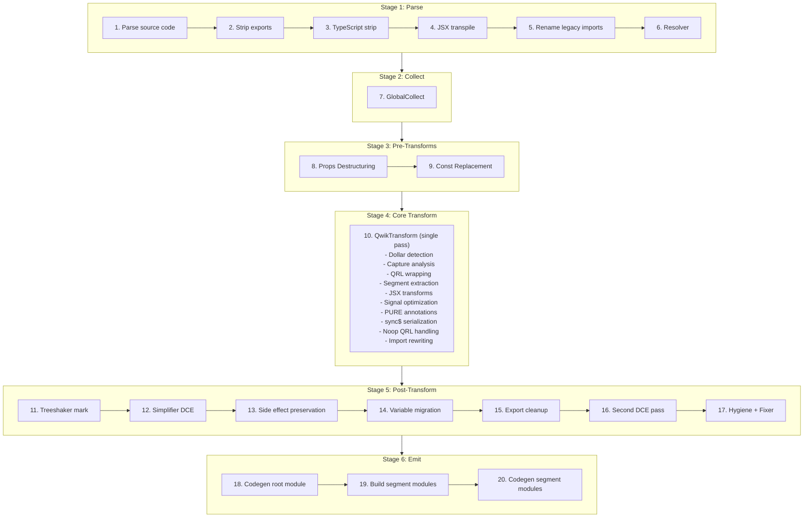

# Qwik v2 Optimizer -- Behavioral Specification

**Version:** 0.1.0
**Date:** 2026-04-01
**Status:** Phase 1 -- Core Pipeline

> **Scope:** This document specifies the behavioral contract of the Qwik v2 optimizer. An OXC implementation can be built from this specification without referencing the SWC source code.

---

## Pipeline Overview

The Qwik optimizer transforms a single input module into multiple output modules: one root module (the transformed original) and N segment modules (lazy-loadable code extracted from `$()` boundaries). The transformation executes as a deterministic 20-step pipeline.

### Pipeline Diagram



Source: parse.rs `transform_code()` function

### Stage Descriptions

**Stage 1: Parse (Steps 1-6).** Parses the source code, detecting TypeScript and JSX from the file extension. Optionally strips named exports (via `strip_exports` config), strips TypeScript type annotations, transpiles JSX to `jsx()`/`jsxs()` calls using React automatic runtime with `@qwik.dev/core` as the import source, renames legacy `@builder.io/qwik` imports to `@qwik.dev/core`, and runs the SWC resolver to assign scope marks for identifier resolution.

**Stage 2: Collect (Step 7).** Runs `GlobalCollect`, a single read-only AST pass that catalogs all imports, exports, and root-level declarations. This metadata is queried by every subsequent transformation stage. See [Stage 2: GlobalCollect](#stage-2-globalcollect) for full specification.

**Stage 3: Pre-Transforms (Steps 8-9).** Reconstructs destructured component props into `_rawProps.propName` access patterns for signal reactivity tracking (runs in all modes including Lib). In non-Lib/non-Test modes, replaces `isServer`, `isBrowser`, and `isDev` imports from `@qwik.dev/core/build` with boolean literals based on build configuration.

**Stage 4: Core Transform (Step 10).** A single traversal pass (`QwikTransform`) that performs the core QRL extraction pipeline: detects `$`-suffixed marker function calls, analyzes captured variables across scope boundaries, wraps marker calls with QRL references (`qrl()`/`inlinedQrl()`), extracts callback bodies as separate segment modules, rewrites imports for both root and segment modules, transforms JSX elements, optimizes signal expressions, adds PURE annotations to tree-shakeable calls, handles `sync$` serialization, and emits noop QRLs for stripped segments.

**Stage 5: Post-Transform (Steps 11-17).** Marks side-effect expressions for client-side tree-shaking, runs dead code elimination (DCE), preserves side-effect imports for Inline/Hoist strategies or performs client-side tree-shaker cleanup, migrates root-level variables exclusively used by a single segment into that segment, cleans up synthetic exports for migrated variables, runs a second DCE pass if migration occurred, and applies hygiene renaming and AST fixing.

**Stage 6: Emit (Steps 18-20).** Generates JavaScript code and source maps for the root module, constructs each segment module from its extracted expression and resolved imports via `code_move::new_module()`, and generates code and individual source maps for each segment module.

### Phase Coverage

**Phase 1 (this document) specifies:** Stage 2 (GlobalCollect), the infrastructure sections (Hash Generation, Path Resolution), and lays the structural foundation. Stages 4 Core Transform details (Dollar Detection, Capture Analysis, QRL Wrapping, Segment Extraction, Import Rewriting) and Stage 5 Variable Migration will be added in Plans 02-04.

**Later phases specify:** Stage 3 Pre-Transforms (Phase 2 -- Props Destructuring; Phase 3 -- Const Replacement), Stage 4 JSX/Signal/PURE subsystems (Phase 2), Stage 4 sync$/noop (Phase 3), Stage 5 DCE/Treeshaker (Phase 3), Stage 6 emit modes and entry strategies (Phase 3), and API/binding contracts (Phase 4).

---

## Stage 2: GlobalCollect

GlobalCollect is a single read-only AST traversal that runs once before any transformations (Step 7 in the pipeline). It catalogs every import, export, and root-level declaration in the module. Its output is queried throughout the pipeline by dollar detection (to identify marker functions), capture analysis (to distinguish globals from captures), QRL wrapping (to manage synthetic imports), segment extraction (to resolve imports for segment modules), and variable migration (to determine which declarations are migratable).

Source: collector.rs:56-528

### Data Structures

GlobalCollect produces four primary data structures:

| Field | Type | Description |
|-------|------|-------------|
| `imports` | `IndexMap<Id, Import>` | Every import specifier with its source module, `ImportKind` (Named, Default, All), whether it is synthetic (added by the optimizer), and optional import assertions |
| `exports` | `IndexMap<Atom, ExportInfo>` | Every exported name with its local `Id` and list of exported names (supports re-exports and renames) |
| `root` | `IndexMap<Id, Span>` | Every top-level declaration: `var`/`let`/`const` bindings, `function` declarations, `class` declarations, and `enum` (TypeScript) declarations |
| `canonical_ids` | `HashMap<Atom, Id>` | Maps symbol names to their first-seen `Id`, used for resolving local identifiers to their canonical representation |

Where `Id` is a tuple of `(Atom, SyntaxContext)` -- the symbol name paired with its scope context. `Import` contains `source` (module path), `specifier` (imported name), `kind` (Named/Default/All), `synthetic` (bool), and optional `asserts`.

### Behavioral Rules

1. **Single pass, read-only.** GlobalCollect visits the AST once using the `Visit` trait (not `VisitMut`). It does not modify the AST. It must run after the resolver (Step 6) so that `SyntaxContext` marks are assigned.

2. **Import collection.** Every `import` declaration is recorded:
   - Named imports (`import { foo } from 'bar'`): specifier = `"foo"`, kind = `Named`
   - Default imports (`import foo from 'bar'`): specifier = `"default"`, kind = `Default`
   - Namespace imports (`import * as foo from 'bar'`): specifier = `"*"`, kind = `All`
   - Renamed imports (`import { foo as bar } from 'baz'`): local id uses `bar`, specifier = `"foo"`
   - All user imports have `synthetic: false`

3. **Export collection.** Every export is recorded via `add_export(local_id, exported_name)`:
   - Named exports (`export { foo }`, `export { foo as bar }`): local_id from the identifier, exported name is the alias or `None` for same-name
   - Export declarations (`export const x = 1`, `export function f() {}`, `export class C {}`): local_id from the declaration name
   - Default export declarations (`export default function f() {}`, `export default class C {}`): exported name is `"default"`
   - Re-exports with a `src` (`export { foo } from 'bar'`) are **skipped** -- they are not local exports
   - Destructured export vars (`export const { a, b } = obj`) record each binding individually

4. **Root declaration collection.** Every top-level statement that is a declaration (but NOT inside an export) is recorded via `add_root(id, span)`:
   - `function` declarations
   - `class` declarations
   - `var`/`let`/`const` declarations (each binding in a destructuring pattern is recorded individually via `collect_from_pat`)
   - TypeScript `enum` declarations
   - Note: Export declarations are handled separately (they call `add_export`, which also registers canonical_ids but not root)

5. **Canonical ID registration.** Every `add_root`, `add_import`, and `add_export` call registers the id via `register_canonical_id()`, which stores the first-seen `Id` for each symbol name in `canonical_ids`. This is used later to resolve different scope contexts of the same symbol to a single canonical identity.

### Key Methods

**`is_global(id) -> bool`**: Returns `true` if the identifier appears in `imports` OR has an export with matching symbol name OR appears in `root`. This is the primary predicate used by capture analysis -- an identifier that is "global" is NOT a capture; it will be available in the segment module via imports or self-imports.

```
is_global(id) = imports.contains(id) || exports.contains(id.symbol) || root.contains(id)
```

**`import(specifier, source) -> Id`**: Ensures an import exists for the given specifier from the given source module. If an existing import matches (checked via `rev_imports` reverse lookup), returns its local `Id`. Otherwise, creates a new synthetic import with `synthetic: true`, adds it to both `imports` and `synthetic` lists, and returns the new local `Id`. Used by the core transform to add runtime helper imports (`qrl`, `componentQrl`, `_jsxSorted`, etc.).

**`add_export(id, exported) -> bool`**: Registers an export. If the symbol name is new, creates an `ExportInfo` entry. If it already exists, appends the new exported name to the list (supporting multiple export aliases). Returns `false` if the exact exported name already exists. Used by `ensure_export()` during segment extraction to create synthetic `_auto_X` exports for self-import resolution.

**`remove_root_and_exports_for_id(id)`**: Removes an identifier from both `root` and `exports` maps. Used during variable migration cleanup -- after a root-level declaration is moved into a segment, its entry is removed so the root module's export list stays clean.

**`get_imported_local(specifier, source) -> Option<Id>`**: Finds the local `Id` for a specific imported specifier from a specific source. Used by segment module construction to resolve identifiers to their original imports.

**`export_local_ids() -> Vec<Id>`**: Returns the local `Id` for every export. Used during dollar detection to identify locally-defined `$`-suffixed exports as marker functions.

### Example 1: Basic Module (basic_collect)

**Input:**

```typescript
import { component$, useTask$ } from '@qwik.dev/core';
import { fetchData } from './api';

export const Counter = component$(() => {
  return <div>Hello</div>;
});

const helperFn = () => 42;
let mutableState = 0;
```

**GlobalCollect output:**

```
imports: {
  (component$, ctx1) -> Import { source: "@qwik.dev/core", specifier: "component$", kind: Named, synthetic: false }
  (useTask$,   ctx1) -> Import { source: "@qwik.dev/core", specifier: "useTask$",   kind: Named, synthetic: false }
  (fetchData,  ctx2) -> Import { source: "./api",          specifier: "fetchData",  kind: Named, synthetic: false }
}

exports: {
  "Counter" -> ExportInfo { local_id: (Counter, ctx0), exported_names: [None] }
}

root: {
  (helperFn,     ctx0) -> Span(...)
  (mutableState, ctx0) -> Span(...)
}

canonical_ids: {
  "component$"   -> (component$, ctx1)
  "useTask$"     -> (useTask$, ctx1)
  "fetchData"    -> (fetchData, ctx2)
  "Counter"      -> (Counter, ctx0)
  "helperFn"     -> (helperFn, ctx0)
  "mutableState" -> (mutableState, ctx0)
}
```

**Key observations:**
- `Counter` appears in `exports` (because of `export const`) but NOT in `root` (export declarations are handled via `visit_export_decl`, which calls `add_export` but not the root-collection path of `visit_module_item`)
- `helperFn` and `mutableState` appear in `root` because they are top-level statements (non-exported `const` and `let`)
- All three imported identifiers are in `imports` with `synthetic: false`
- `is_global(helperFn)` returns `true` (it is in `root`)
- `is_global(Counter)` returns `true` (it has an export)

### Example 2: Synthetic Import During Transform (synthetic_import)

During the core transform pass (Step 10), the optimizer calls `global_collect.import(specifier, source)` to ensure runtime helper imports exist. This mutates GlobalCollect by adding synthetic entries.

**Before transform -- GlobalCollect state:**

```
imports: {
  ($,     ctx1) -> Import { source: "@qwik.dev/core", specifier: "$",     kind: Named, synthetic: false }
}
```

**Transform calls `global_collect.import("qrl", "@qwik.dev/core")`:**

```
imports: {
  ($,     ctx1) -> Import { source: "@qwik.dev/core", specifier: "$",     kind: Named, synthetic: false }
  (qrl,   ctx3) -> Import { source: "@qwik.dev/core", specifier: "qrl",   kind: Named, synthetic: true  }
}

synthetic: [
  (qrl, ctx3) -> Import { source: "@qwik.dev/core", specifier: "qrl", kind: Named, synthetic: true }
]
```

**Key observations:**
- The synthetic import gets a fresh `SyntaxContext` (ctx3) from `private_ident!()`, ensuring no collision with user identifiers
- The `synthetic` list tracks which imports were added by the optimizer (vs. user-written), used during segment module construction to determine which imports to emit
- Calling `import("qrl", "@qwik.dev/core")` a second time returns the existing `(qrl, ctx3)` Id without creating a duplicate (checked via `rev_imports`)
- `is_global((qrl, ctx3))` returns `true` after the synthetic import is added

---

## Stage 3: Pre-Transforms

> (Specified in Phase 2 -- Props Destructuring, Phase 3 -- Const Replacement)

---

## Stage 4: Core Transform

> (Dollar Detection, Capture Analysis, QRL Wrapping, Segment Extraction, and Import Rewriting sections will be added in Plans 02-04)

---

## Infrastructure: Hash Generation

The optimizer uses a deterministic hashing algorithm to generate stable, unique identifiers for each extracted segment. These hashes appear in symbol names, canonical filenames, and QRL references. Hash stability across builds is critical -- changing a hash invalidates cached QRL references and breaks resumability.

Source: transform.rs:204-210 (file hash), transform.rs:353-421 (symbol hash), transform.rs:4725-4729 (base64 encoding), transform.rs:4612-4635 (escape_sym)

### Two-Level Hashing

The optimizer computes two separate hashes using `std::collections::hash_map::DefaultHasher` (Rust's SipHash-1-3):

#### 1. File Hash

Computed once per file during `QwikTransform::new()`. Used as a prefix for JSX key auto-generation.

**Algorithm:**

```
hasher = DefaultHasher::new()
if scope is set:
    hasher.write(scope.as_bytes())
hasher.write(rel_path.to_forward_slash().as_bytes())
file_hash = hasher.finish()    // u64
```

**Inputs (in seed order):**
1. `scope` -- optional string from `TransformModulesOptions.scope` (written first via `Hasher::write` if present)
2. `rel_path` -- the file's relative path with all backslashes converted to forward slashes (via `to_slash_lossy()`)

Source: transform.rs:204-210

#### 2. Symbol Hash

Computed per segment during `register_context_name()`. Produces the hash suffix that appears in symbol names and canonical filenames.

**Algorithm:**

```
hasher = DefaultHasher::new()
if hash_override is set:
    hasher.write(hash_override.as_bytes())
else:
    if scope is set:
        hasher.write(scope.as_bytes())
    hasher.write(rel_path.to_forward_slash().as_bytes())
    hasher.write(display_name.as_bytes())
hash = hasher.finish()    // u64
hash64 = base64(hash)     // see Base64 Encoding below
```

**Inputs (in seed order, when no hash_override):**
1. `scope` -- optional string (written first if present)
2. `rel_path` -- forward-slashed relative file path
3. `display_name` -- the escaped, deduplicated display name (see Display Name Construction below)

Source: transform.rs:393-421

### Base64 Encoding

The `base64()` function converts a `u64` hash to a string identifier:

```rust
fn base64(nu: u64) -> String {
    base64::engine::general_purpose::URL_SAFE_NO_PAD
        .encode(nu.to_le_bytes())
        .replace(['-', '_'], "0")
}
```

**Steps:**
1. Convert the `u64` to 8 bytes in **little-endian** order (`to_le_bytes()`)
2. Encode with `URL_SAFE_NO_PAD` base64 engine (alphabet: `A-Za-z0-9+/` with `-` and `_` instead of `+` and `/`, no `=` padding)
3. Replace all `-` characters with `0`
4. Replace all `_` characters with `0`

The result is always 11 characters (8 bytes base64-encoded without padding = ceil(8*4/3) = 11 chars, with `-`/`_` replaced by `0`).

Source: transform.rs:4725-4729

### Display Name Construction

The display name is built from the function context hierarchy and determines both the human-readable portion of symbol names and the hash input.

**Algorithm:**

```
1. Build context string:
   display_name = stack_ctxt.join("_")
   if stack_ctxt is empty:
       display_name = "s_"

2. Escape non-alphanumeric characters:
   display_name = escape_sym(display_name)
   // escape_sym replaces non-[A-Za-z0-9] with '_'
   // trims leading underscores
   // squashes consecutive underscores to one

3. Prepend underscore if starts with digit:
   if display_name[0] is '0'-'9':
       display_name = "_" + display_name

4. Deduplicate via segment_names HashMap:
   if display_name not in segment_names:
       segment_names[display_name] = 0     // first occurrence, no suffix
   else:
       segment_names[display_name] += 1
       display_name = display_name + "_" + count  // e.g., "sym_1", "sym_2"

5. Compute hash using display_name (see Symbol Hash above)

6. Build final display_name for metadata:
   display_name = file_stem + "_" + display_name  // e.g., "Counter_onClick"
```

**`escape_sym()` details** (transform.rs:4612-4635):
- Every character that is NOT `A-Z`, `a-z`, or `0-9` is replaced with `_`
- Leading underscores are trimmed (the fold starts with an empty accumulator and only emits `_` when preceded by a non-underscore character)
- Consecutive underscores are squashed to a single underscore (tracked via the `prev` state in the fold)

**`stack_ctxt` contents:** The context stack is built during the traversal. Function names, variable names from assignments, and JSX element tag names are pushed onto `stack_ctxt` as the traversal descends. This gives segments meaningful names like `Counter_onClick` rather than anonymous hashes.

Source: transform.rs:4612-4635 (escape_sym), transform.rs:353-376 (register_context_name)

### Symbol Name Format

The final symbol name depends on the emit mode:

| Mode | Format | Example |
|------|--------|---------|
| Dev, Test, Hmr, Lib | `{display_name}_{hash64}` | `Counter_onClick_aXUrPXX5Lak` |
| Prod | `s_{hash64}` | `s_aXUrPXX5Lak` |

Source: transform.rs:407-414

### Example 1: Basic Symbol Hash (example_6)

**Input file:** `test.tsx` (relative path: `test.tsx`)

```typescript
import { $ } from '@qwik.dev/core';
export const sym1 = $((ctx) => console.log("1"));
```

**Display name construction:**
1. `stack_ctxt` at the `$()` call site: `["sym1"]` (from the variable assignment)
2. `stack_ctxt.join("_")` = `"sym1"`
3. `escape_sym("sym1")` = `"sym1"` (already alphanumeric)
4. Does not start with digit, no prepend needed
5. First occurrence in `segment_names`, no deduplication suffix
6. Symbol hash inputs: `rel_path = "test.tsx"`, `display_name = "sym1"`
7. Final `display_name` for metadata: `"test.tsx_sym1"`

**Hash computation (Dev mode):**
```
hasher = DefaultHasher::new()
hasher.write(b"test.tsx")
hasher.write(b"sym1")
hash = hasher.finish()           // some u64
hash64 = base64(hash)            // e.g., "aXUrPXX5Lak"
symbol_name = "sym1_aXUrPXX5Lak" // Dev mode: {display_name}_{hash64}
```

**In Prod mode:** `symbol_name = "s_aXUrPXX5Lak"` (same hash, different format)

### Example 2: Deduplication with Multiple Dollar Calls (dedup_dollar)

**Input file:** `test.tsx`

```typescript
import { $ } from '@qwik.dev/core';
export const handler = () => {
  const a = $(() => console.log("first"));
  const b = $(() => console.log("second"));
};
```

**Display name construction for first `$()`:**
1. `stack_ctxt`: `["handler"]` (from the enclosing function)
2. `display_name` = `"handler"`
3. `segment_names` check: not present, insert `"handler" -> 0`
4. No deduplication suffix
5. Symbol hash inputs: `"test.tsx"` + `"handler"`
6. `symbol_name` = `"handler_{hash1}"`

**Display name construction for second `$()`:**
1. `stack_ctxt`: `["handler"]` (same enclosing function)
2. `display_name` = `"handler"`
3. `segment_names` check: already present with count 0, increment to 1
4. Deduplication suffix applied: `display_name` = `"handler_1"`
5. Symbol hash inputs: `"test.tsx"` + `"handler_1"` (different input, different hash)
6. `symbol_name` = `"handler_1_{hash2}"`

**Result:** Two distinct segments with unique hashes despite sharing the same enclosing context.

---

## Infrastructure: Path Resolution

Path resolution governs how the optimizer constructs file paths for segment modules -- both the canonical filename used to name the segment file and the import path used to reference it from the root module's QRL calls.

Source: parse.rs:927-956 (parse_path), transform.rs:4910-4913 (get_canonical_filename), transform.rs:1110-1145 (create_segment)

### parse_path()

Extracts file metadata from the relative source path. Called once at the start of `transform_code()`.

**Algorithm:**

```
input: relative_path (string), base_dir (Path)
1. Convert backslashes to forward slashes: path = relative_path.replace('\\', '/')
2. Extract file_stem: path without extension (e.g., "Counter" from "src/Counter.tsx")
3. Extract extension: file extension without dot (e.g., "tsx")
4. Extract file_name: full filename (e.g., "Counter.tsx")
5. Extract rel_dir: parent directory of the relative path
6. Compute abs_path: normalize(base_dir / path)
7. Compute abs_dir: normalize(abs_path.parent())
```

**Output (PathData):**

| Field | Type | Description |
|-------|------|-------------|
| `rel_path` | `PathBuf` | Forward-slashed relative path as provided |
| `abs_path` | `PathBuf` | Normalized absolute path (base_dir joined with rel_path) |
| `rel_dir` | `PathBuf` | Parent directory of rel_path |
| `abs_dir` | `PathBuf` | Parent directory of abs_path |
| `extension` | `String` | File extension without dot |
| `file_name` | `String` | Full filename with extension |
| `file_stem` | `String` | Filename without extension |

Source: parse.rs:927-956

### Output Extension Mapping

The extension used for output modules (root and segments) depends on the `transpile_ts` and `transpile_jsx` configuration flags combined with the input file's detected type:

| `transpile_ts` | `transpile_jsx` | `is_typescript` | `is_jsx` | Output Extension |
|:-:|:-:|:-:|:-:|:--|
| true | true | any | any | `.js` |
| true | false | any | true | `.jsx` |
| true | false | any | false | `.js` |
| false | true | true | any | `.ts` |
| false | true | false | any | `.js` |
| false | false | any | any | same as input |

In the common case (`transpile_ts: true, transpile_jsx: true`), all output is `.js` regardless of input type.

Source: parse.rs:225-232

### get_canonical_filename()

Constructs the canonical filename for a segment module. This is the filename (without extension) used both for the output file and for the import path in QRL calls.

**Algorithm:**

```
input: display_name (Atom), symbol_name (Atom)
1. Extract hash suffix: split symbol_name on '_', take last segment
2. canonical_filename = display_name + "_" + hash_suffix
```

**Example:**
- `display_name` = `"test.tsx_sym1"`, `symbol_name` = `"sym1_aXUrPXX5Lak"`
- Hash suffix = `"aXUrPXX5Lak"` (last `_`-delimited token)
- `canonical_filename` = `"test.tsx_sym1_aXUrPXX5Lak"`

Source: transform.rs:4910-4913

### Import Path Construction

The import path used in `qrl()` calls to reference segment modules is constructed in `create_segment()`:

**Algorithm:**

```
input: canonical_filename, explicit_extensions (bool), extension (string)
1. import_path = "./" + canonical_filename
2. if explicit_extensions:
       import_path = import_path + "." + extension
```

**Rules:**
- Import paths always start with `"./"` (relative to the root module)
- When `explicit_extensions` is `false` (the default), no extension is appended -- the bundler resolves the extension
- When `explicit_extensions` is `true`, the output extension (from the extension mapping table above) is appended

Source: transform.rs:1127-1131

### Full Segment Path Construction

The full output path for a segment module file (used in `TransformModule.path`) combines the relative directory with the canonical filename:

```
segment_path = rel_dir + "/" + canonical_filename + "." + extension
```

If `rel_dir` is empty (file is at the root of `src_dir`), the path is just `canonical_filename + "." + extension` with no leading separator.

Source: parse.rs:450-461

### Example 1: Basic Path Resolution (basic_path)

**Input:** `src/components/Counter.tsx` with `transpile_ts: true`, `transpile_jsx: true`, `explicit_extensions: false`

```typescript
import { component$ } from '@qwik.dev/core';
export const Counter = component$(() => {
  return <div>Count</div>;
});
```

**Path resolution:**
- `parse_path("src/components/Counter.tsx", src_dir)`:
  - `file_stem` = `"Counter"`
  - `extension` = `"tsx"`
  - `file_name` = `"Counter.tsx"`
  - `rel_dir` = `"src/components"`
- Output extension: `.js` (transpile_ts + transpile_jsx = true)
- Display name (from hash generation): `"Counter.tsx_Counter"`
- Symbol name: `"Counter_XYZ123hash"` (in Dev mode)
- `get_canonical_filename("Counter.tsx_Counter", "Counter_XYZ123hash")`:
  - Hash suffix = `"XYZ123hash"`
  - canonical_filename = `"Counter.tsx_Counter_XYZ123hash"`
- Import path in QRL: `"./Counter.tsx_Counter_XYZ123hash"` (no extension -- `explicit_extensions: false`)
- Segment file path: `"src/components/Counter.tsx_Counter_XYZ123hash.js"`

### Example 2: Explicit Extensions (explicit_ext)

**Input:** Same `src/components/Counter.tsx` with `explicit_extensions: true`

**Path resolution (only the import path differs):**
- Import path in QRL: `"./Counter.tsx_Counter_XYZ123hash.js"` (extension appended)
- Segment file path: `"src/components/Counter.tsx_Counter_XYZ123hash.js"` (unchanged -- segment file path always has an extension)

**Comparison:**

| Config | Import Path in `qrl()` Call |
|--------|---------------------------|
| `explicit_extensions: false` | `"./Counter.tsx_Counter_XYZ123hash"` |
| `explicit_extensions: true` | `"./Counter.tsx_Counter_XYZ123hash.js"` |

The `explicit_extensions` flag exists because some bundlers (like Vite in certain configurations) require explicit `.js` extensions in import specifiers for proper module resolution, while others resolve extensions automatically.

---
